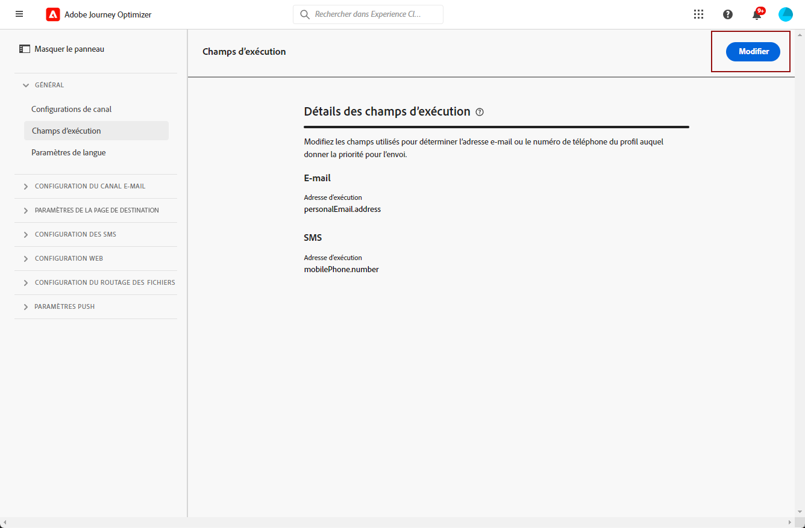

# Modification des adresses principales {#change-primary-email}

>[!CONTEXTUALHELP]
>id="ajo_admin_execution_address"
>title="Définition de l’adresse à utiliser"
>abstract="Lorsque plusieurs adresses sont disponibles dans la base de données (personnelle, professionnelle, etc.), vous pouvez choisir l&#39;adresse à prioriser pour l&#39;envoi."

Lorsque vous ciblez un profil, plusieurs adresses e-mail peuvent être disponibles dans la base de données (adresse e-mail personnelle, professionnelle, etc.).

Avec [!DNL Journey Optimizer], vous pouvez déterminer l&#39;adresse e-mail à utiliser à partir du service de profil et établir la priorité lorsque plusieurs adresses sont disponibles. Pour ce faire, suivez les étapes ci-après.

1. Accédez au menu **[!UICONTROL Canaux]** > **[!UICONTROL Général]** > **[!UICONTROL Champs d’exécution]**.

   

1. Le champ actuellement utilisé par défaut pour déterminer les adresses e-mail des profils s&#39;affiche dans cet écran. Cliquez sur **[!UICONTROL Modifier]** pour le modifier.

   

1. Cliquez sur le champ actif ou sur l&#39;icône de modification pour sélectionner un nouveau champ.

   

1. La liste des champs XDM de type e-mail disponibles s&#39;affiche. Sélectionnez le champ à utiliser.

   

1. Cliquez sur **[!UICONTROL Enregistrer]** pour confirmer votre choix.

   

   Le champ d&#39;exécution est mis à jour et sera désormais utilisé comme adresse principale.

<!--1. You can also select an additional field to use as secondary email address. This allows you to determine which field to use if the primary field is empty for a profile. -->
