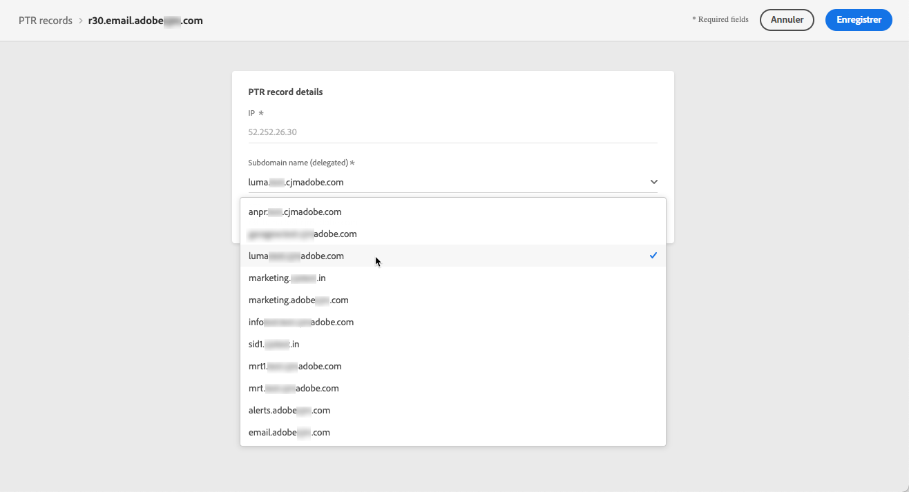
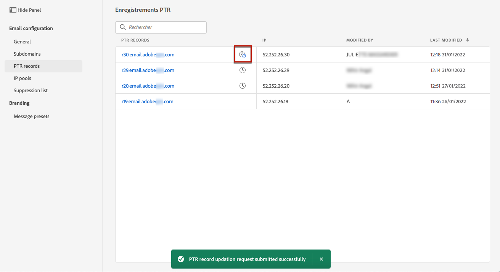
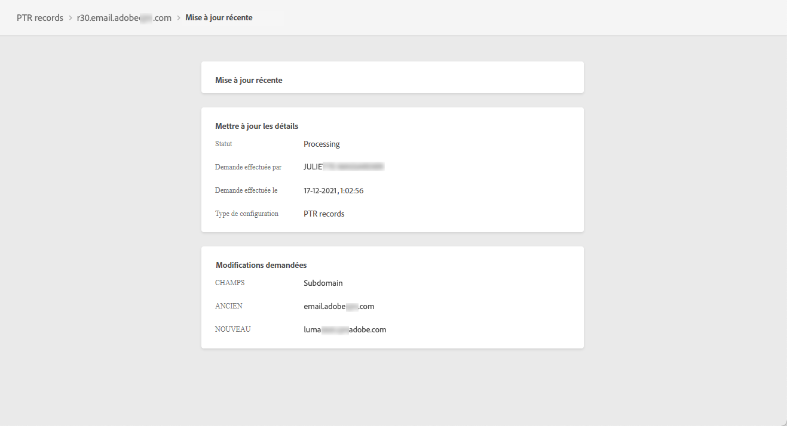

# Enregistrements PTR

## À propos des enregistrements PTR

Un enregistrement pointeur (PTR) est un type d&#39;enregistrement DNS (Domain Name System) qui fournit le nom de domaine associé à une adresse IP.

Avec les enregistrements PTR, les serveurs de messagerie de réception peuvent vérifier l&#39;authenticité des serveurs de messagerie d&#39;envoi en identifiant si leurs adresses IP correspondent aux noms avec lesquels les serveurs se connectent.

## Accès aux enregistrements PTR de vos sous-domaines

Une fois qu’un sous-domaine est délégué dans Adobe Journey Optimizer, un enregistrement PTR est automatiquement créé et associé à ce sous-domaine. Vous pouvez y accéder à partir de la **[!UICONTROL Canaux]** > **[!UICONTROL Configuration des emails]** > **[!UICONTROL Enregistrements PTR]** .

La liste affiche les enregistrements PTR générés pour chaque sous-domaine délégué, en utilisant la syntaxe ci-dessous :

* &quot;r&quot; pour l&#39;enregistrement,
* &quot;xx&quot; pour les deux derniers chiffres de l&#39;adresse IP,
* nom du sous-domaine.

Vous pouvez ouvrir un enregistrement PTR de la liste pour afficher le nom de sous-domaine et l&#39;adresse IP associés.

## Modification d’un enregistrement PTR {#edit-ptr-record}

Vous pouvez modifier un enregistrement PTR pour modifier le sous-domaine associé à une adresse IP.

1. Dans la liste, cliquez sur un nom d’enregistrement PTR pour l’ouvrir.

   

1. Modifiez le sous-domaine selon vos besoins.

   

   >[!NOTE]
   >
   >Vous ne pouvez pas modifier la variable **[!UICONTROL IP]** et **[!UICONTROL Enregistrement PTR]** champs.

1. Cliquez sur **[!UICONTROL Enregistrer]** pour confirmer vos modifications.

Un **[!UICONTROL Mise à jour]** s’affiche en regard du nom de l’enregistrement PTR dans la liste.

Pour vérifier les détails de la mise à jour de l’enregistrement PTR, cliquez sur le bouton **[!UICONTROL Mise à jour]** ou **[!UICONTROL Mises à jour récentes]** icône .

Vous pouvez voir des informations telles que l’état de mise à jour et les modifications demandées.

## Mise à jour des états

Une mise à jour d’enregistrement PTR peut avoir les états suivants :

* **[!UICONTROL Traitement]**: La mise à jour de l&#39;enregistrement du RRTP a été soumise et fait l&#39;objet d&#39;un processus de vérification.
* **[!UICONTROL Succès]**: L’enregistrement PTR mis à jour a été vérifié et le nouveau sous-domaine est désormais associé à l’adresse IP.
* **[!UICONTROL En échec]**: Une ou plusieurs vérifications ont échoué lors de la vérification de la mise à jour des enregistrements PTR.

### En cours de traitement

Plusieurs contrôles de délivrabilité seront effectués pour vérifier que le nouveau sous-domaine à associer à l’adresse IP est valide. <!--The processing time is around **48h-72h**, and can take up to **7-10 days**. Learn more on the checks performed during the validation cycle in [this section](#create-message-preset).-->

>[!NOTE]
>
>Vous ne pouvez pas modifier un enregistrement PTR alors que la mise à jour est en cours. Vous pouvez toujours cliquer sur son nom, mais le champ **[!UICONTROL Subdomain]** est grisé. Les modifications ne seront pas répercutées tant que la mise à jour n’aura pas été effectuée correctement.

Pendant le processus de validation, l’ancien sous-domaine est toujours associé à l’adresse IP.

### Réussite

Une fois le processus de validation réussi, le nouveau sous-domaine est automatiquement associé à l’adresse IP.

### Échoué

Si le processus de validation échoue, l’ancien enregistrement PTR s’affiche. Le sous-domaine valide précédemment associé à l’adresse IP reste inchangé.

Les types d&#39;erreur de mise à jour possibles sont les suivants :
* Échec de la création d’un nouveau DNS avant pour l’enregistrement PTR
* Échec de la mise à jour de l’enregistrement
* Échec du réembarquement des affinités

En cas d’échec de la mise à jour, l’enregistrement PTR est à nouveau modifiable. Vous pouvez cliquer sur son nom et mettre à jour à nouveau le sous-domaine.
