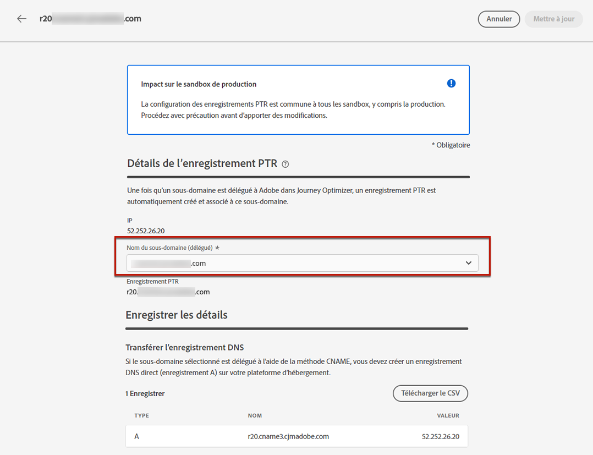
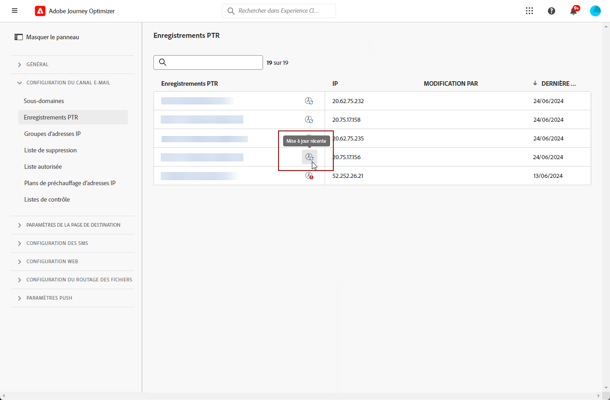

# Créer et modifier des enregistrements PTR {#ptr-records}

>[!CONTEXTUALHELP]
>id="ajo_admin_ptr_record"
>title="Enregistrements PTR des sous-domaines"
>abstract="Un enregistrement pointeur (PTR) est un type d’enregistrement DNS qui fournit le nom de domaine associé à une adresse IP, ce qui permet aux serveurs de messagerie de réception de vérifier les adresses IP des expéditeurs. Ne modifiez un enregistrement PTR qu’après avoir pris en compte les questions et discuté avec votre expert en délivrabilité."

>[!CONTEXTUALHELP]
>id="ajo_admin_ptr_record_header"
>title="Enregistrements PTR des sous-domaines"
>abstract="Une fois que le premier sous-domaine est délégué à Adobe dans Journey Optimizer, les enregistrements PTR sont automatiquement créés."

## À propos des enregistrements PTR {#about-ptr-records}

Un enregistrement pointeur (PTR) est un type d&#39;enregistrement DNS (Domain Name System) qui fournit le nom de domaine associé à une adresse IP.

Avec les enregistrements PTR, les serveurs de messagerie de réception peuvent vérifier l’authenticité des serveurs de messagerie d’envoi en identifiant si leurs adresses IP correspondent aux noms avec lesquels les serveurs se connectent.

## Accès aux enregistrements PTR de vos sous-domaines {#access-ptr-records}

Dès que vous [déléguez](delegate-subdomain.md) votre premier sous-domaine à Adobe dans [!DNL Journey Optimizer], les enregistrements PTR sont automatiquement créés pour vos adresses IP. Vous pouvez y accéder à partir du menu **[!UICONTROL Administration]** > **[!UICONTROL Canaux]** > **[!UICONTROL Paramètres des e-mails]** > **[!UICONTROL Enregistrements PTR]**.

La liste affiche les enregistrements PTR générés en utilisant la syntaxe ci-dessous :

* &quot;r&quot; pour l&#39;enregistrement,
* &quot;xx&quot; pour les deux derniers chiffres de l&#39;adresse IP,
* nom du sous-domaine.

Vous pouvez ouvrir un enregistrement PTR de la liste pour afficher le nom de sous-domaine et l&#39;adresse IP associés.

## Modifier un enregistrement PTR {#edit-ptr-record}

Dans [!DNL Journey Optimizer], vous ne pouvez pas créer manuellement d’enregistrements PTR. Au lieu de cela, dès que vous [déléguez](delegate-subdomain.md) votre premier sous-domaine à Adobe, les enregistrements PTR sont automatiquement créés pour vos adresses IP.

Chacune de vos adresses IP reçoit un seul enregistrement PTR. Tous les enregistrements PTR ont le format suivant : « rxx.subdomain », où « subdomain » est le premier sous-domaine que vous avez délégué dans [!DNL Journey Optimizer].

Lorsque vous créez des sous-domaines supplémentaires, vous devez modifier un ou plusieurs enregistrements PTR et leur attribuer ces nouveaux sous-domaines. Pour ce faire, procédez comme suit.

>[!CAUTION]
>
>Les enregistrements PTR sont communs à tous les environnements. Par conséquent, toute modification apportée à un enregistrement PTR aura également un impact sur les sandbox de production.
>
>Procédez avec une attention particulière lors de la modification des enregistrements PTR. En cas de doute, contactez un expert en délivrabilité.

### Sous-domaines entièrement délégués {#fully-delegated-subdomains}

Pour modifier un enregistrement PTR avec un sous-domaine qui est [entièrement délégué](delegate-subdomain.md#set-up-subdomain) à Adobe, procédez comme suit.

1. Dans la liste, cliquez sur un nom d’enregistrement PTR pour l’ouvrir.

   

1. Sélectionnez un sous-domaine [entièrement délégué](delegate-subdomain.md#set-up-subdomain) à Adobe dans la liste.

   

1. Cliquez sur **[!UICONTROL Enregistrer]** pour confirmer vos modifications.

>[!NOTE]
>
>Vous ne pouvez pas modifier les champs **[!UICONTROL IP]** et **[!UICONTROL Enregistrement PTR]**.

### Sous-domaines délégués à l’aide de la méthode CNAME {#edit-ptr-subdomains-cname}

Pour modifier un enregistrement PTR avec un sous-domaine délégué à Adobe à l’aide de la [méthode CNAME](delegate-subdomain.md#cname-subdomain-setup), procédez comme suit.

1. Dans la liste, cliquez sur un nom d’enregistrement PTR pour l’ouvrir.

   

1. Sélectionnez dans la liste un sous-domaine délégué à Adobe à l’aide de la [méthode CNAME](delegate-subdomain.md#cname-subdomain-setup).

   

1. Vous devez créer un nouvel enregistrement DNS direct sur votre plateforme d’hébergement. Pour ce faire, copiez lʼenregistrement généré par Adobe. Une fois lʼopération terminée, cochez la case « Je confirme… ».

   

   >[!NOTE]
   >
   >Si vous recevez le message « Veuillez d’abord créer un DNS direct, puis réessayer », procédez comme suit :
   >   * Vérifiez auprès du fournisseur DNS si l’enregistrement DNS direct a bien été créé.
   >   * Les enregistrements sur les serveurs DNS peuvent ne pas se synchroniser immédiatement. Patientez quelques minutes, puis réessayez.

1. Cliquez sur **[!UICONTROL Enregistrer]** pour confirmer vos modifications.

>[!NOTE]
>
>Vous ne pouvez pas modifier les champs **[!UICONTROL IP]** et **[!UICONTROL Enregistrement PTR]**.

## Vérification des détails de la mise à jour de l’enregistrement PTR {#check-ptr-record-update}

Une fois que vous avez confirmé la modification de l’enregistrement PTR, l’icône **[!UICONTROL Traitement en cours]** s’affiche en regard du nom de l’enregistrement PTR dans la liste.

>[!NOTE]
>
>Le [traitement de la mise à jour](#processing) peut prendre jusqu’à 3 heures.

Pour vérifier les détails de la mise à jour de l’enregistrement PTR, cliquez sur l’icône en regard de celui-ci. En savoir plus sur les statuts associés aux différentes icônes dans [cette section](#ptr-record-update-statuses).

Vous pouvez voir des informations telles que l’état de mise à jour et les modifications demandées.

## États de mise à jour des enregistrements PTR {#ptr-record-update-statuses}

Une mise à jour d’enregistrement PTR peut afficher les états suivants :

*  **[!UICONTROL En cours de traitement]** : la mise à jour de l’enregistrement PTR a été envoyée et fait l’objet d’un processus de vérification.
*  **[!UICONTROL Réussite]** : l’enregistrement PTR mis à jour a été vérifié et le nouveau sous-domaine est désormais associé à l’adresse IP.
*  **[!UICONTROL Échec]** : une ou plusieurs vérifications ont échoué lors de la vérification de la mise à jour de l’enregistrement PTR.

### En cours de traitement {#processing}

Plusieurs contrôles de délivrabilité seront effectués pour vérifier la validité du nouveau sous-domaine à associer à l’adresse IP. Cela peut prendre jusqu’à 3 heures.

>[!NOTE]
>
>Vous ne pouvez pas modifier un enregistrement PTR pendant que la mise à jour est en cours. Vous pouvez toujours cliquer sur son nom, mais le champ **[!UICONTROL Sous-domaine]** est grisé. Les modifications ne seront pas répercutées tant que la mise à jour n’aura pas réussi.

Pendant le processus de validation, l’ancien sous-domaine est toujours associé à l’adresse IP.

### Réussite {#success}

Une fois le processus de validation réussi, le nouveau sous-domaine est automatiquement associé à l’adresse IP.

### Échec {#failes}

Si le processus de validation échoue, l’ancien enregistrement PTR s’affiche. Le sous-domaine valide précédemment associé à l’adresse IP reste inchangé.

Les types d’erreur de mise à jour possibles sont les suivants :

* Échec de la création d’un nouveau DNS direct pour l’enregistrement PTR
* Échec de la mise à jour de l’enregistrement
* Échec de la réintégration des affinités

En cas d’échec de la mise à jour, l’enregistrement PTR est à nouveau modifiable. Vous pouvez cliquer sur son nom et mettre à nouveau à jour le sous-domaine.
