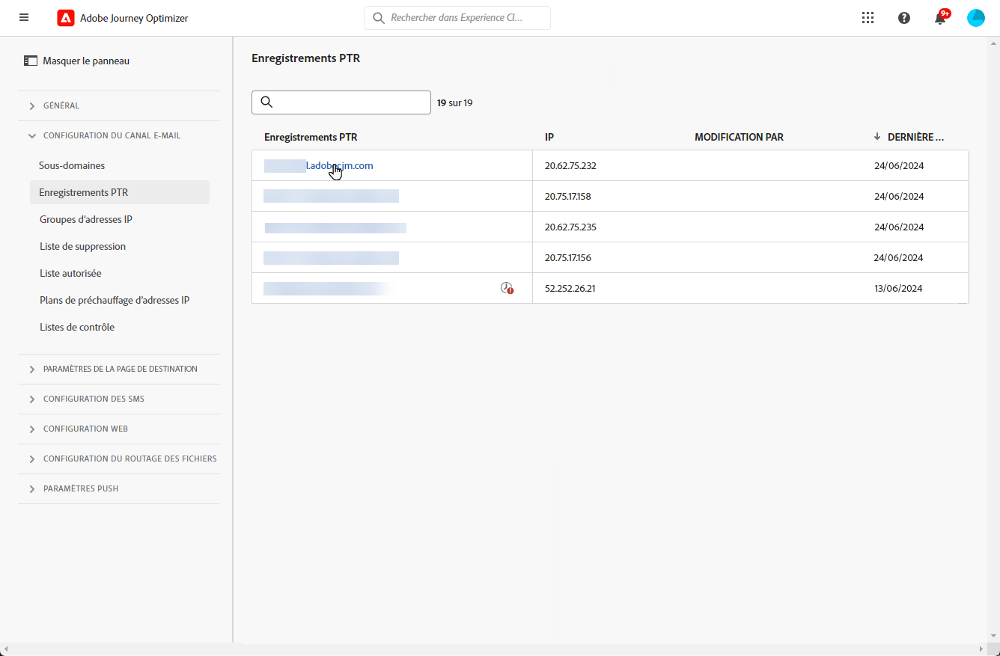
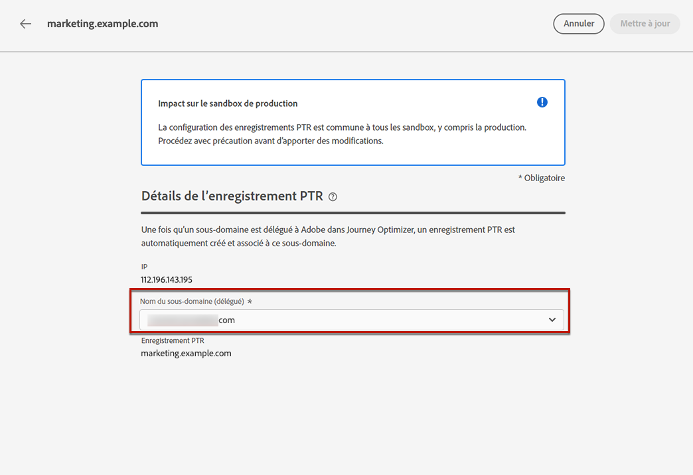
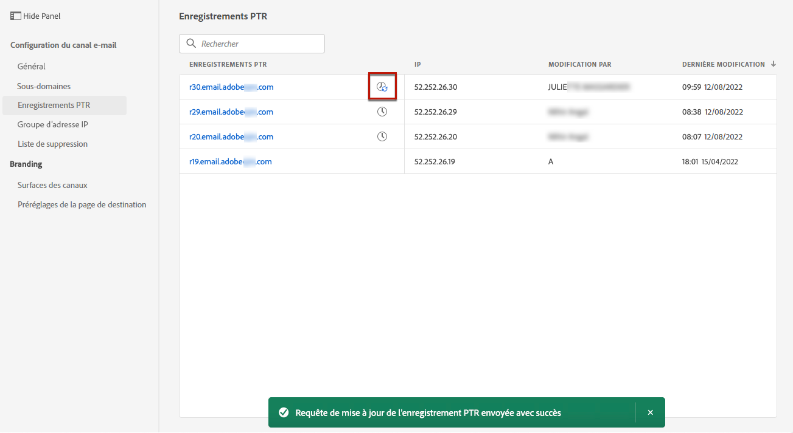

# Enregistrements PTR {#ptr-records}

>[!CONTEXTUALHELP]
>id="ajo_admin_ptr_record"
>title="Enregistrements PTR des sous-domaines"
>abstract="Un enregistrement pointeur (PTR) est un type d’enregistrement DNS qui fournit le nom de domaine associé à une adresse IP, ce qui permet aux serveurs de messagerie de réception de vérifier les adresses IP des expéditeurs. Ne modifiez un enregistrement PTR qu’après avoir pris en compte les questions et discuté avec votre expert en délivrabilité."

>[!CONTEXTUALHELP]
>id="ajo_admin_ptr_record_header"
>title="Enregistrements PTR des sous-domaines"
>abstract="Une fois qu’un sous-domaine est délégué à Adobe dans Journey Optimizer, un enregistrement PTR est automatiquement créé et associé à ce sous-domaine."

## À propos des enregistrements PTR {#about-ptr-records}

Un enregistrement pointeur (PTR) est un type d’enregistrement DNS (Domain Name System) qui fournit le nom de domaine associé à une adresse IP.

Avec les enregistrements PTR, les serveurs de messagerie de réception peuvent vérifier l’authenticité des serveurs de messagerie d’envoi en identifiant si leurs adresses IP correspondent aux noms auxquels les serveurs se connectent.

## Accès aux enregistrements PTR de vos sous-domaines {#access-ptr-records}

Une fois [un sous-domaine est délégué](delegate-subdomain.md) dans Adobe Journey Optimizer, un enregistrement PTR est automatiquement créé et associé à ce sous-domaine. Vous pouvez y accéder à partir de la **[!UICONTROL Administration]** > **[!UICONTROL Channels]** > **[!UICONTROL Email configuration]** > **[!UICONTROL PTR records]** .

La liste affiche les enregistrements PTR générés pour chaque sous-domaine délégué, en utilisant la syntaxe ci-dessous :

* &quot;r&quot; pour l’enregistrement,
* &quot;xx&quot; pour les deux derniers chiffres de l&#39;adresse IP,
* nom du sous-domaine.

Vous pouvez ouvrir un enregistrement PTR de la liste pour afficher le nom de sous-domaine et l’adresse IP associés.

## Modification d’un enregistrement PTR {#edit-ptr-record}

Vous pouvez modifier un enregistrement PTR pour modifier le sous-domaine associé à une adresse IP.

>[!CAUTION]
>
>Les enregistrements PTR sont communs à tous les environnements. Par conséquent, toute modification apportée à un enregistrement PTR aura également un impact sur les environnements de test de production.
>
>Procédez avec une attention particulière lors de la modification des enregistrements PTR. En cas de doute, contactez un expert en délivrabilité.

### Sous-domaines entièrement délégués {#fully-delegated-subdomains}

Pour modifier un enregistrement PTR avec un sous-domaine qui est [entièrement délégué](delegate-subdomain.md#full-subdomain-delegation) Pour Adobe, procédez comme suit.

1. Dans la liste, cliquez sur un nom d’enregistrement PTR pour l’ouvrir.

   

1. Sélectionner un sous-domaine [entièrement délégué](delegate-subdomain.md#full-subdomain-delegation) à Adobe dans la liste.

   

1. Cliquez sur **[!UICONTROL Save]** pour confirmer vos modifications.

>[!NOTE]
>
>Vous ne pouvez pas modifier la variable **[!UICONTROL IP]** et **[!UICONTROL PTR record]** champs.

### Sous-domaines délégués à l’aide de la méthode CNAME {#edit-ptr-subdomains-cname}

Pour modifier un enregistrement PTR avec un sous-domaine délégué à Adobe à l’aide de la variable [méthode CNAME](delegate-subdomain.md#cname-subdomain-delegation), procédez comme suit.

1. Dans la liste, cliquez sur un nom d’enregistrement PTR pour l’ouvrir.

   

1. Sélectionnez un sous-domaine délégué à Adobe à l’aide de la fonction [méthode CNAME](delegate-subdomain.md#cname-subdomain-delegation) dans la liste.

   

1. Vous devez créer un nouvel enregistrement DNS à transférer sur votre plateforme d’hébergement. Pour ce faire, copiez l’enregistrement généré par Adobe. Une fois que vous avez terminé, cochez la case &quot;Je confirme...&quot;.

   

   >[!NOTE]
   >
   >Si vous recevez ce message : &quot;Veuillez d’abord créer le DNS avant, puis réessayer&quot;, procédez comme suit :
   >   * Vérifiez sur le fournisseur DNS si l’enregistrement DNS avancé a bien été créé.
   >   * Les enregistrements dans le DNS peuvent ne pas se synchroniser immédiatement. Patientez quelques minutes, puis réessayez.

1. Cliquez sur **[!UICONTROL Save]** pour confirmer vos modifications.

>[!NOTE]
>
>Vous ne pouvez pas modifier la variable **[!UICONTROL IP]** et **[!UICONTROL PTR record]** champs.

## Vérification des détails de mise à jour des enregistrements PTR {#check-ptr-record-update}

Une fois que vous avez confirmé la modification de l’enregistrement PTR, la variable **[!UICONTROL Processing]** s’affiche en regard du nom de l’enregistrement PTR dans la liste.

>[!NOTE]
>
>Le [traitement des mises à jour](#processing) peut prendre jusqu’à 3 heures.

Pour vérifier les détails de la mise à jour de l’enregistrement PTR, cliquez sur l’icône en regard de celui-ci. En savoir plus sur les statuts associés aux différentes icônes dans [cette section](#ptr-record-update-statuses).

Vous pouvez voir des informations telles que l’état de mise à jour et les modifications demandées.

## Statuts de mise à jour des enregistrements PTR {#ptr-record-update-statuses}

Une mise à jour d’enregistrement PTR peut avoir les états suivants :

*  **[!UICONTROL Processing]**: La mise à jour de l&#39;enregistrement du RRTP a été soumise et fait l&#39;objet d&#39;un processus de vérification.
*  **[!UICONTROL Success]**: L’enregistrement PTR mis à jour a été vérifié et le nouveau sous-domaine est désormais associé à l’adresse IP.
*  **[!UICONTROL Failed]**: Une ou plusieurs vérifications ont échoué lors de la vérification de la mise à jour des enregistrements PTR.

### Traitement {#processing}

Plusieurs contrôles de délivrabilité seront effectués pour vérifier que le nouveau sous-domaine à associer à l’adresse IP est valide. Cela peut prendre jusqu’à 3 heures.

>[!NOTE]
>
>Vous ne pouvez pas modifier un enregistrement PTR alors que la mise à jour est en cours. Vous pouvez toujours cliquer sur son nom, mais le champ **[!UICONTROL Subdomain]** est grisé. Les modifications ne seront pas répercutées tant que la mise à jour n’aura pas été effectuée correctement.

Pendant le processus de validation, l’ancien sous-domaine est toujours associé à l’adresse IP.

### Succès {#success}

Une fois le processus de validation réussi, le nouveau sous-domaine est automatiquement associé à l’adresse IP.

### En échec {#failes}

Si le processus de validation échoue, l’ancien enregistrement PTR s’affiche. Le sous-domaine valide précédemment associé à l’adresse IP reste inchangé.

Les types d&#39;erreur de mise à jour possibles sont les suivants :
* Échec de la création d’un nouveau DNS avant pour l’enregistrement PTR
* Échec de la mise à jour de l’enregistrement
* Échec du réembarquement des affinités

En cas d’échec de la mise à jour, l’enregistrement PTR est de nouveau modifiable. Vous pouvez cliquer sur son nom et mettre à jour à nouveau le sous-domaine.
