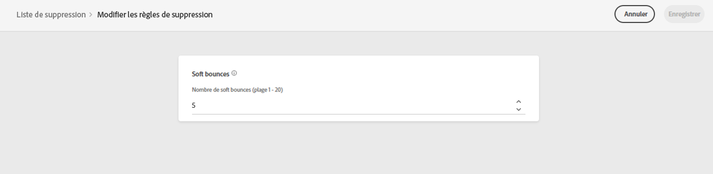

# Reprises {#retries}

Lorsqu’un message électronique échoue en raison d’un message temporaire **Soft bounce** pour une adresse donnée, plusieurs reprises sont effectuées. Chaque erreur incrémente un compteur d&#39;erreurs. Lorsque ce compteur atteint le seuil limite, l’adresse électronique est ajoutée à la liste de suppression.

>[!NOTE]
>
>Pour en savoir plus sur les types d’erreurs, consultez la section [Types d’échec de diffusion](../reports/suppression-list.md#delivery-failures).

Dans la configuration par défaut, le seuil est défini à cinq erreurs.

* Pour une même diffusion, à la cinquième erreur rencontrée pendant la [période de reprise](#retry-duration), l’adresse est supprimée.

* S&#39;il existe des diffusions différentes et que deux erreurs sont séparées d&#39;au moins 24 heures, le compteur d&#39;erreurs est incrémenté à chaque erreur et l&#39;adresse est également supprimée à la cinquième tentative. Les erreurs sont cumulées pour chaque adresse.

Si une diffusion réussit après une reprise, le compteur d&#39;erreurs de l&#39;adresse est réinitialisé.

Par exemple :

* Vous envoyez un email le lundi avec une période de reprise définie sur 24 heures. L&#39;adresse emma.jones@mail.com ne peut pas être diffusée. L’email est retenté jusqu’à trois fois et cesse de retenter d’essayer pour atteindre la période de reprise de 24 heures.

* Vous envoyez un autre email mercredi. Le fichier emma.jones@mail.com, qui a déjà un comptage de trois erreurs, est également ciblé, et de nouveau ne peut pas être livré - deux fois. Deux autres erreurs sont comptabilisées.

A condition qu&#39;aucune autre diffusion n&#39;ait été tentée et qu&#39;elle ait réussi entre ces deux emails, l&#39;adresse emma.jones@mail.com est ajoutée à la liste de suppression étant donné l&#39;impact cumulé des erreurs 3 + 2.

## Modification du seuil de reprise {#edit-retry-threshold}

>[!CONTEXTUALHELP]
>id="ajo_admin_suppression_list_bounces"
>title="Mettre à jour le seuil de reprise"
>abstract="Si la valeur par défaut ne correspond pas à vos besoins, vous pouvez modifier le nombre autorisé de rebonds temporaires consécutifs. Lorsque le compteur de reprises atteint le seuil d’erreur pour une adresse e-mail spécifique, cette adresse est ajoutée à la liste de suppression."
>additional-url="https://experienceleague.adobe.com/docs/journey-optimizer/using/reporting/deliverability/suppression-list.html?lang=fr" text="Comprendre la liste de suppression"

Si la valeur par défaut de 5 ne correspond pas à vos besoins, vous pouvez modifier le seuil d’erreur en procédant comme suit.

1. Accédez à **[!UICONTROL Canaux]** > **[!UICONTROL Configuration des e-mails]** > **[!UICONTROL Liste de suppression]**.

1. Sélectionnez le bouton **[!UICONTROL Modifier les règles de suppression]**.

   

1. Modifiez le nombre autorisé de rebonds temporaires consécutifs en fonction de vos besoins.

   

   Vous devez saisir une valeur entière comprise entre 1 et 20, ce qui signifie que le nombre minimum de reprises est de 1 et que le nombre maximum est de 20.

   >[!CAUTION]
   >
   >Toute valeur supérieure à 10 peut entraîner des problèmes de réputation en matière de délivrabilité, ainsi que la limitation ou la mise sur liste bloquée des adresses IP par les FAI. [En savoir plus sur la délivrabilité](../reports/deliverability.md)

## Période de reprise {#retry-duration}

La **période de reprise** est la période pendant laquelle tout message électronique de la diffusion ayant rencontré une erreur ou un rebond temporaire sera repris.

Par défaut, les reprises seront effectuées pendant **3,5 jours** (ou **84 heures**) à partir du moment où le message a été ajouté à la file d’attente des e-mails.

Cependant, pour vous assurer que les tentatives de reprise ne sont plus effectuées lorsque cela n’est plus nécessaire, vous pouvez modifier ce paramètre en fonction de vos besoins lors de la création ou de la modification d’une [surface de canal](channel-surfaces.md) (c’est-à-dire un préréglage de message) s’appliquant au canal e-mail.

Par exemple, vous pouvez définir la période de reprise sur 24 heures pour un e-mail transactionnel relatif à la réinitialisation du mot de passe et contenant un lien valide seulement pendant une journée. De même, pour une vente à minuit, vous pouvez définir une période de reprise de 6 heures.

>[!NOTE]
>
>La période de reprise ne peut pas dépasser 84 heures. La période de reprise minimale est de 6 heures pour les e-mails marketing et de 10 minutes pour les e-mails transactionnels.

Découvrez comment ajuster les paramètres de reprise d’e-mail lors de la création d’une surface de canal dans [cette section](../email/email-settings.md#email-retry).

