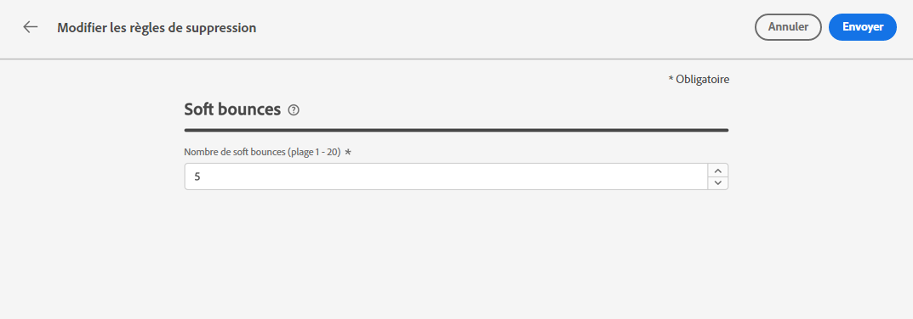

# Reprises {#retries}

Lorsqu’un e-mail échoue en raison d’une erreur temporaire **Soft bounce**, plusieurs reprises sont effectuées. Chaque erreur incrémente un compteur d&#39;erreurs. Lorsque ce compteur atteint le seuil limite, l&#39;adresse est ajoutée à la liste de suppression.

>[!NOTE]
>
>Pour en savoir plus sur les types d’erreurs, consultez la section [Types d’échec de diffusion](../reports/suppression-list.md#delivery-failures).

Dans la configuration par défaut, le seuil est défini à cinq erreurs.

* Pour une même diffusion, à la cinquième erreur rencontrée pendant la [période de reprise](#retry-duration), l’adresse est supprimée.

* S&#39;il existe des diffusions différentes et que deux erreurs se produisent au moins à 24 heures d&#39;intervalle, le compteur d&#39;erreurs est incrémenté à chaque erreur et l&#39;adresse est également supprimée à la cinquième tentative.

Si une diffusion réussit après une reprise, le compteur d&#39;erreurs de l&#39;adresse est réinitialisé.

Si la valeur par défaut de 5 ne correspond pas à vos besoins, vous pouvez modifier le seuil d’erreur en procédant comme suit.

1. Accédez à **[!UICONTROL Canaux]** > **[!UICONTROL Configuration des e-mails]** > **[!UICONTROL Liste de suppression]**.

1. Sélectionnez le bouton **[!UICONTROL Modifier les règles de suppression]**.

   

1. Modifiez le nombre autorisé de soft bounces consécutifs en fonction de vos besoins.

   

   Vous devez saisir une valeur entière comprise entre 1 et 20, ce qui signifie que le nombre minimum de reprises est de 1 et que le nombre maximum est de 20.

   >[!CAUTION]
   >
   >Toute valeur supérieure à 10 peut entraîner des problèmes de réputation en matière de délivrabilité, ainsi que la limitation ou la mise sur liste bloquée des adresses IP par les FAI. [En savoir plus sur la délivrabilité](../reports/deliverability.md)

## Période de reprise {#retry-duration}

La **période de reprise** est la période pendant laquelle tout message électronique de la diffusion ayant rencontré une erreur temporaire ou un soft bounce sera repris.

Par défaut, les reprises seront effectuées pendant **3,5 jours** (ou **84 heures**) à partir du moment où le message a été ajouté à la file d’attente des e-mails.

Cependant, pour vous assurer que les tentatives de reprise ne sont plus effectuées lorsque cela n’est plus nécessaire, vous pouvez modifier ce paramètre en fonction de vos besoins lors de la création ou de la modification d’un [préréglage de message](message-presets.md) s’appliquant au canal e-mail.

Par exemple, vous pouvez définir la période de reprise sur 24 heures pour un e-mail transactionnel relatif à la réinitialisation du mot de passe et contenant un lien valide seulement pendant une journée. De même, pour une vente à minuit, vous pouvez définir une période de reprise de 6 heures.

>[!NOTE]
>
>La période de reprise ne peut pas dépasser 84 heures. La période de reprise minimale est de 6 heures pour les e-mails marketing et de 10 minutes pour les e-mails transactionnels.

Découvrez comment ajuster les paramètres de reprise d’e-mail lors de la création d’un préréglage de message dans [cette section](message-presets.md#create-message-preset).

