# Utiliser des jeux de règles {#rule-sets}

>[!CONTEXTUALHELP]
>id="ajo_business_rules_rule_sets"
>title="Jeux de règles"
>abstract="Utilisez les jeux de règles pour appliquer le capping de fréquence à différents types de communications marketing. Vous pouvez également créer des jeux de règles pour exclure des parcours d’une partie de votre audience en fonction de règles de capping de fréquence."

## Commencer avec les jeux de règles {#gs}

### Que sont les jeux de règles ? {#what}

Outre les règles métier globales qui limitent le nombre de fois où les utilisateurs et utilisatrices reçoivent des messages sur un ou plusieurs canaux, les jeux de règles vous permettent de **regrouper plusieurs règles dans des jeux de règles** et de les appliquer aux campagnes de votre choix. La granularité est ainsi améliorée afin de contrôler la fréquence à laquelle les utilisateurs et utilisatrices recevront un message selon le type de communication.

Vous pouvez par exemple créer un jeu de règles pour limiter le nombre de **communications promotionnelles** envoyées à votre clientèle et créer un autre jeu de règles pour limiter le nombre de **newsletters** qu’elle reçoit. Selon le type de campagne que vous créez, vous pouvez ensuite choisir d’appliquer la communication promotionnelle ou le jeu de règles des newsletters.

➡️ [Découvrir cette fonctionnalité en vidéo](#video)

### Jeux de règles globaux et personnalisés {#global-custom}

Lors de l’accès aux jeux de règles pour la première fois à partir du menu **[!UICONTROL Administration]** > **[!UICONTROL Règles métier (version bêta)]**, un jeu de règles par défaut est précréé et actif : **Jeu de règles par défaut global**.

Ce jeu de règles contient des règles globales que vous pouvez appliquer pour contrôler la fréquence à laquelle les utilisateurs et utilisatrices reçoivent des messages sur un ou plusieurs canaux, comme le font les règles métier actuelles. Toutes les règles définies dans ce jeu de règles s’appliquent à tous les canaux sélectionnés, que les communications soient envoyées d’un parcours ou d’une campagne. [Découvrir comment utiliser les règles métier](../configuration/rule-sets.md)

En plus du jeu de règles « Jeu de règles par défaut global », vous pouvez créer des **jeux de règles personnalisés** que vous pouvez appliquer à n’importe quelle campagne pour limiter le nombre de messages envoyés au sein de cette campagne. [Découvrir comment créer des jeux de règles personnalisés](#create)

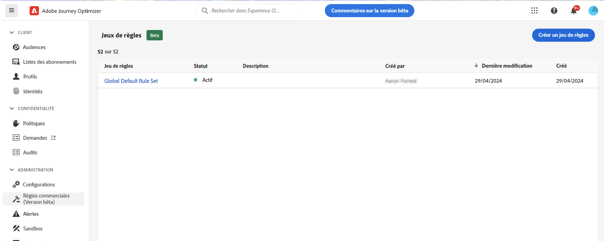

### Règles de limitation des canaux et des parcours {#domain}

>[!CONTEXTUALHELP]
>id="ajo_rule_set_domain"
>title="Domaine du jeu de règles"
>abstract="Lors de la création d’un jeu de règles, vous devez indiquer si les règles du jeu de règles appliqueront les règles de limitation spécifiques aux canaux de communication ou aux parcours."

Lors de la création d’un jeu de règles, vous devez indiquer si les règles du jeu de règles appliqueront les règles de limitation spécifiques aux canaux de communication ou aux parcours. Pour ce faire, sélectionnez un domaine de Canal ou de Parcours pour le jeu de règles lors de sa création. [Découvrez comment créer un jeu de règles](#create)

* Domaine de **Canal** : appliquez des règles de limitation pour les canaux de communication. Par exemple, ne pas envoyer plus d’un e-mail ou d’un SMS par jour.
* Domaine de **Parcours** : appliquez des règles de limitation d’entrée et de simultanéité à un parcours. Par exemple, ne pas entrer simultanément des profils dans plusieurs parcours.

## Créer votre premier jeu de règles personnalisées {#create-rule-set}

### Créer le jeu de règles et sélectionner son domaine {#create}

Pour créer un jeu de règles, procédez comme suit.

>[!NOTE]
>
>Vous pouvez créer jusqu’à 3 ensembles de règles locales de domaine de canal et jusqu’à 5 ensembles de règles locales de domaine de parcours.

1. Accédez à la liste **[!UICONTROL Jeux de règles]**, puis cliquez sur **[!UICONTROL Créer un jeu de règles]**.

   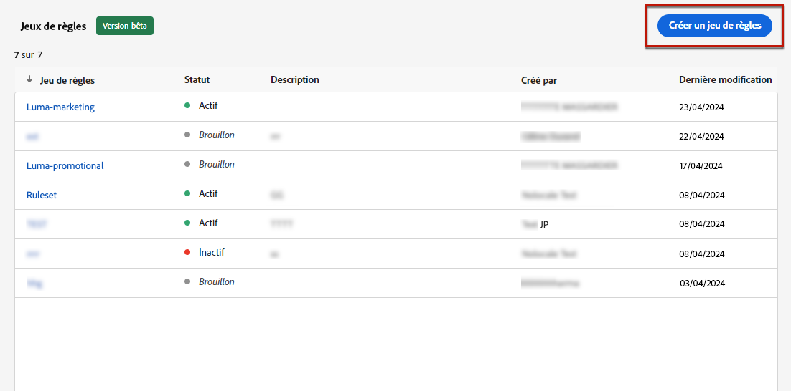

1. Définissez un nom unique pour le jeu de règles et ajoutez une description.

1. Sélectionnez le domaine du jeu de règles. Le domaine vous permet de spécifier si le jeu de règles contient des règles de limitation spécifiques aux canaux de communication ou aux parcours. [En savoir plus sur les règles de limitation des canaux et des parcours](#domain)

   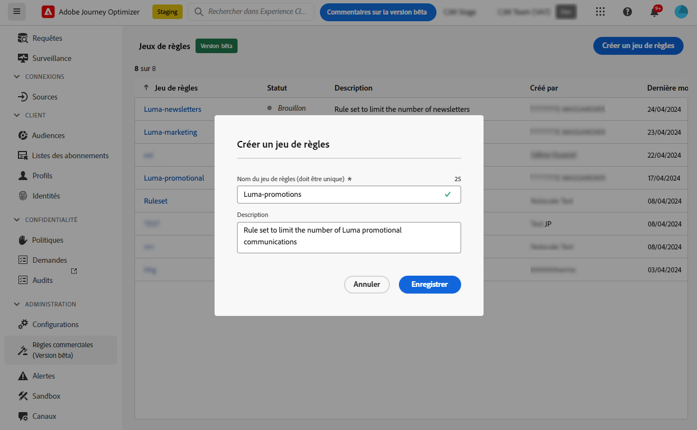

1. Cliquez sur **[!UICONTROL Enregistrer]**.

1. Vous pouvez maintenant [définir les règles](#create-new-rule) que vous souhaitez ajouter à ce jeu de règles.

### Ajouter des règles au jeu de règles {#create-new-rule}

>[!CONTEXTUALHELP]
>id="ajo_rule_sets_category"
>title="Sélectionner la catégorie de règle relative aux messages"
>abstract="Lorsqu’elle sont activées et appliquées à un message, toutes les règles de fréquence correspondant à la catégorie sélectionnée seront automatiquement appliquées à ce message. Actuellement, seule la catégorie Marketing est disponible."

<!--NOT USED?
[!CONTEXTUALHELP]
>id="ajo_rule_sets_capping"
>title="Set the capping for your rule"
>abstract="Specify the maximum number of messages sent to a customer profile within the chosen time frame. The frequency cap will be based on the selected calendar period and will be reset at the beginning of the corresponding time frame."-->

>[!CONTEXTUALHELP]
>id="ajo_rule_sets_channel"
>title="Définissez le ou les canaux auxquels la règle s’applique."
>abstract="Sélectionnez au moins un canal. La limitation est calculée sur l’ensemble des canaux."

>[!CONTEXTUALHELP]
>id="ajo_rule_sets_duration"
>title="Sélectionner la catégorie de règle relative aux messages"
>abstract="Lorsqu’elle sont activées et appliquées à un message, toutes les règles de fréquence correspondant à la catégorie sélectionnée seront automatiquement appliquées à ce message. Actuellement, seule la catégorie Marketing est disponible."

>[!CONTEXTUALHELP]
>id="ajo_rule_set_rule_capping"
>title="Limitation des règles"
>abstract="Définissez la limitation de votre règle. En fonction du domaine du jeu de règles et de la sélection dans le champ Type de règle, ce champ peut définir le nombre maximal de messages qui peuvent être envoyés à un profil, ou le nombre maximal de parcours auxquels le profil peut s’inscrire ou être inscrit simultanément."

Pour ajouter une règle à un jeu de règles, accédez au jeu de règles et cliquez sur **[!UICONTROL Ajouter une règle]**.

Les paramètres disponibles pour la règle dépendent du domaine du jeu de règles sélectionné à sa création.

+++Configurer les règles de limitation des canaux (domaine **Canal**)

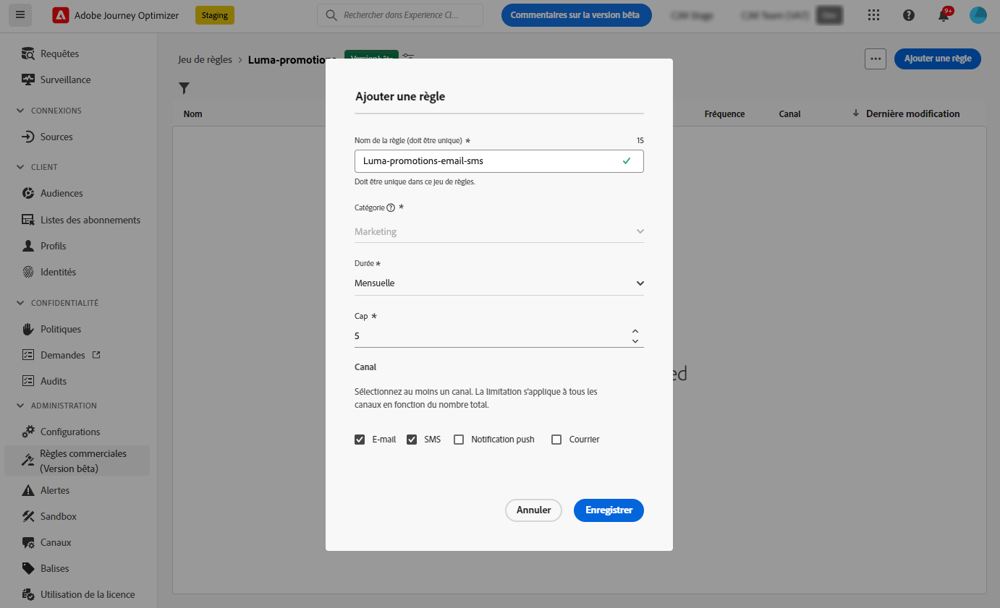

1. Définissez un nom unique pour la règle.

1. Le champ **Catégorie** spécifie la catégorie de message à laquelle la règle s’applique. Pour l’instant, ce champ est en lecture seule, car seule la catégorie **[!UICONTROL Marketing]** est disponible.

1. Dans la liste déroulante **[!UICONTROL Durée]**, sélectionnez si vous souhaitez que la limitation soit appliquée tous les mois, toutes les semaines ou tous les jours. La limite de fréquence est basée sur la période calendaire sélectionnée. Elle est réinitialisée au début de la période correspondante.

   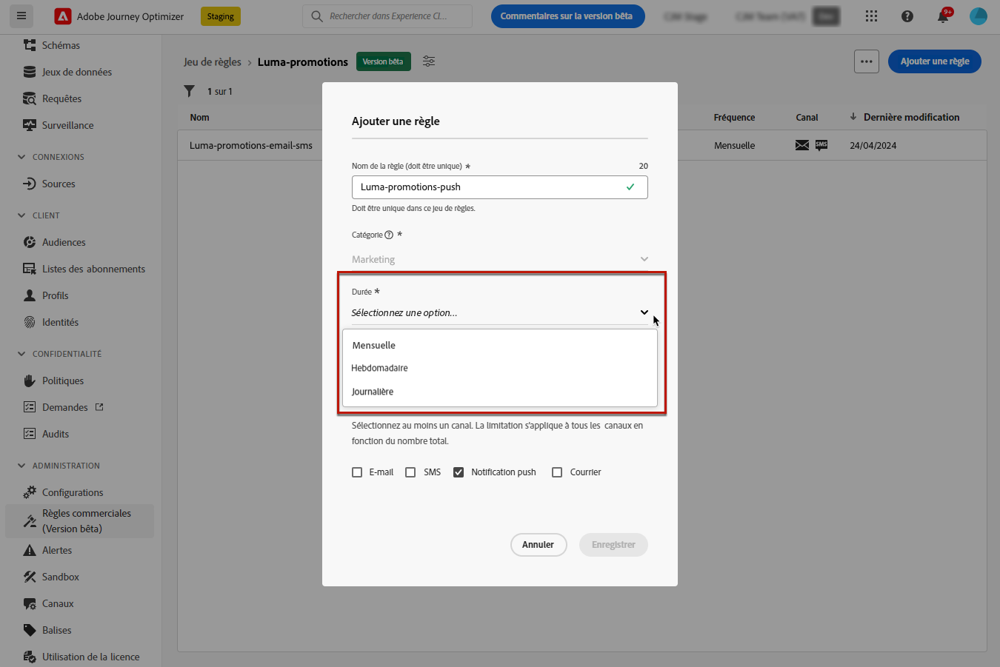

   >[!AVAILABILITY]
   >
   >La durée « quotidienne » est disponible uniquement à la demande. Pour obtenir l’accès, contactez votre représentant ou représentante Adobe.

   L’expiration du compteur pour chaque période se présente comme suit :

   * **[!UICONTROL Mensuele]** : la limite de fréquence est valable jusqu’au dernier jour du mois à 23:59:59 UTC. Par exemple, la date d’expiration mensuelle pour janvier est le 31 janvier à 23:59:59 UTC.

   * **[!UICONTROL Hebdomadaire]** : la limite de fréquence est valable jusqu’au samedi à 23:59:59 UTC de cette semaine, car la semaine calendaire commence le dimanche. L’expiration est indépendante de la création de la règle. Par exemple, si la règle est créée le jeudi, cette règle est valide jusqu’au samedi à 23:59:59.

   * **[!UICONTROL Quotidienne]** : la limite de fréquence quotidienne est valable pour la journée jusqu’à 23:59:59 UTC et est réinitialisée à 0 au début de la journée suivante.

     >[!CAUTION]
     >
     >Pour garantir la précision des règles de capping de la fréquence quotidien, l’utilisation de la [Segmentation en streaming](https://experienceleague.adobe.com/docs/experience-platform/segmentation/ui/streaming-segmentation.html?lang=fr){target="_blank"} est obligatoire. En savoir plus sur les méthodes d’évaluation de l’audience dans [cette section](../audience/about-audiences.md#evaluation-method-in-journey-optimizer).

   Notez que la valeur du compteur de profils est mise à jour une fois la communication diffusée. Tenez-en compte lorsque vous envoyez un grand volume de communications, car le débit peut faire en sorte que les personnes destinataires reçoivent l’e-mail quelques minutes, voire quelques heures après le lancement de la communication (dans le cas où vous envoyez des millions de communications simultanément).

   Cela est important dans le cas où des personnes destinataires reçoivent deux communications de manière rapprochée. Nous vous conseillons d’espacer les communications d’au moins deux heures afin que les personnes destinataires disposent de suffisamment de temps pour recevoir la communication et que la valeur de compteur soit mise à jour en conséquence.

1. Définissez la limitation de votre règle, c’est-à-dire le nombre maximum de messages qui peuvent être envoyés à un profil utilisateur individuel chaque mois, chaque semaine ou chaque jour en fonction de votre sélection ci-dessous.

1. Sélectionnez le canal à utiliser pour cette règle : **[!UICONTROL E-mail]**, **[!UICONTROL SMS]**, **[!UICONTROL Notification push]** ou **[!UICONTROL Courrier]**.

   >[!NOTE]
   >
   >Vous devez sélectionner au moins un canal pour pouvoir créer la règle.

1. Sélectionnez plusieurs canaux si vous souhaitez appliquer une limitation sur tous les canaux sélectionnés en tant que nombre total.

   Par exemple, définissez la limitation sur 5 et sélectionnez les canaux e-mail et SMS. Si un profil a déjà reçu 3 e-mails marketing et 2 SMS marketing pour la période sélectionnée, ce profil sera exclu de la prochaine diffusion de tout e-mail ou SMS marketing.

+++

+++Configurer des règles de limitation des parcours (domaine **Parcours**)

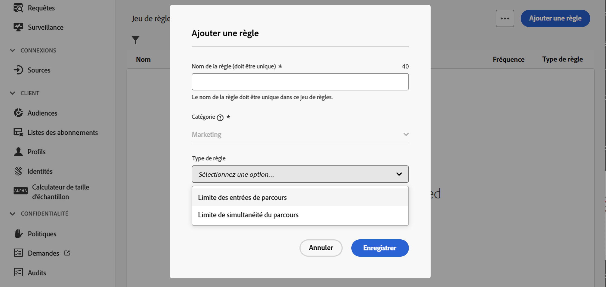

1. Indiquez un nom unique pour la règle.

1. Dans la liste déroulante **[!UICONTROL Type de règle]**, spécifiez le type de limitation de la règle.

   * **[!UICONTROL Limite des entrées de parcours]** : limite le nombre d’entrées dans le parcours sur une période donnée pour un profil.
   * **[!UICONTROL Limite de simultanéité des parcours]** : limite le nombre de parcours dans lesquels un profil peut être inscrit simultanément.

1. Des informations détaillées sur la configuration des règles de limitation de parcours sont disponibles dans la section [Limitation et arbitrage des parcours](../conflict-prioritization/journey-capping.md).

+++

1. Cliquez sur **[!UICONTROL Enregistrer]** pour confirmer la création de la règle. Votre message est ajouté au jeu de règles, au statut **[!UICONTROL Brouillon]**.

   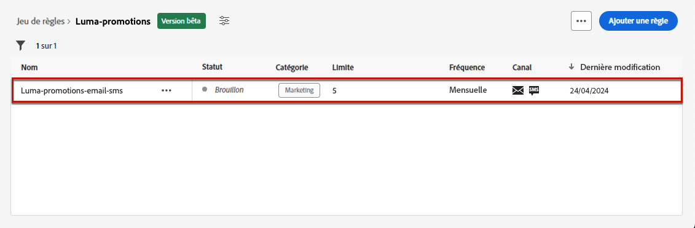

1. Répétez les étapes ci-dessus pour ajouter autant de règles que nécessaire au jeu de règles.

Vous devez maintenant activer chaque règle avant de pouvoir l’appliquer à n’importe quel message. [En savoir plus](#activate-rule)

### Activer les règles et le jeu de règles {#activate-rule}

Une fois créée, la règle affiche le statut **[!UICONTROL Brouillon]** et n’a encore aucune incidence sur le message. Pour l’activer, cliquez sur le bouton **[!UICONTROL Autres actions]** en regard de la règle et sélectionnez **[!UICONTROL Activer]**.

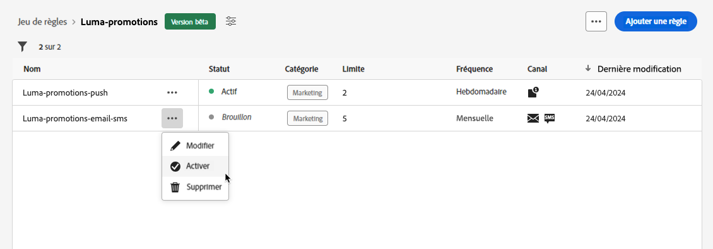

Vous devez également activer le jeu de règles pour pouvoir y accéder dans les campagnes ou parcours et l’appliquer à vos messages.

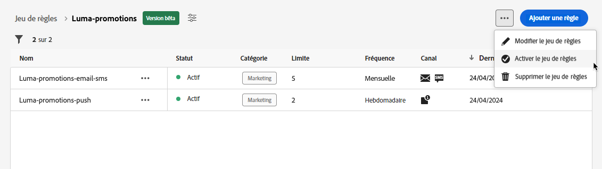

>[!NOTE]
>
>L’activation complète d’un jeu de règles peut prendre jusqu’à 20 minutes. Vous n’avez pas besoin de modifier des messages ou de republier des parcours pour qu’une règle prenne effet.

<!--Currently, once a rule set is activated, no more rules can be added to that rule set.-->

Pour désactiver une règle ou un jeu de règles, cliquez sur le bouton **[!UICONTROL Autres actions]** en regard de l’élément souhaité et sélectionnez **[!UICONTROL Désactiver]**.

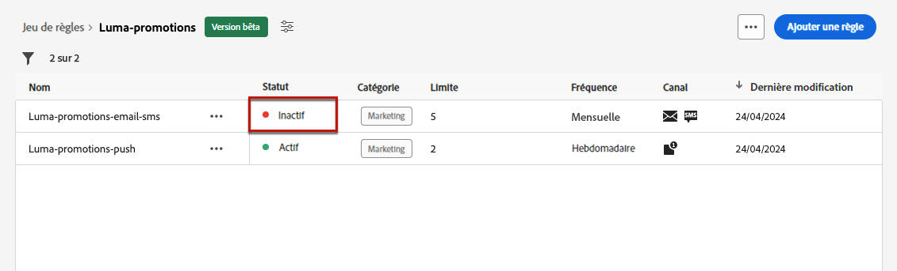

Le statut de la règle devient **[!UICONTROL Inactif]** et la règle ne s’appliquera pas aux futures exécutions de messages. Les messages en cours d&#39;exécution ne seront pas affectés.

>[!NOTE]
>
>La désactivation d’une règle ou d’un jeu de règles n’affecte ou ne réinitialise aucun comptage sur les profils individuels.

## Accéder aux jeux de règles et les gérer {#access-rule-sets}

Tous les jeux de règles créés s’affichent dans le menu **[!UICONTROL Administration]** > **[!UICONTROL Règles métier (version bêta)]**. Ils sont triés par date de dernière modification.

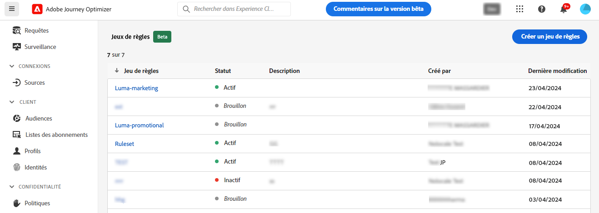

Cliquez sur le nom d’un jeu de règles pour afficher et modifier son contenu. Toutes les règles incluses dans ce jeu de règles sont répertoriées. Le menu contextuel en haut à droite vous permet d’effectuer les opérations suivantes :

* Modifier le nom et la description du jeu de règles
* Activer le jeu de règles - [en savoir plus](#activate-rule)
* Supprimer le jeu de règles

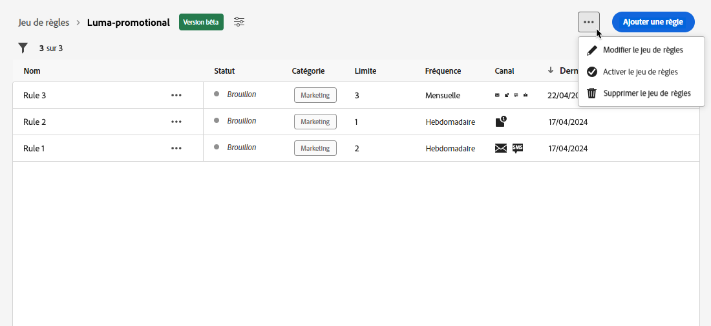

Pour chaque règle du jeu de règles, le bouton **[!UICONTROL Autres actions]** vous permet d’effectuer les opérations suivantes :

* Modifier la règle
* Activer la règle [en savoir plus](#activate-rule)
* Supprimer la règle

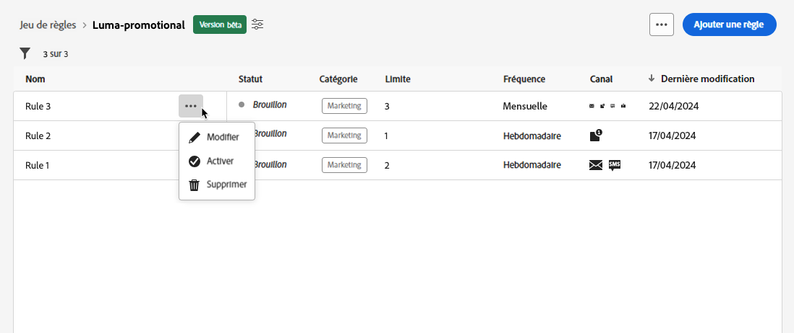

<!--### Permissions{#permissions-frequency-rules}

To access, create, edit or delete message frequency rules, you must have the **[!UICONTROL Manage frequency rules]** permission. 

Users with the **[!UICONTROL View frequency rules]** permission are able to view rules, but not to modify or delete them.

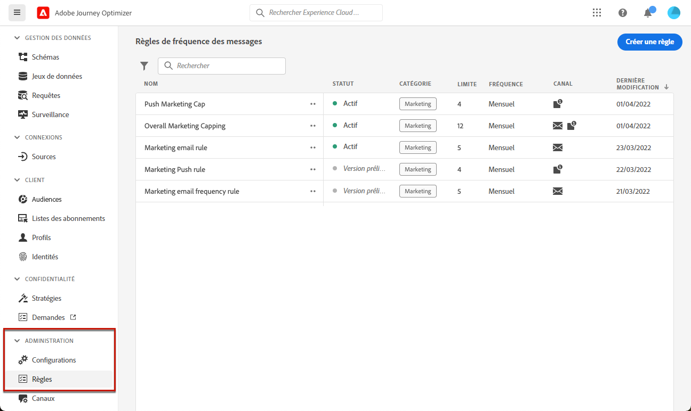

Learn more about permissions in [this section](../administration/high-low-permissions.md).-->

## Appliquer des ensembles de règles à un message ou à un parcours {#apply-frequency-rule}

Vous pouvez appliquer un jeu de règles à un message ou à un parcours, en fonction du domaine sélectionné lors de la création du jeu de règles. Pour plus d’informations, développez les sections ci-dessous.

+++ Appliquer un jeu de règles à un message

1. Lors de la création d’une [campagne](../campaigns/create-campaign.md), sélectionnez l’un des canaux que vous avez définis pour votre jeu de règles et modifiez le contenu de votre message.

1. Dans l’écran de modification du contenu, cliquez sur le bouton **[!UICONTROL Ajouter une règle métier]**.

1. Sélectionnez le [jeu de règles que vous avez créé](#create-rule-set).

   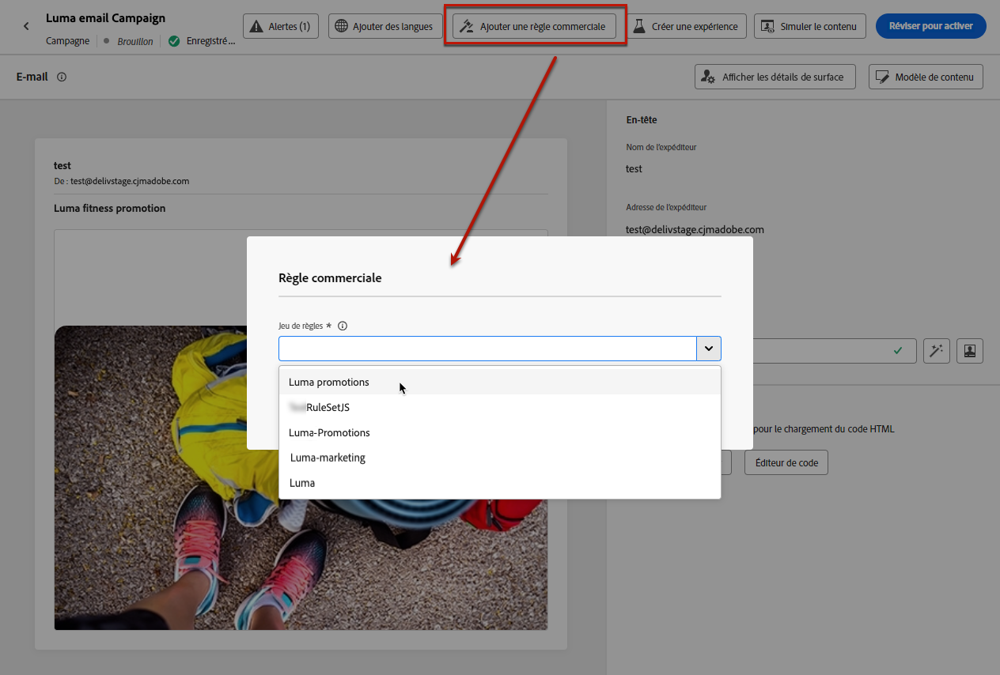

   >[!NOTE]
   >
   >Seuls les jeux de règles [activés](#activate-rule) s’affichent dans la liste.

   <!--Messages where the category selected is **[!UICONTROL Transactional]** will not be evaluated against business rules.-->

1. Avant d’activer votre campagne, assurez-vous de planifier son exécution au moins 10 minutes à l’avance.

   Cela laisse suffisamment de temps pour renseigner les valeurs de compteur sur le profil pour la règle métier que vous avez sélectionnée. Si vous activez immédiatement la campagne, les valeurs de compteur de jeux de règles ne seront pas renseignées sur les profils des personnes destinataires et le message ne sera pas comptabilisé dans les règles de capping de fréquence pour les jeux de règles personnalisées.

   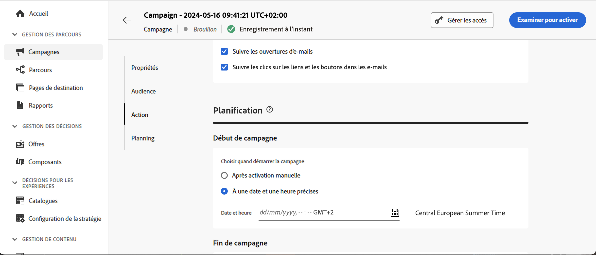

1. Vous pouvez visualiser le nombre de profils exclus de la diffusion dans le [rapport Customer Journey Analytics](../reports/report-gs-cja.md) et dans le [rapport dynamique](../reports/live-report.md), où les règles de fréquence seront répertoriées comme une raison possible pour les personnes exclues de la diffusion.

>[!NOTE]
>
>Plusieurs règles peuvent s’appliquer au même canal, mais une fois la limite inférieure atteinte, le profil sera exclu des prochaines diffusions.

<!--
## Example: combine several rules {#frequency-rule-example}

You can combine several message frequency rules, such as described in the example below.

1. [Create a rule](#create-new-rule) called *Overall Marketing Capping*:

   * Select all channels.
   * Set capping to 12 monthly.

   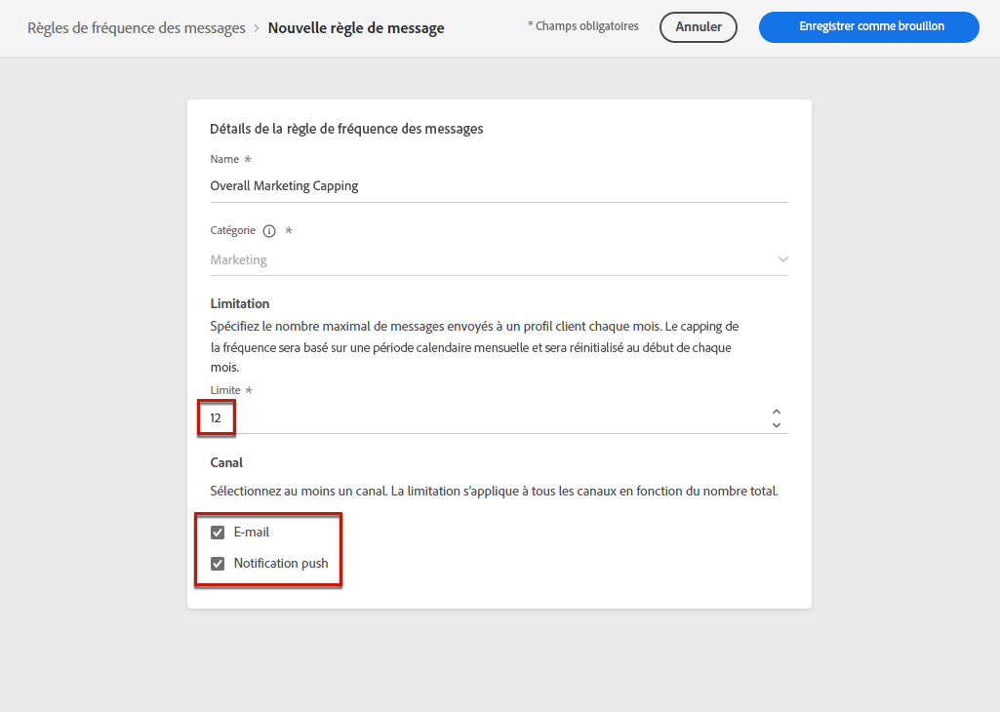

1. To further restrict the number of marketing-based push notifications that a user is sent, create a second rule called *Push Marketing Cap*:

   * Select Push channel.
   * Set capping to 4 monthly.

   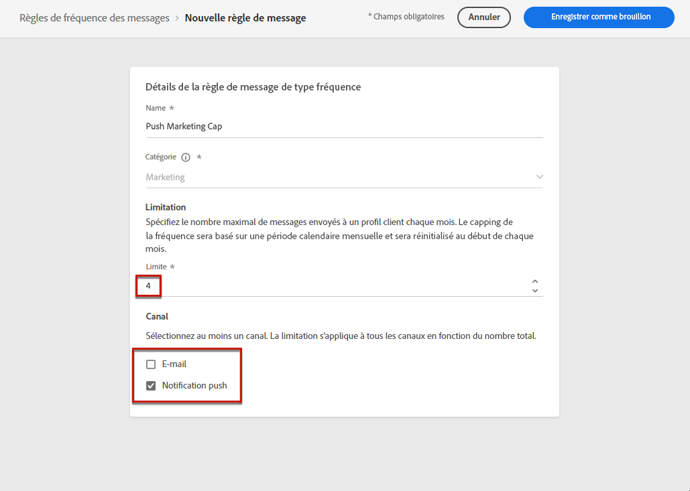

1. Save and [activate](#activate-rule) the rule.

1. [Create a message](../building-journeys/journeys-message.md) for every channel you want to communicate through and select the **[!UICONTROL Marketing]** category for each message. [Learn how to apply a frequency rule](#apply-frequency-rule)

   

In this scenario, an individual profile:
* can receive up to 12 marketing messages per month;
* but will be excluded from marketing push notifications after they have received 4 push notifications.-->

Lors du test des règles de fréquence, il est recommandé d’utiliser un nouveau [profil de test](../audience/creating-test-profiles.md), car une fois la limitation de fréquence d’un profil atteinte, il n’est pas possible de réinitialiser le compteur avant la période suivante. La désactivation d’une règle permet aux profils limités de recevoir des messages, mais elle ne supprime pas les incréments de compteur.

+++

+++ Appliquer un jeu de règles à un parcours

Pour appliquer une règle de limitation à un parcours, accédez au parcours et ouvrez ses propriétés. Dans la liste déroulante **[!UICONTROL Règles de limitation]**, sélectionnez le jeu de règles approprié.

>[!IMPORTANT]
>
>Si un parcours est activé immédiatement, cela peut prendre jusqu’à 15 minutes pour que le système puisse commencer à supprimer la clientèle. Vous pouvez planifier votre parcours pour qu’il commence au moins 15 minutes dans le futur afin d’éviter cette éventualité.

+++

## Vidéo pratique {#video}

>[!VIDEO](https://video.tv.adobe.com/v/3435531?quality=12)
