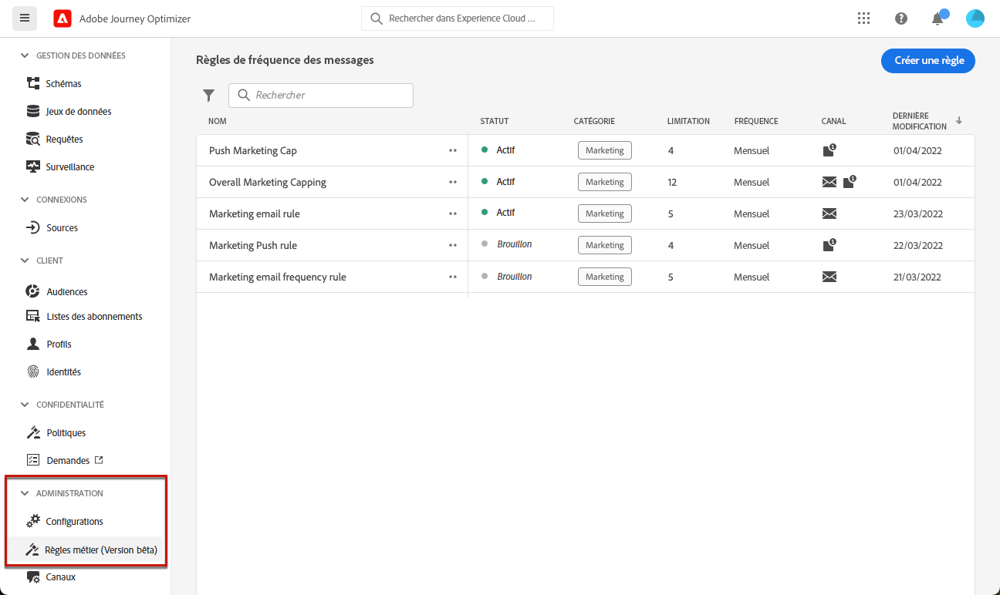

# Utilisation d’ensembles de règles {#rule-sets}

>[!CONTEXTUALHELP]
>id="ajo_business_rules_rule_sets"
>title="Jeux de règles"
>abstract="Utilisez les ensembles de règles pour appliquer la limitation de fréquence à différents types de communications marketing. Vous pouvez par exemple créer un ensemble de règles pour limiter le nombre de **communications promotionnelles** envoyé à vos clients et créez un autre ensemble de règles pour limiter le nombre de **newsletters** leur a été envoyé. Les jeux de règles sont actuellement disponibles en version bêta pour sélectionner uniquement les utilisateurs."

>[!AVAILABILITY]
>
>Les jeux de règles sont actuellement disponibles en version bêta uniquement pour les utilisateurs sélectionnés. Contactez votre représentant d’Adobe pour qu’il soit inclus dans la version bêta.

## Que sont les ensembles de règles ? {#what}

Outre les règles commerciales globales qui limitent le nombre de fois où les utilisateurs reçoivent des messages sur un ou plusieurs canaux, les jeux de règles vous permettent de **regrouper plusieurs règles dans des jeux de règles ;** et les appliquer aux campagnes de votre choix. La granularité est ainsi améliorée afin de contrôler la fréquence à laquelle les utilisateurs recevront un message selon le type de communication.

Vous pouvez par exemple créer un ensemble de règles pour limiter le nombre de **communications promotionnelles** envoyé à vos clients et un autre ensemble de règles pour limiter le nombre de **newsletters** leur a été envoyé. Selon le type de campagne que vous créez, vous pouvez ensuite choisir d’appliquer la communication promotionnelle ou l’ensemble de règles des newsletters.

## Jeux de règles globaux et personnalisés {#global-custom}

Lors de l’accès aux jeux de règles pour la première fois à partir de **[!UICONTROL Administration]** > **[!UICONTROL Règles de fonctionnement (bêta)]** , un jeu de règles par défaut est précréé et actif : **Jeu de règles par défaut global**.

Ce jeu de règles contient des règles globales que vous pouvez appliquer pour contrôler la fréquence à laquelle les utilisateurs reçoivent des messages sur un ou plusieurs canaux, comme le fonctionnement des règles métier actuelles. Toutes les règles définies dans ce jeu de règles s’appliquent à tous les canaux sélectionnés, que les communications proviennent d’un parcours ou d’une campagne. [Découvrez comment utiliser les règles de fonctionnement](frequency-rules.md)

Outre ce jeu de règles &quot;Jeu de règles par défaut global&quot;, vous pouvez créer des **règle personnalisée** définit que vous pouvez appliquer à n’importe quelle campagne pour limiter le nombre de messages envoyés dans cette campagne. [Découvrez comment créer des jeux de règles personnalisés](#create)

>[!IMPORTANT]
>
>Pour l’instant, les jeux de règles personnalisés peuvent être appliqués à **campagnes** uniquement. Seules les règles définies dans le jeu de règles &quot;Jeu de règles par défaut global&quot; s’appliquent aux communications parcours et campagnes.

## Créer votre premier jeu de règles personnalisé {#create-rule-set}

### Création du jeu de règles {#create}

Pour créer un jeu de règles, procédez comme suit.

>[!NOTE]
>
>Vous pouvez créer jusqu’à 3 jeux de règles personnalisés.

1. Accédez à la liste **[!UICONTROL Jeux de règles]**, puis cliquez sur **[!UICONTROL Créer un jeu de règles]**.

   

1. Définissez le nom du jeu de règles, ajoutez une description si nécessaire, puis cliquez sur **[!UICONTROL Enregistrer]**.

   

   >[!NOTE]
   >
   >Le nom du jeu de règles doit être unique.

1. Maintenant, vous pouvez [définir les règles ;](#create-new-rule) vous souhaitez ajouter à ce jeu de règles.

### Ajouter des règles au jeu de règles {#create-new-rule}

>[!CONTEXTUALHELP]
>id="ajo_rule_sets_category"
>title="Sélectionner la catégorie de règle du message"
>abstract="Lorsqu’elle sont activées et appliquées à un message, toutes les règles de fréquence correspondant à la catégorie sélectionnée seront automatiquement appliquées à ce message. Actuellement, seule la catégorie Marketing est disponible."

>[!CONTEXTUALHELP]
>id="ajo_rule_sets_capping"
>title="Définir la limitation de votre règle"
>abstract="Spécifiez le nombre maximal de messages envoyés à un profil client au cours de la période choisie. La limite de fréquence sera basée sur la période calendaire sélectionnée et sera réinitialisée au début de la période correspondante."

>[!CONTEXTUALHELP]
>id="ajo_rule_sets_channel"
>title="Définissez le ou les canaux auxquels la règle s’applique."
>abstract="Sélectionnez au moins un canal. Le plafond est calculé sur l’ensemble des canaux."

>[!CONTEXTUALHELP]
>id="ajo_rule_sets_duration"
>title="Sélectionner la catégorie de règle du message"
>abstract="Lorsqu’elle sont activées et appliquées à un message, toutes les règles de fréquence correspondant à la catégorie sélectionnée seront automatiquement appliquées à ce message. Actuellement, seule la catégorie Marketing est disponible."

Pour ajouter une règle à un jeu de règles, procédez comme suit :

1. Dans le jeu de règles que vous venez de créer, cliquez sur **[!UICONTROL Ajouter une règle]**.

   

1. Définition d’une variable **Nom de la règle**.

1. La variable **Catégorie** spécifie la catégorie de message à laquelle la règle s’applique. Pour l’instant, ce champ est en lecture seule comme la seule valeur **[!UICONTROL Marketing]** est disponible.

1. Dans la **[!UICONTROL Durée]** , sélectionnez cette option si vous souhaitez que la limitation soit appliquée tous les mois, toutes les semaines ou tous les jours. La limite de fréquence est basée sur la période calendaire sélectionnée. Elle est réinitialisée au début de la période correspondante.

   

   L’expiration du compteur pour chaque période se présente comme suit :

   * **[!UICONTROL Mensuelle]** : la limite de fréquence est valable jusqu’au dernier jour du mois à 23:59:59 UTC. Par exemple, la date d’expiration mensuelle pour janvier est le 31 janvier à 23:59:59 UTC.

   * **[!UICONTROL Hebdomadaire]** : la limite de fréquence est valable jusqu’au samedi à 23:59:59 UTC de cette semaine, car la semaine calendaire commence le dimanche. L’expiration est indépendante de la création de la règle. Par exemple, si la règle est créée le jeudi, cette règle est valide jusqu’au samedi à 23:59:59.

   * **[!UICONTROL Quotidienne]** : la limite de fréquence quotidienne est valable pour la journée jusqu’à 23:59:59 UTC et est réinitialisée à 0 au début de la journée suivante.

     >[!CAUTION]
     >
     >Pour garantir la précision des règles de capping de la fréquence quotidien, l’utilisation de la [Segmentation en streaming](https://experienceleague.adobe.com/docs/experience-platform/segmentation/ui/streaming-segmentation.html?lang=fr){target="_blank"} est obligatoire. En savoir plus sur les méthodes d’évaluation de l’audience dans [cette section](../audience/about-audiences.md#evaluation-method-in-journey-optimizer).

   Notez que la valeur du compteur de profils est mise à jour une fois la communication diffusée. Veuillez en tenir compte lorsque vous envoyez un grand volume de communications, car le débit peut entraîner l&#39;envoi au destinataire de l&#39;email de minutes, voire d&#39;heures, après le lancement de la communication (dans le cas où vous envoyez des millions de communications simultanément).

   Cela est important dans le cas où un destinataire reçoit deux communications de manière rapprochée. Dans la mesure du possible, nous vous conseillons de séparer les communications d’au moins deux heures afin que le destinataire dispose de suffisamment de temps pour recevoir la communication et que la valeur de compteur soit mise à jour en conséquence.

1. Définissez la limitation de votre règle, c’est-à-dire le nombre maximum de messages qui peuvent être envoyés à un profil utilisateur individuel chaque mois, chaque semaine ou chaque jour en fonction de votre sélection ci-dessous.

1. Sélectionnez le canal à utiliser pour cette règle : **[!UICONTROL E-mail]**, **[!UICONTROL SMS]**, **[!UICONTROL Notification push]** ou **[!UICONTROL Courrier]**.

   

   >[!NOTE]
   >
   >Vous devez sélectionner au moins un canal pour pouvoir créer la règle.

1. Sélectionnez plusieurs canaux si vous souhaitez appliquer une limitation sur tous les canaux sélectionnés en tant que nombre total.

   Par exemple, définissez la limitation sur 5 et sélectionnez les canaux e-mail et SMS. Si un profil a déjà reçu 3 e-mails marketing et 2 SMS marketing pour la période sélectionnée, ce profil sera exclu de la prochaine diffusion de tout e-mail ou SMS marketing.

1. Cliquez sur **[!UICONTROL Enregistrer]** pour confirmer la création de la règle. Votre message est ajouté au jeu de règles, au statut **[!UICONTROL Brouillon]**.

   

1. Répétez les étapes ci-dessus pour ajouter autant de règles que nécessaire au jeu de règles.

Vous devez maintenant activer chaque règle avant de pouvoir l’appliquer à n’importe quel message. [En savoir plus](#activate-rule)

### Activer les règles et le jeu de règles {#activate-rule}

Une fois créée, la règle affiche le statut **[!UICONTROL Brouillon]** et n’a encore aucune incidence sur le message. Pour l’activer, cliquez sur le bouton **[!UICONTROL Autres actions]** en regard de la règle et sélectionnez **[!UICONTROL Activer]**.

Vous devez également activer le jeu de règles pour pouvoir y accéder dans les campagnes ou parcours et l’appliquer à vos messages.

L’activation d’un jeu de règles aura un impact sur tous les messages auxquels il s’applique lors de leur exécution suivante. Découvrez comment [appliquer un jeu de règles à un message](#apply-rule-set).

>[!NOTE]
>
>L’activation complète d’un jeu de règles peut prendre jusqu’à 10 minutes. Vous n’avez pas besoin de modifier des messages ou de republier des parcours pour qu’une règle prenne effet.

<!--Currently, once a rule set is activated, no more rules can be added to that rule set.-->

Pour désactiver une règle ou un jeu de règles, cliquez sur le bouton **[!UICONTROL Autres actions]** en regard de l’élément souhaité et sélectionnez **[!UICONTROL Désactiver]**.

Le statut de la règle devient **[!UICONTROL Inactif]** et la règle ne s’appliquera pas aux futures exécutions de messages. Les messages en cours d&#39;exécution ne seront pas affectés.

>[!NOTE]
>
>La désactivation d’une règle ou d’un jeu de règles n’affecte ou ne réinitialise aucun comptage sur les profils individuels.

## Accès et gestion des ensembles de règles {#access-rule-sets}

Tous les jeux de règles créés s’affichent dans la variable **[!UICONTROL Administration]** > **[!UICONTROL Règles de fonctionnement (bêta)]** . Ils sont triés par date de dernière modification.

Cliquez sur le nom d’un jeu de règles pour afficher et modifier son contenu. Toutes les règles incluses dans ce jeu de règles sont répertoriées. Le menu contextuel en haut à droite vous permet d’effectuer les opérations suivantes :

* Modifier le nom et la description du jeu de règles
* Activer le jeu de règles - [en savoir plus](#activate-rule)
* Supprimer le jeu de règles

Pour chaque règle du jeu de règles, le bouton **[!UICONTROL Autres actions]** vous permet d’effectuer les opérations suivantes :

* Modifier la règle
* Activer la règle [en savoir plus](#activate-rule)
* Supprimer la règle

<!--### Permissions{#permissions-frequency-rules}

To access, create, edit or delete message frequency rules, you must have the **[!UICONTROL Manage frequency rules]** permission. 

Users with the **[!UICONTROL View frequency rules]** permission are able to view rules, but not to modify or delete them.

Learn more about permissions in [this section](../administration/high-low-permissions.md).-->

## Appliquer un ensemble de règles à un message {#apply-frequency-rule}

Pour appliquer une règle de fonctionnement à un message, procédez comme suit.

1. Lors de la création d’une [campagne](../campaigns/create-campaign.md), sélectionnez l’un des canaux que vous avez définis pour votre jeu de règles et modifiez le contenu de votre message.

1. Dans l’écran de modification du contenu, cliquez sur le bouton **[!UICONTROL Ajouter une règle métier]**.

1. Sélectionnez le [jeu de règles que vous avez créé](#create-rule-set).

   

   >[!NOTE]
   >
   >Seuls les jeux de règles [activés](#activate-rule) s’affichent dans la liste.

   <!--Messages where the category selected is **[!UICONTROL Transactional]** will not be evaluated against business rules.-->

1. Avant d&#39;activer votre campagne, veillez à planifier son exécution dans au moins 10 minutes.

   Cela permet de gagner suffisamment de temps pour renseigner les valeurs de compteur sur le profil pour la règle de fonctionnement que vous avez sélectionnée. Si vous activez immédiatement la campagne, les valeurs de compteur de l’ensemble de règles ne seront pas renseignées sur les profils des destinataires et le message ne sera pas comptabilisé dans les règles de limitation de fréquence pour les ensembles de règles personnalisés.

   

1. Vous pouvez visualiser le nombre de profils exclus de la diffusion dans le [rapport global](../reports/global-report.md) et dans le [rapport dynamique](../reports/live-report.md), où les règles de fréquence seront répertoriées comme une raison possible pour les utilisateurs exclus de la diffusion.

>[!NOTE]
>
>Plusieurs règles peuvent s’appliquer au même canal, mais une fois la limite inférieure atteinte, le profil sera exclu des prochaines diffusions.

<!--
## Example: combine several rules {#frequency-rule-example}

You can combine several message frequency rules, such as described in the example below.

1. [Create a rule](#create-new-rule) called *Overall Marketing Capping*:

   * Select all channels.
   * Set capping to 12 monthly.

   

1. To further restrict the number of marketing-based push notifications that a user is sent, create a second rule called *Push Marketing Cap*:

   * Select Push channel.
   * Set capping to 4 monthly.

   

1. Save and [activate](#activate-rule) the rule.

1. [Create a message](../building-journeys/journeys-message.md) for every channel you want to communicate through and select the **[!UICONTROL Marketing]** category for each message. [Learn how to apply a frequency rule](#apply-frequency-rule)

   

In this scenario, an individual profile:
* can receive up to 12 marketing messages per month;
* but will be excluded from marketing push notifications after they have received 4 push notifications.-->

Lors du test des règles de fréquence, il est recommandé d’utiliser un nouveau [profil de test](../audience/creating-test-profiles.md), car une fois la limitation de fréquence d’un profil atteinte, il n’est pas possible de réinitialiser le compteur avant la période suivante. La désactivation d’une règle permet aux profils limités de recevoir des messages, mais elle ne supprime pas les incréments de compteur.
