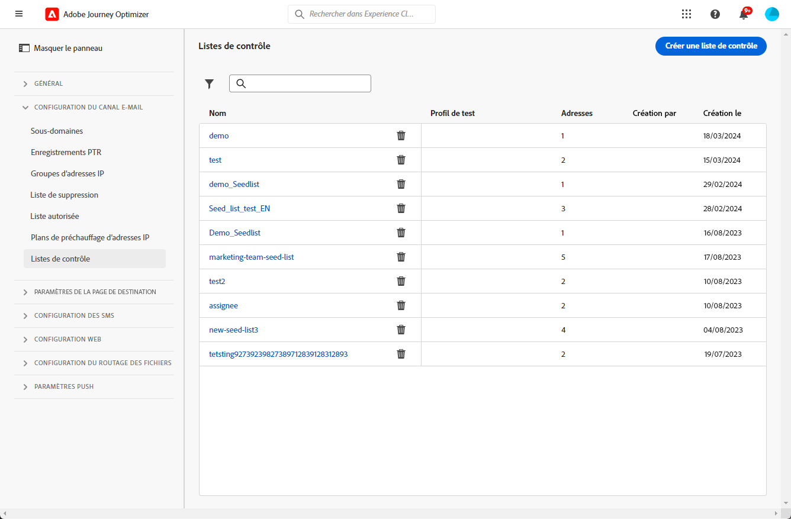

# Utiliser des listes de contrôle {#seed-lists}

Les listes de contrôle dans [!DNL Journey Optimizer] vous permettent d’inclure automatiquement des adresses de contrôle spécifiques dans vos diffusions.

>[!CAUTION]
>
>Actuellement, cette fonctionnalité s’applique uniquement au canal e-mail.

Les adresses de contrôle permettent de cibler des personnes destinataires qui ne correspondent pas aux critères de ciblage définis. Ainsi, les personnes destinataires qui n’entrent pas dans le cadre de la diffusion peuvent la recevoir, comme toute autre personne destinataire cible.

Les adresses de contrôle ne sont ni des profils réels ni des profils de test, car elles n’incluent aucun détail de profil. Elles ne sont que des personnes destinataires appartenant à des parties prenantes internes stockées dans le système. Lorsqu’elles sont sélectionnées dans une campagne ou un parcours spécifique, elles sont incluses au moment de l’exécution de la diffusion, ce qui signifie qu’elles recevront une copie de la diffusion à des fins de vérification.

* En recevant des diffusions en même temps et dans les mêmes conditions que vos clientes et clients, les listes de contrôle vous permettent de surveiller les copies d’e-mails envoyées pour vous assurer que tous les formats d’affichage, les images et les liens sont corrects, ainsi que de suivre les messages réels envoyés à vos personnes destinataires.

  Par exemple :

  +++ Si vous êtes la personne responsable du marketing :

  Vous souhaitez que toutes les personnes membres de votre équipe reçoivent des copies des messages envoyés en même temps que vos clientes et clients. Ainsi, votre équipe peut s’assurer que les messages sont envoyés avec la disposition prévue et les URL actives, ou encore le bon texte et les bonnes images, c’est-à-dire comme prévu avant exécution.

  +++

  +++ Si vous êtes la personne propriétaire d’un produit :

  Vous devez effectuer le suivi des messages réels envoyés aux clientes et clients. En effet, votre équipe et votre direction peuvent s’intéresser à certaines campagnes et doivent être ajoutées sur une base ad hoc pour recevoir des copies du message au moment de la diffusion.

  +++

* Une autre raison d’utiliser les listes de contrôle est la protection de votre liste de publipostage. L’insertion d’adresses de contrôle dans votre liste de publipostage vous permet de savoir si elle est utilisée par une entité tierce. Les adresses de contrôle qu’elle contient recevront en effet les diffusions envoyées à votre liste de publipostage.

>[!NOTE]
>
>Les variantes sont prises en charge, notamment les variantes multilingues et d’expérimentation. Chaque adresse de contrôle reçoit une copie unique de chaque variante du même message, par exemple différentes versions d’une [expérience de contenu](../content-management/get-started-experiment.md). Notez que des e-mails de contrôle distincts ne sont pas envoyés pour du contenu conditionnel.

## Accéder aux listes de contrôle {#access-seed-lists}

Pour accéder aux listes de contrôle déjà créées, accédez à **[!UICONTROL Administration]** > **[!UICONTROL Canaux]** > **[!UICONTROL Paramètres des e-mails]**, puis sélectionnez **[!UICONTROL Liste de contrôle]**.

<!--
>[!CAUTION]
>
>Permissions to view, export and manage the seed lists are restricted to [Journey Administrators](../administration/ootb-product-profiles.md#journey-administrator). Learn more about managing [!DNL Journey Optimizer] users' access rights in [this section](../administration/permissions-overview.md).-->

>[!CAUTION]
>
>Pour pouvoir afficher, modifier et gérer les listes de contrôle, vous devez disposer de l’autorisation **[!UICONTROL Gérer la liste de contrôle]**.

Vous pouvez effectuer des recherches dans les listes de contrôle par nom et/ou filtrer selon la personne qui a créé la liste ou selon la date de création. Une fois la liste sélectionnée, vous pouvez effacer le filtre affiché en haut de la liste.

Utilisez le bouton **[!UICONTROL Supprimer]** pour supprimer définitivement une entrée.

>[!CAUTION]
>
>Il n’est pas possible de supprimer une liste de contrôle utilisée dans une [campagne](../campaigns/review-activate-campaign.md) active ou un [parcours](../building-journeys/publish-journey.md) actif. Vous devez désactiver la campagne/le parcours ou le modifier pour utiliser une autre configuration dans laquelle la liste de contrôle n’est pas sélectionnée. [En savoir plus sur l’utilisation d’une liste de contrôle](#use-seed-list)

Vous pouvez cliquer sur le nom d’une liste de contrôle pour l’éditer. <!--Use the **[!UICONTROL Edit]** button to edit a seed list.-->

## Créer une liste de contrôle {#create-seed-list}

>[!CONTEXTUALHELP]
>id="ajo_seed_list_details"
>title="Définir une liste de contrôle"
>abstract="Utilisez une liste de contrôle pour ajouter automatiquement des adresses internes spécifiques à votre audience de diffusion, et ce à des fins de vérification. Les listes de contrôle vous permettent de surveiller les copies de message envoyées pour vous assurer que tous les éléments d’affichage sont corrects et protéger ainsi votre liste de publipostage. Actuellement, cette fonctionnalité s’applique uniquement au canal e-mail."
>additional-url="https://experienceleague.adobe.com/docs/journey-optimizer/using/configuration/seed-lists.html?lang=fr#use-seed-list" text="Que sont les listes de contrôle ?"

>[!CONTEXTUALHELP]
>id="ajo_seed_addresses"
>title="Remplir la liste de contrôle"
>abstract="Sélectionnez les adresses qui seront incluses au moment de l’exécution de la diffusion et qui recevront une copie exacte de votre message. Vous pouvez importer un fichier CSV ou saisir manuellement des adresses e-mail."

Pour créer une liste de contrôle, procédez comme suit :

1. Accédez au menu **[!UICONTROL Administration]** > **[!UICONTROL Canaux]** > **[!UICONTROL Paramètres des e-mails]** > **[!UICONTROL Liste de contrôle]**.

1. Cliquez sur le bouton **[!UICONTROL Créer une liste de contrôle]**.

   <!---->

1. Renseignez les détails. Commencez par ajouter un nom.

   

   >[!NOTE]
   >
   >Les noms doivent commencer par une lettre (A-Z) et inclure uniquement des caractères alphanumériques ou spéciaux (_, ., -).

1. Sélectionnez le canal. Actuellement, seul le canal e-mail est disponible.

1. Sélectionnez un profil de test. Comme les adresses de contrôle n’incluent pas les détails du profil, ce profil de test ne sera utilisé que pour afficher les données de personnalisation dans le message envoyé aux adresses de contrôle.

   >[!NOTE]
   >
   >Un seul profil de test peut être sélectionné à la fois.

1. Ajoutez les adresses de contrôle auxquelles vous souhaitez envoyer vos diffusions. Vous pouvez importer un fichier CSV ou saisir manuellement des adresses e-mail.

   

   >[!NOTE]
   >
   >Vous pouvez combiner les deux options, mais le nombre total d’adresses dans une liste de contrôle ne peut pas dépasser 300.

1. Cliquez sur **[!UICONTROL Créer]** pour confirmer. La liste de contrôle nouvellement créée s’affiche dans l’[écran de liste de contrôle](#access-seed-lists).

## Utiliser une liste de contrôle dans une campagne ou un parcours {#use-seed-list}

Maintenant que votre liste de contrôle est créée, vous pouvez l’utiliser dans n’importe quelle campagne ou n’importe quel parcours pour inclure les adresses de contrôle correspondantes dans vos diffusions. Pour ce faire, procédez comme suit.

>[!CAUTION]
>
>Les messages envoyés aux adresses de contrôle ne sont pas inclus dans les rapports de parcours ou de campagne.

1. Créez une configuration et sélectionnez le canal **[!UICONTROL E-mail]**. [En savoir plus](../email/email-settings.md)

1. Sélectionnez la liste de contrôle de votre choix dans la [section correspondante](../email/email-settings.md#seed-list).

   >[!NOTE]
   >
   >Une seule liste de contrôle peut être sélectionnée à la fois.

   

1. Soumettez la configuration.

1. Créez une [campagne](../campaigns/create-campaign.md) ou un [parcours](../building-journeys/journey-gs.md).

1. Sélectionnez l’action **[!UICONTROL E-mail]** et sélectionnez la [configuration](channel-surfaces.md) contenant la liste de contrôle qui vous intéresse.

   

1. Activez votre [campagne](../campaigns/review-activate-campaign.md) ou publiez votre [parcours](../building-journeys/publish-journey.md).

Désormais, chaque fois qu’un e-mail est envoyé à vos clientes et clients par le biais de cette campagne ou de ce parcours, les adresses e-mail de la liste de contrôle sélectionnée le reçoivent également dans les mêmes conditions, en même temps et avec le même contenu que les personnes destinataires ciblées.

>[!NOTE]
>
>Les parcours en [mode test](../building-journeys/testing-the-journey.md) n’envoient pas d’e-mails à la liste de contrôle. Pour vérifier le contenu de votre e-mail, utilisez la fonctionnalité [prévisualisation et test](../content-management/preview-test.md) avant d’envoyer votre message.
>
>Pour les parcours récurrents, la diffusion e-mail est envoyée aux adresses de contrôle à chaque exécution du parcours, à condition qu’au moins un profil atteigne le nœud d’e-mail.
