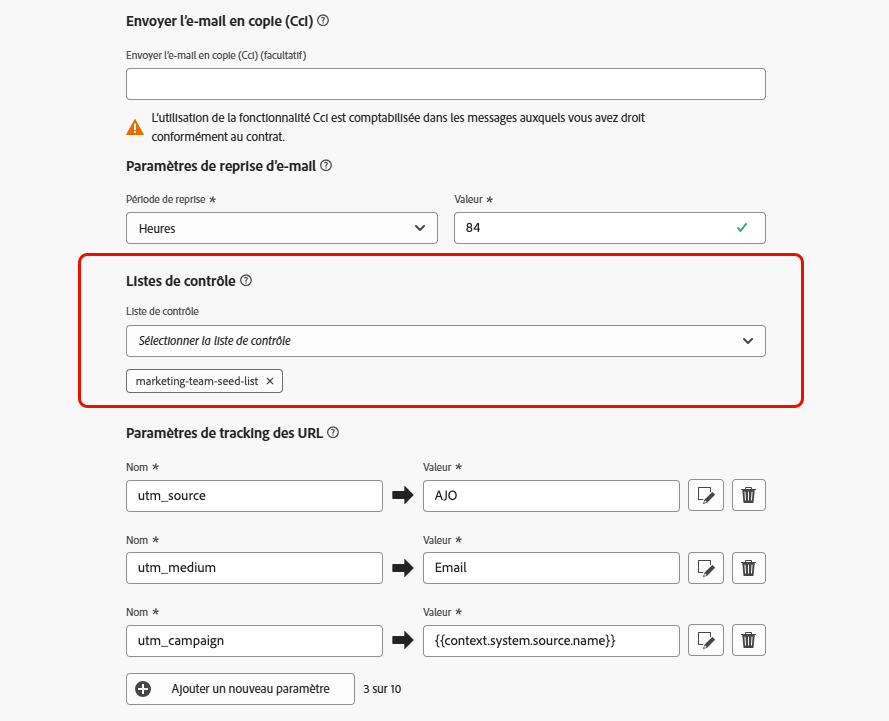

# Utiliser des listes de contrôle {#seed-lists}

Listes de contrôle dans [!DNL Journey Optimizer] vous permettent d&#39;inclure automatiquement des adresses de contrôle spécifiques dans vos diffusions.

>[!CAUTION]
>
>Actuellement, cette fonctionnalité ne s’applique qu’au canal email.

Les adresses de contrôle permettent de cibler des destinataires qui ne correspondent pas aux critères de ciblage définis. Ainsi, les destinataires qui n’entrent pas dans le cadre de la diffusion peuvent la recevoir, comme tout autre destinataire cible.

Les adresses de contrôle ne sont ni des profils réels ni des profils de test, car elles n’incluent aucun détail de profil. Ils ne sont que des destinataires appartenant à des parties prenantes internes stockées dans le système. Lorsqu&#39;ils sont sélectionnés dans une campagne ou un parcours spécifique, ils sont inclus au moment de l&#39;exécution de la diffusion, ce qui signifie qu&#39;ils recevront une copie de la diffusion à des fins d&#39;assurance.

* En recevant des diffusions en même temps et dans les mêmes conditions que vos clients, les listes de contrôle vous permettent de surveiller les copies d&#39;emails envoyées pour vous assurer que tous les formats d&#39;affichage, images et liens sont corrects, ainsi que de suivre les messages réels envoyés à vos destinataires.

  Par exemple :

+++ Si vous êtes responsable marketing :

  Vous souhaitez que tous les membres de votre équipe reçoivent des copies des messages envoyés en même temps que vos clients. Ainsi, votre équipe peut s’assurer que les messages sont envoyés avec la disposition attendue, les URL actives, le texte correct et les images, le tout comme prévu avant exécution.

+++

+++ Si vous êtes propriétaire d’un produit :

  Vous devez effectuer le suivi des messages réels envoyés aux clients. En effet, votre équipe et votre équipe dirigeante peuvent s’intéresser à certaines campagnes et doivent être ajoutées sur une base ponctuelle pour recevoir des copies du message au moment de l’envoi.

+++

* Une autre raison d&#39;utiliser les listes de contrôle est la protection de votre liste de messagerie. L’insertion d’adresses de contrôle dans votre liste de diffusion vous permet de savoir si elle est utilisée par un tiers. Les adresses de contrôle qu’elle contient recevront en effet les diffusions envoyées à votre liste de diffusion.

## Accéder aux listes de contrôle {#access-seed-lists}

Pour accéder aux listes de contrôle déjà créées, accédez à **[!UICONTROL Administration]** > **[!UICONTROL Canaux]** > **[!UICONTROL Configuration des emails]**, puis sélectionnez **[!UICONTROL Liste de contrôle]**.

>[!CAUTION]
>
>Les autorisations pour afficher, exporter et gérer les listes de contrôle sont limitées à [Administrateurs de parcours](../administration/ootb-product-profiles.md#journey-administrator). Pour en savoir plus sur la gestion des droits d’accès des utilisateurs [!DNL Journey Optimizer], consultez [cette section](../administration/permissions-overview.md).

Vous pouvez effectuer des recherches dans les listes de contrôle par nom et/ou filtrer selon l’utilisateur qui a créé la liste ou la date de création. Une fois sélectionné, vous pouvez effacer le filtre affiché en haut de la liste.

Utilisez le bouton **[!UICONTROL Supprimer]** pour supprimer définitivement une entrée.

>[!CAUTION]
>
>Il n&#39;est pas possible de supprimer une liste de contrôle utilisée dans une activité [campaign](../campaigns/review-activate-campaign.md) ou [parcours](../building-journeys/publishing-the-journey.md). Vous devez désactiver l&#39;opération/le parcours, ou l&#39;éditer pour utiliser une autre surface dont la liste de contrôle n&#39;est pas sélectionnée. [En savoir plus sur l&#39;utilisation d&#39;une liste de contrôle](#use-seed-list)

Vous pouvez cliquer sur le nom d&#39;une liste de contrôle pour l&#39;éditer. <!--Use the **[!UICONTROL Edit]** button to edit a seed list.-->

## Créer une liste de contrôle {#create-seed-list}

>[!CONTEXTUALHELP]
>id="ajo_seed_list_details"
>title="Définir une liste de contrôle"
>abstract="Utilisez une liste de contrôle pour ajouter automatiquement des adresses internes spécifiques à votre audience de diffusion à des fins d&#39;assurance. Les listes de contrôle vous permettent de surveiller les copies de message envoyées pour vous assurer que tous les éléments d’affichage sont corrects et protéger votre liste de messagerie. Actuellement, cette fonctionnalité ne s’applique qu’au canal email."
>additional-url="https://experienceleague.adobe.com/docs/journey-optimizer/using/configuration/seed-lists.html#use-seed-list" text="Que sont les listes de contrôle ?"

>[!CONTEXTUALHELP]
>id="ajo_seed_addresses"
>title="Remplir la liste de contrôle"
>abstract="Sélectionnez les adresses qui seront incluses au moment de l&#39;exécution de la diffusion et qui recevront une copie exacte de votre message. Vous pouvez importer un fichier CSV ou saisir manuellement des adresses électroniques."

Pour créer une liste de contrôle, procédez comme suit.

1. Accédez au **[!UICONTROL Administration]** > **[!UICONTROL Canaux]** > **[!UICONTROL Configuration des emails]** > **[!UICONTROL Liste de contrôle]** .

1. Sélectionnez la variable **[!UICONTROL Créer une liste de contrôle]** bouton .

   

1. Renseignez les détails. Commencez par ajouter un nom.

   

   >[!NOTE]
   >
   >Les noms doivent commencer par une lettre (A-Z) et contenir uniquement des caractères alphanumériques ou des caractères spéciaux ( _, ., -).

1. Sélectionnez le canal. Actuellement, seul le canal email est disponible.

1. Sélectionnez un profil de test. Comme les adresses de contrôle n&#39;incluent pas les détails du profil, ce profil de test ne sera utilisé que pour afficher les données de personnalisation dans le message envoyé aux adresses de contrôle.

   >[!NOTE]
   >
   >Un seul profil de test peut être sélectionné à la fois.

1. Ajoutez les adresses de contrôle auxquelles vous souhaitez envoyer vos diffusions. Vous pouvez importer un fichier CSV ou saisir manuellement des adresses électroniques.

   

   >[!NOTE]
   >
   >Vous pouvez combiner les deux options, mais le nombre total d&#39;adresses dans une liste de contrôle ne peut pas dépasser 50.

1. Cliquez sur **[!UICONTROL Créer]** pour confirmer. La liste de contrôle nouvellement créée s’affiche dans la variable [Écran de liste de contrôle](#access-seed-lists).

## Utiliser une liste de contrôle dans une campagne ou un parcours {#use-seed-list}

Maintenant que votre liste de contrôle est créée, vous pouvez l&#39;utiliser dans n&#39;importe quelle opération ou parcours pour inclure les adresses de contrôle correspondantes dans vos diffusions. Pour ce faire, procédez comme suit.

>[!CAUTION]
>
>Les messages envoyés aux adresses de contrôle ne sont pas inclus dans les rapports.

1. Créez une surface et sélectionnez l’option **[!UICONTROL Email]** canal. [En savoir plus](../email/email-settings.md)

1. Sélectionnez la liste de contrôle de votre choix dans la [section correspondante](../email/email-settings.md#seed-list).

   >[!NOTE]
   >
   >Une seule liste de contrôle peut être sélectionnée à la fois.

   

1. Soumettez la surface.

1. Créez un [campaign](../campaigns/create-campaign.md) ou [parcours](../building-journeys/journey-gs.md).

1. Sélectionnez la variable **[!UICONTROL Email]** et sélectionnez l’action [surface](channel-surfaces.md) y compris la liste de contrôle qui vous intéresse.

   

1. Activez votre [campaign](../campaigns/review-activate-campaign.md) ou publiez votre [parcours](../building-journeys/publishing-the-journey.md).

Désormais, chaque fois qu’un email est envoyé à vos clients par le biais de cette campagne ou de ce parcours, les adresses email de la liste de contrôle sélectionnée le reçoivent également dans les mêmes conditions, en même temps et avec le même contenu que les destinataires ciblés.

>[!NOTE]
>
>Pour les parcours, la diffusion email n&#39;est envoyée aux adresses de contrôle que lors de la première exécution du parcours.

