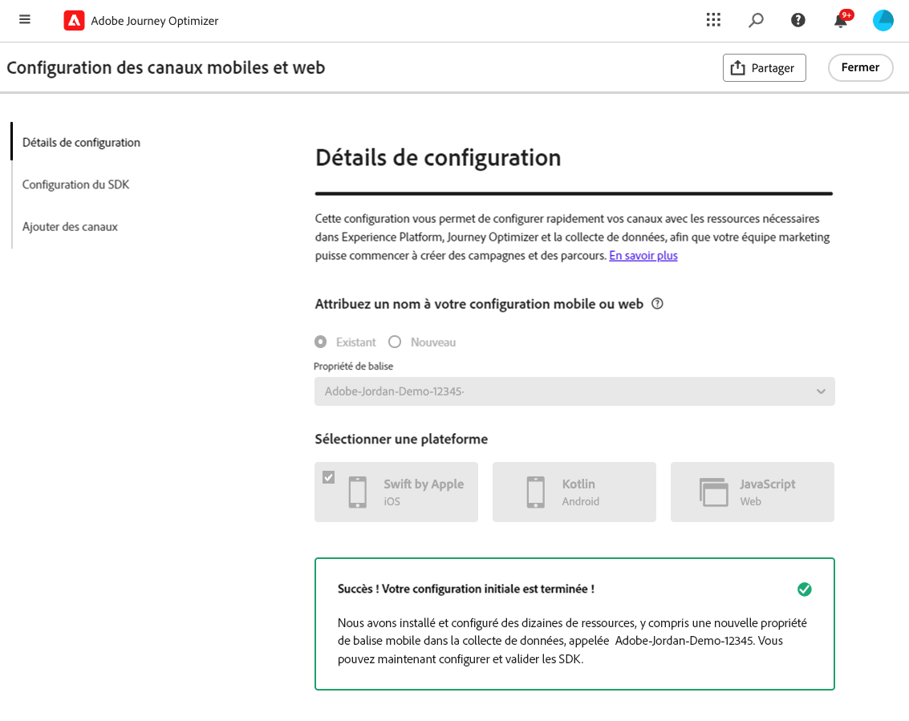
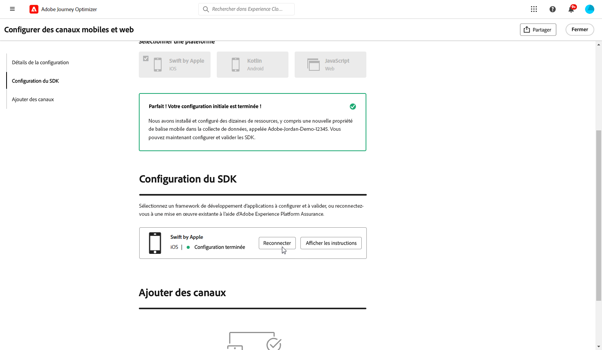
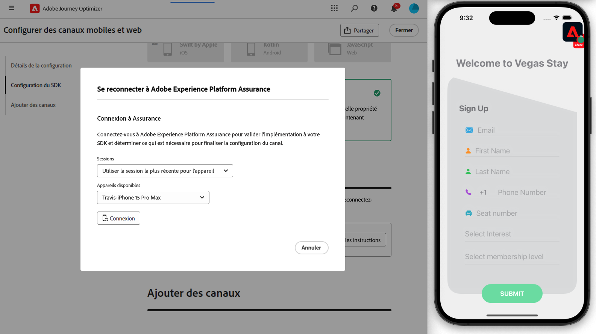

# Configuration de la configuration mobile iOS {#set-mobile-ios}

>[!IMPORTANT]
>
>Pour garantir la compatibilité et des performances optimales, veillez à utiliser les versions suivantes du SDK :
>
> * SDK principal : 5.2.0 ou version ultérieure
> * SDK de messagerie : 5.1.1 ou version ultérieure

Cette configuration d’iOS simplifie la configuration rapide des canaux marketing, rendant toutes les ressources essentielles facilement disponibles dans les applications Experience Platform, Journey Optimizer et Data Collection. Cela permet à votre équipe marketing de commencer rapidement à créer des campagnes et des parcours.

## Création d’une configuration iOS {#new-setup-ios}

1. Sur la page d’accueil de Journey Optimizer, cliquez sur **[!UICONTROL Commencer]** dans la carte **[!UICONTROL Configurer les canaux mobiles et web]**.

   

1. Créez une configuration **[!UICONTROL New]**.

   Si vous disposez déjà de configurations, vous pouvez en sélectionner une ou en créer une nouvelle.

   

1. Saisissez un **[!UICONTROL Nom]** pour votre nouvelle configuration et sélectionnez ou créez votre **[!UICONTROL Datastream]**. Ce **[!UICONTROL nom]** sera utilisé pour toutes les ressources créées automatiquement.

1. Si votre entreprise dispose de plusieurs jeux de données, sélectionnez-en un parmi les options existantes. Si vous ne disposez pas d’un flux de données, celui-ci sera créé automatiquement.

1. Sélectionnez la plateforme iOS et cliquez sur **[!UICONTROL Créer automatiquement les ressources]**.

   

1. Pour simplifier le processus de configuration, les ressources nécessaires sont automatiquement créées pour vous aider à démarrer. Cela inclut la création d’une **[!UICONTROL propriété de balise mobile]** et l’installation d’extensions.

   Vous trouverez ci-dessous une liste complète de toutes les ressources générées automatiquement :

+++ Ressources créées

   <table>
    <thead>
    <tr>
    <th><strong>Solution</strong></th>
    <th><strong>Ressources créées automatiquement</strong></th>
    </tr>
    </thead>
    <tbody>
    <tr>
    <td>
    <p>Journey Optimizer</p>
    </td>
    <td>
    <ul>
    <li>Configuration de canal</li>
    <li>Informations d’identification push (message push mobile uniquement)</li>
    </ul>
    </td>
    </tr>
    <tr>
    <td>
    <p>Balises</p>
    </td>
    <td>
    <ul>
    <li>Propriété de balise mobile</li>
    <li>Règles</li>
    <li>Éléments de données</li>
    <li>Bibliothèque</li>
    <li>Environnements (évaluation, production, développement)</li>
    </ul>
    </td>
    </tr>
    <tr>
    <td>
    <p>Extensions de balises</p>
    </td>
    <td>
    <ul>
    <li>Adobe Experience Platform Edge Network</li>
    <li>Adobe Journey Optimizer</li>
    <li>Assurance AEP</li>
    <li>Consentement (avec activation des stratégies de consentement par défaut)</li>
    <li>Identité (avec ECID par défaut, avec règles de groupement par défaut)</li>
    <li>Mobile Core</li>
    </ul>
    </td>
    </tr>
    <tr>
    <td>
    <p>Assurance</p>
    </td>
    <td>
    <p>Session d’assurance</p>
    </td>
    </tr>
    <tr>
    <td>
    <p>Trains de données</p>
    </td>
    <td>
    <p>Flux de données avec services</p>
    </td>
    </tr>
    <tr>
    <td>
    <p>Experience Platform</p>
    </td>
    <td>
    <ul>
    <li>Jeu de données</li>
    <li>Schéma</li>
    </ul>
    </td>
    </tr>
    </tbody>
    </table>

+++

1. Une fois la génération des ressources terminée, cliquez sur **[!UICONTROL Configurer]** pour commencer à configurer votre SDK.

   

1. Vous devez d’abord ajouter et importer des dépendances comme décrit dans l’interface utilisateur. [En savoir plus](https://experienceleague.adobe.com/en/docs/platform-learn/implement-mobile-sdk/app-implementation/install-sdks).

1. Insérez le code d&#39;initialisation dans la méthode `onCreate()` de votre application. Ce code de test vous permet de vous connecter à Assurance et de valider la configuration de votre application avant de passer en production.

   {zoomable="yes"}

1. Pour valider directement votre SDK sur votre application mobile, ouvrez simplement votre application mobile et autorisez l’accès à [Adobe Assurance](https://experienceleague.adobe.com/en/docs/experience-platform/assurance/home). Assurance est un outil puissant qui vous permet de tester et valider minutieusement votre mise en oeuvre, en veillant à ce que tout fonctionne correctement.

   Une fois connecté, votre appareil sera automatiquement détecté et répertorié dans le menu déroulant **[!UICONTROL Périphérique disponible]**, ce qui vous permet de surveiller et de résoudre en temps réel vos problèmes de configuration.

   {zoomable="yes"}

1. Cliquez sur **[!UICONTROL Connect]**.

   {zoomable="yes"}

1. Vous pouvez maintenant configurer vos canaux [In-App](#inapp-channel) et/ou [Push](#push-channel).

1. Une fois la configuration terminée, partagez la **[!UICONTROL configuration de canal]** générée automatiquement avec les membres de l’équipe chargés de la création des Parcours et des campagnes.

   La **[!UICONTROL configuration de canal]** doit être référencée dans l’interface Campagnes ou Parcours, ce qui permet une connexion transparente entre votre configuration et l’exécution des parcours et campagnes ciblés pour votre audience.

   {zoomable="yes"}

## Modifier une configuration existante {#reconnect}

Après avoir créé votre configuration, vous pouvez facilement la revoir à tout moment pour ajouter des canaux supplémentaires ou effectuer d’autres réglages en fonction de vos besoins.

1. Sur la page d’accueil de Journey Optimizer, cliquez sur **[!UICONTROL Commencer]** dans la carte **[!UICONTROL Configurer les canaux mobiles et web]**.

   

1. Sélectionnez **[!UICONTROL Existant]** et choisissez votre **[!UICONTROL propriété de balise]** existante dans la liste déroulante.

   

1. Lors de l’accès à votre configuration existante, vous devez vous reconnecter à Adobe Assurance. Dans le menu Configuration du SDK, cliquez sur **[!UICONTROL Reconnecter]**.

   

1. Sélectionnez votre appareil dans la liste déroulante **[!UICONTROL Appareils disponibles]** et cliquez sur **[!UICONTROL Se connecter]**.

   {zoomable="yes"}

1. Vous pouvez maintenant mettre à jour votre configuration si nécessaire.

## Configuration de la chaîne In-App {#inapp-channel}

Le canal In-App ne nécessite aucune configuration supplémentaire. Pour vérifier la précision de votre configuration, vous pouvez envoyer facilement un message de test à l’aide de la fonction Assurance. Cela vous permettra d’obtenir des commentaires immédiats sur la disponibilité du système à diffuser efficacement les messages In-App.

Pour ce faire, cliquez simplement sur **[!UICONTROL Afficher le message in-app]**.

{zoomable="yes"}

Pour simplifier le processus de configuration, les ressources nécessaires sont automatiquement créées pour vous aider à démarrer. Cela inclut la création d’une configuration de canal.

Vous pouvez désormais envoyer des messages In-App à l’aide de la **[!UICONTROL configuration de canal]** configurée précédemment. [Découvrez comment créer des messages in-app](../in-app/create-in-app.md)

## Configuration du canal push {#push-channel}

>[!CONTEXTUALHELP]
>id="ajo_mobile_web_setup_push_certificate"
>title="Fournir un certificat push"
>abstract="Le fichier de clé .p8 contient une clé privée utilisée pour authentifier votre application auprès des serveurs Apple pour les notifications push sécurisées. Vous pouvez acquérir cette clé à partir de la page Certificats, identifiants et profils de votre compte de développeur."

>[!CONTEXTUALHELP]
>id="ajo_mobile_web_setup_push_key_id"
>title="ID de clé"
>abstract="L’ID de clé, une chaîne de 10 caractères attribuée lors de la création de la clé d’authentification p8, se trouve sous l’onglet **Clés** de la page Certificats, identifiants et profils de votre compte de développeur."

>[!CONTEXTUALHELP]
>id="ajo_mobile_web_setup_push_team_id"
>title="ID d’équipe"
>abstract="L’ID d’équipe, une valeur de chaîne utilisée pour identifier votre équipe, se trouve sous l’onglet **Adhésion** de votre compte de développeur."

1. Une fois votre SDK mobile configuré, cliquez sur **[!UICONTROL Ajouter]** depuis la carte de notification push.

1. Tout d’abord, dans la méthode `didRegisterForRemoteNotificationsWithDeviceToken` de votre `AppDelegate`, ajoutez le code suivant pour synchroniser le jeton push de l’appareil avec votre profil Adobe Experience Platform.

   ```
   MobileCore.setPushIdentifier(deviceToken)
   ```

1. Effectuez un glisser-déposer de votre fichier de clé d’authentification de notification push Apple .p8. Cette clé peut être obtenue à partir de la page Certificats, identifiants et profils .

1. Indiquez les informations suivantes :

   * ID de clé : chaîne de 10 caractères attribuée lors de la création de la clé d’authentification p8. Elle se trouve sous l’onglet Clés de la page Certificats, identifiants et profils .

   * Identifiant d’équipe : valeur de chaîne qui se trouve sous l’onglet Appartenance .

   {zoomable="yes"}

1. Pour vérifier la précision de votre configuration, vous pouvez envoyer facilement un message de test à l’aide de la fonction Assurance. Cela vous permettra d’obtenir des commentaires immédiats sur la préparation du système à diffuser efficacement les notifications push.

   Pour ce faire, cliquez simplement sur **[!UICONTROL Envoyer un message push]**.

   {zoomable="yes"}

Pour simplifier le processus de configuration, les ressources nécessaires sont automatiquement créées pour vous aider à démarrer. Cela inclut la création d’une **[!UICONTROL configuration de canal]** et d’ **[!UICONTROL informations d’identification push]**.

Vous pouvez maintenant envoyer des notifications push à l’aide de la **[!UICONTROL configuration de canal]** configurée précédemment. [Découvrez comment créer une notification push](../push/create-push.md)
