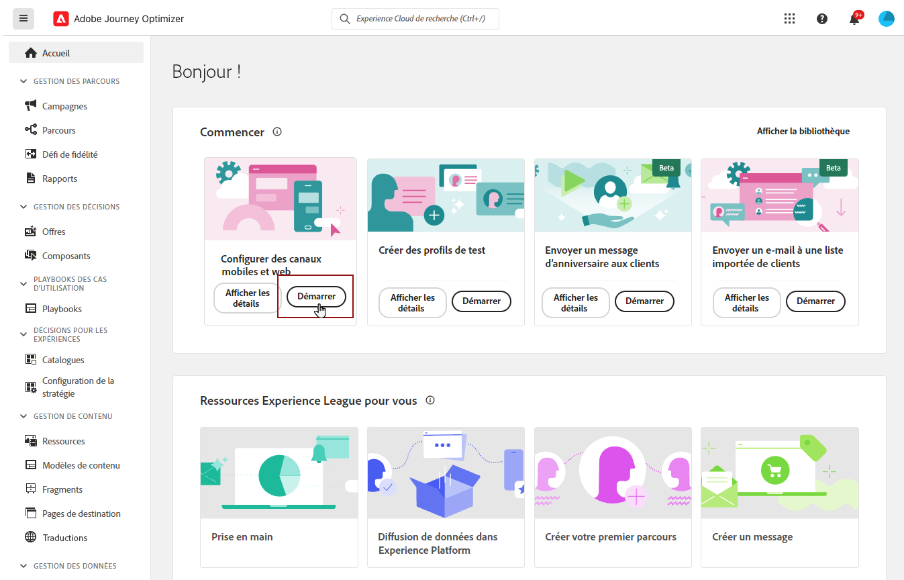
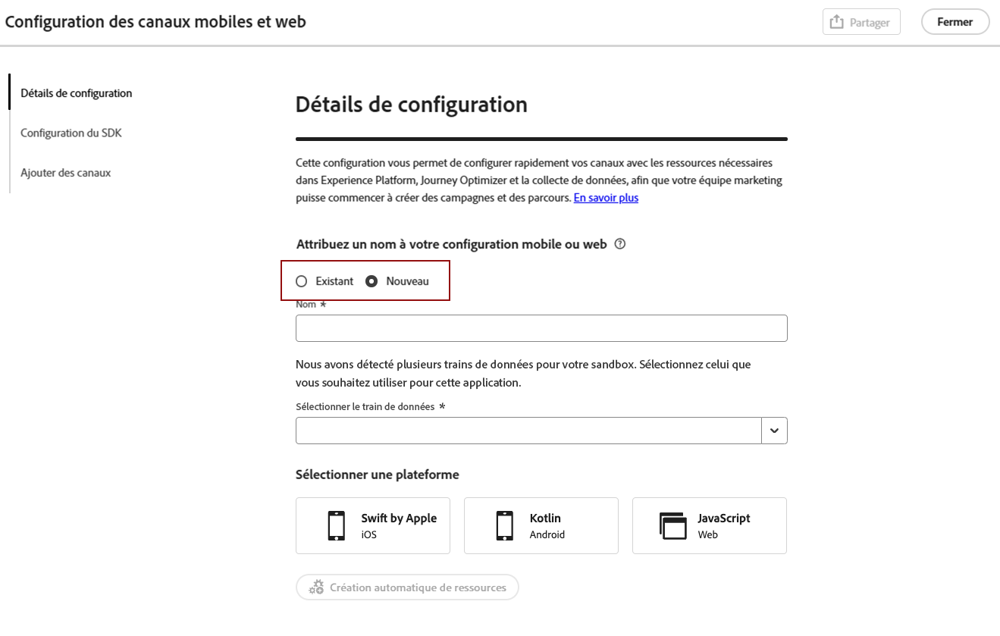
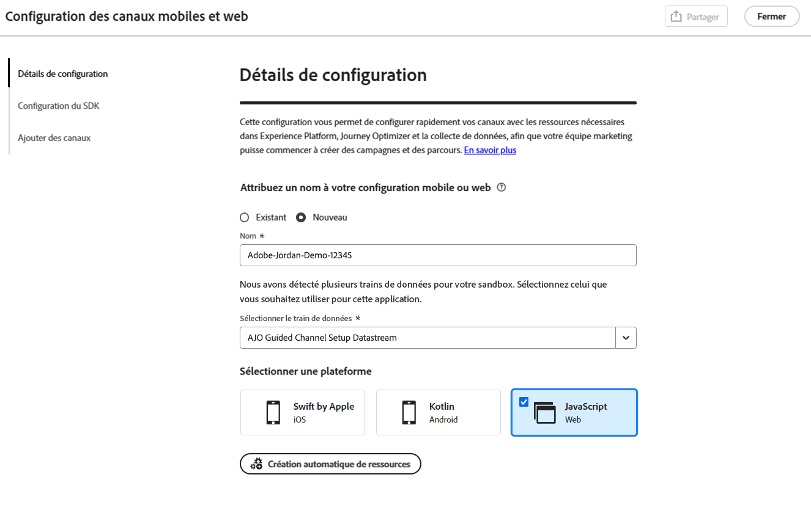
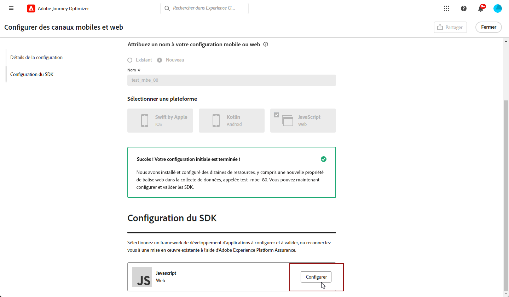
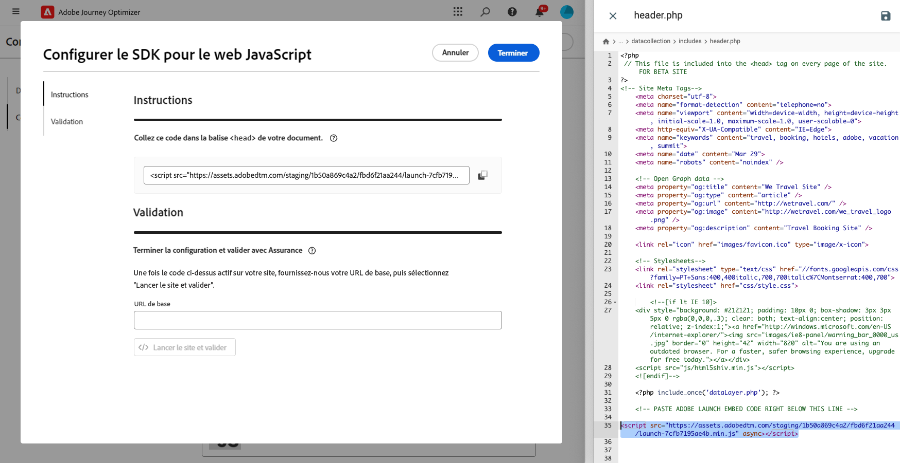
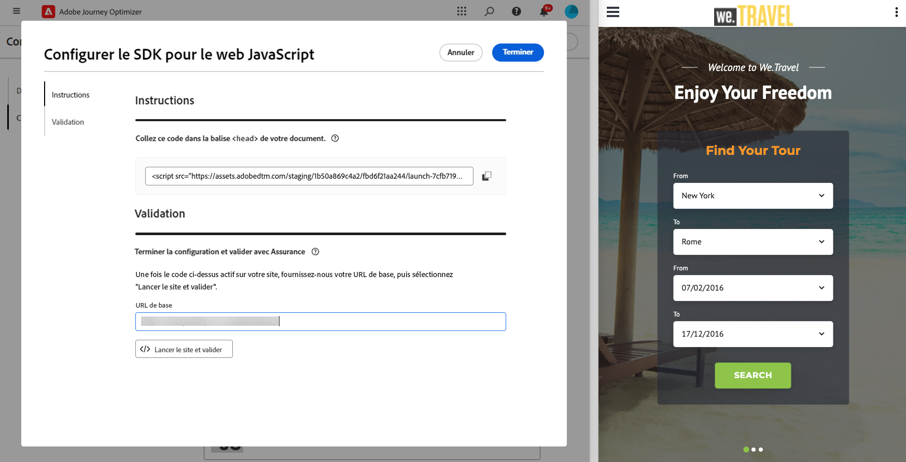
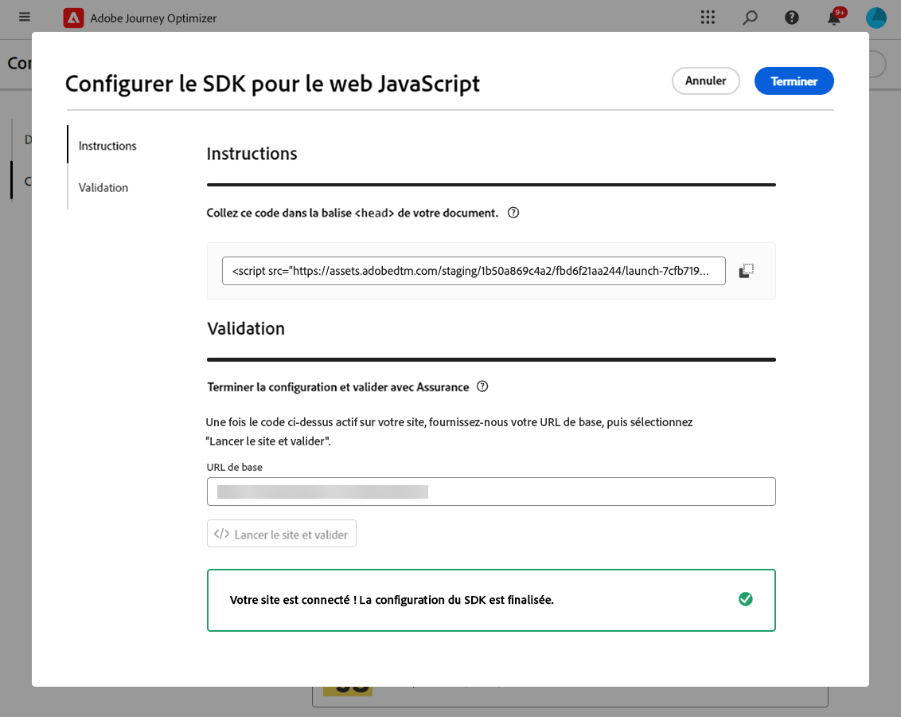
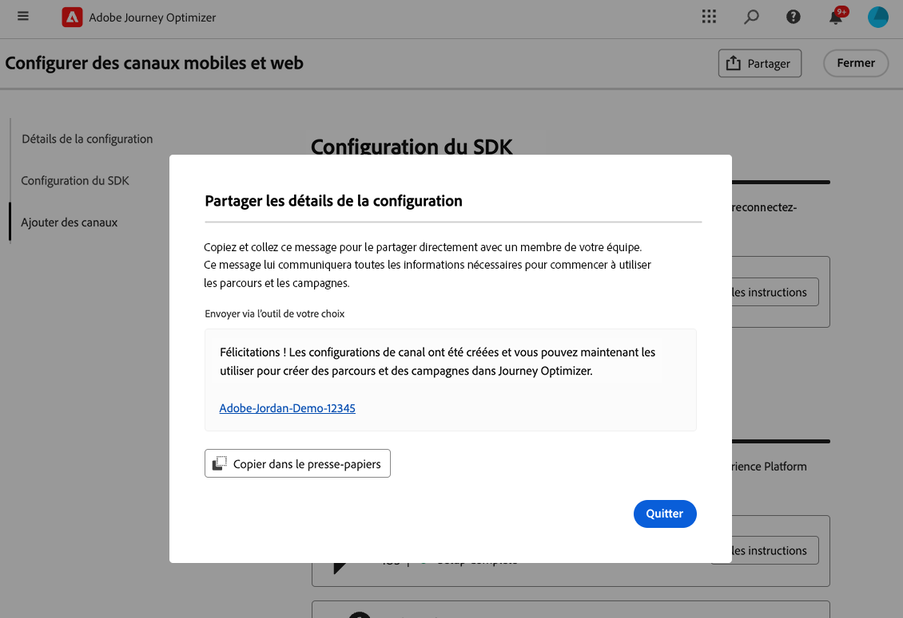
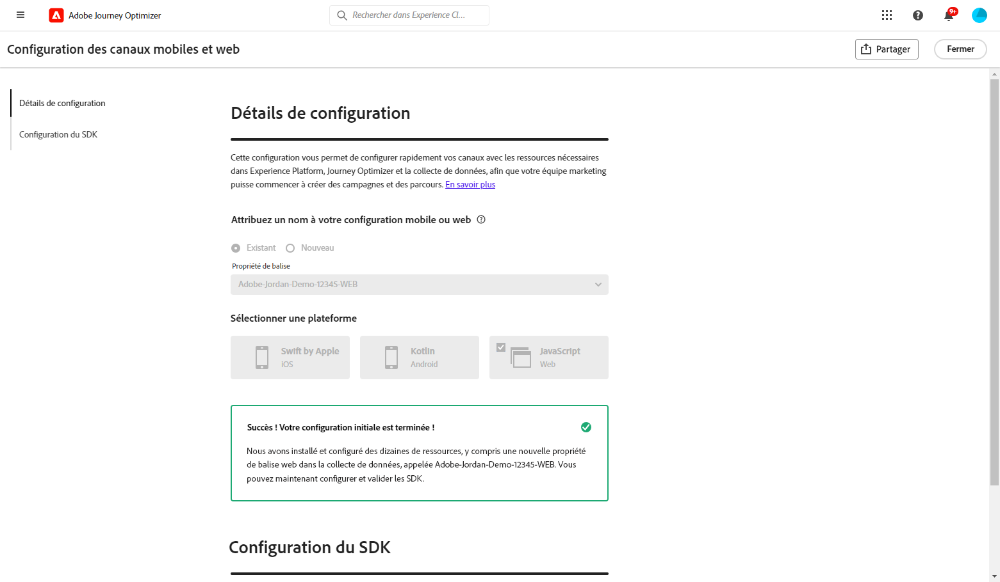

# Configuration web {#set-mobile-web}

>[!CONTEXTUALHELP]
>id="ajo_mobile_web_setup_javascript_code"
>title="Code JavaScript"
>abstract="TBC"

>[!CONTEXTUALHELP]
>id="ajo_mobile_web_setup_javascript_site"
>title="Lancer le site et valider"
>abstract="TBC"

Cette configuration facilite la configuration rapide des canaux marketing, en s’assurant que toutes les ressources requises sont facilement disponibles dans Experience Platform, Journey Optimizer et Data Collection. Cela permet à votre équipe marketing de commencer immédiatement la création de campagne et de parcours.

## Créer une configuration web {#new-setup}

1. Sur la page d’accueil de Journey Optimizer, cliquez sur **[!UICONTROL Commencer]** dans la carte **[!UICONTROL Configurer les canaux mobiles et web]**.

   

1. Créez une configuration **[!UICONTROL New]**.

   Si vous disposez déjà de configurations, vous pouvez en sélectionner une ou en créer une nouvelle.

   

1. Saisissez un **[!UICONTROL Nom]** pour votre nouvelle configuration et sélectionnez ou créez votre **[!UICONTROL Datastream]**. Ce **[!UICONTROL nom]** sera utilisé pour toutes les ressources créées automatiquement.

1. Si votre entreprise dispose de plusieurs jeux de données, sélectionnez-en un parmi les options existantes. Si vous ne disposez pas d’un flux de données, celui-ci sera créé automatiquement.

1. Sélectionnez la plateforme Web et cliquez sur **[!UICONTROL Créer automatiquement les ressources]**.

   

1. Pour simplifier le processus de configuration, les ressources nécessaires sont automatiquement créées pour vous aider à démarrer.

   Vous trouverez ci-dessous une liste complète de toutes les ressources générées automatiquement :

+++ Ressources créées

   <table>
    <thead>
    <tr>
    <th><strong>Solution</strong></th>
    <th><strong>Ressources créées automatiquement</strong></th>
    </tr>
    </thead>
    <tbody>
    <tr>
    </tr>
    <tr>
    <td>
    
Balises

    </td>
    <td>
    <ul>
    <li>Propriété de balise mobile</li>
    <li>Règles</li>
    <li>Éléments de données</li>
    <li>Bibliothèque</li>
    <li>Environnements (évaluation, production, développement)</li>
    </ul>
    </td>
    </tr>
    <tr>
    <td>
    
Extensions de balises

    </td>
    <td>
    <ul>
    <li>Adobe Experience Platform Edge Network</li>
    <li>Adobe Journey Optimizer</li>
    <li>Assurance AEP</li>
    <li>Consentement (avec activation des stratégies de consentement par défaut)</li>
    <li>Identité (avec ECID par défaut, avec règles de groupement par défaut)</li>
    <li>Mobile Core</li>
    </ul>
    </td>
    </tr>
    <tr>
    <td>
    
Assurance

    </td>
    <td>
    
Session d’assurance

    </td>
    </tr>
    <tr>
    <td>
    
Trains de données

    </td>
    <td>
    
Flux de données avec services

    </td>
    </tr>
    <tr>
    <td>
    
Experience Platform

    </td>
    <td>
    <ul>
    <li>Jeu de données</li>
    <li>Schéma</li>
    </ul>
    </td>
    </tr>
    </tbody>
    </table>

+++

1. Une fois la génération des ressources terminée, cliquez sur **[!UICONTROL Configurer]** pour commencer à configurer votre SDK.

   

1. Collez le code affiché à l’écran dans la balise `<head>` de votre document.

   {zoomable="yes"}

1. Pour valider directement votre SDK sur votre application mobile, il vous suffit de coller l’URL de base.

   {zoomable="yes"}

1. Sélectionnez **[!UICONTROL Launch site &amp; validate]** pour connecter votre site.

   {zoomable="yes"}

1. Une fois la configuration terminée, partagez la **[!UICONTROL propriété Web mobile]** générée automatiquement avec les membres de l’équipe chargés de la création des Parcours et des campagnes.

   La **[!UICONTROL propriété web mobile]** doit être référencée dans l’interface Campagnes ou Parcours, ce qui permet une connexion transparente entre votre configuration et l’exécution des parcours et campagnes ciblés pour votre audience.

   

Vous pouvez désormais créer des pages Web à l’aide de la **[!UICONTROL propriété Web mobile]** configurée précédemment. [Découvrez comment créer une page Web](../web/create-web.md)

## Modifier une configuration existante {#reconnect}

Après avoir créé votre configuration, vous pouvez facilement la revoir à tout moment pour ajouter des canaux supplémentaires ou effectuer d’autres réglages en fonction de vos besoins.

1. Sur la page d’accueil de Journey Optimizer, cliquez sur **[!UICONTROL Commencer]** dans la carte **[!UICONTROL Configurer les canaux mobiles et web]**.

   

1. Sélectionnez **[!UICONTROL Existant]** et choisissez votre **[!UICONTROL propriété de balise]** existante dans la liste déroulante.

   

1. Vous pouvez maintenant mettre à jour votre configuration si nécessaire.
