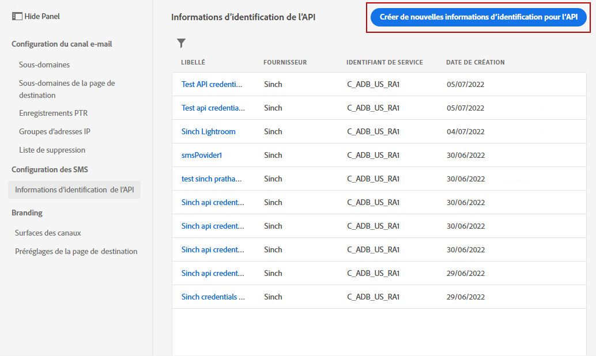
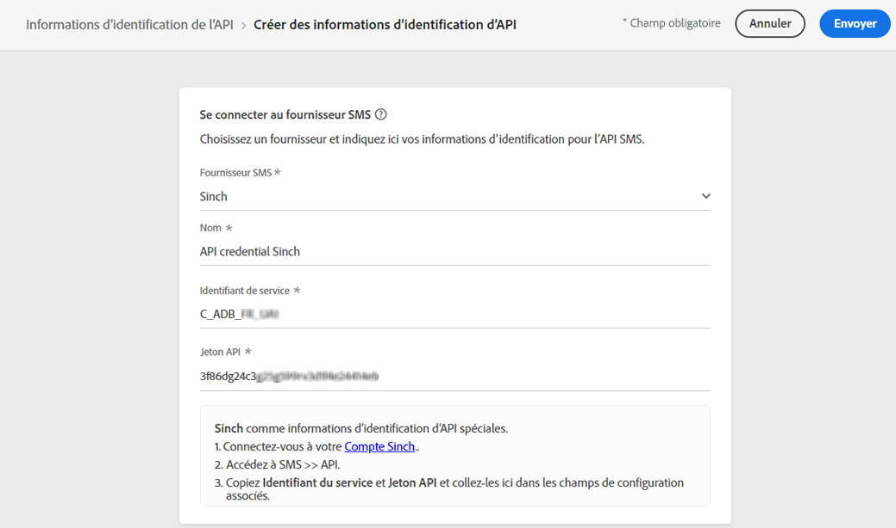
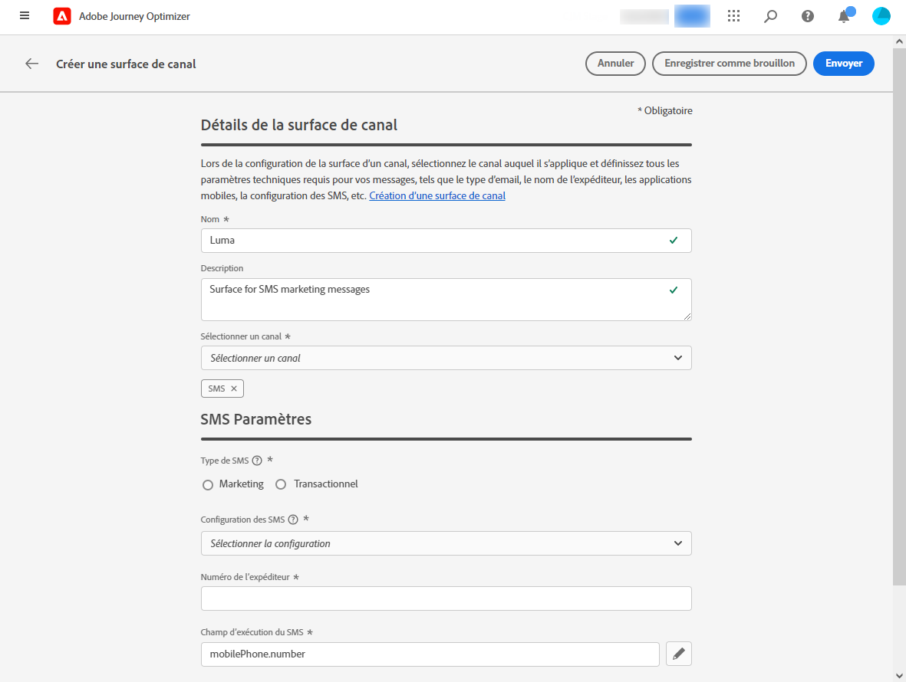
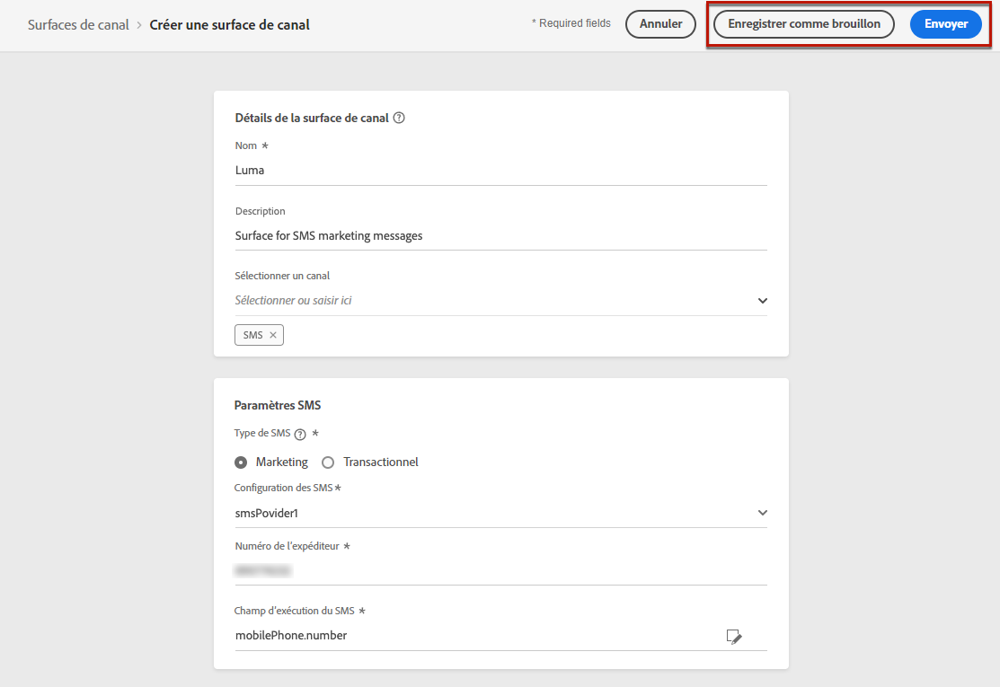

# Configurer le canal SMS {#sms-configuration}

[!DNL Journey Optimizer] vous permet de créer vos parcours et dʼenvoyer des messages à une audience ciblée.

Avant d’envoyer des SMS, configurez votre instance. Vous devez [intégrer les paramètres du fournisseur](#create-api) avec Journey Optimizer et [créer une surface SMS](#message-preset-sms) (c.-à-d. un préréglage de SMS). Ces étapes doivent être exécutées par un [Administrateur système Adobe Journey Optimizer](../start/path/administrator.md).

>[!IMPORTANT]
>
>Adobe Journey Optimizer s’intègre actuellement à des fournisseurs tiers tels que Sinch et Twilio, qui offrent des services SMS indépendants d’Adobe Journey Optimizer.  Avant la configuration des SMS, vous devez créer un compte auprès de l’un de ces fournisseurs SMS afin de recevoir le jeton API et l’ID de service qui vous permettront d’établir la connexion entre Adobe Journey Optimizer et le fournisseur SMS approprié. Votre utilisation des services SMS sera soumise aux conditions générales supplémentaires de la part du fournisseur de SMS concerné. Étant donné que Sinch et Twilio sont des produits tiers disponibles pour les utilisateurs d’Adobe Journey Optimizer via une intégration, pour tout problème ou toute demande liée aux services SMS, les utilisateurs de Sinch ou Twilio devront contacter le fournisseur de SMS approprié pour obtenir de l’aide. Adobe ne contrôle pas et n’est pas responsable des produits tiers.

## Création d’informations d’identification API {#create-api}

>[!CONTEXTUALHELP]
>id="ajo_admin_sms_api_header"
>title="Configurer votre fournisseur de SMS avec Journey Optimizer"
>abstract="Sélectionnez votre fournisseur et renseignez vos informations d’identification d’API SMS."

>[!CONTEXTUALHELP]
>id="ajo_admin_sms_api"
>title="Configurer votre fournisseur de SMS avec Journey Optimizer"
>abstract="Avant d’envoyer des SMS, vous devez intégrer les paramètres du fournisseur à Journey Optimizer. Une fois cette opération terminée, vous devrez créer une surface SMS. Ces étapes doivent être exécutées par un Administrateur système Adobe Journey Optimizer."
>additional-url="https://experienceleague.adobe.com/docs/journey-optimizer/using/configuration/configuration-message/sms-configuration.html?lang=fr#message-preset-sms" text="Créer une surface de canal SMS"

>[!CONTEXTUALHELP]
>id="ajo_admin_sms_configuration"
>title="Sélectionnez la configuration du fournisseur de SMS."
>abstract="Sélectionnez les informations d’identification d’API configurées pour votre fournisseur SMS."

Pour configurer votre fournisseur de SMS avec Journey Optimizer, procédez comme suit :

1. Accédez au menu **[!UICONTROL Administration]** > **[!UICONTROL Canaux]** > **[!UICONTROL Informations d’identification API]**, puis cliquez sur **[!UICONTROL Création d’informations d’identification API]**.

   

1. Sélectionnez votre **[!UICONTROL Fournisseur SMS]** :

   * [!DNL Sinch]. Pour rechercher votre **[!UICONTROL ID de service]** et **[!UICONTROL Jeton API]**, accédez au menu SMS > API depuis votre compte Sinch.
   * [!DNL Twilio]. Pour rechercher votre **[!UICONTROL ID de service]** et **[!UICONTROL Jeton API]**, accédez au volet Informations du compte de la page Tableau de bord de la console.

1. Entrez un **[!UICONTROL Nom]** pour vos informations d’identification API.

1. Saisissez votre **[!UICONTROL ID de service]** et **[!UICONTROL Jeton API]**.

   

1. Cliquez sur **[!UICONTROL Envoyer]** lorsque vous avez terminé la configuration de vos informations d’identification API.

Après avoir créé et configuré vos informations d’identification API, vous devez maintenant créer une surface de canal (c’est-à-dire un préréglage de message) pour les messages SMS.

## Créer une surface de canal pour les SMS {#message-preset-sms}

>[!CONTEXTUALHELP]
>id="ajo_admin_surface_sms_type"
>title="Définissez la catégorie de SMS."
>abstract="Sélectionnez le type de messages SMS qui seront envoyés lors de l’utilisation de cette surface : Marketing pour les messages promotionnels qui nécessitent le consentement de l’utilisateur, ou Transactionnel pour les messages non commerciaux, qui peuvent également être envoyés aux profils désabonnés dans des contextes spécifiques."
>additional-url="https://experienceleague.adobe.com/docs/journey-optimizer/using/messages/create-sms.html?lang=fr#sms-opt-in-out" text="Se désinscrire dans les messages SMS de marketing"

Une fois votre canal SMS configuré, vous devez créer une surface de canal afin de pouvoir envoyer des SMS depuis **[!DNL Journey Optimizer]**.

Pour créer une surface de canal, procédez comme suit :

1. Accédez au menu **[!UICONTROL Canaux]** > **[!UICONTROL Branding]** > **[!UICONTROL Surfaces des canaux]**, puis cliquez sur **[!UICONTROL Créer une surface de canal]**.

   

1. Saisissez un nom et une description (facultatif) pour la surface, puis sélectionnez le canal SMS.

   

   >[!NOTE]
   >
   > Les noms doivent commencer par une lettre (A-Z). Ils ne peuvent contenir que des caractères alphanumériques. Vous pouvez également utiliser le trait de soulignement `_`, le point`.` et le trait d&#39;union `-`.

1. Configurez les paramètres des **SMS**.

   

   * Sélectionnez le **[!UICONTROL Type de SMS]** qui sera envoyé avec la surface : **[!UICONTROL Transactionnel]** ou **[!UICONTROL Marketing]**.

   * Sélectionnez la **[!UICONTROL Configuration SMS]** à associer à la surface.

      Pour plus dʼinformations sur la configuration de votre environnement pour envoyer des messages SMS, consultez [cette section](#create-api).

   * Saisissez le **[!UICONTROL Numéro dʼexpéditeur]** à utiliser lors de vos communications.

   * Sélectionnez votre **[!UICONTROL Champ d’exécution SMS]** pour sélectionner l’**[!UICONTROL Attribut de profil]** associé aux numéros de téléphone des profils.

1. Une fois tous les paramètres configurés, cliquez sur **[!UICONTROL Envoyer]** pour confirmer. Vous pouvez également enregistrer la surface de canal en tant que brouillon et reprendre sa configuration ultérieurement.

   

1. Une fois la surface de canal créée, elle s&#39;affiche dans la liste avec le statut **[!UICONTROL Traitement]**.

   >[!NOTE]
   >
   >Si les vérifications ne réussissent pas, découvrez les raisons possibles de l’échec dans [cette section](#monitor-channel-surfaces).

1. Une fois les vérifications effectuées, la surface de canal obtient le statut **[!UICONTROL Actif]**. Elle est prête à être utilisée pour diffuser des messages.

   

Vous êtes maintenant prêt à envoyer des messages SMS avec Journey Optimizer.

**Rubriques connexes**

* [Création dʼun SMS](../messages/create-sms.md)
* [Ajout dʼun message dans un parcours](../building-journeys/journeys-message.md)
