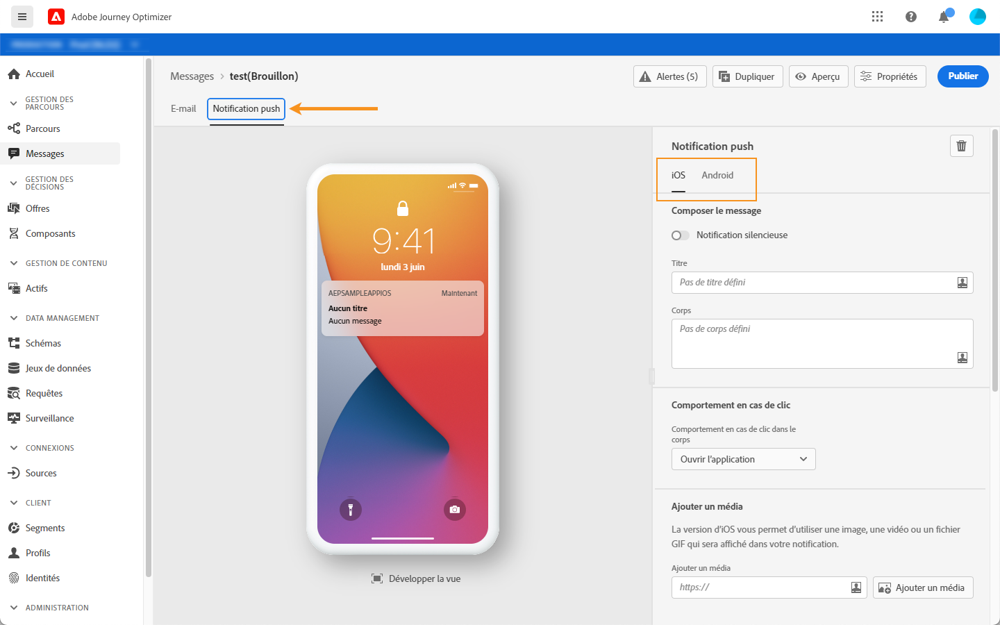

# Configurer une notification Push {#create-push-notification}

Les notifications Push sont configurées lors de la création d’un message, dans l’onglet **[!UICONTROL Notification Push]** (voir [Création d’un message](create-message.md)).

Vous pouvez configurer le contenu des notifications Push pour les systèmes d’exploitation iOS ou Android à l’aide des onglets dédiés.

## Titre et contenu

Pour composer votre message, cliquez sur les champs **[!UICONTROL Titre]** et **[!UICONTROL Corps]**. Utilisez l’éditeur d’Expressions pour définir le contenu et les données de personnalisation.

En savoir plus sur la personnalisation dans [cette section](personalization/personalize.md)

Utilisez la section centrale pour visualiser comment s’affiche la notification Push sur les terminaux iOS et Android.

>[!NOTE]
>
>La section **[!UICONTROL Composer le message]** est commune aux onglets **[!UICONTROL iOS]** et **[!UICONTROL Android]**. Toute modification apportée à cette section s&#39;appliquera aux deux systèmes d&#39;exploitation.

## Comportement de clic {#on-click-behavior}

Sélectionnez le comportement lorsqu’un destinataire clique sur le corps de la notification Push :

* Utilisez l&#39;option **[!UICONTROL Ouvrir l&#39;application]** pour ouvrir l&#39;application associée au message **[!UICONTROL Prédéfini]**.
* Utilisez l&#39;option **[!UICONTROL Deplink]** pour rediriger le destinataire vers un contenu spécifique situé dans l&#39;application. Entrez le lien profond dans le champ associé.
* Utilisez l&#39;option **[!UICONTROL URL Web]** pour rediriger le destinataire vers une URL externe. Entrez l’URL dans le champ associé.

## Envoyer une notification silencieuse

Une notification Push silencieuse (ou notification en arrière-plan) est une instruction masquée qui est transmise à l’application. Il est utilisé par exemple pour informer votre application de la disponibilité du nouveau contenu ou pour lancer un téléchargement en arrière-plan.

Sélectionnez l&#39;option **[!UICONTROL Notification silencieuse]** pour avertir l&#39;application en silence : dans ce cas, la notification est transférée directement à la demande. Aucune alerte n&#39;est affichée sur l&#39;écran du périphérique.

Utilisez la section **[!UICONTROL Données personnalisées]** pour ajouter des paires clé/valeur.

## Options avancées

Configurez les **[!UICONTROL options avancées]**. Les paramètres disponibles sont les suivants :

| Paramètre | Disponibilité | Description |
|---------|----------|---------|
| **[!UICONTROL Réductible]** | iOS/Android | Un message réductible est un message qui peut être remplacé par un nouveau message. Par exemple, une application qui met à jour les utilisateurs avec les dernières informations sur une rubrique. Dans ce cas, seul le message le plus récent est pertinent. D’un autre côté, avec des messages non réductibles, chaque message est important pour l’application cliente et doit être diffusé. |
| **[!UICONTROL Son personnalisé]** | iOS/Android | Son à lire par le terminal mobile lors de la réception de la notification. Le son doit être assemblé dans l’application. |
| **[!UICONTROL Badges]** | iOS/Android | Un badge est utilisé pour afficher directement sur l’icône de l’application le nombre de nouvelles informations non lues.  La valeur du badge disparaît dès que l’utilisateur ouvre ou lit le nouveau contenu de l’application. Lorsqu’une notification est reçue sur un périphérique, elle peut actualiser ou ajouter une valeur de badge pour l’application associée. Par exemple, si vous stockez le nombre d’articles non lus de vos clients, vous pouvez tirer parti de la personnalisation pour envoyer la valeur unique de badge d’articles non lus pour chaque client. Pour plus de personnalisation, consultez [cette section](personalization/personalize.md). |
| **[!UICONTROL Groupe]**  de notification/ | iOS | Associez un groupe de notification à la notification Push. À partir d’iOS 12, les groupes de notifications vous permettent de consolider les threads de message et les rubriques de notification en ID de threads. Par exemple, une marque peut envoyer des notifications marketing sous un identifiant de groupe, tout en conservant d’autres notifications de type opérationnel sous un ou plusieurs identifiants différents. Pour illustrer cela, vous pouvez avoir groupID : 123 &quot;Consulter la nouvelle collection printanière de pulls&quot; et groupID : 456 Groupes de notification &quot;votre colis a été livré&quot;. Dans cet exemple, toutes les notifications de diffusion sont regroupées sous ID de groupe : 456. |
| **[!UICONTROL Canal de notification]** | Android | Associez un canal de notification à la notification Push. Depuis Android 8.0 (niveau API 26), toutes les notifications doivent être affectées à un canal pour s’afficher. Pour plus d’informations, consultez la [documentation destinée aux développeurs Android](https://developer.android.com/guide/topics/ui/notifiers/notifications#ManageChannels). |
| **[!UICONTROL Ajouter l&#39;indicateur de disponibilité du contenu]** | iOS | Envoie l’indicateur de contenu disponible dans la charge utile Push pour s’assurer que l’application se réveille dès réception de la notification Push, ce qui signifie que l’application pourra accéder aux données de charge.  Cela fonctionne même si l’application s’exécute en arrière-plan et sans avoir à interagir avec l’utilisateur (par exemple, appuyer sur la notification Push). Toutefois, cela ne s’applique pas si l’application n’est pas en cours d’exécution. Pour plus d’informations à ce sujet, consultez la [documentation destinée aux développeurs Apple](https://developer.apple.com/library/content/documentation/NetworkingInternet/Conceptual/RemoteNotificationsPG/CreatingtheNotificationPayload.html). |
| **[!UICONTROL Ajouter un indicateur de contenu modifiable]** | iOS | Envoie l’indicateur de contenu modifiable dans la charge utile Push et permet de modifier le contenu de la notification Push en utilisant l’extension d’application du service de notification fournie dans le SDK iOS. Pour plus d’informations à ce sujet, consultez la [documentation destinée aux développeurs Apple](https://developer.apple.com/library/content/documentation/NetworkingInternet/Conceptual/RemoteNotificationsPG/ModifyingNotifications.html). Vous pouvez ensuite exploiter vos extensions d&#39;applications mobiles pour modifier davantage le contenu ou la présentation des notifications Push arrivant  [!DNL Journey Optimizer] Par exemple, les utilisateurs peuvent utiliser cette option pour déchiffrer des données, modifier le corps ou le titre d&#39;une notification, ajouter un identifiant de thread à une notification, etc. |
| **[!UICONTROL Visibilité des notifications]** | Android | Définit la visibilité de la notification Push. <b></b> privé affichera la notification sur tous les verrous, mais dissimulera les informations sensibles ou privées sur les verrous sécurisés. <b>La </b> publication affichera la notification dans son intégralité sur tous les écrans de verrouillage. <b>Le </b> Secrétariat ne divulguera aucune partie de la notification sur un écran de verrouillage sécurisé. Pour plus d’informations à ce sujet, consultez la [documentation destinée aux développeurs Android](https://developer.android.com/reference/android/app/Notification). |
| **[!UICONTROL Priorité de notification]** | Android | Définit l’importance de la notification Push de Faible à Max. Cette opération détermine l’intrusion de la notification Push lors de sa diffusion. Pour plus d’informations à ce sujet, consultez la [documentation destinée aux développeurs Android](https://developer.android.com/guide/topics/ui/notifiers/notifications#importance). |
| **[!UICONTROL Delivery priority]** | Android | Définit une priorité élevée ou normale pour vos notifications Push. Pour plus d&#39;informations sur la priorité des messages, consultez la [documentation destinée aux développeurs Google](https://firebase.google.com/docs/cloud-messaging/concept-options#setting-the-priority-of-a-message). |

## Données personnalisées

Dans la section **[!UICONTROL Données personnalisées]**, vous pouvez ajouter des variables personnalisées à la charge utile, en fonction de la configuration de votre application mobile. Pour plus d’informations sur la configuration des notifications Push dans Adobe Experience Platform et le lancement d’Adobe, voir [cette section](push-configuration.md).

