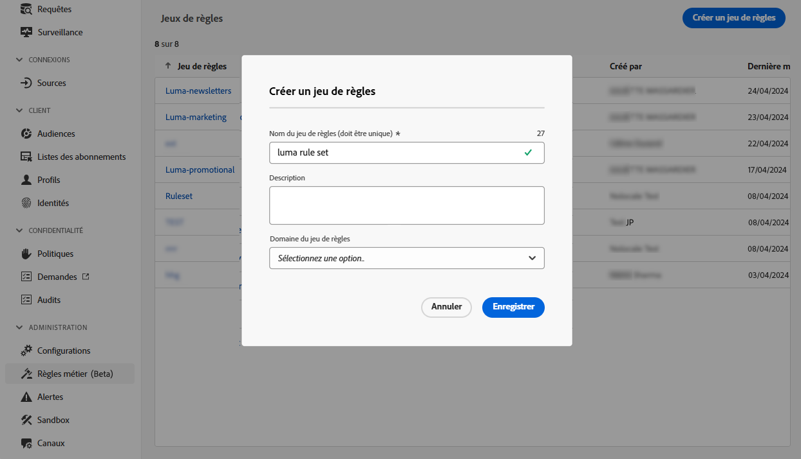

# Capping de la fréquence par canal et type de communication {#rule-sets}

Les jeux de règles de **Canal** appliquent des règles de limitation aux canaux de communication. Par exemple, ne pas envoyer plus d’un e-mail ou d’un SMS par jour.

L’utilisation des jeux de règles de canal vous permet de définir un capping de fréquence par type de communication afin d’éviter d’envoyer trop de messages similaires aux clientes et aux clients. Vous pouvez par exemple créer un jeu de règles pour limiter le nombre de **communications promotionnelles** envoyées à votre clientèle et créer un autre jeu de règles pour limiter le nombre de **newsletters** qu’elle reçoit. Selon le type de campagne que vous créez, vous pouvez ensuite choisir d’appliquer la communication promotionnelle ou le jeu de règles des newsletters.

>[!IMPORTANT]
>
>Pour garantir le bon fonctionnement de la limitation au niveau du canal, veillez à choisir l’espace de noms avec la priorité la plus élevée lors de la création d’une campagne ou d’un parcours. Pour en savoir plus sur la priorité des espaces de noms, consultez le [guide sur le Service d’identités Platform](https://experienceleague.adobe.com/fr/docs/experience-platform/identity/features/identity-graph-linking-rules/namespace-priority){target="_blank"}.

## Créer une règle de limitation de canal

>[!CONTEXTUALHELP]
>id="ajo_rule_sets_channel"
>title="Définissez le ou les canaux auxquels la règle s’applique."
>abstract="Sélectionnez au moins un canal. La limitation est calculée sur l’ensemble des canaux."

Pour créer un jeu de règles de canal, procédez comme suit :

>[!NOTE]
>
>Vous pouvez créer jusqu’à 10 jeux de règles locales actifs pour chaque domaine de canal et pour le domaine de parcours.

1. Accédez à la liste **[!UICONTROL Jeux de règles]**, puis cliquez sur **[!UICONTROL Créer un jeu de règles]**.

   

1. Sélectionnez le jeu de règles dans lequel vous souhaitez ajouter la règle de limitation ou créez un nouveau jeu de règles :

   * Pour utiliser un jeu de règles existant, sélectionnez-le dans la liste. Les règles de limitation de canal ne peuvent être ajoutées qu’à des jeux de règles dont le domaine est « canal ». Vous pouvez vérifier ces informations dans les listes des jeux de règles, dans la colonne **[!UICONTROL Domaine]**.

     

   * Pour créer la règle de limitation dans un nouveau jeu de règles, cliquez sur **[!UICONTROL Créer un jeu de règles]**, indiquez un nom unique pour ce jeu, sélectionnez « Channel » (Canal) dans le menu déroulant **[!UICONTROL Domaine du jeu de règles]**, puis cliquez sur **[!UICONTROL Enregistrer]**.

     

1. Dans l’écran du jeu de règles, cliquez sur le bouton **[!UICONTROL Ajouter une règle]** et définissez un nom unique pour la règle.

1. Le champ **Catégorie** spécifie la catégorie de message à laquelle la règle s’applique. Pour l’instant, ce champ est en lecture seule, car seule la catégorie **[!UICONTROL Marketing]** est disponible.

   

1. Dans le champ **[!UICONTROL Nombre de limitations]**, définissez le capping de la règle, c’est-à-dire le nombre maximum de messages qui peuvent être envoyés à un profil utilisateur individuel chaque mois, chaque semaine ou chaque jour en fonction de votre sélection dans les champs ci-dessous.

1. Dans la liste déroulante **[!UICONTROL Réinitialiser la fréquence de capping]**, sélectionnez la fréquence de capping souhaitée à appliquer : horaire, journalière, hebdomadaire ou mensuelle. La limite de fréquence est basée sur la période calendaire sélectionnée. Elle est réinitialisée au début de la période correspondante.

   L’expiration du compteur pour chaque période est la suivante :

   * **[!UICONTROL Horaire]** : le capping de la fréquence est valide pour le nombre d’heures sélectionné. Le compteur est automatiquement réinitialisé au début de chaque période. Pour un capping de la fréquence de 1 heure, la réinitialisation se produit toutes les heures, ce qui coïncide avec la fin d’une heure UTC.
   * **[!UICONTROL Journalière]** : le capping de la fréquence journalière est valable pour la journée jusqu’à 23:59:59 UTC et est remise à 0 au début de la journée suivante.
   * **[!UICONTROL Hebdomadaire]** : la limite de fréquence est valide jusqu’au samedi, 23 :59: 59 UTC de cette semaine. La date d’expiration s’applique quelle que soit la date de création de la règle. Par exemple, si la règle est créée le jeudi, cette règle est valide jusqu’au samedi à 23:59:59.
   * **[!UICONTROL Mensuelle]** : le capping de la fréquence est valable jusqu’au dernier jour du mois à 23:59:59 UTC. Par exemple, la date d’expiration mensuelle pour janvier est le 31 janvier à 23:59:59 UTC.

   >[!IMPORTANT]
   >
   >* Afin de garantir l’exactitude, veillez à choisir l’espace de noms avec la priorité la plus élevée lors de la création d’une campagne ou d’un parcours. Pour en savoir plus sur la priorité des espaces de noms, consultez le [guide sur le Service d’identités Platform.](https://experienceleague.adobe.com/fr/docs/experience-platform/identity/features/identity-graph-linking-rules/namespace-priority){target="_blank"} 
   >
   >* La valeur du compteur de profils est mise à jour une fois la communication diffusée. Tenez-en compte lorsque vous envoyez un grand volume de communications, car le débit de diffusion peut faire en sorte que les personnes destinataires reçoivent l’e-mail plusieurs minutes, voire plusieurs heures après le lancement de la communication (dans le cas où vous envoyez des millions de communications simultanément). Cela est important dans le cas où une personne destinataire reçoit deux communications rapprochées. Nous vous conseillons d’espacer les communications d’au moins deux heures afin que les personnes destinataires disposent de suffisamment de temps pour recevoir la communication et que la valeur de compteur soit mise à jour en conséquence.

1. Le champ **[!UICONTROL Chaque]** vous permet de répéter les règles de capping de la fréquence sur plusieurs heures, jours, semaines ou mois, selon la durée spécifiée. Exemple : appliquez la règle de capping de la fréquence pendant 2 semaines.

   Veillez à entrer une valeur qui correspond au type de durée sélectionné : de 1 à 23 pour Horaire, de 1 à 30 pour Journalière, de 1 à 4 pour Hebdomadaire et de 1 à 3 pour Mensuelle.

   Le compteur se remet automatiquement à 0 lorsqu’une nouvelle période commence. Pour un capping de la fréquence de 2 jours, cette réinitialisation se produit tous les deux jours à minuit UTC.

1. Sélectionnez le canal à utiliser pour cette règle : **[!UICONTROL E-mail]**, **[!UICONTROL SMS]**, **[!UICONTROL Notification push]** ou **[!UICONTROL Courrier]**.

1. Sélectionnez plusieurs canaux si vous souhaitez appliquer la limitation à tous les canaux sélectionnés en tant que nombre total.

   Par exemple, définissez la limitation sur 5 et sélectionnez les canaux e-mail et SMS. Si un profil a déjà reçu 3 e-mails marketing et 2 SMS marketing pour la période sélectionnée, ce profil sera exclu de la prochaine diffusion de tout e-mail ou SMS marketing.

1. Cliquez sur **[!UICONTROL Enregistrer]** pour confirmer la création de la règle. Votre message est ajouté au jeu de règles, au statut **[!UICONTROL Brouillon]**.

   

1. Répétez les étapes ci-dessus pour ajouter autant de règles que nécessaire au jeu de règles.

1. Une fois la règle de limitation prête à être appliquée aux messages, activez le jeu de règles ainsi que la règle qui y a été ajoutée. [Découvrir comment activer les jeux de règles](../conflict-prioritization/rule-sets.md#Create)

## Appliquer des jeux de règles à un message {#apply-frequency-rule}

Pour appliquer un jeu de règles à un message, procédez comme suit :

1. Lors de la création d’un message de parcours ou de campagne, sélectionnez l’un des canaux que vous avez définis pour votre jeu de règles, puis modifiez le contenu de votre message.

1. Dans l’écran de modification du contenu, cliquez sur le bouton **[!UICONTROL Ajouter une règle métier]**.

1. Sélectionnez le jeu de règles que vous avez créé.

   

   >[!NOTE]
   >
   >Seuls les jeux de règles [activés](#activate-rule) s’affichent dans la liste.

   <!--Messages where the category selected is **[!UICONTROL Transactional]** will not be evaluated against business rules.-->

1. Avant d’activer votre parcours ou votre campagne, veillez à planifier son exécution au moins 10 minutes dans le futur.

   Cela laisse suffisamment de temps pour renseigner les valeurs des compteurs sur le profil pour la règle métier que vous avez sélectionnée. Si vous activez immédiatement la campagne, les valeurs des compteurs des jeux de règles ne seront pas renseignées sur les profils des personnes destinataires et le message ne sera pas comptabilisé dans les règles de capping de la fréquence pour les jeux de règles personnalisés. En outre, le capping peut ne pas fonctionner correctement pour les parcours et les campagnes activés immédiatement et pour les campagnes déclenchées par API.

   

1. Vous pouvez visualiser le nombre de profils exclus de la diffusion dans le [rapport Customer Journey Analytics](../reports/report-gs-cja.md) et dans le [rapport dynamique](../reports/live-report.md), où les règles de fréquence seront répertoriées comme une raison possible pour les personnes exclues de la diffusion.

>[!NOTE]
>
>Plusieurs règles peuvent s’appliquer au même canal, mais une fois la limite inférieure atteinte, le profil sera exclu des prochaines diffusions.

Lors du test des règles de fréquence, il est recommandé d’utiliser un nouveau [profil de test](../audience/creating-test-profiles.md), car une fois la limitation de fréquence d’un profil atteinte, il n’est pas possible de réinitialiser le compteur avant la période suivante. La désactivation d’une règle permet aux profils limités de recevoir des messages, mais elle ne supprime pas les incréments de compteur.

>[!CAUTION]
>
>Les règles de limitation de la fréquence s’appliquent également lors de l’envoi de [BAT](../content-management/proofs.md). Si un profil de test a déjà atteint la limite de fréquence, les BAT s&#39;affichent comme terminés, mais aucun e-mail ne sera diffusé.

<!--add a new section for default priority namespace.-->

<!--
## Example: combine several rules {#frequency-rule-example}

You can combine several message frequency rules, such as described in the example below.

1. [Create a rule](#create-new-rule) called *Overall Marketing Capping*:

   * Select all channels.
   * Set capping to 12 monthly.

   

1. To further restrict the number of marketing-based push notifications that a user is sent, create a second rule called *Push Marketing Cap*:

   * Select Push channel.
   * Set capping to 4 monthly.

   

1. Save and [activate](#activate-rule) the rule.

1. [Create a message](../building-journeys/journeys-message.md) for every channel you want to communicate through and select the **[!UICONTROL Marketing]** category for each message. [Learn how to apply a frequency rule](#apply-frequency-rule)

   

In this scenario, an individual profile:
* can receive up to 12 marketing messages per month;
* but will be excluded from marketing push notifications after they have received 4 push notifications.-->

## Vidéo pratique {#video}

>[!VIDEO](https://video.tv.adobe.com/v/3435531?quality=12)
