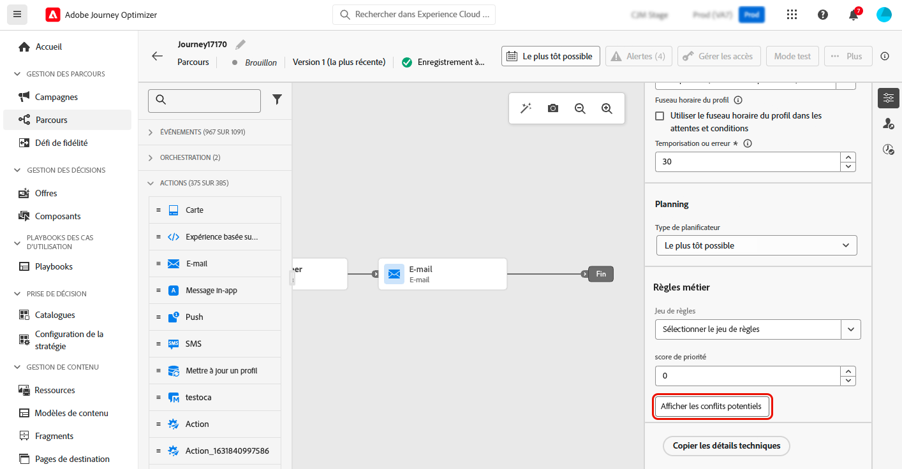
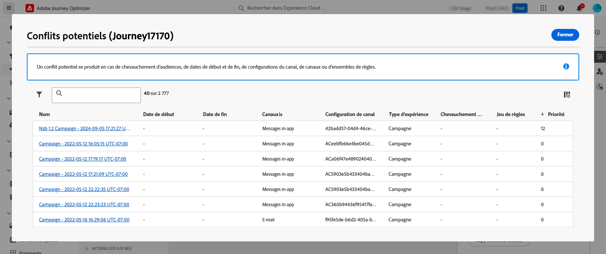

# Détecter les conflits potentiels dans les parcours et les campagnes {#conflict}

À mesure que les spécialistes marketing augmentent le volume des campagnes et des parcours dans Journey Optimizer, il devient de plus en plus difficile pour ceux-ci de savoir si leurs clientes et clients sont submergés par un trop grand nombre d’interactions marketing. Il est donc essentiel d’identifier facilement lorsque des campagnes et des parcours se chevauchent pour s’assurer d’un bon équilibre dans les communications marketing tout en atténuant le risque de lassitude des clientes et des clients.

Les principaux domaines à surveiller pour détecter un chevauchement potentiel sont les suivants :

* **Chronologie** (dates de début et de fin) : trop de parcours s’exécutent-ils simultanément ?
* **Audience** : quel pourcentage de mon audience de parcours fait également partie d’autres parcours ?
* **Canal** : existe-t-il d’autres communications programmées pour la même période, et si oui, combien ?
* **Jeu de règles de capping** : quels types de parcours suis-je en train de limiter et se chevauchent-ils ?
* **Configuration des canaux** : existe-t-il d’autres parcours ou campagnes utilisant une configuration des canaux utilisée dans le même parcours ou la même campagne qui peut empêcher l’affichage du parcours ou de la campagne aux utilisateurs et utilisatrices finaux ?

➡️ [Découvrez cette fonctionnalité en vidéo.](#video)

## Détection des conflits par Journey Optimizer {#detection}

Vous trouverez ci-dessous un résumé de la manière dont Journey Optimizer identifie les conflits potentiels pour les parcours et les campagnes :

* **Portée d’identification des conflits** : les conflits s’affichent uniquement pour les campagnes et les parcours en ligne ou planifiés.
* **Parcours unitaires** : si le parcours sélectionné est unitaire, les autres parcours commençant par le même événement s’affichent, car cet événement déclenchera tous ces parcours.
* Parcours **Qualification d’audience et Lecture d’audience/événement métier** : si le parcours sélectionné est un parcours Qualification d’audience ou Lecture d’audience/événement métier, tous les autres parcours du même type avec une audience valide sont affichés, car il peut y avoir des chevauchements entre les audiences.
* **Campagnes** : étant donné que toutes les campagnes ciblent des audiences et qu’il n’existe aucun concept d’événement, toutes les campagnes peuvent entrer en conflit avec des parcours déclenchés par un segment (en commençant par une activité Lecture d’audience).
* **Campagnes en ligne/planifiées** : les campagnes en ligne et planifiées peuvent entrer en conflit les unes avec les autres en raison d’un chevauchement d’audiences potentiel. Pour une campagne donnée, toutes les campagnes en ligne ou planifiées sont répertoriées dans la visionneuse de conflits.

## Afficher les conflits identifiés pour un parcours ou une campagne spécifique {#view}

>[!CONTEXTUALHELP]
>id="ajo_campaigns_campaign_conflict"
>title="Afficher les conflits potentiels"
>abstract="Vérifiez chaque fois qu’il existe un risque de chevauchement avec d’autres campagnes. Les conflits s’affichent uniquement pour les campagnes actives et planifiées. Notez que le bouton devient disponible dès que vous avez attribué l’un des paramètres suivants : **[!UICONTROL Date de début/fin]**, **[!UICONTROL Audience]**, **[!UICONTROL Canal]**, **[!UICONTROL Configuration des canaux]** et **[!UICONTROL Jeu de règles]**."

>[!CONTEXTUALHELP]
>id="ajo_journey_conflict"
>title="Afficher les conflits potentiels"
>abstract="Vérifiez chaque fois qu’il existe un risque de chevauchement avec d’autres parcours. Les conflits s’affichent uniquement pour les parcours actifs et planifiés. Notez que le bouton devient disponible dès que vous avez attribué l’un des paramètres suivants : **[!UICONTROL Date de début/fin]**, **[!UICONTROL Audience]**, **[!UICONTROL Canal]**, **[!UICONTROL Configuration des canaux]** et **[!UICONTROL Jeu de règles]**."

Lors de la création d’un parcours ou d’une campagne, Journey Optimizer vous permet de vérifier chaque fois qu’il existe un risque de chevauchement avec d’autres parcours ou campagnes. Pour ce faire, procédez comme suit :

1. Au moment de créer un parcours ou une campagne, cliquez sur le bouton **[!UICONTROL Afficher les conflits potentiels]** dans les propriétés du parcours ou de la campagne.

   

   >[!NOTE]
   >
   >Vous pouvez sélectionner le bouton **[!UICONTROL Afficher les conflits potentiels]** dès que vous avez attribué l’un des paramètres suivants : **[!UICONTROL Date de début/fin]**, **[!UICONTROL Audience]**, **[!UICONTROL Canal]**, **[!UICONTROL Configuration des canaux]** et **[!UICONTROL Jeu de règles]**. Assurez-vous de sélectionner **[!UICONTROL Enregistrer]** après avoir affecté ces paramètres, car le bouton ne sera pas sélectionnable tant que les modifications ne seront pas enregistrées.

1. La fenêtre **[!UICONTROL Conflits potentiels]** s’ouvre, ce qui vous permet de visualiser tous les éléments en chevauchement avec la campagne ou le parcours actuel.

   Vous pouvez ouvrir un parcours ou une campagne en chevauchement directement à partir de cet écran en sélectionnant son nom.

   

   >[!NOTE]
   >
   >Les parcours et campagnes nouvellement publiés peuvent prendre entre 3 et 7 minutes pour s’afficher dans la visionneuse de conflits en raison de la mise en cache implémentée.

Pour affiner davantage votre recherche de chevauchements potentiels, vous pouvez filtrer votre liste de campagnes et de parcours en fonction des champs pertinents. Pour ce faire, sélectionnez l’icône de filtre dans la vue d’inventaire. [Découvrir comment utiliser les filtres](../start/search-filter-categorize.md#filter-lists)

## Résoudre les conflits {#resolve}

Voici quelques conseils pour réduire les conflits potentiels une fois qu’ils sont identifiés :

* Ajustez les **dates de début/fin** pour éviter le chevauchement de campagnes ou de parcours.
* Affinez le **ciblage d’audience** afin de minimiser le chevauchement entre les parcours.
* Mettez en œuvre des **limitations de la fréquence** pour empêcher les clientes et clients de recevoir trop de communications.
* Réduisez le nombre de **parcours actifs** pour gérer plus efficacement l’expérience des clientes et clients.
* Définissez les **priorités** sur les actions entrantes pour vous assurer que l’action la plus importante s’affiche pour les clientes et les clients.

En utilisant ces fonctionnalités, vous pouvez vous assurer que vos efforts marketing sont harmonisés et que vous maintenez le bon équilibre dans votre politique de communication.

## Vidéo pratique {#video}

>[!VIDEO](https://video.tv.adobe.com/v/3435528?quality=12)
