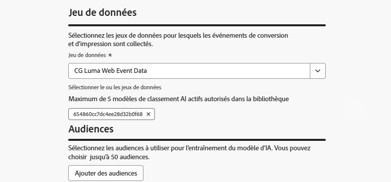

# Utilisation des modèles d’IA pour classer les parcours {#journey-ai-models}

>[!AVAILABILITY]
>
>Cette fonctionnalité est actuellement en disponibilité limitée. Contactez votre représentant ou représentante Adobe pour en obtenir l’accès.

[!DNL Adobe Journey Optimizer] vous permet de contrôler les parcours qu’un profil peut entrer lorsqu’ils sont qualifiés pour plus que ce que le système autorise. Pour ce faire, vous pouvez utiliser [ensembles de règles](rule-sets.md) pour définir des limites sur l’entrée de parcours ou la simultanéité. Lorsqu’un profil est éligible à plus de parcours que la limite ne le permet, la priorité attribuée à chaque parcours détermine les parcours sélectionnés.

Au lieu d’utiliser des formules de priorité ou de classement, vous pouvez utiliser des **modèles d’IA** pour classer dynamiquement les parcours en fonction des scores de modèle formés. Vous pouvez créer des modèles d’IA à partir de la section **[!UICONTROL Classement d’orchestration]** de l’interface utilisateur et les utiliser dans des ensembles de règles pour les appliquer aux parcours.

Pour obtenir un aperçu des types de modèles d’IA disponibles dans [!DNL Journey Optimizer], consultez la section [Prise en main des modèles d’IA](../experience-decisioning/ranking/ai-models.md#ai-model-types) dans la section Prise de décision .

## Créer un modèle d’IA {#create-ai-model}

>[!CAUTION]
>
>Pour créer, modifier ou supprimer des modèles d&#39;IA, vous devez disposer de la permission **Gestion des stratégies de classement**. [En savoir plus](../administration/high-low-permissions.md#manage-ranking-strategies)

Pour créer un modèle d’IA pour le classement des parcours, procédez comme suit.

1. Créez un jeu de données dans lequel les événements de conversion seront collectés. [Voici comment procéder.](../experience-decisioning/data-collection/create-dataset.md)

1. Accédez à la section **[!UICONTROL Classement d’orchestration]**, puis sélectionnez l’onglet **[!UICONTROL Modèles d’IA]** . La liste des modèles d’IA créés précédemment s’affiche.

1. Cliquez sur **[!UICONTROL Créer un modèle d’IA]**.

1. Spécifiez un nom unique et, si nécessaire, une description pour le modèle d’IA.

   {width="80%"}

   >[!NOTE]
   >
   >L&#39;objet de classement est l&#39;entité à laquelle la formule de classement s&#39;appliquera. Par défaut, l&#39;objet de classement est défini sur **[!UICONTROL Parcours]**.

<!--
1. Select the type of AI model you want to create:

    * **[!UICONTROL Auto-optimization]** optimizes based on past performance. [Learn more](../experience-decisioning/ranking/auto-optimization-model.md)
    * **[!UICONTROL Personalized optimization]** optimizes and personalizes based on audiences and performance. [Learn more](../experience-decisioning/ranking/personalized-optimization-model.md)-->

1. La section **[!UICONTROL Mesure d’optimisation]** fournit des informations sur l’événement de conversion utilisé par le modèle d’IA. Classements [!DNL Journey Optimizer] en fonction du **taux de conversion** (Taux de conversion = Nombre total d’événements de conversion/Nombre total d’événements d’impression). Le taux de conversion est calculé comme suit :

   * **Événements d’impression** (éléments affichés)
   * **Événements de conversion** (éléments qui génèrent des clics ou des conversions)

   Ces événements sont automatiquement capturés à l’aide de Web SDK ou de Mobile SDK. Pour plus d’informations, consultez la vue d’ensemble du [SDK Web Adobe Experience Platform](https://experienceleague.adobe.com/fr/docs/experience-platform/collection/home).

1. Sélectionnez le ou les jeux de données dans lesquels les événements de conversion et d’impression sont collectés. Découvrez comment créer ce type de jeu de données dans [cette section](../experience-decisioning/data-collection/create-dataset.md).

   {width="85%"}

   >[!CAUTION]
   >
   >Seuls les jeux de données créés à partir de schémas associés au groupe de champs **[!UICONTROL Événement d’expérience - Interactions avec les propositions]** (précédemment appelé « mixin ») s’affichent dans la liste déroulante.

1. <!--If you are creating a **[!UICONTROL Personalized optimization]** AI model, -->Sélectionnez le ou les segments à utiliser pour entraîner le modèle d’IA.

   >[!NOTE]
   >
   >Vous pouvez sélectionner jusqu’à 5 audiences.

1. Enregistrez et activez le modèle d’IA.

Le modèle d’IA est désormais disponible lorsque vous configurez un ensemble de règles.

## Affectation du modèle d’IA à un ensemble de règles {#assign-ai-model-to-ruleset}

Pour utiliser un modèle d’IA afin de classer vos parcours, vous devez l’utiliser dans une formule et affecter cette formule à un ensemble de règles.

1. Créez une formule de classement à l’aide du modèle d’IA que vous avez créé. [Voici comment procéder](journey-ranking-formulas.md#create-journey-ranking-formula)

1. Dans le menu **[!UICONTROL Business rules]**, créez un jeu de règles à utiliser pour l&#39;arbitrage de parcours. [Voici comment procéder](rule-sets.md#Create)

1. Veillez à sélectionner le domaine **[!UICONTROL Parcours]**.

1. Dans les propriétés de l&#39;ensemble de règles, définissez la **[!UICONTROL méthode de classement]** sur **[!UICONTROL Formule]** (au lieu de **[!UICONTROL Priorité]**).

1. Sélectionnez la formule qui utilise le modèle d’IA que vous avez créé dans la liste déroulante.

1. Créez les règles de limitation de parcours à ajouter au jeu de règles. [Voici comment procéder](journey-capping.md#create-rule)

1. Enregistrez l’ensemble de règles.

Désormais, la formule utilisant le modèle d’IA est affectée à l’ensemble de règles. Vous pouvez ensuite appliquer cet ensemble de règles à vos parcours.

## Application du jeu de règles à un parcours {#assign-rule-set-to-journey}

Pour attribuer l’ensemble de règles à un parcours, procédez comme suit.

1. Créez ou ouvrez le parcours auquel vous souhaitez affecter l’ensemble de règles. [Découvrez comment créer un parcours.](../building-journeys/journey-gs.md)

1. Dans les propriétés du parcours, sélectionnez l’ensemble de règles dans la liste déroulante. [Découvrez comment procéder](journey-capping.md#apply-capping).

   >[!NOTE]
   >
   >Un seul ensemble de règles à la fois peut être appliqué à un parcours.

1. Enregistrez le parcours.

Tous les parcours qui utilisent cet ensemble de règles seront classés avec la formule sélectionnée à l’aide du modèle d’IA lors de l’application de la limitation.
