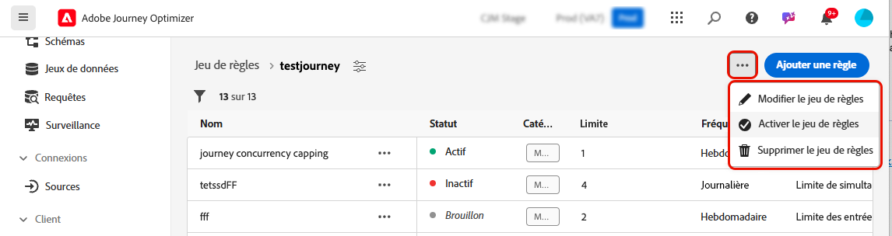

# Limitation et arbitrage des parcours {#journey-capping}

>[!AVAILABILITY]
>
>Les fonctionnalités de gestion des conflits et de hiérarchisation sont actuellement disponibles en disponibilité limitée pour un groupe restreint de clients. Notez que ces fonctionnalités seront progressivement déployées vers d’autres utilisateurs et utilisatrices à l’avenir. Contactez votre équipe de compte si vous souhaitez qu’elle vous ajoute à la liste d’attente pour ces fonctionnalités.

La limitation des parcours permet de limiter le nombre de parcours dans lesquels un profil peut être inscrit, ce qui évite la surcharge de communication. Dans Journey Optimizer, vous pouvez définir deux types de règles de limitation :

* La **limitation des entrées** limite le nombre d’entrées de parcours sur une période donnée pour un profil.
* La **limitation de simultanéité** limite le nombre de parcours dans lesquels un profil peut être inscrit simultanément.

Les deux types de limitation de parcours utilisent des scores de priorité pour arbitrer les entrées.

>[!AVAILABILITY]
>
>Les ensembles de règles de domaine **Parcours** ne sont disponibles que pour un nombre limité d&#39;utilisateurs (disponibilité limitée). Pour en bénéficier, contactez votre représentant ou représentante Adobe.

➡️ [Découvrir cette fonctionnalité en vidéo](#video)

## Création d’une règle de limitation de parcours {#create-rule}

>[!CONTEXTUALHELP]
>id="ajo_rule_set_concurrency_prioritization"
>title="Avenir de la priorité"
>abstract=" Si un parcours de priorité plus élevée est planifié dans la période spécifiée ici, le client ou la cliente ne pourra pas entrer dans ce parcours. Dans les cas où vous souhaitez que les parcours soient accessibles sur la base du premier arrivé, premier servi, nous vous suggérons de choisir la période d’anticipation quotidienne et de vous assurer que le score de priorité de tout autre parcours ce jour-là est inférieur au score de priorité du parcours. Un score de priorité de 100 à un parcours garantirait également son accessibilité."

>[!CONTEXTUALHELP]
>id="ajo_rule_set_rule_type"
>title="Type de règle"
>abstract="Spécifiez le type de limitation de la règle. La **[!UICONTROL limite d’entrée dans le parcours]** limite le nombre d’entrées dans le parcours sur une période donnée pour un profil, tandis que la **[!UICONTROL limite de simultanéité du parcours]** limite le nombre de parcours auxquels un profil peut être inscrit simultanément."

Pour créer une règle de limitation de parcours, procédez comme suit :

1. Accédez au menu **[!UICONTROL Règles métier]** pour accéder à l’inventaire des jeux de règles.

1. Sélectionnez le jeu de règles dans lequel vous souhaitez ajouter la règle de limitation ou créez un nouveau jeu de règles :

   * Pour utiliser un jeu de règles existant, sélectionnez-le dans la liste. Les règles de limitation de parcours ne peuvent être ajoutées qu’aux jeux de règles avec le domaine « parcours ». Vous pouvez vérifier ces informations dans les listes des jeux de règles, dans la colonne **[!UICONTROL Domaine]**.

     

   * Pour créer la règle de limitation dans un nouveau jeu de règles, cliquez sur **[!UICONTROL Créer un jeu de règles]**, spécifiez un nom unique pour le jeu de règles, sélectionnez « Parcours » dans la liste déroulante **[!UICONTROL Domaine du jeu de règles]**, puis cliquez sur **[!UICONTROL Enregistrer]**.

     

1. Dans l’écran du jeu de règles, cliquez sur le bouton **[!UICONTROL Ajouter une règle]**, puis configurez la règle en fonction de vos besoins :

   

   * Indiquez un nom unique pour la règle.

   * Dans la liste déroulante **[!UICONTROL Type de règle]**, spécifiez le type de limitation de la règle.

      * **[!UICONTROL Limite des entrées de parcours]** : limite le nombre d’entrées dans le parcours sur une période donnée pour un profil.
      * **[!UICONTROL Limite de simultanéité des parcours]** : limite le nombre de parcours dans lesquels un profil peut être inscrit simultanément.

   * Développez les sections ci-dessous pour découvrir comment configurer chaque type de limitation :

     +++ Configuration d’une règle de limitation d’entrée de parcours

      1. Dans le champ **[!UICONTROL Limitation]**, définissez le nombre maximal de parcours qu’un profil peut rejoindre.
      1. Dans le champ **[!UICONTROL Durée]**, définissez la période à prendre en compte. Veuillez noter que la durée est basée sur le fuseau horaire UTC. Par exemple, la limite quotidienne est réinitialisée à minuit UTC.

     >[!AVAILABILITY]
     >
     >La durée « Quotidienne » est disponible uniquement pour un ensemble d’organisations (disponibilité limitée). Pour en bénéficier, contactez votre représentant ou représentante Adobe.

     Dans cet exemple, nous voulons limiter à « 5 » le nombre de parcours par mois que les profils peuvent rejoindre.

     

     >[!NOTE]
     >
     >Le système prendra en compte la priorité des parcours planifiés à venir auxquels cette même règle est appliquée.
     >
     >Dans cet exemple, si la personne spécialiste marketing a déjà rejoint 4 parcours et qu’il y a un autre parcours planifié à venir ce mois-ci avec une priorité plus élevée, les personnes clientes seront alors supprimées de l’entrée au parcours de priorité plus faible.

+++

     +++ Configuration d’une règle de limitation de la simultanéité des parcours

      1. Dans le champ **[!UICONTROL Limitation]**, définissez le nombre maximal de parcours dans lesquels un profil peut être inscrit simultanément.

      1. Utilisez le champ **[!UICONTROL Aperçu de la hiérarchisation]** pour arbitrer les entrées de parcours en fonction des scores de priorité sur une période donnée (par exemple, 1 jour, 7 jours, 30 jours). Cela permet de donner la priorité à l’entrée dans des parcours à plus forte valeur si un profil est éligible à plusieurs parcours.

     Dans cet exemple, nous voulons empêcher les profils de rejoindre le parcours s’ils sont déjà inscrits dans un autre parcours contenant le même jeu de règles. Si un autre parcours dans les 7 jours à venir a un score de priorité plus élevé, le profil ne rejoint pas ce parcours.

     {width="50%" zommable="yes"}

+++

1. Lorsque la règle de limitation est prête à être appliquée à des parcours, activez-la en cliquant sur le bouton représentant des points de suspension en regard de son nom.

   

1. Activez la totalité du jeu de règles en cliquant sur le bouton représentant des points de suspension en regard du bouton Ajouter une règle dans le coin supérieur droit de l’écran.

   

## Application de règles de limitation aux parcours {#apply-capping}

>[!CONTEXTUALHELP]
>id="ajo_journey_capping_rule"
>title="Appliquer un jeu de règles aux parcours"
>abstract="Appliquez un jeu de règles pour exclure ce parcours d’une partie de votre audience en fonction des règles de capping de la fréquence."

Pour appliquer une règle de limitation à un parcours, accédez au parcours et ouvrez ses propriétés. Dans la liste déroulante **[!UICONTROL Règles de limitation]**, sélectionnez l’ensemble de règles approprié. Une fois le parcours activé, les règles de limitation définies dans le jeu de règles prennent effet.

>[!IMPORTANT]
>
>Si un parcours est activé immédiatement, cela peut prendre jusqu’à 20 minutes pour que le système puisse commencer à supprimer la clientèle. Vous pouvez planifier votre parcours pour qu’il commence au moins 20 minutes dans le futur afin d’éviter cette éventualité.

Une fois le parcours actif, vous pouvez vérifier dans le rapport de parcours si l’ensemble de règles a entraîné une exclusion du parcours, dans le tableau **[!UICONTROL Exclusions de Parcours]**. [Découvrez comment utiliser les rapports de parcours ](../reports/journey-global-report-cja.md)

## Vidéo pratique {#video}

>[!VIDEO](https://video.tv.adobe.com/v/3435530?quality=12)
