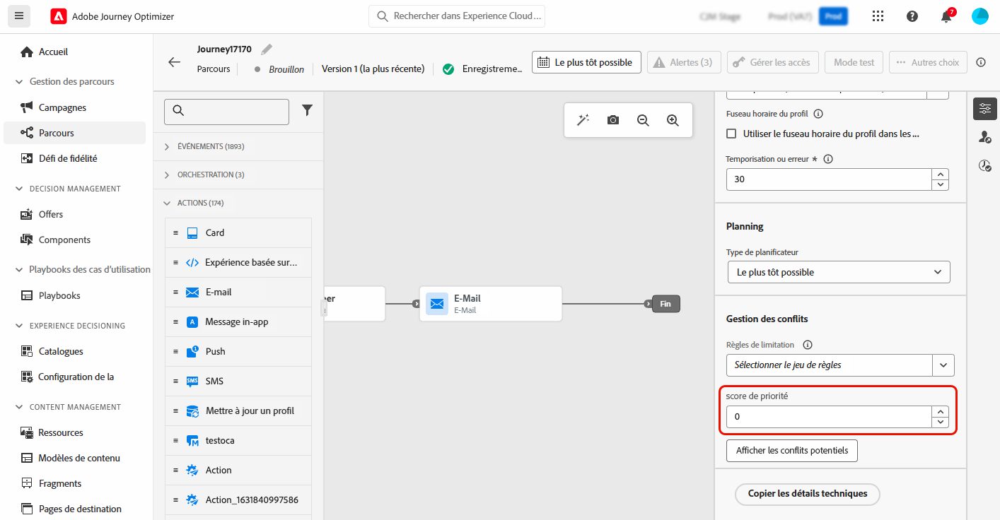
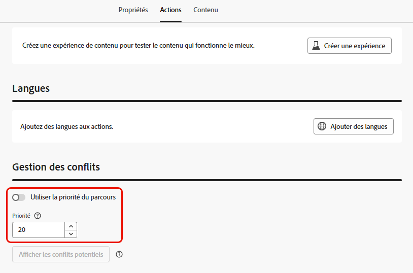

# Attribuer des scores de priorité {#priority}

Journey Optimizer permet d’attribuer un score de priorité à un parcours, une campagne ou à une action de canal entrant dans l’activité **[!UICONTROL Action]** du parcours.

Il est essentiel d’attribuer une priorité à un parcours, une campagne ou une action lorsqu’une contrainte est imposée (par exemple, un capping de la fréquence).

Dans les cas où une personne est admissible pour plusieurs parcours, campagnes ou communications et que vous souhaitez choisir ceux qu’elle doit rejoindre et recevoir, vous devez utiliser ce champ.

## Attribuer des scores de priorité aux parcours et aux campagnes {#priority-journey-campaign}

>[!CONTEXTUALHELP]
>id="ajo_campaigns_campaign_priority"
>title="Priorité"
>abstract="Attribuez un score de priorité à la campagne. La priorité est essentielle pour établir la priorité d’une campagne lorsqu’une contrainte est imposée (par exemple, un capping de la fréquence). Saisissez une valeur numérique (comprise entre 0 et 100). Notez que plus le nombre est élevé, plus la priorité est importante. Si deux campagnes ont le même score de priorité, la campagne qui a été activée en premier s’affiche."

>[!CONTEXTUALHELP]
>id="ajo_journey_priority"
>title="Priorité"
>abstract="Attribuez un score de priorité au parcours. La priorité est essentielle pour établir la priorité d’un parcours lorsqu’une contrainte est imposée (par exemple, un capping de la fréquence). Saisissez une valeur numérique (comprise entre 0 et 100). Notez que plus le nombre est élevé, plus la priorité est importante. Dans les cas où deux parcours ont le même score de priorité, le parcours qui a été activé en premier s’affiche."

➡️ [Découvrez cette fonctionnalité en vidéo.](#video)

L’attribution d’un score de priorité est essentielle pour la communication entrante, par exemple web, mobile et in-app. Si plusieurs campagnes utilisent la même configuration des canaux (une bannière dans la partie supérieure de votre page web, par exemple), cela peut s’avérer problématique, car seul le contenu d’une campagne peut être affiché. Le score de priorité est l’emplacement où vous insérerez vos préférences pour la campagne qui doit s’afficher lorsque les destinataires peuvent être admissibles pour plusieurs campagnes.

>[!NOTE]
>
>Dans les campagnes, le score de priorité est disponible uniquement pour les canaux entrants web, in-app et basés sur du code.

Pour attribuer un score de priorité à un parcours ou à une campagne, saisissez une valeur numérique (de 0 à 100) dans le champ **[!UICONTROL Score de priorité]** situé dans les propriétés du parcours ou de la campagne. Plus le nombre est élevé, plus la priorité est élevée.

Si vous créez cette campagne et souhaitez vous assurer que son contenu s’affiche, donnez-lui un score de 100.

>[!IMPORTANT]
>
>Si deux parcours ou campagnes ont le même score de priorité, le système ne dispose pas d’un mécanisme de rupture d’égalité. Assurez-vous que les scores de priorité sont uniques pour éviter les conflits.

## Attribuer des scores de priorité aux actions de canal entrant {#priority-action}

>[!CONTEXTUALHELP]
>id="ajo_journey_action_priority"
>title="Priorité"
>abstract="Attribuez un score de priorité à l’action de parcours. La priorité est essentielle pour donner la priorité à une action entrante lorsqu’il existe plusieurs actions de parcours ou campagnes utilisant la même configuration des canaux. Saisissez une valeur numérique (comprise entre 0 et 100). Notez que plus le nombre est élevé, plus la priorité est importante. Par défaut, le score de priorité de l’action est hérité du score de priorité global du parcours."

Journey Optimizer vous permet également d’attribuer un score de priorité aux actions de canal entrant dans l’activité [Action](../building-journeys/journey-action.md).

Cela vous permet d’établir la priorité d’une action entrante lorsqu’il existe plusieurs actions de parcours ou campagnes utilisant la même configuration des canaux.

>[!NOTE]
>
>Dans l’activité **[!UICONTROL Action]**, le score de priorité est disponible uniquement pour les canaux entrants web, in-app et basés sur du code.

Dans la section **[!UICONTROL Gestion des conflits]**, l’option **[!UICONTROL Utiliser la priorité du parcours]** est sélectionnée par défaut, ce qui signifie que le score de priorité de l’action est hérité du score de priorité global du parcours.

Pour attribuer un score de priorité aux actions entrantes définies dans l’activité **[!UICONTROL Action]**, désélectionnez l’option **[!UICONTROL Utiliser la priorité du parcours]** et saisissez une valeur numérique (comprise entre 0 et 100) dans le champ **[!UICONTROL Priorité]**. Plus le nombre est élevé, plus la priorité est élevée.

{width=70%}

## Vidéo pratique {#video}

>[!VIDEO](https://video.tv.adobe.com/v/3445003?captions=fre_fr&quality=12)
