# Définir des heures creuses {#quiet-hours}

## Présentation des heures creuses

Les **heures creuses** vous permettent de définir des exclusions temporelles pour les canaux **E-mail**, **SMS**, **Push** et **WhatsApp**. Ils garantissent qu’aucun message n’est envoyé pendant des périodes spécifiques, afin de respecter les préférences de la clientèle et les exigences de conformité.

Vous pouvez appliquer des heures creuses par le biais d’**ensembles de règles** qui peuvent être affectés à des actions individuelles dans des campagnes ou des parcours pour un contrôle précis.

En rationalisant ces processus, vous pouvez améliorer l’expérience client, gagner du temps et garantir la conformité aux règles de communication :

* **Ne réveillez pas votre clientèle** : *la bonne personne, sur le bon canal et au bon moment* est le mantra de bon nombre de spécialistes marketing. Le timing doit donc faire partie intégrante du parcours client. En définissant une règle d’heures creuses, les marques peuvent mieux contrôler le moment où les contacts reçoivent les messages, s’assurant ainsi qu’ils les reçoivent au moment où ils sont le plus susceptibles d’agir.
* **Commodité** : interceptez facilement les communications entre les campagnes et les parcours lorsque vous devez empêcher une audience de recevoir un message sans avoir à arrêter l’ensemble du parcours ou de la campagne.
* **Gain de temps** : gérez les exclusions au même endroit en créant une **règle temporelle**, au lieu d’ajouter plusieurs nœuds de condition avec des expressions personnalisées.\
  <!--* **Extra Safeguard** - Benefit from an extra safeguard in case audience criteria or time-window configurations were incorrectly set, ensuring individuals are still excluded when they should be.-->

➡️ [Découvrez cette fonctionnalité en vidéo.](#video)

## Mécanismes de sécurisation et limitations

* **Canaux pris en charge** : E-mail, SMS, Push et WhatsApp.
* **Campagnes orchestrées** - Les heures calmes ne sont pas prises en charge pour les campagnes orchestrées.
* **Délai de propagation** : les mises à jour d’une règle d’heures creuses peuvent prendre jusqu’à 12 heures pour être appliquées aux actions de canal qui utilisent déjà cette règle.
* **Latence de volume élevé** : en cas de communications à volume élevé, le système peut nécessité un délai supplémentaire pour commencer à appliquer les suppressions liées aux heures creuses.

<!--* **Custom actions** – For custom actions, only quiet hours rules are enforced. If a rule set also includes other rules (e.g., frequency capping), those rules are ignored.-->
<!--* **Pre-suppression window** – The system begins suppressing communications 30 minutes before quiet hours start, ensuring that no messages are delivered once the quiet period begins.-->

## Créer des règles d’heures creuses

Pour définir des heures creuses, créez une règle dans un ensemble de règles personnalisé. [Découvrez comment créer des ensembles de règles](../conflict-prioritization/rule-sets.md#Create). Procédez comme suit :

1. Accédez au menu **[!UICONTROL Règles métier]** pour accéder à l’inventaire des ensembles de règles.

1. Choisissez un ensemble de règles personnalisé existant ou créez-en un :

   +++Créer une règle d’heures creuses dans un ensemble de règles existant

   Sélectionnez l’ensemble de règles dans l’inventaire. Les règles d’heures creuses ne peuvent être ajoutées qu’à des ensembles de règles dont le domaine est « canal ». Vous pouvez vérifier ces informations dans la colonne **[!UICONTROL Domaine]**.

   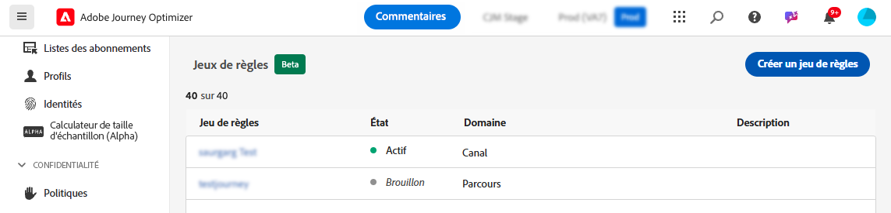

   +++

   +++Créer une règle d’heures creuses dans un nouvel ensemble de règles

   Cliquez sur **[!UICONTROL Créer un ensemble de règles]**, saisissez un nom unique, puis sélectionnez « Canal » dans le menu déroulant **[!UICONTROL Domaine de l’ensemble de règles]**.

   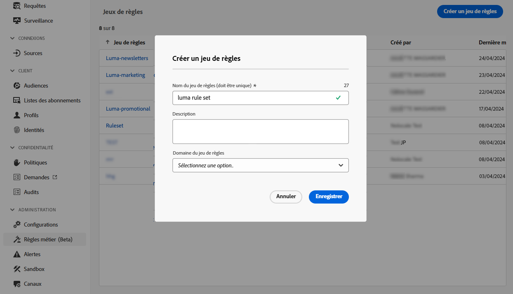

   +++

   >[!NOTE]
   >
   >Les heures creuses ne peuvent être définies que dans des **ensembles de règles personnalisés**. L’ensemble de règles global ne prend pas en charge la configuration des heures creuses.

1. Dans l’écran de l’ensemble de règles, cliquez sur **[!UICONTROL Ajouter une règle]** et définissez un nom unique pour la règle.

1. Le champ **Catégorie** spécifie la catégorie de message à laquelle la règle s’applique. Pour l’instant, ce champ est en lecture seule et est défini par défaut sur **[!UICONTROL Marketing]**.

1. Dans le menu déroulant **[!UICONTROL Type de règle]**, sélectionnez **[!UICONTROL Heures creuses]**.

   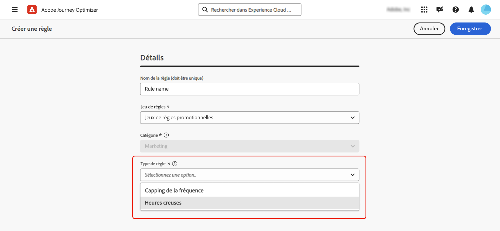

1. Dans la section **[!UICONTROL Dates et heures]**, définissez quand appliquer des heures creuses :

   1. Dans le menu déroulant **[!UICONTROL Fuseau horaire]**, appliquez un fuseau horaire standard à tous les destinataires de l’audience, quels que soient leurs fuseaux horaires individuels.

      Pour utiliser le champ de fuseau horaire de chaque profil, sélectionnez **[!UICONTROL Utiliser le fuseau horaire local des destinataires]** . [En savoir plus sur la gestion des fuseaux horaires dans les parcours](../building-journeys/timezone-management.md#timezone-from-profiles)

      >[!IMPORTANT]
      >
      >Si un profil ne dispose d’aucune valeur de fuseau horaire, les heures creuses ne sont pas appliquées pour celui-ci.

   1. Spécifiez la période à laquelle les heures creuses doivent s’appliquer.

      * **[!UICONTROL Hebdomadaire]** : sélectionnez des jours spécifiques de la semaine et un créneau horaire. Vous pouvez également appliquer la règle **[!UICONTROL Toute la journée]**.

        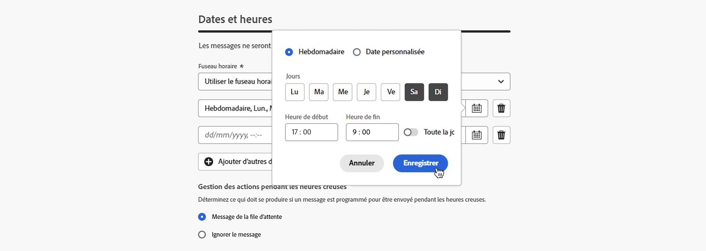

      * **[!UICONTROL Date personnalisée]** : sélectionnez des dates spécifiques dans le calendrier et un créneau horaire. Vous pouvez également appliquer la règle **[!UICONTROL Toute la journée]**.

        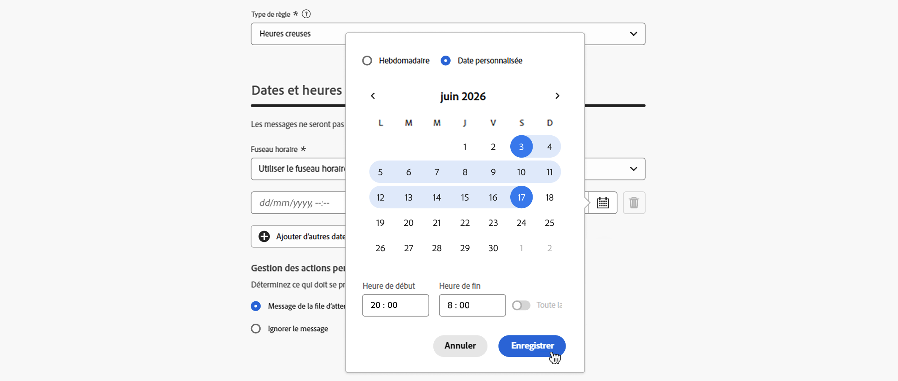

   1. Cliquez sur le bouton **[!UICONTROL Ajouter d’autres dates]** pour ajouter jusqu’à 5 périodes distinctes.

      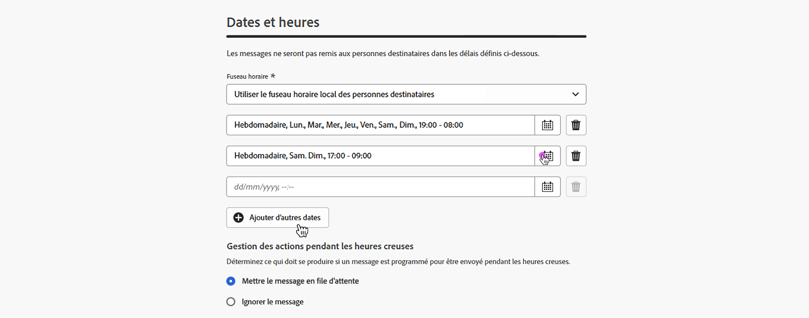

1. Dans la section **[!UICONTROL Gestion des actions pendant les heures creuses]**, choisissez comment les messages sont traités pendant la période sélectionnée :

   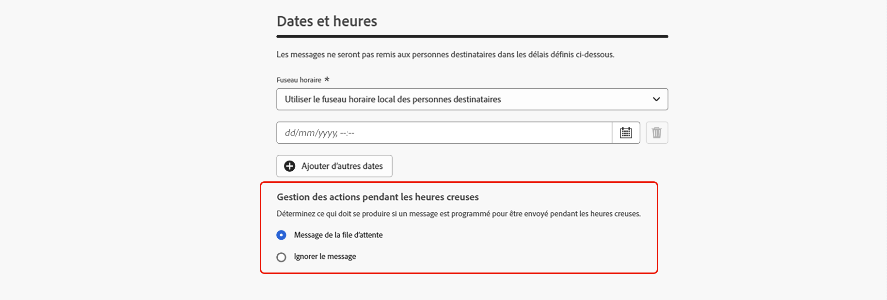

   * **[!UICONTROL Message en file d’attente]** : les messages sont envoyés à la fin de la période d’heures creuses, sauf s’ils sont en pause.

     >[!NOTE]
     >
     >Si un message reste dans la file d’attente pour un profil pendant plus de 7 jours, le message est ignoré.

   * **[!UICONTROL Ignorer le message]** - Les messages ne sont jamais envoyés.

     >[!NOTE]
     >
     >Si vous sélectionnez **[!UICONTROL Ignorer]** et appliquez cette règle à une action de parcours, le profil est supprimé de la diffusion du message et quitté le parcours.

La règle s’affiche désormais dans l’ensemble de règles. Vous pouvez la sélectionner pour afficher ses détails dans le volet des propriétés.

Si votre règle est prête, activez-la et effectuez la configuration de votre ensemble de règles. [Découvrez comment créer et activer des ensembles de règles](../conflict-prioritization/rule-sets.md#Create)

## Appliquer des heures creuses aux parcours et aux campagnes {#apply}

Une fois votre règle enregistrée et l’ensemble de règles activé, vous pouvez l’appliquer aux actions des parcours et des campagnes. Canaux pris en charge : **E-mail, SMS, Push, WhatsApp**. Pour plus d’informations, consultez les onglets ci-dessous.

>[!BEGINTABS]

>[!TAB Appliquer des actions de canal des heures creuses dans les parcours]

1. Ouvrez votre parcours, sélectionnez une [action de canal](../building-journeys/journey-action.md) et modifiez le contenu de votre message.
1. Cliquez sur le bouton **[!UICONTROL Ajouter une règle métier]** et sélectionnez l’ensemble de règles contenant la règle d’heures creuses.

   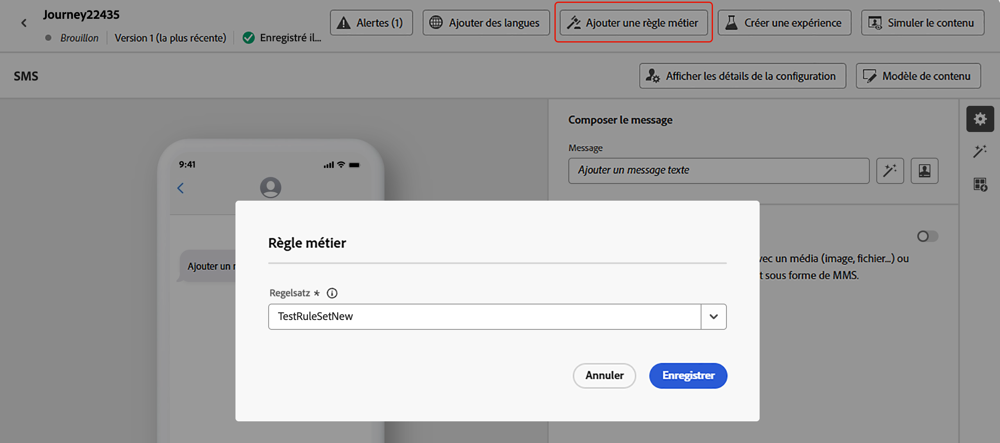

   >[!NOTE]
   >
   >Seuls les ensembles de règles [activés](#activate-rule) s’affichent dans la liste.

1. Activez votre parcours.

>[!TAB Appliquer des heures creuses aux actions de campagne]

1. Modifiez votre campagne et accédez à l’onglet **[!UICONTROL Actions]**.
1. Dans la section **[!UICONTROL Règles métier]**, sélectionnez l’ensemble de règles contenant la règle d’heures creuses.

   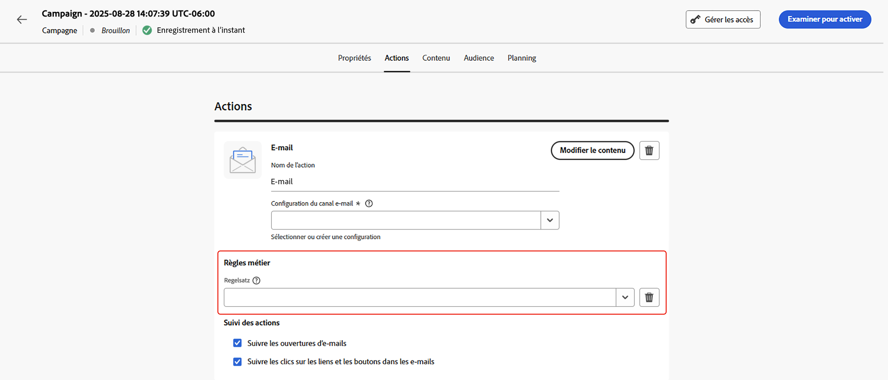

   >[!NOTE]
   >
   >Seuls les ensembles de règles [activés](#activate-rule) s’affichent dans la liste.

1. Activez votre campagne.

>[!ENDTABS]

## Étapes suivantes

Une fois vos campagnes ou votre parcours activés et exécutés, vous pouvez visualiser le nombre de profils exclus de la communication dans le [rapport Customer Journey Analytics](../reports/report-gs-cja.md) et dans le [rapport dynamique](../reports/live-report.md), où les règles des heures creuses seront répertoriées comme une raison possible pour les personnes exclues de la diffusion.

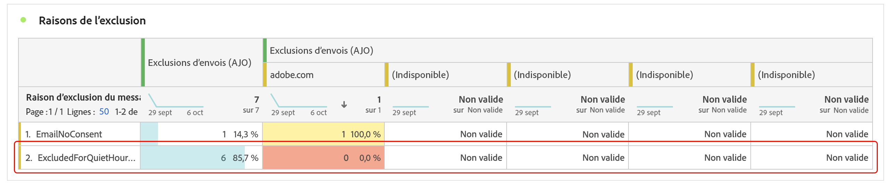

<!--

>[!TAB Apply Quiet hours to custom actions]

1. Open your journey and add or select a custom action in the canvas.

1. In the **[!UICONTROL Business rules]** section, select the rule set containing the Quiet hours rule.

   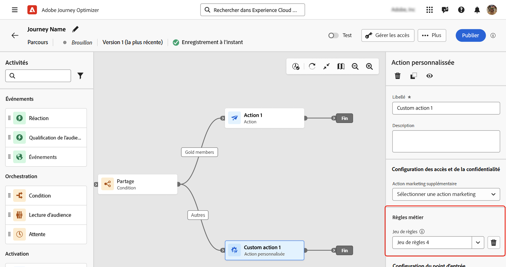

   >[!NOTE]
   >
   >Only [activated](#activate-rule) rule sets display in the list.

1. Activate your journey.

-->

## Vidéo pratique {#video}

Découvrez comment utiliser la fonctionnalité des heures creuses dans Adobe Journey Optimizer.

>[!VIDEO](https://video.tv.adobe.com/v/3475851?quality=12)
