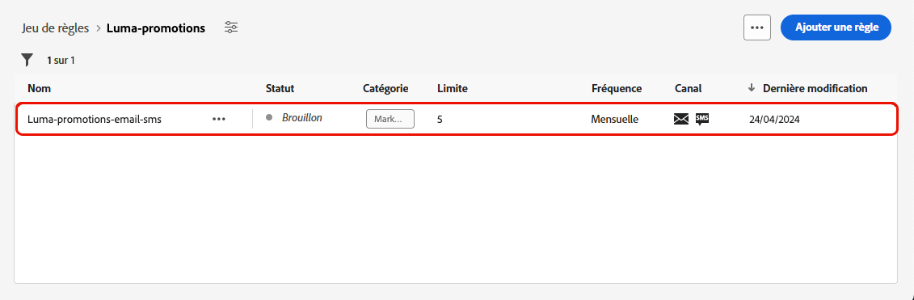
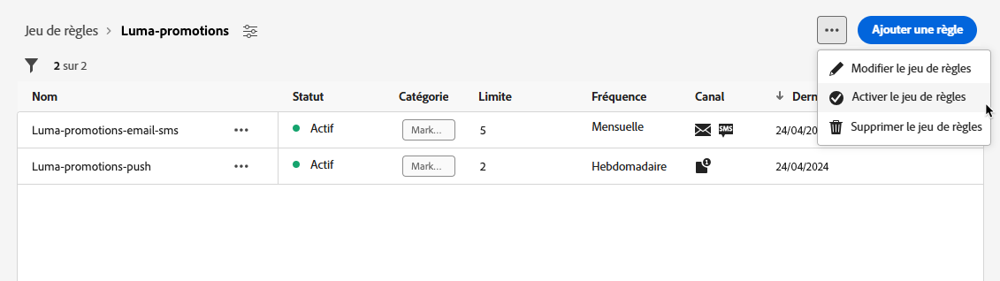

# Utiliser des jeux de règles {#rule-sets}

>[!CONTEXTUALHELP]
>id="ajo_business_rules_rule_sets"
>title="Jeux de règles"
>abstract="Utilisez des jeux de règles pour appliquer un capping de fréquence à différents types de communications marketing. Vous pouvez également créer des jeux de règles pour exclure des parcours d’une partie de votre audience en fonction de règles de capping de fréquence."

## Commencer avec les jeux de règles {#gs}

### Que sont les jeux de règles ? {#what}

Les jeux de règles vous permettent de **regrouper plusieurs règles en jeux de règles** et de les appliquer aux parcours et aux campagnes de votre choix. Cela permet d’améliorer la granularité afin de limiter la fréquence et le nombre de parcours qu’un client ou une cliente peut rejoindre au cours d’une certaine période ou de contrôler la fréquence à laquelle les utilisateurs et utilisatrices recevront un message selon le type de communication.

Vous pouvez créer deux types de jeux de règles :

* Les jeux de règles de **Canal** appliquent des règles aux canaux de communication. Ils vous permettent de définir les éléments suivants :

   * **Règles de capping de fréquence** : *ne pas envoyer plus d’un e-mail ou d’un SMS par jour.*
   * **Règles d’heures creuses** (disponibilité limitée) : *ne pas envoyer d’e-mails en dehors de la période de 8 h à 21 h.*

* Les jeux de règles de **Parcours** appliquent des règles de limitation d’entrée et de simultanéité à un parcours. Par exemple, ne pas entrer simultanément des profils dans plusieurs parcours.

➡️ [Découvrez cette fonctionnalité en vidéo.](#video)

### Autorisations {#permissions-frequency-rules}

Pour utiliser les règles métier, vous avez besoin des autorisations suivantes :

* **[!UICONTROL Afficher les règles de fréquence]** : accédez aux règles métier et affichez-les.
* **[!UICONTROL Gérer les règles de fréquence]** : créez, modifiez ou supprimez des règles métier.

Pour en savoir plus sur les autorisations, consultez [cette section](../administration/high-low-permissions.md).

### Jeux de règles globaux et personnalisés {#global-custom}

Lors de l’accès aux jeux de règles pour la première fois à partir du menu **[!UICONTROL Administration]** > **[!UICONTROL Règles métier]**, un jeu de règles par défaut est précréé et actif : **Jeu de règles par défaut global**.

Ce jeu de règles contient des règles globales que vous pouvez appliquer pour contrôler la fréquence à laquelle les utilisateurs et utilisatrices reçoivent des messages sur un ou plusieurs canaux. Toutes les règles définies dans ce jeu de règles s’appliquent à tous les canaux sélectionnés, que les communications soient envoyées d’un parcours ou d’une campagne.

En plus du jeu de règles « Jeu de règles par défaut global », vous pouvez créer des **jeux de règles** que vous pouvez appliquer à tout parcours ou campagne afin d’appliquer des règles de limitation spécifiques. [Découvrir comment créer des jeux de règles personnalisés](#create)

## Créer et activer des jeux de règles {#Create}

>[!CONTEXTUALHELP]
>id="ajo_rule_set_domain"
>title="Domaine du jeu de règles"
>abstract="Lors de la création d’un jeu de règles, vous devez indiquer si les règles du jeu de règles appliqueront les règles de limitation spécifiques aux canaux de communication ou aux parcours."

>[!CONTEXTUALHELP]
>id="ajo_rule_sets_category"
>title="Sélectionner la catégorie de règle relative aux messages"
>abstract="Lorsqu’elle sont activées et appliquées à un message, toutes les règles de fréquence correspondant à la catégorie sélectionnée seront automatiquement appliquées à ce message. Actuellement, seule la catégorie Marketing est disponible."

<!--NOT USED?
[!CONTEXTUALHELP]
>id="ajo_rule_sets_capping"
>title="Set the capping for your rule"
>abstract="Specify the maximum number of messages sent to a customer profile within the chosen time frame. The frequency cap will be based on the selected calendar period and will be reset at the beginning of the corresponding time frame."-->

>[!CONTEXTUALHELP]
>id="ajo_rule_type"
>title="Type de règle"
>abstract="Sélectionnez le type de règle souhaité pour votre jeu de règles de canal : utilisez le type **Capping de la fréquence** pour appliquer des règles de limitation aux canaux de communication. Par exemple, n’envoyez pas plus d’un e-mail ou d’un SMS par jour. Sélectionnez **Heures creuses** (en disponibilité limitée) pour définir des exclusions basées sur l’heure afin de vous assurer qu’aucun message n’est envoyé pendant certaines périodes."

>[!CONTEXTUALHELP]
>id="ajo_rule_sets_duration"
>title="Sélectionner la catégorie de règle relative aux messages"
>abstract="Lorsqu’elle sont activées et appliquées à un message, toutes les règles de fréquence correspondant à la catégorie sélectionnée seront automatiquement appliquées à ce message. Actuellement, seule la catégorie Marketing est disponible."

>[!CONTEXTUALHELP]
>id="ajo_rule_set_rule_capping"
>title="Limitation des règles"
>abstract="Définissez la limitation de votre règle. En fonction du domaine du jeu de règles et de la sélection dans le champ Type de règle, ce champ peut définir le nombre maximal de messages qui peuvent être envoyés à un profil, ou le nombre maximal de parcours auxquels le profil peut s’inscrire ou être inscrit simultanément."

>[!CONTEXTUALHELP]
>id="ajo_journey_business_rules"
>title="Jeu de règles"
>abstract="Sélectionnez le jeu de règles à appliquer à votre action personnalisée."

Pour créer un jeu de règles, procédez comme suit.

>[!NOTE]
>
>Vous pouvez créer jusqu’à 10 ensembles de règles pour le domaine de canal et 10 ensembles de règles pour le domaine de parcours, pour un total de 20 ensembles de règles.

1. Accédez à la liste **[!UICONTROL Jeux de règles]**, puis cliquez sur **[!UICONTROL Créer un jeu de règles]**.

   

1. Définissez un nom unique pour le jeu de règles et ajoutez une description.

1. Sélectionnez le domaine du jeu de règles et cliquez sur **[!UICONTROL Enregistrer]**.

   * Domaine de **Canal** : appliquez des règles de limitation ou des règles d’heures creuses aux canaux de communication.
   * Domaine de **Parcours** : appliquez des règles de limitation d’entrée et de simultanéité à un parcours.

   

1. Définissez les règles que vous souhaitez ajouter à ce jeu de règles. Pour ce faire, accédez au jeu de règles et cliquez sur **[!UICONTROL Ajouter une règle]**.

1. Configurez les paramètres de la règle en fonction de vos besoins. Les paramètres disponibles pour la règle dépendent du domaine du jeu de règles sélectionné à sa création.

   Vous trouverez des informations détaillées sur la configuration des règles de parcours et de canal dans les sections suivantes :

   * [Limitation d’un parcours](../conflict-prioritization/journey-capping.md)
   * [Capping de la fréquence par canal et type de communication](../conflict-prioritization/channel-capping.md)
   * [Heures creuses](../conflict-prioritization/quiet-hours.md) (fonctionnalité en disponibilité limitée)

1. Cliquez sur **[!UICONTROL Enregistrer]** pour confirmer la création de la règle. Votre message est ajouté au jeu de règles, au statut **[!UICONTROL Brouillon]**.

   

1. Répétez les étapes ci-dessus pour ajouter autant de règles que nécessaire au jeu de règles.

1. Une fois créée, la règle affiche le statut **[!UICONTROL Brouillon]** et n’a encore aucune incidence sur le message. Pour l’activer, cliquez sur le bouton **[!UICONTROL Autres actions]** en regard de la règle et sélectionnez **[!UICONTROL Activer]**.

   

1. Activez le jeu de règles pour pouvoir l’appliquer à vos parcours et à vos messages.

   

   >[!NOTE]
   >
   >L’activation complète d’un jeu de règles peut prendre jusqu’à 10 minutes. Vous n’avez pas besoin de modifier des messages ou de republier des parcours pour qu’une règle prenne effet.

<!--Currently, once a rule set is activated, no more rules can be added to that rule set.-->

1. Vous pouvez appliquer un jeu de règles à un message ou à un parcours, en fonction du domaine sélectionné lors de la création du jeu de règles.

   Vous trouverez des informations détaillées sur l’application d’un jeu de règles dans les sections suivantes :

   * [Appliquer un jeu de règles à un parcours](../conflict-prioritization/journey-capping.md#apply-capping)
   * [Appliquer des règles de limitation aux actions de parcours et de campagnes](../conflict-prioritization/channel-capping.md#apply-frequency-rule)
   * [Appliquer des règles d’heures creuses à des parcours et des campagnes](../conflict-prioritization/quiet-hours.md#apply)

## Accéder aux jeux de règles et les gérer {#access-rule-sets}

Tous les jeux de règles créés s’affichent dans le menu **[!UICONTROL Administration]** > **[!UICONTROL Règles métier]**. Ils sont triés par date de dernière modification.

Cliquez sur le nom d’un jeu de règles pour afficher et modifier son contenu. Toutes les règles incluses dans ce jeu de règles sont répertoriées. Le menu contextuel en haut à droite vous permet de modifier le nom et la description du jeu de règles, ainsi que d’activer et de supprimer ce dernier.

Pour chaque règle du jeu de règles, le bouton **[!UICONTROL Plus d’actions]** vous permet de modifier la règle, de l’activer et de la supprimer.

Pour désactiver une règle ou un jeu de règles, cliquez sur le bouton **[!UICONTROL Autres actions]** en regard de l’élément souhaité et sélectionnez **[!UICONTROL Désactiver]**.

Le statut de la règle devient **[!UICONTROL Inactif]** et la règle ne s’appliquera pas aux futures exécutions de messages. Les messages en cours d&#39;exécution ne seront pas affectés.

>[!NOTE]
>
>La désactivation d’une règle ou d’un jeu de règles n’affecte ou ne réinitialise aucun comptage sur les profils individuels.

## Vidéo pratique {#video}

>[!VIDEO](https://video.tv.adobe.com/v/3444728?captions=fre_fr&quality=12)
