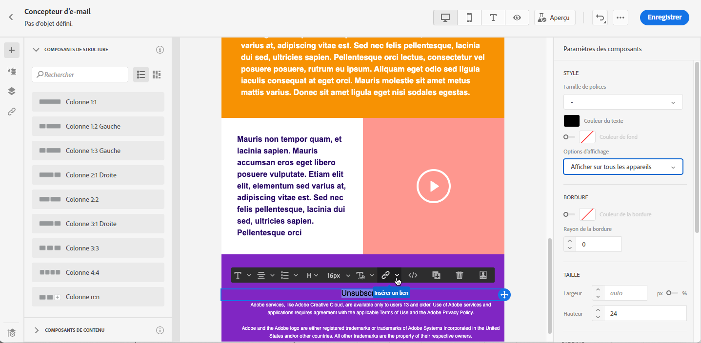
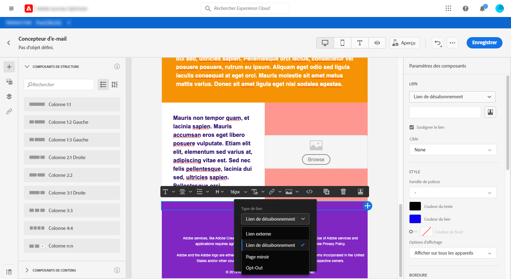
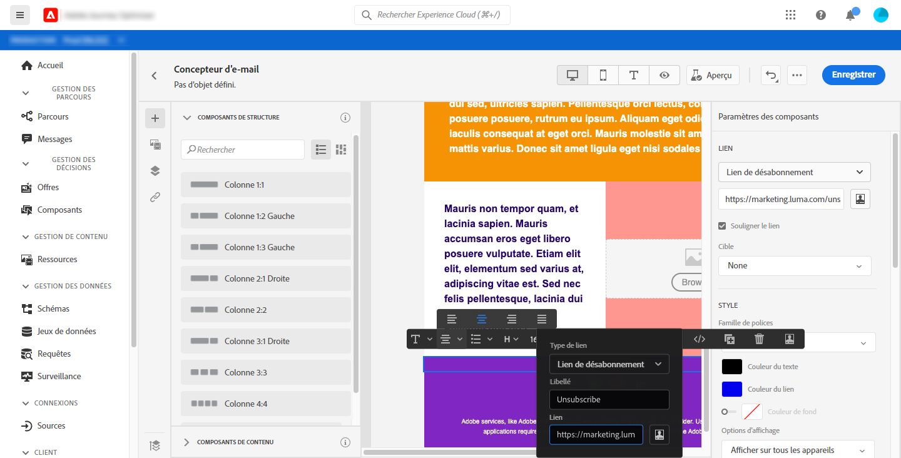
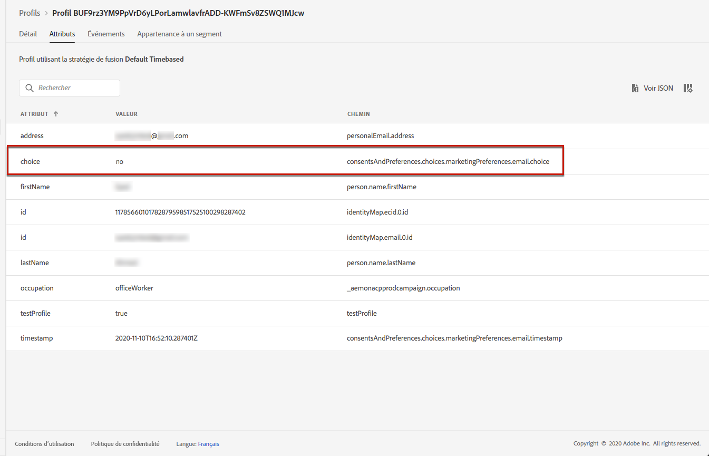

# Gestion de la désinscription {#consent}

Utilisez [!DNL Journey Optimizer] pour suivre le consentement de vos destinataires à la communication et comprendre comment ils veulent interagir avec votre marque en gérant leurs préférences et leurs abonnements. <!--Their preferences and subscriptions are handled through Consent management.-->

Des règlements tels que le RGPD stipulent que vous devez respecter des exigences spécifiques avant de pouvoir utiliser les informations provenant de sujets de données. En outre, les sujets de données devraient pouvoir modifier leur consentement à tout moment.

**Pourquoi est-ce important ?**

* Le fait de ne pas se conformer à ces règlements introduit des risques juridiques réglementaires pour votre marque.
* Cela vous aide à éviter d&#39;envoyer des communications non sollicitées à vos destinataires, ce qui pourrait les faire marquer vos messages comme des courriers indésirables et nuire à votre réputation.

Pour en savoir plus sur la gestion de la confidentialité et les réglementations applicables, consultez la [documentation Experience Platform](https://experienceleague.adobe.com/docs/experience-platform/privacy/home.html?lang=fr){target=&quot;_blank&quot;}.

<!--* Recipients should be able to opt-in/opt-out from receiving electronic communication through one or more channel
* Recipients expect the brand to offer preference centre capability that controls how brand should engage with them (example: channel of communication, invasive and non-invasive tracking etc). This helps to fulfil regulatory obligations and also facilitates quality engagement with recipient. 
* The third category is the capability to offer subscription to recipients (newsletter, etc)-->

## Gestion du droit d&#39;opposition {#opt-out-management}

La possibilité pour les destinataires de se désabonner de la réception des communications d&#39;une marque est une exigence légale. Pour en savoir plus sur la législation applicable, consultez la [documentation d’Experience Platform](https://experienceleague.adobe.com/docs/experience-platform/privacy/regulations/overview.html?lang=fr#regulations){target=&quot;_blank&quot;}.

Par conséquent, vous devez toujours inclure un **lien de désabonnement** dans chaque e-mail envoyé aux destinataires :
* Lorsqu&#39;ils cliquent sur ce lien, les destinataires sont dirigés vers une page de destination contenant un bouton pour confirmer leur désinscription.
* Lorsqu&#39;ils cliquent sur le bouton de désinscription, un appel d’Adobe I/O est lancé pour mettre à jour les données du profil avec ces informations. [En savoir plus à ce sujet](#consent-service-api).

### Ajout d’un lien de désabonnement {#add-unsubscribe-link}

Pour ajouter un lien de désabonnement, procédez comme suit :

1. Construisez votre page de destination de désinscription.
1. Hébergez votre page de destination sur le système tiers de votre choix.
1. [Créez un message](../../help/using/create-message.md) dans [!DNL Journey Optimizer].

   <!--The link to your landing page should contain a static URL and the profile ID.-->

1. Sélectionnez du texte dans votre contenu et insérez un lien à l’aide de la barre d’outils contextuelle.

   

1. Sélectionnez **[!UICONTROL Lien de désinscription]** dans la liste déroulante **[!UICONTROL Type de lien]**.

   

1. Dans le cadre **[!UICONTROL URL de la page de désinscription]**, copiez le lien vers votre page de destination.

   

1. Cliquez sur **[!UICONTROL Enregistrer]**.

1. Enregistrez votre contenu et [publiez votre message](../../help/using/publish-manage-message.md).

   >[!NOTE]
   >
   >L&#39;URL de votre page de destination tierce inclut trois paramètres qui seront utilisés pour mettre à jour les préférences des profils par le biais d&#39;un appel d&#39;Adobe I/O. [En savoir plus dans cette section](#consent-service-api).

1. Envoyez votre message avec le lien vers votre page de destination via un [parcours](building-journeys/journey.md).

1. Une fois le message reçu, si le destinataire clique sur le lien de désabonnement, votre page de destination s’affiche.

   

1. Si le destinataire clique sur le bouton de désinscription dans le page de destination (ici, le bouton **Se désabonner**), les données du profil sont mises à jour par le biais d’un [appel d’Adobe I/O](#opt-out-api).

   Le destinataire désabonné est ensuite redirigé vers un écran de message de confirmation indiquant que la désinscription a réussi.

   

   Par conséquent, cet utilisateur ne recevra aucune communication de votre marque à moins d&#39;être de nouveau abonné.

Pour vérifier que le choix du profil correspondant a été mis à jour, accédez à Experience Platform et accédez au profil en sélectionnant un espace de noms d&#39;identité et une valeur d&#39;identité correspondante. Pour en savoir plus, consultez la [documentation d’Experience Platform](https://experienceleague.adobe.com/docs/experience-platform/profile/ui/user-guide.html?lang=fr#getting-started){target=&quot;_blank&quot;}.



Dans l&#39;onglet **[!UICONTROL Attributs]**, vous pouvez voir la valeur de **[!UICONTROL choice]** remplacée par **[!UICONTROL no]**.

<!--The opt-out URL is resolved upon each recipient receiving the message. It is then personalized with the relevant encrypted parameters (profile ID, profile name, journey ID, sandbox ID, and message execution ID).-->

### Appel d&#39;API de désinscription {#opt-out-api}

Une fois que le destinataire s’est désabonné en cliquant sur le lien de désabonnement, une API Adobe I/O <!--Consent service API to capture the encrypted data and-->est appelée pour mettre à jour la préférence de profil correspondante.

Cet appel Adobe I/O POST est le suivant :

Point d&#39;entrée : cjm.adobe.io/imp/consent/preferences

Paramètres de requête:
* **params** : contient la payload chiffrée
* **sig** : signature <!--which signature?-->
* **pid** : ID de profil chiffré

Ces paramètres sont disponibles à partir du lien de désabonnement envoyé à votre destinataire, c’est-à-dire l’URL qui ouvrira votre page de destination tierce pour un destinataire donné :


<!--QUESTION: How do you get the URL built for each recipient? Do you have to wait until each targeted recipient receives the unsubscribe link or can you deduce it in advance? Is it done automatically upon the API call or do you have to do something manually for each profile? In other words will the LP automatically include the 3 parameters or do you have to insert something manually? Still not completely clear-->

Exigences d’en-tête :
* x-api-key
* x-gw-ims-org-id
* x-sandbox-name
* autorisation (jeton utilisateur de votre compte technique) <!--How do you find this information? And other header elements?-->

Corps de la requête:

```
{
   "marketing": [
       {
            "type": "email",           
            "choice": "no",          
            "scope": "channel"       
        }
    ],
 
}
```

<!--The Consent service /-->[!DNL Journey Optimizer] will <!--decrypt and-->use these parameters to update the corresponding profile's choice.
<!--and provide an answer back to the landing page.-->

## Exclusion en un clic {#one-click-opt-out}

Comme de nombreux clients recherchent un processus plus facile pour se désabonner, vous pouvez également ajouter un lien d’exclusion en un clic dans votre contenu d’email. Ce lien permettra à vos destinataires de se désabonner rapidement de vos communications, sans être redirigés vers une landing page dans laquelle ils doivent confirmer leur désinscription.

Découvrez comment ajouter un lien d’exclusion au contenu de votre message dans [cette section](message-tracking.md#one-click-opt-out-link).

Une fois votre message envoyé via un [parcours](building-journeys/journey.md), si un destinataire clique sur le lien d’exclusion, il est immédiatement désinscrit.

## Lien de désabonnement dans l&#39;en-tête {#unsubscribe-email}

Si le client de messagerie des destinataires prend en charge l&#39;affichage d&#39;un lien de désabonnement dans l&#39;en-tête des e-mails, les e-mails envoyés avec [!DNL Journey Optimizer] incluent automatiquement ce lien.

Par exemple, le lien de désabonnement s&#39;affiche comme suit dans Gmail :


En fonction du client de messagerie, cliquer sur le lien de désabonnement de l&#39;en-tête aura l&#39;un des impacts suivants :

* Le profil correspondant est immédiatement exclu et ce choix est mis à jour dans Experience Platform. Pour en savoir plus, consultez la [documentation d’Experience Platform](https://experienceleague.adobe.com/docs/experience-platform/profile/ui/user-guide.html#getting-started){target=&quot;_blank&quot;}.

* Cela a le même effet que de cliquer sur le lien de désabonnement dans le contenu de l&#39;e-mail : le destinataire est redirigé vers une landing page comprenant un bouton pour confirmer sa désinscription. En savoir plus sur la gestion des opt-outs dans [cette section](#opt-out-management).

## Gestion des désinscriptions push {#push-opt-out-management}

Les destinataires push peuvent se désabonner eux-mêmes via leurs appareils.

Par exemple, lors du téléchargement ou de l’utilisation de votre application, ils peuvent choisir d’arrêter les notifications. De même, ils peuvent modifier les paramètres de notification par le biais du système d’exploitation mobile.
