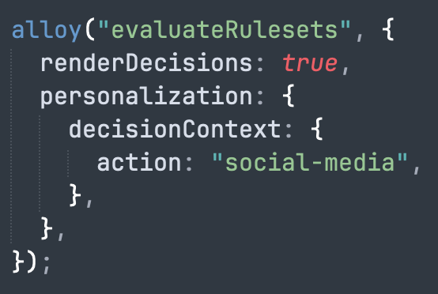

# Configuration de la prise en charge des cartes de contenu dans le SDK Web {#content-card-configuration-sdk}

Cet exemple explique comment récupérer les cartes de contenu de Adobe Journey Optimizer (AJO) à l’aide de Adobe Experience Platform. En utilisant le [SDK Web de Adobe Experience Platform](https://experienceleague.adobe.com/en/docs/experience-platform/web-sdk/home), le contenu de personnalisation est récupéré et rendu entièrement du côté client.

Lors du chargement initial de la page, la page affiche son état par défaut. Cependant, si vous interagissez avec les boutons **Dépôt de fonds** ou **Partager sur les médias sociaux**, d’autres cartes de contenu s’affichent. Ces cartes sont déclenchées par des conditions côté client, en veillant à ce qu’elles ne s’affichent que lorsque des actions spécifiques sont effectuées.


## Exécution de l’exemple {#run-sample}

>[!PREREQUISITES]
>
>Vous devez installer node et npm. [Reportez-vous à cette documentation](https://docs.npmjs.com/downloading-and-installing-node-js-and-npm)


1. Configurez des certificats SSL locaux pour HTTPS. Ces exemples nécessitent des certificats SSL signés localement pour diffuser du contenu via HTTPS :

   1. Installez `mkcert` sur votre ordinateur.

   1. Après l’installation, exécutez `mkcert -install` pour installer le certificat `mkcert root`.

1. Cloner le référentiel sur votre ordinateur local.

1. Ouvrez un terminal et accédez au dossier de l’exemple.

1. Installez les dépendances requises en exécutant `npm install`.

1. Démarrez l’application en exécutant `npm start`.

1. Ouvrez votre navigateur web et accédez à `https://localhost`.

## Fonctionnement {#setup}

1. Insérez et configurez le [SDK Web](https://experienceleague.adobe.com/en/docs/experience-platform/web-sdk/home) sur la page à l’aide des paramètres du fichier `.env` dans l’exemple de dossier.

   ```
   <script src="https://cdn1.adoberesources.net/alloy/2.18.0/alloy.min.js" async></script>
   alloy("configure", {
       defaultConsent: "in",
       edgeDomain: "{{edgeDomain}}",
       edgeConfigId: "{{edgeConfigId}}",
       orgId:"{{orgId}}",
       debugEnabled: false,
       personalizationStorageEnabled: true,
       thirdPartyCookiesEnabled: false
   });
   ```

1. Utilisez la commande `sendEvent` pour récupérer du contenu personnalisé.

   ```
   alloy("sendEvent", {
       renderDecisions: true,
       personalization: {
           surfaces: ["web://alloy-samples.adobe.com/#content-cards-sample"],
       },
   });
   ```

1. Abonnez-vous aux cartes de contenu pour une surface spécifique à l’aide de la commande `subscribeRulesetItems`. Chaque fois que des jeux de règles sont évalués, gérez l’objet de résultat dans le rappel, qui contiendra `propositions` avec les données de carte de contenu.

   ```
   const contentCardManager = createContentCardManager("content-cards");
   
   alloy("subscribeRulesetItems", {
       surfaces: ["web://alloy-samples.adobe.com/#content-cards-sample"],
       schemas: ["https://ns.adobe.com/personalization/message/content-card"],
       callback: (result, collectEvent) => {
           const { propositions = [] } = result;
           contentCardManager.refresh(propositions, collectEvent);
       },
   });
   ```

1. Gérez le rendu des cartes de contenu et envoyez les événements `interact` et `display` à l’aide de l’objet `contentCardsManager` présent dans `script.js`. Extrayez, triez et traitez les cartes de contenu des propositions reçues.

   ```
   const createContentCard = (proposition, item) => {
       const { data = {}, id } = item;
       const {
           content = {},
           meta = {},
           publishedDate,
           qualifiedDate,
           displayedDate,
       } = data;
   
       return {
           id,
           ...content,
           meta,
           qualifiedDate,
           displayedDate,
           publishedDate,
           getProposition: () => proposition,
       };
   };
   
   const extractContentCards = (propositions) =>
       propositions
           .reduce((allItems, proposition) => {
           const { items = [] } = proposition;
   
           return [
               ...allItems,
               ...items.map((item) => createContentCard(proposition, item)),
           ];
       }, [])
       .sort(
           (a, b) =>
               b.qualifiedDate - a.qualifiedDate || b.publishedDate - a.publishedDate
       );
   
   const contentCards = extractContentCards(propositions);
   ```

1. Effectuez le rendu des cartes de contenu en fonction des détails définis pour chaque campagne. Chaque carte comprend `title`, `body`, `imageUrl` et d’autres valeurs de données personnalisées.

   ```
   const renderContentCards = () => {
       const contentCardsContainer = document.getElementById(containerElementId);
       contentCardsContainer.addEventListener("click", handleContentCardClick);
   
       let contents = "";
   
       contentCards.forEach((card) => {
           const { id, title, body, imageUrl, meta = {} } = card;
           const { buttonLabel = "" } = meta;
   
           contents += `
               <div class="col">
                   <div data-id="${id}" class="card h-100">
                       
                       <div class="card-body d-flex flex-column">
                           <h5 class="card-title">${title}</h5>
                           <p class="card-text">${body}</p>
                           <a href="#" class="mt-auto btn btn-primary">${buttonLabel}</a>
                       </div>
                   </div>
                </div>
            `;
       });
   
       contentCardsContainer.innerHTML = contents;
       collectEvent(
           "display",
           contentCards.map((card) => card.getProposition())
        );
   };
   ```

1. Lorsque le rappel `subscribeRulesetItems` est appelé, une fonction pratique appelée `collectEvent` est également fournie. Cette fonction est utilisée pour envoyer des événements Experience Edge afin d’effectuer le suivi des interactions, des affichages et d’autres actions de l’utilisateur. Dans cet exemple, collectEvent effectue le suivi lorsqu’un utilisateur clique sur une carte de contenu. De plus, si vous cliquez sur le bouton de la carte de contenu, le navigateur est dirigé vers le `actionUrl` spécifié par la campagne.

   ```
   const handleContentCardClick = (evt) => {
       const cardEl = evt.target.closest(".card");
   
       if (!cardEl) {
           return;
       }
   
       const isAnchor = evt.target.nodeName === "A";
       const card = contentCards.find((card) => card.id === cardEl.dataset.id);
   
       if (!card) {
           return;
       }
   
       collectEvent("interact", [card.getProposition()]);
   
       if (isAnchor) {
           evt.preventDefault();
           evt.stopImmediatePropagation();
           const { actionUrl } = card;
           if (actionUrl && actionUrl.length > 0) {
               window.location.href = actionUrl;
           }
       }
   };
   ```

## Principales observations {#key-observations}

### personalizationStorageEnabled

L’option `personalizationStorageEnabled` est définie sur `true` dans la commande `configure`. Cela garantit que les cartes de contenu précédemment qualifiées sont stockées et continuent à être affichées dans toutes les sessions utilisateurs.

### Déclencheurs

Les cartes de contenu prennent en charge les déclencheurs personnalisés évalués côté client. Lorsqu’une règle de déclenchement est respectée, d’autres cartes de contenu s’affichent. Cet exemple utilise quatre campagnes différentes, une pour chaque carte de contenu, toutes partageant la même surface : `web://alloy-samples.adobe.com/#content-cards-sample`. Le tableau ci-dessous décrit les règles de déclenchement pour chaque campagne et la manière de les satisfaire.

<table>
    <tr>
        <th>Règle de déclenchement</th>
        <th>Carte</th>
        <th>Comment satisfaire la règle de déclenchement</th>
    </tr>
    <tr>
        <td>Aucun</td>
        <td></td>
        <td>sendEvent, commande. Aucune règle côté client à satisfaire.</td>
    </tr>
    <tr>
        <td>Aucun</td>
        <td></td>
        <td>sendEvent, commande. Aucune règle côté client à satisfaire.</td>
    </tr>
    <tr>
        <td></td>
        <td></td>
        <td></td>
    </tr>
    <tr>
        <td></td>
        <td></td>
        <td></td>
    </tr>
</table>

La commande `evaluateRulesets` est déclenchée lorsque vous cliquez sur les boutons &quot;Déposer les fonds&quot; et &quot;Partager sur les médias sociaux&quot;. Chaque bouton spécifie le `decisionContext` approprié pour respecter les règles définies pour les campagnes respectives.

```
document.getElementById("action-button-1").addEventListener("click", () => {
    alloy("evaluateRulesets", {
        renderDecisions: true,
        personalization: {
            decisionContext: {
                action: "deposit-funds",
            },
        },
    });
});

document.getElementById("action-button-2").addEventListener("click", () => {
    alloy("evaluateRulesets", {
        renderDecisions: true,
        personalization: {
            decisionContext: {
                action: "social-media",
            },
        },
    });
});
```
