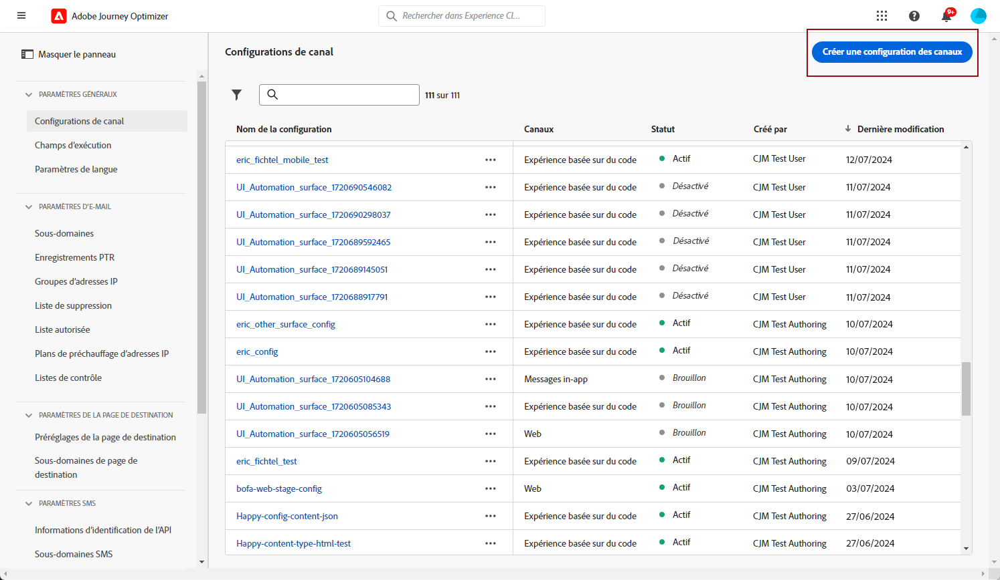
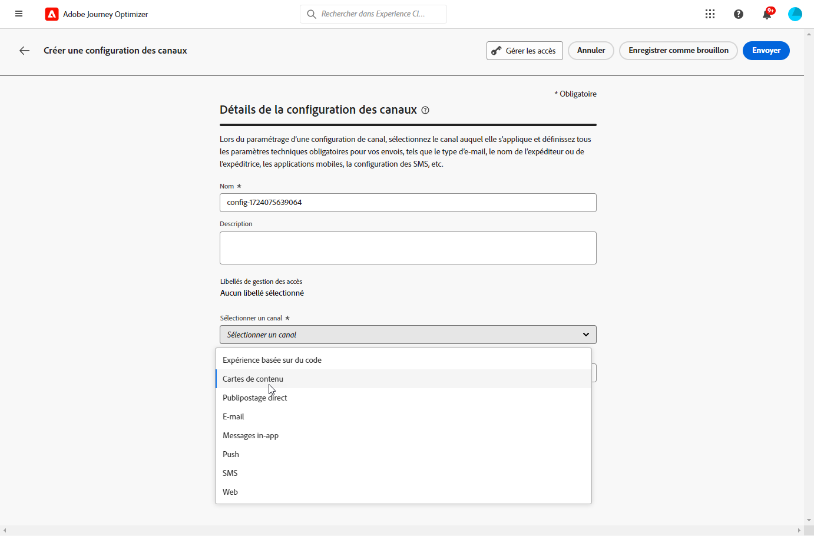
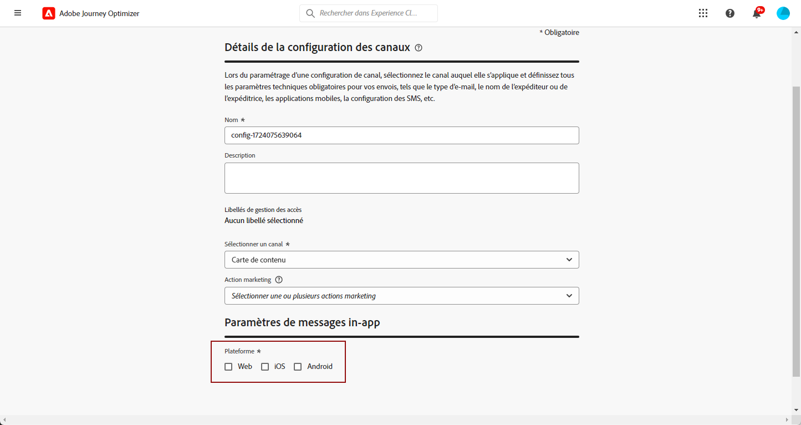

# Configuration des cartes de contenu {#content-card-configuration}

>[!BEGINSHADEBOX]

**Table des matières**

* [Prise en main des cartes de contenu](get-started-content-card.md)
* [Prérequis pour les cartes de contenu](content-card-configuration-prereq.md)
* **Configurer le canal de cartes de contenu**
* [Création de cartes de contenu](create-content-card.md)
* [Concevoir des cartes de contenu](design-content-card.md)
* [Rapport sur les cartes de contenu](content-card-report.md)

>[!ENDSHADEBOX]

## Qu’est-ce qu’une configuration ? {#surface-definition}

Une **configuration d’expérience de carte de contenu** est toute entité conçue pour l’interaction de l’utilisateur ou du système, qui est identifiée de manière unique par un **URI**.

En d’autres termes, une surface peut être vue comme un conteneur à n’importe quel niveau de hiérarchie avec une entité (point de contact) qui existe.

* Il peut s’agir d’une page web, d’une application mobile, d’une appli de bureau, d’un emplacement de contenu spécifique au sein d’une entité plus grande (par exemple, un `div`) ou d’un modèle d’affichage non standard (par exemple, un kiosque ou une bannière d’application de bureau).

* Elle peut également s’étendre à des éléments spécifiques de conteneurs de contenu à des fins de non-affichage ou d’affichage abstrait (par exemple, des objets blob JSON fournis à des services).

* Il peut également s’agir d’une surface de caractères génériques qui correspond à diverses définitions de surface client (par exemple, un emplacement d’image principale sur chaque page de votre site web peut se traduire en un URI de surface comme : web://mondomaine.com/*#image_principale).

Fondamentalement, un URI de surface est composé de plusieurs sections :

1. **Type** : web, application mobile, ATM, kiosque, tvcd, service, etc.
1. **Propriété** : URL de page ou bundle d’applications.
1. **Conteneur** : emplacement sur l’activité page/application.

Les tableaux ci-dessous répertorient quelques exemples de définition d’URI de surface pour divers appareils.

**Web et mobile**

| Type | URI | Description |
| --------- | ----------- | ------- | 
| Web | `web://domain.com/path/page.html#element` | Représente un élément individuel dans une page spécifique d’un domaine spécifique, où un élément peut être un libellé comme dans les exemples suivants : hero_banner, top_nav, menu, pied de page, etc. |
| Application iOS | `mobileapp://com.vendor.bundle/activity#element` | Représente un élément spécifique dans une activité application native, tel qu’un bouton ou un autre élément de vue. |
| Application Android | `mobileapp://com.vendor.bundle/#element` | Représente un élément spécifique dans une application native. |

**Autres types d’appareils**

| Type | URI | Description |
| --------- | ----------- | ------- | 
| Bureau | `desktop://com.vendor.bundle/#element` | Représente un élément spécifique dans une application, tel qu’un bouton, un menu, une bannière principale, etc. |
| Application TV | `tvcd://com.vendor.bundle/#element` | Représente un élément spécifique dans un identifiant de bundle spécifique à l’application d’un appareil connecté à la télévision ou à la télévision intelligente. |
| Service | `service://servicename/#element` | Représente un processus côté serveur ou une autre entité manuelle. |
| Kiosque | `kiosk://location/screen#element` | Exemple de types de surfaces supplémentaires potentiels pouvant être ajoutés facilement. |
| ATM | `atm://location/screen#element` | Exemple de types de surfaces supplémentaires potentiels pouvant être ajoutés facilement. |

**Surfaces de caractères génériques**

| Type | URI | Description |
| --------- | ----------- | ------- | 
| Caractère générique web | `wildcard:web://domain.com/*#element` | Surface de caractères génériques : représente un élément individuel dans chacune des pages sous un domaine spécifique. |
| Caractère générique web | `wildcard:web://*domain.com/*#element` | Surface de caractères génériques : représente un élément individuel dans chacune des pages sous tous les domaines se terminant par « domain.com ». |

## Création d’une configuration de carte de contenu {#create-config}

1. Accédez au menu **[!UICONTROL Canaux]** > **[!UICONTROL Marques]** > **[!UICONTROL Configurations de canaux]** , puis cliquez sur **[!UICONTROL Créer une configuration de canal]**.

   

1. Saisissez un nom et une description (facultatif) pour la configuration.

   >[!NOTE]
   >
   > Les noms doivent commencer par une lettre (A-Z). Ils ne peuvent contenir que des caractères alphanumériques. Vous pouvez également utiliser le trait de soulignement `_`, le point`.` et le trait d&#39;union `-`.

1. Pour attribuer des libellés d’utilisation des données personnalisés ou de base à la configuration, vous pouvez sélectionner **[!UICONTROL Gérer l’accès]**. [En savoir plus sur le contrôle d’accès au niveau de l’objet (OLAC)](../administration/object-based-access.md).

1. Sélectionnez le canal **[!UICONTROL Carte de contenu]**.

   

1. Sélectionnez une **[!UICONTROL Action marketing]** ou plusieurs pour associer des politiques de consentement aux messages utilisant cette configuration. Toutes les politiques de consentement associées à cette action marketing sont utilisées afin de respecter les préférences de vos clientes et clients. [En savoir plus](../action/consent.md#surface-marketing-actions)

1. Sélectionnez la plateforme pour laquelle l’expérience de carte de contenu sera appliquée.

   

1. Pour le web :

   * Spécifiez une **[!UICONTROL URL de page]** pour appliquer les modifications à une seule page uniquement.

   * Ou créez une **[!UICONTROL règle de correspondance de pages]** pour cibler plusieurs URL qui correspondent à la règle spécifiée. Par exemple, cette capacité peut être exploitée pour diffuser des modifications globales, telles que le rafraîchissement de la bannière principale sur chaque page ou l’insertion d’une image principale sur chaque page produit. [En savoir plus](../web/web-configuration.md)

1. Pour iOS et Android :

   * Saisissez ou sélectionnez votre **[!UICONTROL ID d’application]**, **[!UICONTROL Emplacement ou chemin dans l’application]** et **[!UICONTROL URL d’aperçu]**.

1. Soumettez vos modifications.

Vous pouvez maintenant sélectionner votre configuration lors de la création de votre expérience de carte de contenu.

