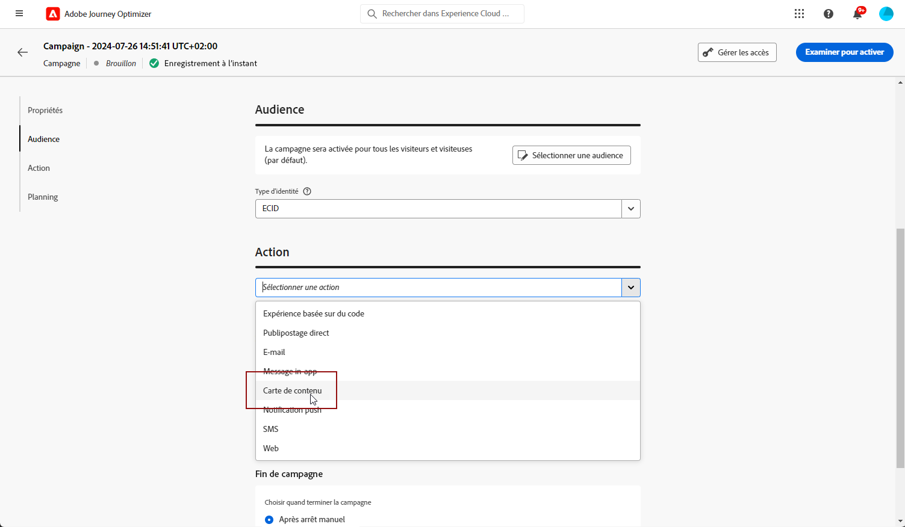

# Créer des cartes de contenu {#create-content-card}

>[!IMPORTANT]
>
>Par défaut, le bouton Fermer masque la carte. Pour ajouter d’autres fonctionnalités, vous pouvez définir manuellement des règles de rejet ou de disqualification.

>[!BEGINTABS]

>[!TAB Ajouter des cartes de contenu à un parcours]

Pour ajouter une carte de contenu à un parcours, procédez comme suit :

1. Ouvrez votre [parcours ](../building-journeys/journey-gs.md), puis effectuez un glisser-déposer d&#39;une activité **[!UICONTROL Action]** depuis la section **[!UICONTROL Actions]** de la palette. En savoir plus sur l’activité [Action](../building-journeys/journey-action.md).

   >[!IMPORTANT]
   >
   >Tous les canaux natifs étant désormais accessibles par le biais de l’activité Action , les activités de canal natives héritées seront abandonnées avec la version de mars. Les parcours existants qui incluent des actions héritées continueront à fonctionner en l’état. Aucune migration n’est requise.

1. Sélectionnez **[!UICONTROL Carte]** comme type d’action.

   

   >[!NOTE]
   >
   >Comme **Carte** est une activité d’expérience entrante, elle est fournie avec une activité de 3 jours **Attente**. [En savoir plus](../building-journeys/wait-activity.md#auto-wait-node)

1. Saisissez un **[!UICONTROL Libellé]** pour identifier votre action dans la zone de travail du parcours.

1. Cliquez sur le bouton **[!UICONTROL Configurer l’action]**.

1. Vous accédez à l’onglet **[!UICONTROL Actions]**. À partir de là, sélectionnez ou créez la configuration de carte de contenu à utiliser. [En savoir plus](content-card-configuration.md)

   

1. Vous pouvez maintenant commencer à concevoir votre contenu à l’aide du bouton **[!UICONTROL Modifier le contenu]**. [En savoir plus](design-content-card.md)

1. Activez l’option **[!UICONTROL Activer des règles de diffusion supplémentaires]**, puis sélectionnez **[!UICONTROL Modifier les règles]** pour définir à quel moment votre message doit être affiché, ignoré ou définitivement masqué.

   

   1. Cliquez sur **[!UICONTROL Ajouter une condition]** pour sélectionner votre événement.

      +++Consultez l’événement disponible.

      | Package | Déclencheur | Définition |
      |---|---|---|
      | Envoyer des données à Platform | Envoi de données à Platform | Déclenché lorsque l’application mobile émet un événement d’expérience Edge pour envoyer des données à Adobe Experience Platform. En règle générale, l’appel API [sendEvent](https://developer.adobe.com/client-sdks/documentation/edge-network/api-reference/#sendevent) à partir de l’extension AEP Edge. |
      | Suivi principal | Suivi de l’action | Déclenché lorsque la fonctionnalité héritée proposée dans l’API de code mobile [trackAction](https://developer.adobe.com/client-sdks/documentation/mobile-core/api-reference/#trackaction) est appelée. |
      | Suivi principal | Suivi de l’état | Déclenché lorsque la fonctionnalité héritée proposée dans l’API de code mobile [trackState](https://developer.adobe.com/client-sdks/documentation/mobile-core/api-reference/#trackstate) est appelée. |
      | Suivi principal | Collecte des PII | Déclenchée lorsque la fonctionnalité héritée proposée dans l’API de code mobile [collectPII](https://developer.adobe.com/client-sdks/documentation/mobile-core/api-reference/#collectpii) est appelée. |
      | Cycle de vie de l’application | Lancement de l’application | Déclenché à chaque exécution, y compris les blocages et les installations. Également déclenché à la mise en premier plan de l’application lorsque le délai d’expiration de la session de cycle de vie a été dépassé. |
      | Cycle de vie de l’application | Installation de l’application | Déclenchée lors de la première exécution après l’installation ou la réinstallation. |
      | Cycle de vie de l’application | Mise à jour de l’application | Déclenchée lors de la première exécution après une mise à niveau ou lorsque le numéro de version change. |
      | Cycle de vie de l’application | Fermeture de l’application | Déclenchée lorsque l’application est fermée. |
      | Cycle de vie de l’application | Crash de l‘application | Déclenché lorsque l’application n’est pas mise en arrière-plan avant sa fermeture. L’événement est envoyé au démarrage de l’application après son crash. La création de rapports de crash d’Adobe Mobile n’implémente pas un gestionnaire global d’exceptions non interceptées. |

      +++

   1. Choisissez la condition **[!UICONTROL Ou]** si vous souhaitez ajouter d’autres **[!UICONTROL Déclencheurs]** pour développer davantage votre règle.

   1. Choisissez la condition **[!UICONTROL Et]** si vous souhaitez ajouter des **[!UICONTROL caractéristiques]** et mieux affiner votre règle.

      +++Consultez les caractéristiques disponibles.

      | Package | Caractéristiques | Définition |
      |---|---|---|
      | Informations sur l’appareil | Nom de l’opérateur | Déclenché lorsque l’un des noms de l’opérateur de la liste est rencontré. |
      | Informations sur l’appareil | Nom de l’appareil | Déclenché lorsque l’un des noms d’appareil est rencontré. |
      | Informations sur l’appareil | Paramètres régionaux | Déclenché lorsque l’une des langues de la liste est rencontrée. |
      | Informations sur l’appareil | Version du système d’exploitation | Déclenché lorsque l’une des versions de système d’exploitation spécifiées est rencontrée. |
      | Informations sur l’appareil | Version précédente du système d’exploitation | Déclenché lorsque l’une des versions précédentes de système d’exploitation spécifiées est rencontrée. |
      | Informations sur l’appareil | Mode d’exécution | Déclenché si le mode d’exécution est une application ou une extension. |
      | Cycle de vie de l’application | ID d’application | Déclenché lorsque l’ID d’application spécifié est rencontré. |
      | Cycle de vie de l’application | Jour de la semaine | Déclenché lorsque le jour de la semaine spécifié est atteint. |
      | Cycle de vie de l’application | Jours depuis la première utilisation | Déclenché lorsque le nombre spécifié de jours depuis la première utilisation est atteint. |
      | Cycle de vie de l’application | Jours depuis la dernière utilisation | Déclenché lorsque le nombre spécifié de jours depuis la dernière utilisation est atteint. |
      | Cycle de vie de l’application | Jours depuis la mise à niveau | Déclenché lorsque le nombre spécifié de jours depuis la dernière mise à niveau est atteint. |
      | Cycle de vie de l’application | Date d’installation | Déclenché lorsque la date d’installation spécifiée est atteinte. |
      | Cycle de vie de l’application | Lancements | Déclenché lorsque le nombre spécifié de lancements est atteint. |
      | Cycle de vie de l’application | Heure | Déclenché lorsque l’heure spécifiée du jour est atteinte. |

      +++

   1. Cliquez sur **[!UICONTROL Créer un groupe]** pour regrouper les déclencheurs.

1. Vous pouvez ajouter une ou plusieurs actions entrantes à votre carte de contenu en cliquant sur le bouton **[!UICONTROL Ajouter une action]**. [En savoir plus](../building-journeys/journey-action.md#multi-action)

1. Revenez à la zone de travail parcours. Si nécessaire, complétez votre flux de parcours en faisant glisser et en déposant des actions ou des événements supplémentaires. [En savoir plus](../building-journeys/about-journey-activities.md)

Pour plus d’informations sur la création, la configuration et la publication d’un parcours, consultez [cette page](../building-journeys/journey-gs.md).

>[!TAB Ajouter des cartes de contenu à une campagne]

Pour commencer à créer vos cartes de contenu par le biais d’une campagne, suivez les étapes ci-dessous.

1. Création d’une campagne. [En savoir plus](../campaigns/create-campaign.md)

1. Sélectionner le type de campagne que vous souhaitez exécuter.

   * **[!UICONTROL Scheduled - Marketing]** : permet d’exécuter la campagne immédiatement ou à une date spécifiée. Les campagnes planifiées visent à envoyer des messages de **marketing**. Elles sont configurées et exécutées à partir de l’interface d’utilisation.

   * **[!UICONTROL Déclenchée par API - Marketing/Transactionnelle]** : permet d’exécuter la campagne à l’aide d’un appel API. Les campagnes déclenchées par API sont destinées à envoyer des messages **marketing**, ou **transactionnels**, c’est-à-dire des messages envoyés suite à une action effectuée par une personne : réinitialisation du mot de passe, abandon de panier, etc. [Découvrir comment déclencher une campagne à l’aide d’API](../campaigns/api-triggered-campaigns.md)

   

1. Dans la section **[!UICONTROL Propriétés]**, indiquez un nom et une description pour la campagne.

1. Dans la section **Audience**, cliquez sur le bouton **[!UICONTROL Sélectionner une audience]** pour afficher la liste des audiences Adobe Experience Platform disponibles. [En savoir plus sur les audiences](../audience/about-audiences.md).

1. Dans le champ **[!UICONTROL Espace de noms d’identité]**, choisissez l’espace de noms à utiliser pour identifier les personnes à partir du segment sélectionné. [En savoir plus sur les espaces de noms](../event/about-creating.md#select-the-namespace)

1. Sélectionnez l’action **[!UICONTROL Carte de contenu]**.

   

1. Sélectionnez ou créez une [configuration de carte de contenu](content-card-configuration.md).

1. Pour tester le contenu de votre message, cliquez sur **[!UICONTROL Créer une expérience]**. Vous pouvez ainsi tester plusieurs variables d’une diffusion sur des échantillons de population afin de déterminer quel traitement a le plus d’impact sur l’audience ciblée. [En savoir plus sur l’expérience de contenu](../content-management/content-experiment.md).

1. Activez l’option **[!UICONTROL Activer des règles de diffusion supplémentaires]**, puis sélectionnez **[!UICONTROL Modifier les règles]** pour définir à quel moment votre message doit être affiché, ignoré ou définitivement masqué.

   Utilisez les créateurs de règles pour définir des conditions spécifiques qui déclenchent ces actions.

   1. Cliquez sur **[!UICONTROL Ajouter une condition]** pour sélectionner votre événement.

      +++Consultez l’événement disponible.

      | Package | Déclencheur | Définition |
      |---|---|---|
      | Envoyer des données à Platform | Envoi de données à Platform | Déclenché lorsque l’application mobile émet un événement d’expérience Edge pour envoyer des données à Adobe Experience Platform. En règle générale, l’appel API [sendEvent](https://developer.adobe.com/client-sdks/documentation/edge-network/api-reference/#sendevent) à partir de l’extension AEP Edge. |
      | Suivi principal | Suivi de l’action | Déclenché lorsque la fonctionnalité héritée proposée dans l’API de code mobile [trackAction](https://developer.adobe.com/client-sdks/documentation/mobile-core/api-reference/#trackaction) est appelée. |
      | Suivi principal | Suivi de l’état | Déclenché lorsque la fonctionnalité héritée proposée dans l’API de code mobile [trackState](https://developer.adobe.com/client-sdks/documentation/mobile-core/api-reference/#trackstate) est appelée. |
      | Suivi principal | Collecte des PII | Déclenchée lorsque la fonctionnalité héritée proposée dans l’API de code mobile [collectPII](https://developer.adobe.com/client-sdks/documentation/mobile-core/api-reference/#collectpii) est appelée. |
      | Cycle de vie de l’application | Lancement de l’application | Déclenché à chaque exécution, y compris les blocages et les installations. Également déclenché à la mise en premier plan de l’application lorsque le délai d’expiration de la session de cycle de vie a été dépassé. |
      | Cycle de vie de l’application | Installation de l’application | Déclenchée lors de la première exécution après l’installation ou la réinstallation. |
      | Cycle de vie de l’application | Mise à jour de l’application | Déclenchée lors de la première exécution après une mise à niveau ou lorsque le numéro de version change. |
      | Cycle de vie de l’application | Fermeture de l’application | Déclenchée lorsque l’application est fermée. |
      | Cycle de vie de l’application | Crash de l‘application | Déclenché lorsque l’application n’est pas mise en arrière-plan avant sa fermeture. L’événement est envoyé au démarrage de l’application après son crash. La création de rapports de crash d’Adobe Mobile n’implémente pas un gestionnaire global d’exceptions non interceptées. |

      +++

   1. Choisissez la condition **[!UICONTROL Ou]** si vous souhaitez ajouter d’autres **[!UICONTROL Déclencheurs]** pour développer davantage votre règle.

   1. Choisissez la condition **[!UICONTROL Et]** si vous souhaitez ajouter des **[!UICONTROL caractéristiques]** et mieux affiner votre règle.

      +++Consultez les caractéristiques disponibles.

      | Package | Caractéristiques | Définition |
      |---|---|---|
      | Informations sur l’appareil | Nom de l’opérateur | Déclenché lorsque l’un des noms de l’opérateur de la liste est rencontré. |
      | Informations sur l’appareil | Nom de l’appareil | Déclenché lorsque l’un des noms d’appareil est rencontré. |
      | Informations sur l’appareil | Paramètres régionaux | Déclenché lorsque l’une des langues de la liste est rencontrée. |
      | Informations sur l’appareil | Version du système d’exploitation | Déclenché lorsque l’une des versions de système d’exploitation spécifiées est rencontrée. |
      | Informations sur l’appareil | Version précédente du système d’exploitation | Déclenché lorsque l’une des versions précédentes de système d’exploitation spécifiées est rencontrée. |
      | Informations sur l’appareil | Mode d’exécution | Déclenché si le mode d’exécution est une application ou une extension. |
      | Cycle de vie de l’application | ID d’application | Déclenché lorsque l’ID d’application spécifié est rencontré. |
      | Cycle de vie de l’application | Jour de la semaine | Déclenché lorsque le jour de la semaine spécifié est atteint. |
      | Cycle de vie de l’application | Jours depuis la première utilisation | Déclenché lorsque le nombre spécifié de jours depuis la première utilisation est atteint. |
      | Cycle de vie de l’application | Jours depuis la dernière utilisation | Déclenché lorsque le nombre spécifié de jours depuis la dernière utilisation est atteint. |
      | Cycle de vie de l’application | Jours depuis la mise à niveau | Déclenché lorsque le nombre spécifié de jours depuis la dernière mise à niveau est atteint. |
      | Cycle de vie de l’application | Date d’installation | Déclenché lorsque la date d’installation spécifiée est atteinte. |
      | Cycle de vie de l’application | Lancements | Déclenché lorsque le nombre spécifié de lancements est atteint. |
      | Cycle de vie de l’application | Heure | Déclenché lorsque l’heure spécifiée du jour est atteinte. |

      +++

   1. Cliquez sur **[!UICONTROL Créer un groupe]** pour regrouper les déclencheurs.

   

1. Vous pouvez planifier vos campagnes à une date spécifique ou à intervalles réguliers. [En savoir plus](../campaigns/create-campaign.md#schedule)

1. Vous pouvez maintenant commencer à concevoir votre contenu à l’aide du bouton **[!UICONTROL Modifier le contenu]**. [En savoir plus](design-content-card.md)

   

>[!ENDTABS]
