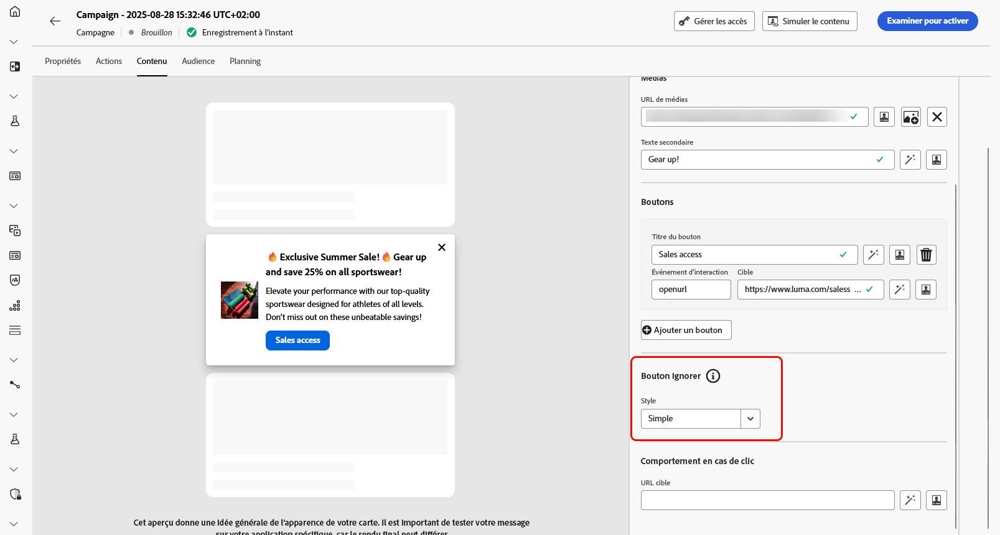
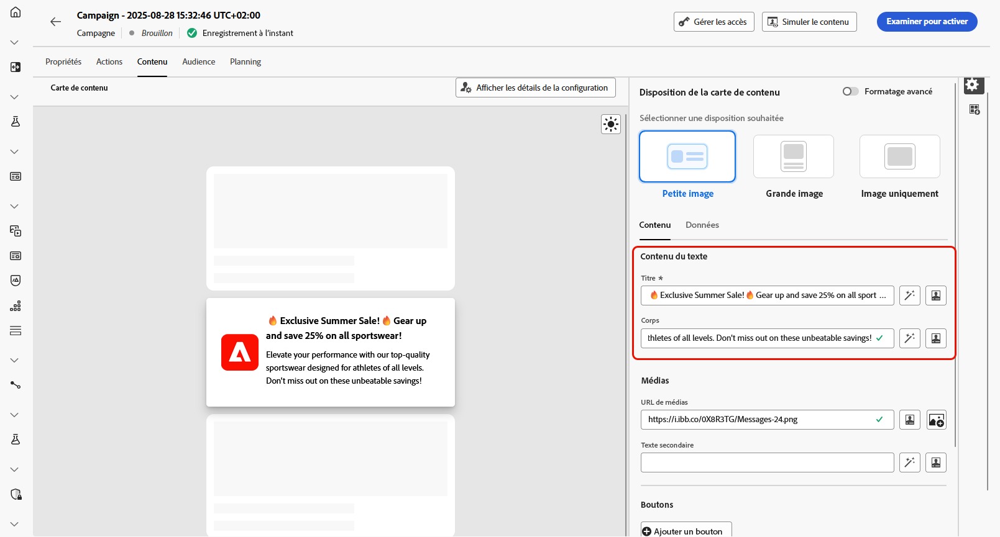
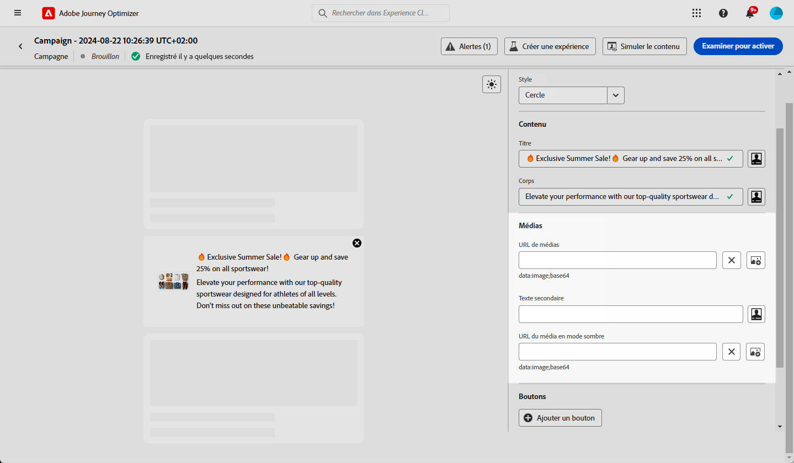
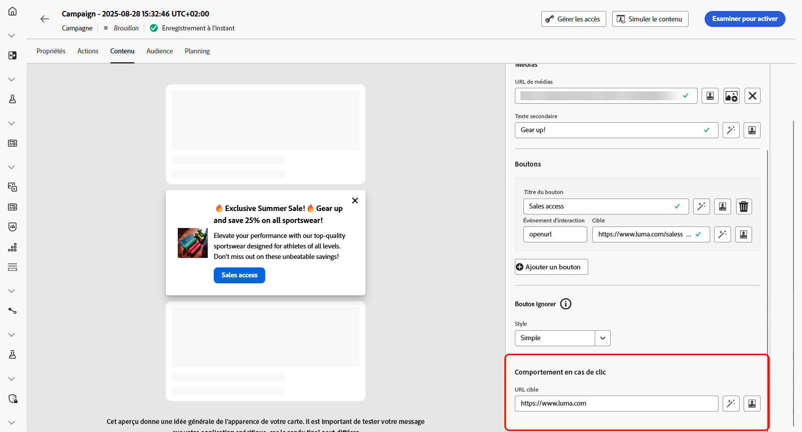
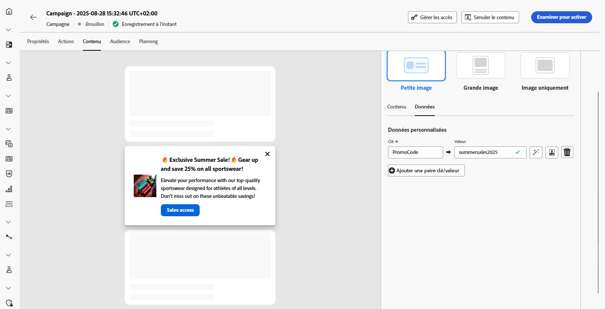

# Concevoir le contenu des cartes de contenu {#design-content-card}

Le concept de création de cartes offre une expérience de création basée sur des formulaires qui fournit aux marketeurs des entrées de base qui peuvent être utilisées pour le rendu par le développeur.

Une fois votre contenu défini et personnalisé, vous pouvez le consulter et l’activer. Votre campagne sera envoyée selon le planning défini. [En savoir plus dans cette page](../campaigns/review-activate-campaign.md).

## Onglet Contenu {#content-tab}

Dans l&#39;onglet **[!UICONTROL Contenu]** , vous pouvez personnaliser vos cartes de contenu en définissant à la fois leur contenu et la conception du bouton **[!UICONTROL Fermer]** . De plus, vous pouvez améliorer votre contenu avec les médias et ajouter des boutons d’action directement à partir de cet onglet.

### Bouton Fermer {#close-button}

Sélectionnez le **[!UICONTROL Style]** de votre **[!UICONTROL bouton Fermer]** pour personnaliser son aspect.

Vous pouvez sélectionner l’un des styles suivants :

* **[!UICONTROL None]**
* **[!UICONTROL Simple]**
* **[!UICONTROL Cercle]**

### Contenu {#title-body}

Pour composer votre message, saisissez votre texte dans les champs **[!UICONTROL Titre]** et **[!UICONTROL Corps]** .

Si vous souhaitez personnaliser davantage votre message, utilisez l’icône **[!UICONTROL Personalization]** pour ajouter des éléments personnalisés. Pour obtenir des instructions détaillées sur l&#39;utilisation des fonctionnalités de personnalisation, reportez-vous à [cette section](../personalization/personalize.md).

<!--
+++More options with advanced formatting

If the **[!UICONTROL Advanced formatting mode]** is switched on, you can choose for your **[!UICONTROL Header]** and **[!UICONTROL Body]**:

* the **[!UICONTROL Font]**
* the **[!UICONTROL Pt size]**
* the **[!UICONTROL Font Color]**
* the **[!UICONTROL Alignment]**
+++
-->

### Média {#add-media}

Le champ **[!UICONTROL Média]** vous permet d’améliorer vos cartes de contenu en ajoutant des supports, ce qui peut rendre votre présentation plus attrayante pour les utilisateurs finaux.

Pour inclure un média, saisissez l’URL du média à utiliser ou cliquez sur l’icône **[!UICONTROL Sélectionner Assets]** pour choisir parmi les ressources stockées dans votre bibliothèque Assets. [En savoir plus sur la gestion des ressources](../content-management/assets.md).

<!--
+++More options with advanced formatting

If the **[!UICONTROL Advanced formatting mode]** is switched on, you can add an **[!UICONTROL Alternative text]** for screen reading applications and another asset in the **[!UICONTROL Dark Mode Media URL]** field.

+++
-->

### Boutons {#add-buttons}

Ajoutez des boutons pour que les utilisateurs puissent interagir avec vos cartes de contenu.

1. Cliquez sur **[!UICONTROL Ajouter un bouton]** pour créer un bouton d’action.

1. Editez le champ **[!UICONTROL Titre]** du bouton pour spécifier le libellé qui s&#39;affichera sur le bouton.

1. Sélectionnez un **[!UICONTROL événement Interact]** pour définir l’action qui sera déclenchée lorsque les utilisateurs cliqueront ou interagiront avec le bouton.

1. Dans le champ **[!UICONTROL Target]** , saisissez l’URL web ou le lien profond vers lequel les utilisateurs seront redirigés après avoir interagi avec le bouton.

<!--
+++More options with advanced formatting

If the **[!UICONTROL Advanced formatting mode]** is switched on, you can choose for your **[!UICONTROL Buttons]**:

* the **[!UICONTROL Font]**
* the **[!UICONTROL Pt size]**
* the **[!UICONTROL Font Color]**
* the **[!UICONTROL Alignment]**

+++
-->

### Comportement en cas de clic

Dans le champ **[!UICONTROL URL cible]** , saisissez l’URL web ou le lien profond qui redirigera les utilisateurs vers la destination souhaitée une fois qu’ils auront interagi avec votre carte de contenu. Il peut s’agir d’un site web externe, d’une page spécifique au sein de l’application ou de tout autre emplacement sur lequel vous souhaitez que les utilisateurs soient amenés en fonction de leur interaction.

## Onglet Données

## Données personnalisées {#custom-data}

Dans la section **[!UICONTROL Données personnalisées]** , cliquez sur **[!UICONTROL Ajouter une paire clé/valeur]** pour inclure des variables personnalisées dans la payload. Ces paires clé/valeur vous permettent de transmettre des données supplémentaires, selon votre configuration spécifique. Vous pouvez ainsi ajouter du contenu personnalisé ou dynamique, des informations de suivi ou toute autre donnée pertinente pour votre configuration.
