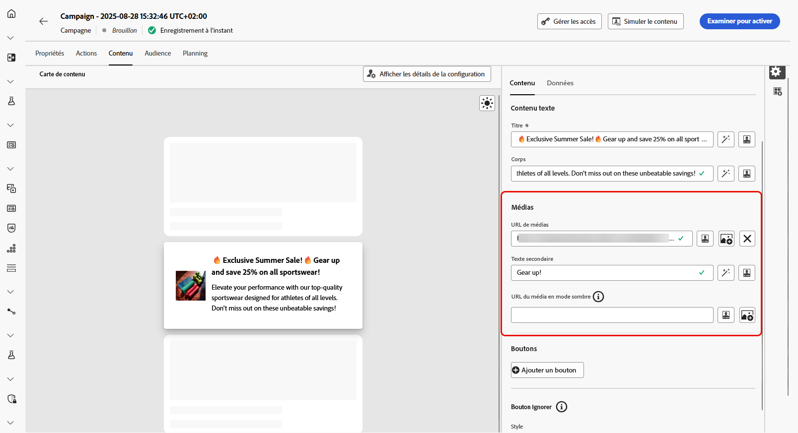

# Concevoir le contenu des cartes de contenu {#design-content-card}

Le concept de création de cartes offre une expérience de création basée sur des formulaires qui fournit aux responsables marketing des entrées de base qui peuvent être utilisées pour le rendu par l’équipe de développement.

Une fois votre contenu défini et personnalisé, vous pouvez le consulter et l’activer. Votre campagne sera envoyée selon le planning défini. [En savoir plus dans cette page](../campaigns/review-activate-campaign.md).

## Disposition de la carte de contenu

Dans la section **[!UICONTROL Disposition de la carte de contenu]**, choisissez l’une des trois options de disposition d’image en fonction de vos besoins en matière de messages.

* **[!UICONTROL Petite image]** : affiche une image compacte à côté du texte. Idéale pour les messages dont le contenu est plus important que les visuels.

  Pour en savoir plus, consultez la documentation Adobe Developer [pour iOS](https://developer.adobe.com/client-sdks/edge/adobe-journey-optimizer/content-card-ui/iOS/templates/smallimage-template/) et [pour Android](https://developer.adobe.com/client-sdks/edge/adobe-journey-optimizer/content-card-ui/Android/public-classes/state/smallimagecarduistate/).

* **[!UICONTROL Grande image]** : présente une image bien en vue au-dessus ou à côté du texte, ce qui fait des visuels l’élement central de votre message.

  Pour en savoir plus, consultez la documentation Adobe Developer [pour iOS](https://developer.adobe.com/client-sdks/edge/adobe-journey-optimizer/content-card-ui/iOS/templates/largeimage-template/) et [pour Android](https://developer.adobe.com/client-sdks/edge/adobe-journey-optimizer/content-card-ui/Android/public-classes/state/largeimagecarduistate/).

* **[!UICONTROL Image seule]** : affiche l’image sans texte d’accompagnement. Idéale pour les messages visuels ou les images isolées.

  Pour en savoir plus, consultez la documentation Adobe Developer [pour iOS](https://developer.adobe.com/client-sdks/edge/adobe-journey-optimizer/content-card-ui/iOS/templates/imageonly-template/) et [pour Android](https://developer.adobe.com/client-sdks/edge/adobe-journey-optimizer/content-card-ui/Android/public-classes/state/imageonlycarduistate/).

## Onglet Contenu {#content-tab}

Dans l’onglet **[!UICONTROL Contenu]**, vous pouvez personnaliser vos cartes de contenu en définissant le contenu et en ajoutant des médias et des boutons d’action directement à partir de cet onglet.

### Contenu textuel {#title-body}

Pour composer votre message, saisissez votre texte dans les champs **[!UICONTROL Titre]** et **[!UICONTROL Corps]**.

Si vous souhaitez personnaliser davantage votre message, utilisez l’icône **[!UICONTROL Personalisation]** pour ajouter des éléments personnalisés. Pour plus d’informations sur l’utilisation des fonctionnalités de personnalisation, consultez [cette section](../personalization/personalize.md).

### Média {#add-media}

Le champ **[!UICONTROL Média]** vous permet d’améliorer vos cartes de contenu en ajoutant des médias, ce qui peut renforcer l’engagement de votre présentation pour les utilisateurs et utilisatrices finaux.

Pour inclure un média, saisissez l’URL du média à utiliser ou cliquez sur l’icône **[!UICONTROL Sélectionner des ressources]** pour choisir parmi les ressources stockées dans votre bibliothèque de ressources. [En savoir plus sur la gestion des ressources](../integrations/assets.md).

+++Plus d’options avec le formatage avancé

Si le **[!UICONTROL mode Formatage avancé]** est activé, vous pouvez ajouter un **[!UICONTROL texte secondaire]** pour les applications de lecture d’écran et une autre ressource dans le champ **[!UICONTROL URL du média en mode sombre]**.

+++

### Boutons {#add-buttons}

Ajoutez des boutons pour que les utilisateurs et utilisatrices puissent interagir avec vos cartes de contenu.

1. Cliquez sur **[!UICONTROL Ajouter un bouton]** pour créer un bouton d’action.

1. Modifiez le champ **[!UICONTROL Titre]** du bouton pour spécifier le libellé qui s’affichera sur le bouton.

1. Sélectionnez un **[!UICONTROL événement d’interaction]** pour définir l’action qui sera déclenchée lorsque les utilisateurs et utilisatrices cliqueront ou interagiront avec le bouton.

1. Dans le champ **[!UICONTROL Cible]**, saisissez l’URL web ou le lien profond vers lequel les utilisateurs et utilisatrices seront redirigés après avoir interagi avec le bouton.

<!--
+++More options with advanced formatting

If the **[!UICONTROL Advanced formatting mode]** is switched on, you can choose for your **[!UICONTROL Buttons]**:

* the **[!UICONTROL Font]**
* the **[!UICONTROL Pt size]**
* the **[!UICONTROL Font Color]**
* the **[!UICONTROL Alignment]**

+++
-->

### Bouton Ignorer {#close-button}

Sélectionnez le **[!UICONTROL style]** de votre **[!UICONTROL bouton Ignorer]** pour personnaliser son aspect.

Vous avez le choix parmi les styles suivants :

* **[!UICONTROL Aucun]**
* **[!UICONTROL Simple]**
* **[!UICONTROL Cercle]**

<!--
+++More options with advanced formatting

If the **[!UICONTROL Advanced formatting mode]** is switched on, you can choose for your **[!UICONTROL Header]** and **[!UICONTROL Body]**:

* the **[!UICONTROL Font]**
* the **[!UICONTROL Pt size]**
* the **[!UICONTROL Font Color]**
* the **[!UICONTROL Alignment]**
+++
-->

### Comportement en cas de clic

Dans le champ **[!UICONTROL URL cible]**, saisissez l’URL web ou le lien profond qui redirigera les personnes vers la destination souhaitée une fois qu’elles auront interagi avec votre carte de contenu. Il peut s’agir d’un site web externe, d’une page spécifique au sein de l’application ou de tout autre emplacement vers lequel vous souhaitez que les personnes soient redirigées en fonction de leur interaction.

## Onglet Données

## Données personnalisées {#custom-data}

Dans la section **[!UICONTROL Données personnalisées]**, cliquez sur **[!UICONTROL Ajouter une paire clé/valeur]** pour inclure des variables personnalisées dans le payload. Ces paires clé/valeur vous permettent de transmettre des données supplémentaires, selon votre configuration spécifique. Vous pouvez ainsi ajouter du contenu personnalisé ou dynamique, des informations de suivi ou toute autre donnée pertinente pour votre configuration.
