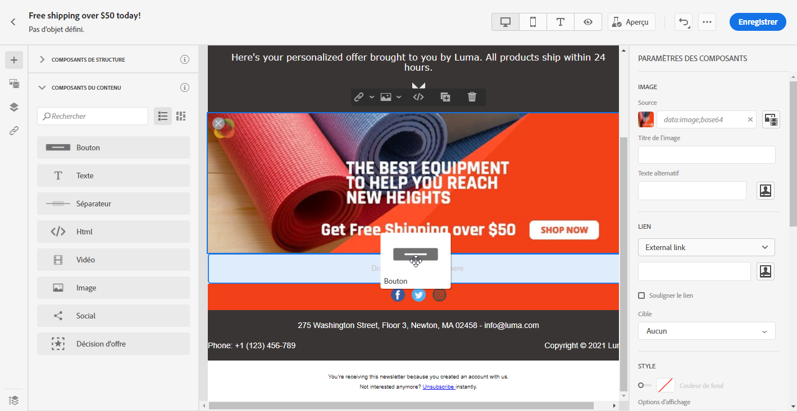
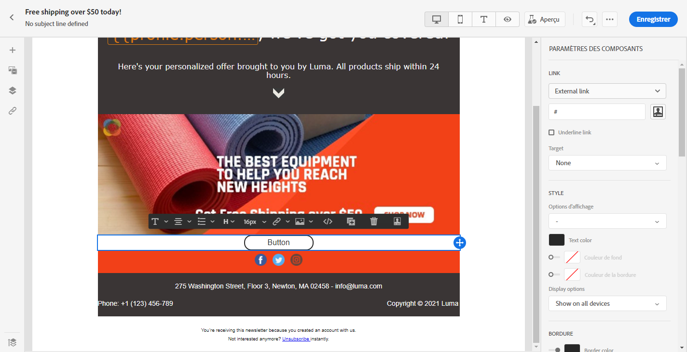
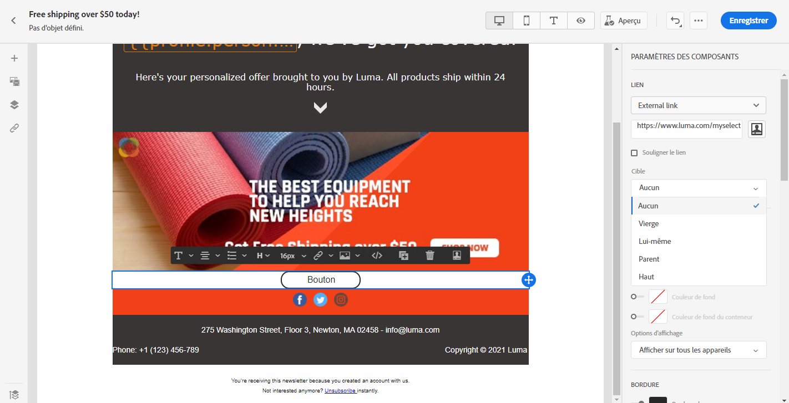
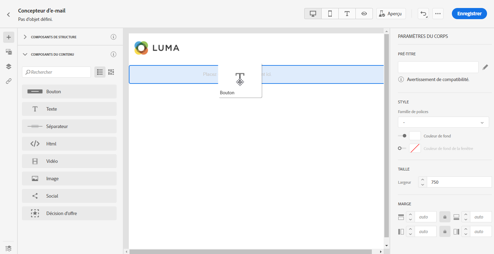
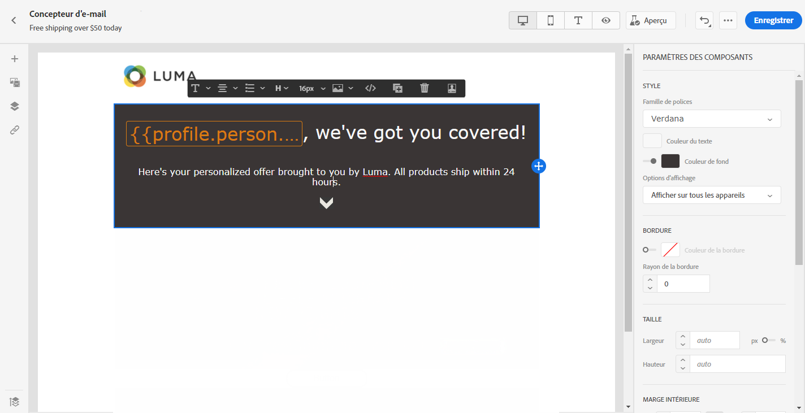
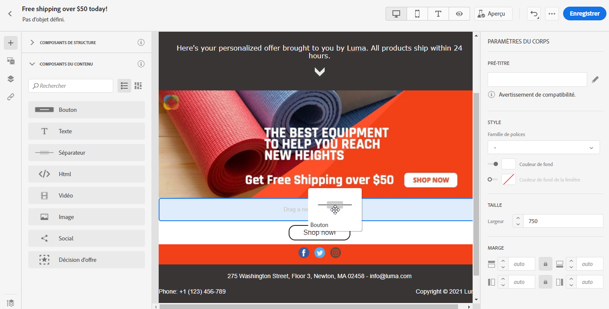
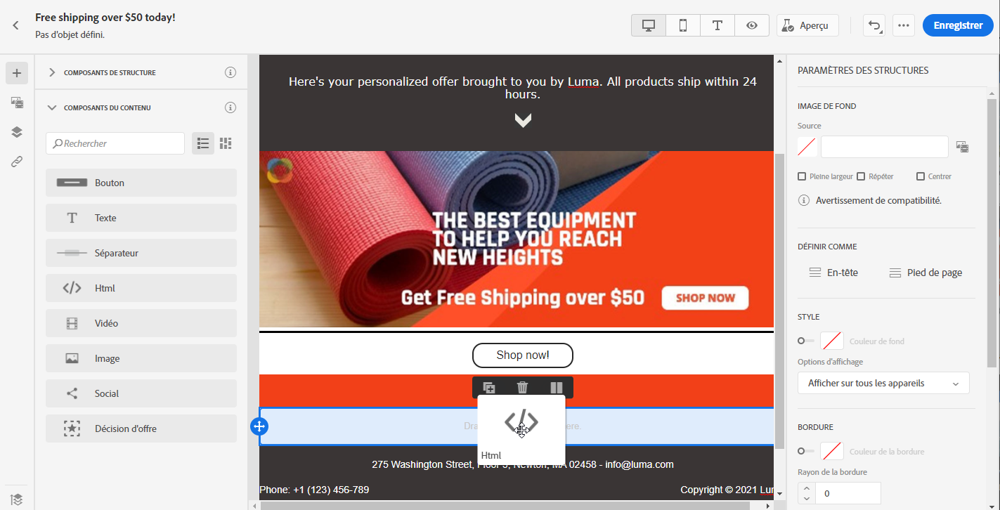
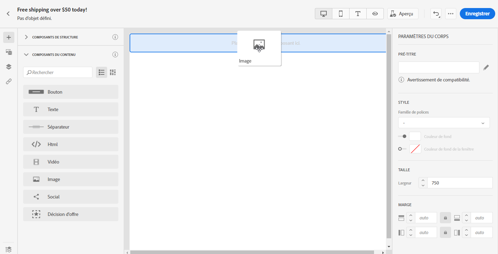
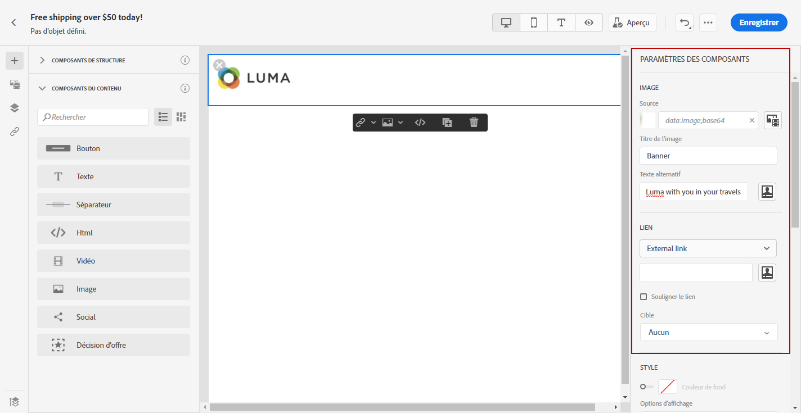
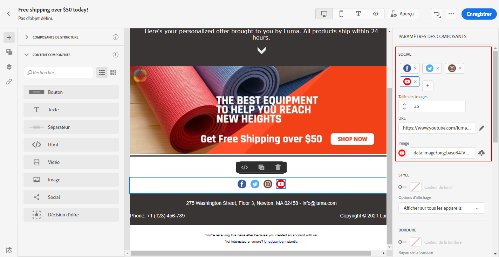

# Utiliser les composants de contenu du concepteur de courrier électronique {#content-components}

>[!CONTEXTUALHELP]
>id="ac_content_components"
>title="À propos des composants de contenu"
>abstract="Les composants de contenu sont des espaces réservés au contenu vide que vous pouvez utiliser pour créer la mise en page d’un courrier électronique."

Lorsque vous créez à partir de zéro votre contenu de courrier électronique, **[!UICONTROL Les composants de contenu]** vous permettent de personnaliser davantage votre courrier électronique à l’aide de composants bruts et vides que vous pouvez utiliser une fois placé dans un courrier électronique.
Vous pouvez ajouter autant de **[!UICONTROL composants de contenu]** que nécessaire dans un composant **[!UICONTROL Structure]** qui définit la disposition de votre courrier électronique.

## Bouton {#buttons}

Utilisez le composant **[!UICONTROL Bouton]** pour insérer plusieurs boutons dans votre courrier électronique et rediriger votre audience électronique vers une autre page.

1. À partir de **[!UICONTROL Composants de contenu]**, faites glisser **[!UICONTROL Bouton]** dans un composant de structure ****.

   

1. Cliquez sur votre nouveau bouton pour personnaliser le texte et accéder aux **[!UICONTROL Paramètres des composants]** dans le volet droit du concepteur de courrier électronique.

   

1. Dans le champ **[!UICONTROL Lien]** des **[!UICONTROL Paramètres des composants]**, ajoutez l’URL à laquelle vous souhaitez que votre audience soit redirigée lorsque vous cliquez sur le bouton.

1. Choisissez comment votre audience sera redirigée avec la liste déroulante **[!UICONTROL Cible]** :

   * **[!UICONTROL Aucun]** : ouvre le lien dans le même cadre que celui sur lequel l’utilisateur a cliqué (par défaut).
   * **[!UICONTROL Vierge]** : ouvre le lien dans une nouvelle fenêtre ou un nouvel onglet.
   * **[!UICONTROL Self]** : ouvre le lien dans le même cadre que celui sur lequel l’utilisateur a cliqué.
   * **[!UICONTROL Parent]** : ouvre le lien dans le cadre parent.
   * **[!UICONTROL Haut]** : ouvre le lien dans le corps complet de la fenêtre.

   

1. Vous pouvez désormais personnaliser davantage votre bouton en modifiant, par exemple, **[!UICONTROL Style]**, **[!UICONTROL Marge]** et **[!UICONTROL Bordure]**.

## Texte {#text}

Utilisez le composant **[!UICONTROL Texte]** pour insérer du texte dans votre courrier électronique. Vous pouvez ajuster la couleur, le style et la taille de votre texte dans **[!UICONTROL Paramètres des composants]**.

1. Dans **[!UICONTROL Composants de contenu]**, faites glisser **[!UICONTROL Texte]** dans un composant **[!UICONTROL Structure]**.

   

1. Cliquez sur votre nouveau composant ajouté pour personnaliser le texte et accéder aux **[!UICONTROL Paramètres des composants]** dans le volet droit du concepteur de courrier électronique.

1. Modifiez votre texte à l’aide des options suivantes disponibles dans la barre d’outils :

   

   * **[!UICONTROL Modifier le style]** de texte : appliquez des caractères gras, italiques, soulignés ou barré à votre texte.
   * **Modifier l&#39;alignement** : choisissez entre l’alignement à gauche, à droite, centré ou justifié pour votre texte.
   * **[!UICONTROL Créer une liste]** : ajoutez une puce ou une liste numérique à votre texte.
   * **[!UICONTROL Définir le titre]** : ajouter jusqu&#39;à six niveaux d&#39;en-tête à votre texte.
   * **Taille** de police : sélectionnez la taille de police de votre texte en pixels.
   * **[!UICONTROL Modifier l&#39;image]** : ajoutez une image ou un fichier à votre composant de texte. [En savoir plus sur la gestion](assets-essentials.md) des ressources.
   * **[!UICONTROL Afficher le code]** source : affiche le code source de votre texte. Il ne peut pas être modifié.
   * **[!UICONTROL Duplicata]** : ajoutez une copie de votre composant de texte.
   * **[!UICONTROL Supprimer]** : supprimez le composant de texte sélectionné de votre courrier électronique.
   * **[!UICONTROL Personnalisation]** des Ajoutes : ajoutez des champs de personnalisation pour personnaliser le contenu à partir des données de vos profils. [En savoir plus sur la personnalisation](personalization/personalize.md) du contenu.

1. Pour une meilleure expérience utilisateur, vous pouvez ajouter des champs de personnalisation à votre audience. Pour plus d’informations à ce sujet, consultez cette [section](personalization/personalize.md).

1. Réglez la **[!UICONTROL couleur du texte]**, **[!UICONTROL famille de polices]** et **[!UICONTROL taille]** dans les **[!UICONTROL paramètres des composants]**.

   

## Diviseur {#divider}

Utilisez le composant **[!UICONTROL Divider]** pour insérer une ligne de séparation afin d’organiser la disposition et le contenu de votre courrier électronique.
Vous pouvez sélectionner la couleur, le style et la taille de la ligne de rupture dans **[!UICONTROL Paramètres des composants]**.

## HTML {#HTML}

Utilisez **[!UICONTROL HTML]** pour copier-coller les différentes parties de votre code HTML existant. Cela vous permet de créer des composants HTML modulaires gratuits.

Pour simplement rendre un contenu externe compatible avec le Concepteur de courriers électroniques, l’Adobe recommande de créer un message de toutes pièces et de copier le contenu de votre courrier électronique existant dans les composants.

1. Dans **[!UICONTROL Composants de contenu]**, faites glisser **[!UICONTROL HTML]** dans un composant **[!UICONTROL Structure]**.

   

1. Cliquez sur votre nouveau composant ajouté, puis **[!UICONTROL Afficher le code source]** pour ajouter votre code HTML.

   

1. Copiez-collez le code HTML à ajouter à votre adresse électronique et cliquez sur **[!UICONTROL Enregistrer]**.

   

1. Vous pouvez désormais personnaliser davantage votre code HTML en modifiant le **[!UICONTROL style]**, **[!UICONTROL Margin]** et **[!UICONTROL Bordure]** par exemple ou en ajoutant un lien pour rediriger votre audience vers un autre contenu.

## Image {#image}

Utilisez le composant **[!UICONTROL Image]** pour insérer un fichier image de votre ordinateur dans votre courrier électronique.

1. Dans **[!UICONTROL Composants de contenu]**, faites glisser **[!UICONTROL Image]** dans un composant **[!UICONTROL Structure]**.

   

1. Cliquez sur **[!UICONTROL Parcourir]** pour choisir un fichier image sur votre ordinateur.

   Vous pouvez également cliquer sur **[!UICONTROL Sélecteur de ressources]** pour ajouter un fichier à votre courrier électronique. Pour plus d&#39;informations sur les ressources, consultez cette [section](assets-essentials.md).

1. Cliquez sur le composant que vous venez d&#39;ajouter pour configurer votre **[!UICONTROL Composants du contenu]** et pour accéder aux **[!UICONTROL Paramètres des composants]** dans le volet droit du concepteur de courrier électronique.

1. Configurez vos propriétés d’image :

   * **[!UICONTROL Les]** titres d’image vous permettent de définir un titre pour votre image.
   * **[!UICONTROL Les autres]** textes vous permettent de définir la légende liée à votre image. Cela correspond à l’attribut alt HTML.

   

1. Vous pouvez maintenant personnaliser davantage votre image en modifiant le **[!UICONTROL style]**, **[!UICONTROL Marge]** et **[!UICONTROL Bordure]** par exemple ou en ajoutant un lien pour rediriger votre audience vers un autre contenu.

## Vidéo {#Video}

>[!CONTEXTUALHELP]
>id="ac_edition_video"
>title="Paramètres vidéo"
>abstract="Utilisez ce composant pour insérer une vidéo dans votre email. Notez que les vidéos ne fonctionnent pas sur tous les clients de messagerie. Nous vous conseillons de définir une image de remplacement."
>additional-url="https://www.emailonacid.com/blog/article/email-development/a_how_to_guide_to_embedding_html5_video_in_email/" text="Informations supplémentaires"

Utilisez le composant **[!UICONTROL Vidéo]** pour insérer une vidéo dans votre courrier électronique via un lien URL.

1. Dans **[!UICONTROL Composants de contenu]**, faites glisser **[!UICONTROL Vidéo]** dans un composant **[!UICONTROL Structure]**.

   

1. Cliquez sur le composant que vous venez d&#39;ajouter pour configurer votre **[!UICONTROL Composants du contenu]** et pour accéder aux **[!UICONTROL Paramètres des composants]** dans le volet droit du concepteur de courrier électronique.

1. Dans le champ **[!UICONTROL Lien vidéo]** des **[!UICONTROL Paramètres des composants]**, ajoutez votre URL de vidéo.

   

1. Vous pouvez ajouter une **[!UICONTROL image d’affiche]** à votre vidéo pour spécifier une image à afficher jusqu’à ce que votre audience clique sur le bouton de lecture.

1. Vous pouvez désormais personnaliser davantage votre image en modifiant, par exemple, le **[!UICONTROL style]**, **[!UICONTROL Marge]** et **[!UICONTROL Bordure]**.

## Social {#social}

Utilisez le composant **[!UICONTROL Social]** pour insérer des liens vers des pages de médias sociaux dans votre courrier électronique.

1. Dans **[!UICONTROL Composants de contenu]**, faites glisser **[!UICONTROL Social]** dans un composant **[!UICONTROL Structure]**.

   

1. Cliquez sur le composant que vous venez d&#39;ajouter pour configurer votre **[!UICONTROL Composants du contenu]** et pour accéder aux **[!UICONTROL Paramètres des composants]** dans le volet droit du concepteur de courrier électronique.

1. Dans le champ **[!UICONTROL Social]** des **[!UICONTROL Paramètres des composants]**, sélectionnez le réseau social que vous souhaitez ajouter ou supprimer.

   

1. Sélectionnez la taille de vos icônes dans le champ **[!UICONTROL Taille des images]**.

1. Cliquez sur chacune des icônes de vos réseaux sociaux pour configurer l&#39;**[!UICONTROL URL]** à laquelle votre audience sera redirigée.

   

1. Vous pouvez également modifier les icônes de chacun de vos réseaux sociaux si nécessaire dans le champ **[!UICONTROL Image]**.

1. Vous pouvez désormais personnaliser davantage vos icônes de médias sociaux en modifiant les paramètres **[!UICONTROL Style]**, **[!UICONTROL Marge]** et **[!UICONTROL Bordure]**.

## Décision sur l&#39;Offre {#offer-decision}

Utilisez le composant **[!UICONTROL décision d&#39;Offre]** pour insérer des décisions (précédemment appelées activités d&#39;offre) dans vos messages. Les décisions s’appuient sur la gestion des décisions pour choisir la meilleure offre à fournir à vos clients.

Rubriques connexes :

* [Commencez avec la gestion des](offers/get-started/starting-offer-decisioning.md) décisions.
* [Ajouter des offres personnalisées dans des messages](deliver-personalized-offers.md).

