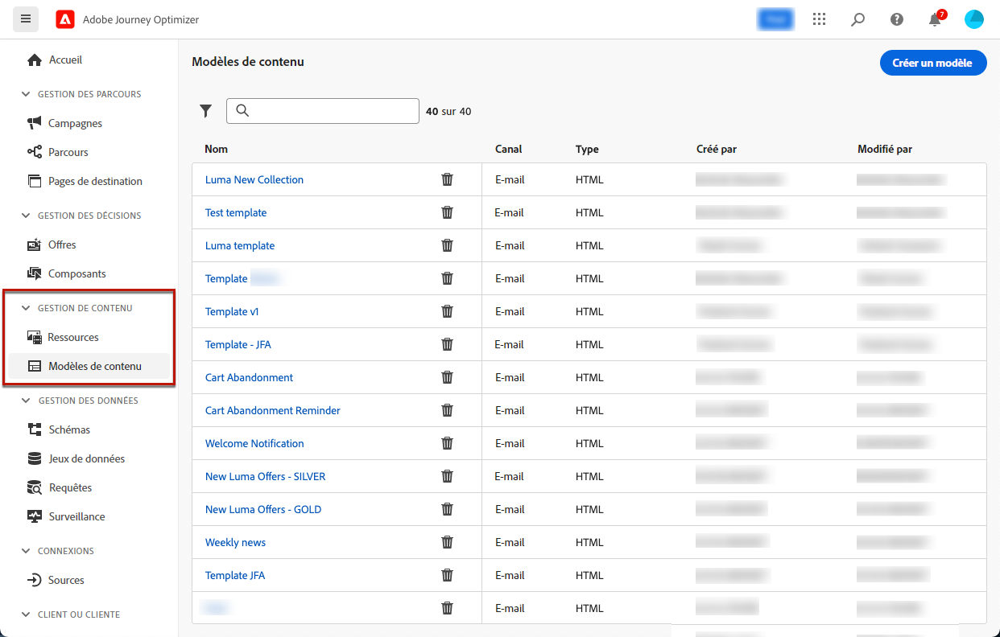
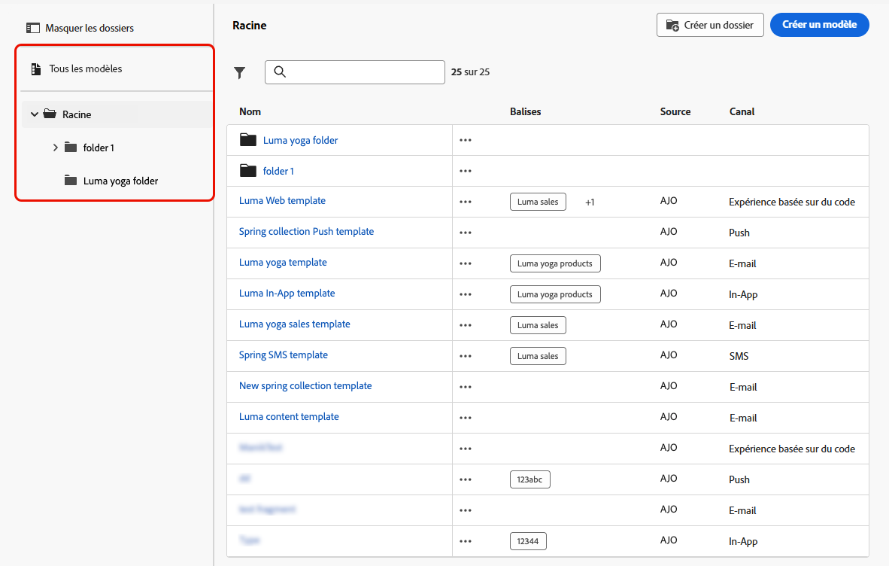
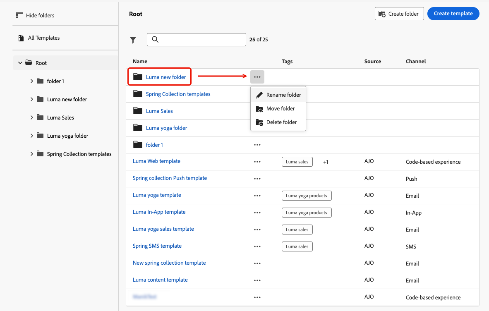
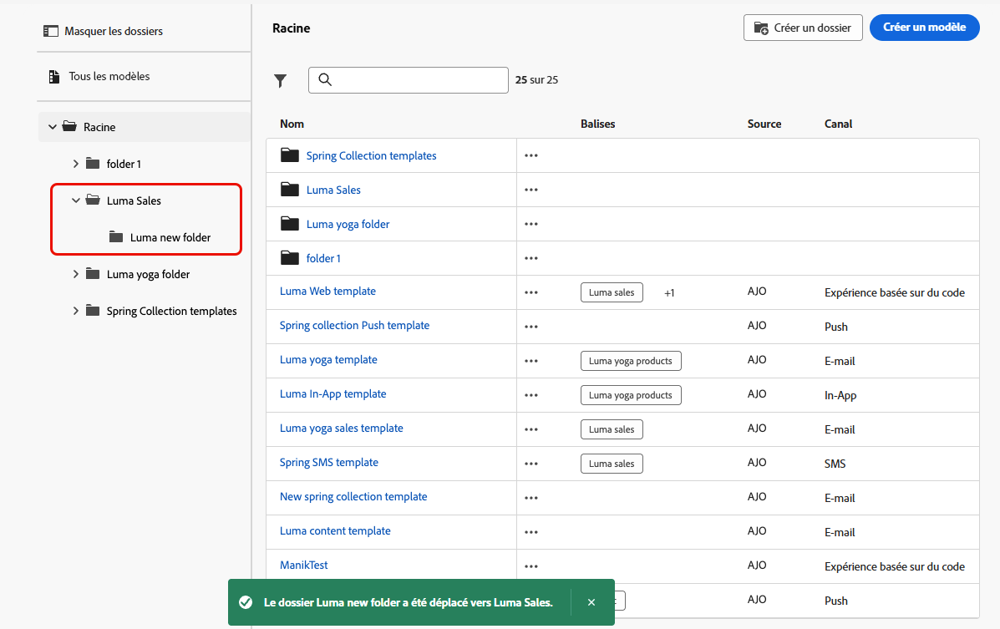
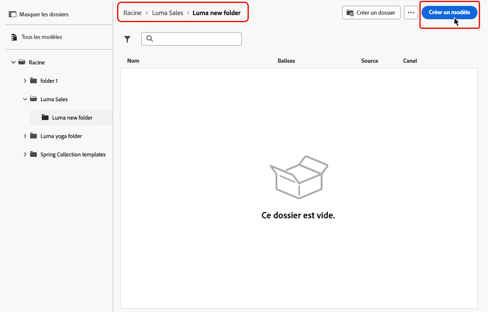
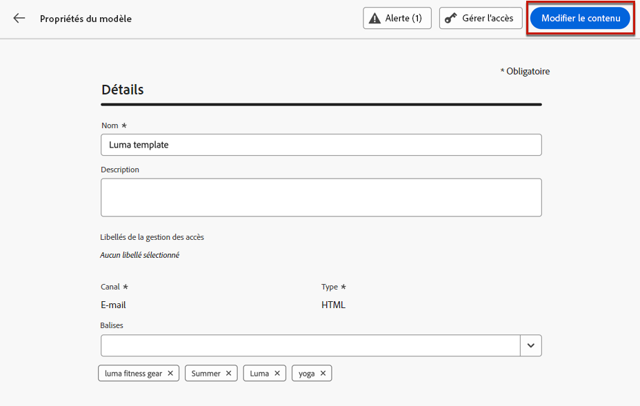
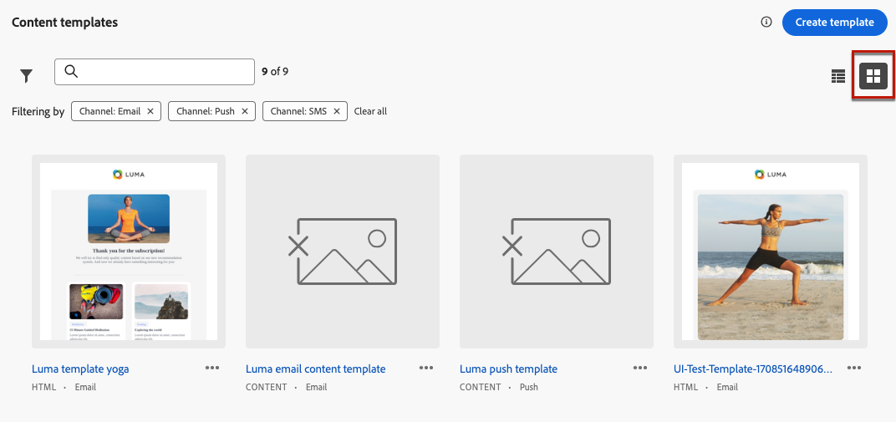

# Accéder aux modèles de contenu et les gérer {#access-manage-templates}

>[!BEGINSHADEBOX]

**Sur cette page :** découvrez comment accéder aux modèles de contenu, les rechercher, les organiser dans des dossiers, les modifier, les supprimer et les exporter dans les sandbox de Adobe Journey Optimizer.

>[!ENDSHADEBOX]

## Conditions préalables {#prerequisites}

Pour accéder aux modèles de contenu et les gérer, vérifiez les points suivants :

* **Autorisation Modèles de contenu** — Votre rôle doit inclure l&#39;autorisation **[!UICONTROL Gérer les modèles de contenu]** (sous la ressource **Gestion de contenu**). Sans cela, le menu **Modèles de contenu** n’est pas visible dans le volet de navigation de gauche. [Découvrez comment gérer les autorisations](../administration/permissions.md)
* **Portée du sandbox** — Les modèles de contenu sont spécifiques au sandbox. Les modèles créés dans un sandbox ne sont pas disponibles dans un autre. Assurez-vous que vous vous trouvez dans le bon sandbox avant de rechercher un modèle.
* **Modèles HTML (obsolète)** — À compter de mars 2025, les modèles de contenu de type HTML seront obsolètes. Les modèles HTML existants restent accessibles, mais il est impossible d’en créer de nouveaux.

## Accéder aux modèles de contenu {#access}

Pour accéder à la liste des modèles de contenu, sélectionnez **[!UICONTROL Gestion de contenu]** > **[!UICONTROL Modèles de contenu]** dans le menu de gauche.

Tous les modèles qui ont été créés sur le sandbox actuel, soit à partir d’un parcours ou d’une campagne à l’aide de l’option **[!UICONTROL Enregistrer en tant que modèle]**, soit à partir du menu **[!UICONTROL Modèles de contenu]**, sont affichés. [Découvrez comment créer des modèles.](#create-content-templates)

Dans le volet de gauche, vous pouvez organiser les modèles de contenu en dossiers. Par défaut, tous les modèles s’affichent. Lorsque vous sélectionnez un dossier, seuls les modèles et les dossiers qu’il contient s’affichent. [En savoir plus](#folders)

Pour trouver un élément spécifique, commencez à saisir un nom dans le champ de recherche. Lorsque vous sélectionnez un [dossier](#folders), la recherche s’applique à tous les modèles de contenu ou dossiers du premier niveau de la hiérarchie de ce dossier<!--(not nested items)-->.

Vous pouvez trier les modèles de contenu par :

* Type
* Canal
* Date de création ou de modification
* Balises - [En savoir plus sur les balises](../start/search-filter-categorize.md#tags)

Vous pouvez également choisir d’afficher uniquement les éléments que vous avez créés ou modifiés.

>[!NOTE]
>
>Depuis mars 2025, les modèles de contenu de type HTML sont devenus obsolètes. Vous pouvez toujours accéder aux modèles de contenu HTML précédemment créés dans [!DNL Journey Optimizer].

## Utiliser des dossiers pour gérer les modèles de contenu {#folders}

Pour parcourir facilement vos modèles de contenu, utilisez des dossiers pour mieux les organiser avec une hiérarchie structurée. Vous pouvez ainsi classer et gérer les éléments en fonction des besoins de votre organisation.

1. Cliquez sur le bouton **[!UICONTROL Tous les modèles de contenu]** pour afficher tous les éléments créés précédemment sans le regroupement des dossiers.

1. Cliquez sur le dossier **[!UICONTROL racine]** pour afficher tous les dossiers créés.

   >[!NOTE]
   >
   >Si vous n’avez pas encore créé de dossiers, tous les modèles de contenu s’affichent.

1. Cliquez sur n’importe quel dossier à l’intérieur du dossier **[!UICONTROL racine]** pour afficher son contenu.

1. Cliquez sur le dossier **[!UICONTROL racine]** ou sur n’importe quel autre dossier pour afficher le bouton **[!DNL Create folder]**. Sélectionnez-le.

   

1. Saisissez le nom du nouveau dossier, puis cliquez sur **[!UICONTROL Enregistrer]**. Le nouveau dossier s’affiche en haut de la liste des modèles de contenu dans le dossier **[!UICONTROL racine]** ou dans le dossier sélectionné.

1. Vous pouvez cliquer sur le bouton **[!UICONTROL Plus d’actions]** pour renommer ou supprimer le dossier.

   

1. À l’aide du bouton **[!UICONTROL Plus d’actions]**, vous pouvez également déplacer le modèle de contenu vers un autre dossier existant.

   

1. Accédez au dossier que vous venez de créer. Chaque nouveau modèle de contenu que vous [créez](create-content-templates.md) ici est enregistré dans le dossier actif.

   

## Modifier et supprimer des modèles de contenu {#edit}

À partir du bouton **[!UICONTROL Autres actions]** en regard de chaque modèle, vous pouvez accéder aux raccourcis et actions suivants :

* **[!UICONTROL Modifier les détails]** — Modifiez le nom, la description et les balises du modèle.
* **[!UICONTROL Simuler du contenu]** — Prévisualisez et testez le contenu du modèle.
* **[!UICONTROL Supprimer]** — Supprimez le modèle.

Pour les modèles d’e-mail, les raccourcis supplémentaires suivants sont disponibles :

* **[!UICONTROL Modifier l&#39;objet]** — Mettez rapidement à jour l&#39;objet de l&#39;e-mail.
* **[!UICONTROL Modifier le corps de l’e-mail]** — Ouvrez le concepteur d’e-mail pour modifier le contenu du modèle.
* **[!UICONTROL Afficher l&#39;épreuve]** — Affichez une épreuve du modèle d&#39;e-mail.
* **[!UICONTROL Envoyer un BAT]** — Envoyez un BAT du modèle aux destinataires désignés.
* **[!UICONTROL Rapport sur les courriers indésirables]** — Analysez le modèle par rapport aux filtres de courrier indésirable.
* **[!UICONTROL Rendre l’e-mail]** — Prévisualisez le rendu de l’e-mail sur différents clients de messagerie.

Pour modifier le contenu complet d’un modèle, cliquez sur l’élément de votre choix dans la liste et apportez les modifications souhaitées. Vous pouvez également modifier les propriétés du modèle de contenu en cliquant sur le bouton de modification en regard du nom du modèle.

    

>[!NOTE]
>
>Lorsqu’un modèle est modifié ou supprimé, les campagnes ou les parcours, y compris le contenu créé à l’aide de ce modèle, ne sont pas affectés.

## Actions en masse {#bulk-actions-templates}

Vous pouvez sélectionner plusieurs modèles à la fois et leur appliquer des opérations en bloc. Les opérations disponibles incluent l’ajout d’éléments à un package, leur déplacement dans un dossier, la modification de balises, la gestion de l’accès et l’archivage. [En savoir plus sur les actions en bloc →](../start/search-filter-categorize.md#bulk-actions)

Vous pouvez également trier la liste de modèles en cliquant sur la plupart des en-têtes de colonne et redimensionner les colonnes en faisant glisser la bordure de colonne pour l’adapter aux données dont vous avez besoin.

## [!BADGE Disponibilité limitée]{type=Informative} afficher les modèles sous forme de miniatures {#template-thumbnails}

Sélectionnez le mode de **[!UICONTROL vue Grille]** pour afficher chaque modèle sous la forme d’une miniature.

>[!AVAILABILITY]
>
>Cette fonctionnalité est publiée en disponibilité limitée pour un petit groupe de personnes.

>[!NOTE]
>
>Les miniatures appropriées peuvent uniquement être générées pour les modèles de contenu d’e-mail de type HTML.

Lorsque vous mettez à jour du contenu, patientez quelques secondes pour que les modifications se reflètent dans la miniature.

## Résolution des problèmes {#troubleshooting}

+++Je ne peux pas voir le menu Modèles de contenu dans le volet de navigation de gauche

Il manque l’autorisation **Gérer les modèles de contenu** à votre rôle. Demandez à votre administrateur d’ajouter la ressource **Gestion de contenu** avec l’autorisation **Gérer les modèles de contenu** à votre rôle. [En savoir plus](../administration/permissions.md)

+++

+++Un modèle que j’ai créé ne s’affiche pas dans la liste

Vérifiez que vous vous trouvez dans le bon sandbox : les modèles sont spécifiques au sandbox. Vérifiez également si un dossier est sélectionné dans le volet de gauche ; lorsqu’un dossier est sélectionné, seuls les modèles le contenant s’affichent. Cliquez sur **[!UICONTROL Tous les modèles de contenu]** pour afficher tous les modèles, quel que soit le dossier.

+++

+++J’ai modifié un modèle mais mon contenu de campagne ou de parcours n’a pas été mis à jour

La modification ou la suppression d’un modèle ne met pas à jour rétroactivement les campagnes ou les parcours créés à l’aide de celui-ci. Le contenu est copié au moment de l’utilisation. Pour mettre à jour le contenu existant, modifiez directement la campagne ou le parcours.

+++

## Exporter des modèles de contenu vers un autre sandbox {#export}

Journey Optimizer vous permet de copier un modèle de contenu d’un sandbox à un autre. Par exemple, vous pouvez copier un modèle de votre sandbox d’évaluation vers votre sandbox de production.

Le processus de copie est réalisé via un **export et un import de package** entre les sandbox source et cible. Des informations détaillées sur l’export d’objets et leur import dans un sandbox cible sont disponibles dans cette section : [Copier des objets vers un autre sandbox](../configuration/copy-objects-to-sandbox.md).

