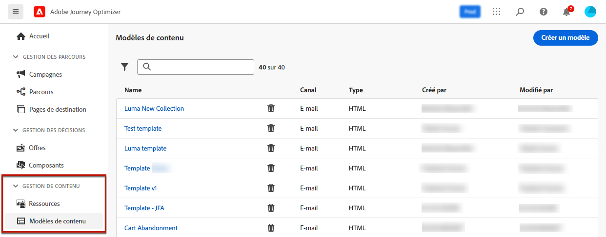

# Accéder aux modèles de contenu et les gérer {#access-manage-templates}

## Accéder aux modèles de contenu {#access}

Pour accéder à la liste des modèles de contenu, sélectionnez **[!UICONTROL Gestion de contenu]** > **[!UICONTROL Modèles de contenu]** dans le menu de gauche.

Tous les modèles qui ont été créés sur le sandbox actuel, soit à partir d’un parcours ou d’une campagne à l’aide de l’option **[!UICONTROL Enregistrer en tant que modèle]**, soit à partir du menu **[!UICONTROL Modèles de contenu]**, sont affichés. [Découvrez comment créer des modèles.](#create-content-templates)

Dans le volet de gauche, vous pouvez organiser les modèles de contenu en dossiers. Par défaut, tous les modèles s’affichent. Lorsque vous sélectionnez un dossier, seuls les modèles et les dossiers qu’il contient s’affichent. [En savoir plus](#folders)

Pour trouver un élément spécifique, commencez à saisir un nom dans le champ de recherche. Lorsque vous sélectionnez un [dossier](#folders), la recherche s’applique à tous les modèles de contenu ou dossiers du premier niveau de la hiérarchie de ce dossier<!--(not nested items)-->.

Vous pouvez trier les modèles de contenu par :

* Type
* Canal
* Date de création ou de modification
* Balises - [En savoir plus sur les balises](../start/search-filter-categorize.md#tags)

Vous pouvez également choisir d’afficher uniquement les éléments que vous avez créés ou modifiés.

>[!NOTE]
>
>Depuis mars 2025, les modèles de contenu de type HTML sont devenus obsolètes. Vous pouvez toujours accéder aux modèles de contenu HTML précédemment créés dans [!DNL Journey Optimizer].

## Utiliser des dossiers pour gérer les modèles de contenu {#folders}

Pour parcourir facilement vos modèles de contenu, utilisez des dossiers pour mieux les organiser avec une hiérarchie structurée. Vous pouvez ainsi classer et gérer les éléments en fonction des besoins de votre organisation.

1. Cliquez sur le bouton **[!UICONTROL Tous les modèles de contenu]** pour afficher tous les éléments créés précédemment sans le regroupement des dossiers.

1. Cliquez sur le dossier **[!UICONTROL racine]** pour afficher tous les dossiers créés.

   >[!NOTE]
   >
   >Si vous n’avez pas encore créé de dossiers, tous les modèles de contenu s’affichent.

1. Cliquez sur n’importe quel dossier à l’intérieur du dossier **[!UICONTROL racine]** pour afficher son contenu.

1. Cliquez sur le dossier **[!UICONTROL racine]** ou sur n’importe quel autre dossier pour afficher le bouton **[!DNL Create folder]**. Sélectionnez-le.

   

1. Saisissez le nom du nouveau dossier, puis cliquez sur **[!UICONTROL Enregistrer]**. Le nouveau dossier s’affiche en haut de la liste des modèles de contenu dans le dossier **[!UICONTROL racine]** ou dans le dossier sélectionné.

1. Vous pouvez cliquer sur le bouton **[!UICONTROL Plus d’actions]** pour renommer ou supprimer le dossier.

   

1. À l’aide du bouton **[!UICONTROL Plus d’actions]**, vous pouvez également déplacer le modèle de contenu vers un autre dossier existant.

   

1. Accédez au dossier que vous venez de créer. Chaque nouveau modèle de contenu que vous [créez](create-content-templates.md) ici est enregistré dans le dossier actif.

   

## Modifier et supprimer des modèles de contenu {#edit}

* Pour modifier le contenu d’un modèle, cliquez sur l’élément de votre choix dans la liste, puis effectuez les modifications souhaitées. Vous pouvez également modifier les propriétés du modèle de contenu en cliquant sur le bouton de modification en regard du nom du modèle.

  

* Pour supprimer un modèle, sélectionnez le bouton **[!UICONTROL Plus d’actions]** situé en regard du modèle souhaité et sélectionnez **[!UICONTROL Supprimer]**.

  

>[!NOTE]
>
>Lorsqu’un modèle est modifié ou supprimé, les campagnes ou les parcours, y compris le contenu créé à l’aide de ce modèle, ne sont pas affectés.

## [!BADGE Disponibilité limitée]{type=Informative} Afficher les modèles sous forme de miniatures {#template-thumbnails}

Sélectionnez le mode de **[!UICONTROL vue Grille]** pour afficher chaque modèle sous la forme d’une miniature.

>[!AVAILABILITY]
>
>Cette fonctionnalité est publiée en disponibilité limitée pour un petit groupe de personnes.

>[!NOTE]
>
>Les miniatures appropriées peuvent uniquement être générées pour les modèles de contenu d’e-mail de type HTML.

Lorsque vous mettez à jour du contenu, patientez quelques secondes pour que les modifications se reflètent dans la miniature.

## Exporter des modèles de contenu vers un autre sandbox {#export}

Journey Optimizer vous permet de copier un modèle de contenu d’un sandbox à un autre. Par exemple, vous pouvez copier un modèle de votre sandbox d’évaluation vers votre sandbox de production.

Le processus de copie est réalisé via un **export et un import de package** entre les sandbox source et cible. Des informations détaillées sur l’export d’objets et leur import dans un sandbox cible sont disponibles dans cette section : [Copier des objets vers un autre sandbox](../configuration/copy-objects-to-sandbox.md).

