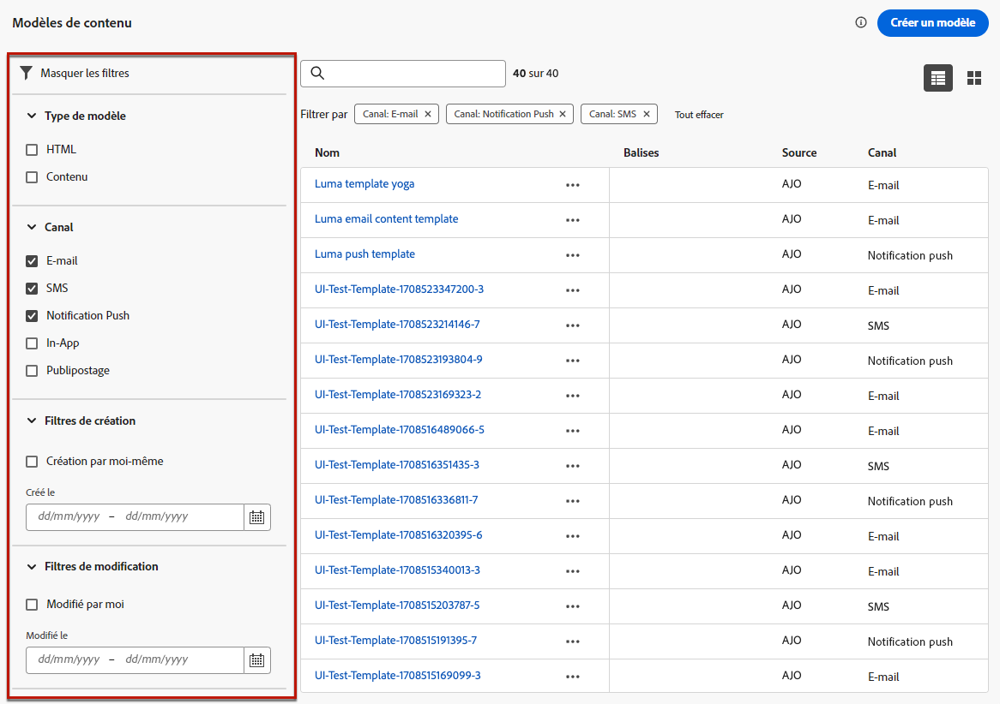

# Accéder aux modèles de contenu et les gérer {#access-manage-templates}

## Accéder aux modèles de contenu {#access}

Pour accéder à la liste des modèles de contenu, sélectionnez **[!UICONTROL Gestion de contenu]** > **[!UICONTROL Modèles de contenu]** dans le menu de gauche.

Tous les modèles qui ont été créés sur le sandbox actuel à partir d’un parcours ou d’une campagne à l’aide de l’option **[!UICONTROL Enregistrer en tant que modèle]** du menu **[!UICONTROL Modèles de contenu]** s’affichent. [Découvrir comment créer des modèles](#create-content-templates)

Vous pouvez trier les modèles de contenu par :
* Type
* Canal
* Date de création ou de modification
* Balises - [En savoir plus sur les balises](../start/search-filter-categorize.md#tags)

Vous pouvez également choisir d’afficher uniquement les éléments que vous avez créés ou modifiés.

## Modifier et supprimer des modèles de contenu {#edit}

* Pour modifier le contenu d’un modèle, cliquez sur l’élément de votre choix dans la liste, puis effectuez les modifications souhaitées. Vous pouvez également modifier les propriétés du modèle de contenu en cliquant sur le bouton de modification en regard du nom du modèle.

  

* Pour supprimer un modèle, sélectionnez le bouton **[!UICONTROL Plus d’actions]** situé en regard du modèle souhaité et sélectionnez **[!UICONTROL Supprimer]**.

  

>[!NOTE]
>
>Lorsqu’un modèle est modifié ou supprimé, les campagnes ou les parcours, y compris le contenu créé à l’aide de ce modèle, ne sont pas affectés.

## Afficher les modèles sous forme de miniatures {#template-thumbnails}

Sélectionnez le mode de **[!UICONTROL vue Grille]** pour afficher chaque modèle sous la forme d’une miniature.

>[!AVAILABILITY]
>
>Cette fonctionnalité est publiée en disponibilité limitée pour un petit groupe de personnes.

>[!NOTE]
>
>Actuellement, les miniatures appropriées ne peuvent être générées que pour les modèles de contenu d’e-mail de type HTML.

Lorsque vous mettez à jour un contenu, vous devrez peut-être attendre quelques secondes avant que les modifications ne soient reflétées dans la miniature.
