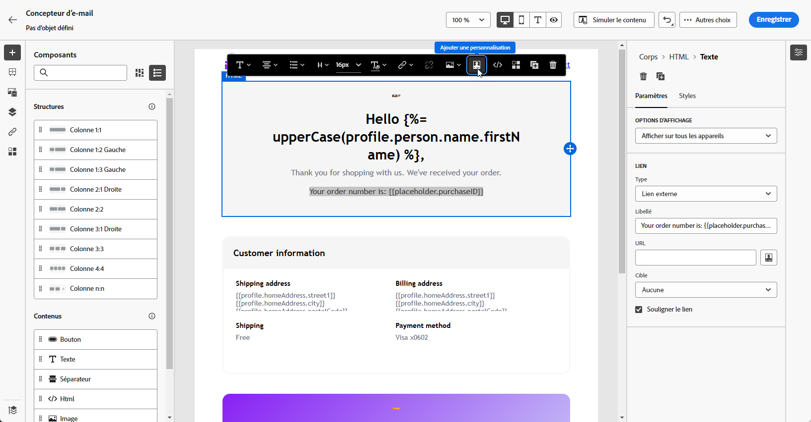
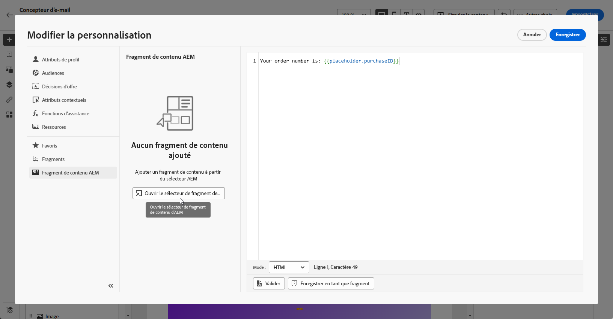
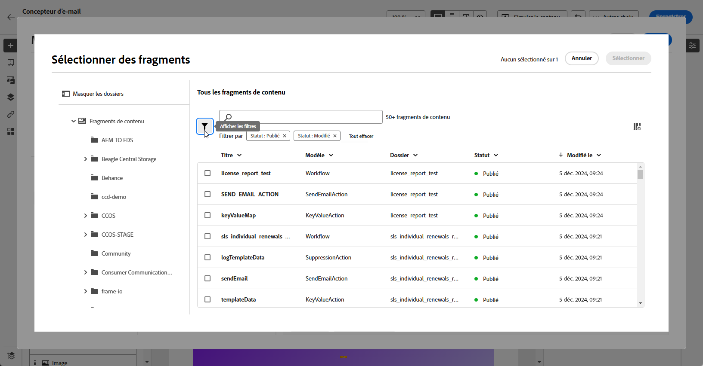
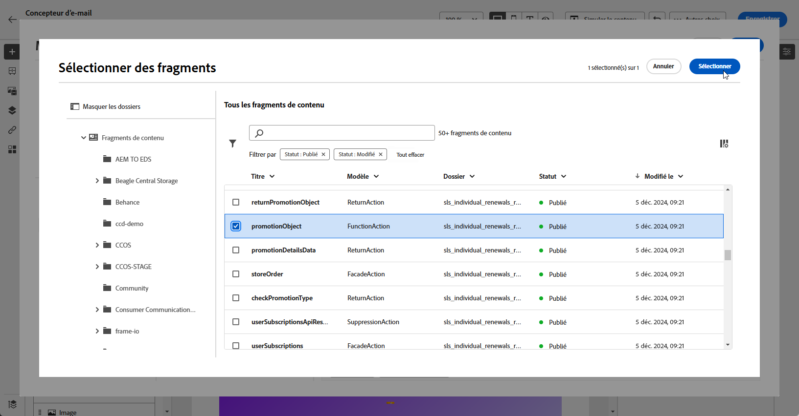
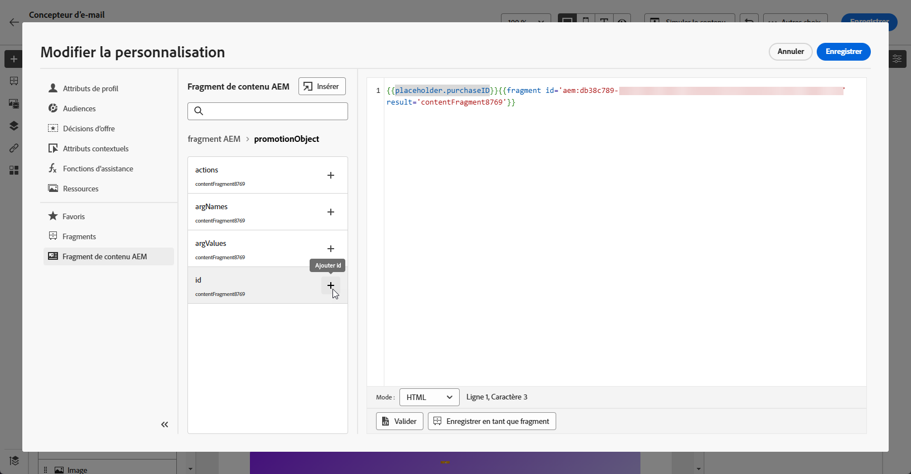

# Fragments de contenu Adobe Experience Manager {#aem-fragments}

En intégrant Adobe Experience Manager à Adobe Journey Optimizer, vous pouvez désormais incorporer facilement vos fragments de contenu AEM dans le contenu de vos e-mails Journey Optimizer. Cette connexion rationalisée simplifie le processus d’accès au contenu AEM et d’utilisation de celui-ci, ce qui permet de créer des campagnes et des parcours personnalisés et dynamiques.

Pour en savoir plus sur le fragment de contenu AEM, consultez la documentation de l’Experience Manager .

## Limites {#limitations}

* Disponible uniquement pour le canal E-mail.

* Les utilisateurs ne peuvent actuellement pas changer l’instance AEM à laquelle ils sont connectés, car chaque sandbox est limité à une seule instance.

* Il est recommandé de limiter le nombre d’utilisateurs autorisés à publier des fragments de contenu afin de réduire le risque d’erreurs accidentelles dans les e-mails.

* Pour le contenu multilingue, seul le flux manuel est pris en charge.

* Les variantes ne sont actuellement pas prises en charge.

* Vous devez créer une balise spécifique à Journey Optimizer.

+++ Découvrez comment créer votre balise Journey Optimizer

   1. Accédez à votre environnement **Experience Manager**.

   1. Dans le menu **Outils**, accédez à l’onglet **Général** et sélectionnez **Balisage**.

   1. Cliquez sur **Créer une balise**.

   1. Assurez-vous que l’identifiant respecte la syntaxe suivante : `ajo-enabled:{AJO-OrgId}/{AJO-SandboxName}`.

   1. Cliquez sur **Créer**.

  Vous pouvez maintenant affecter cette balise Journey Optimizer à vos fragments de contenu.
+++

## Ajouter des fragments de contenu AEM {#aem-add}

Après avoir créé et personnalisé vos [fragments de contenu AEM](https://experienceleague.adobe.com/en/docs/experience-manager-cloud-service/content/sites/authoring/fragments/content-fragments), vous pouvez maintenant les importer dans votre campagne ou votre parcours Parcours Optimizer.

1. Après avoir créé votre [Campaign](../email/create-email.md) ou [Parcours ](../email/create-email.md) avec une action d’e-mail, accédez au concepteur d’e-mail pour configurer le contenu de l’e-mail. [En savoir plus](../email/get-started-email-design.md)

1. Cliquez à l’intérieur d’un bloc de texte ou dans la ligne d’objet et sélectionnez **[!UICONTROL Ajouter un Personalization]** dans la barre d’outils contextuelle.

   

1. Dans le menu **[!UICONTROL Fragment de contenu AEM]** du volet de gauche, cliquez sur **[!UICONTROL Ouvrir le sélecteur AEM CF]**.

   

1. Sélectionnez un **[!UICONTROL fragment de contenu]** dans la liste disponible à importer dans votre contenu Journey Optimizer.

   >[!IMPORTANT]
   >
   >Seuls les **[!UICONTROL fragments de contenu]** publiés peuvent être utilisés.

1. Cliquez sur **[!UICONTROL Afficher les filtres]** pour affiner les réglages de votre liste Fragments de contenu.

   Le sélecteur de fragment de contenu comprend des filtres préconfigurés :

   * **[!UICONTROL Statut]** : Publié, Modifié
   * **[!UICONTROL Balise]** : défini automatiquement en fonction de votre environnement Journey Optimizer (identifiant d’organisation et sandbox)

   

1. Après avoir sélectionné votre **[!UICONTROL fragment de contenu]**, cliquez sur **[!UICONTROL Sélectionner]** pour l’ouvrir.

   

1. Sélectionnez les champs de votre **[!UICONTROL fragment de contenu]** à ajouter à votre contenu.

   

1. Cliquez sur **[!UICONTROL Enregistrer]** et vérifiez votre message dans l’aperçu. Vous pouvez maintenant tester et vérifier le contenu de votre message, comme indiqué dans [cette section](preview.md).

Une fois que vous avez effectué vos tests et validé le contenu, vous pouvez envoyer l’e-mail à votre audience avec votre [Campaign](../campaigns/review-activate-campaign.md) ou [Parcours ](../building-journeys/publishing-the-journey.md).

