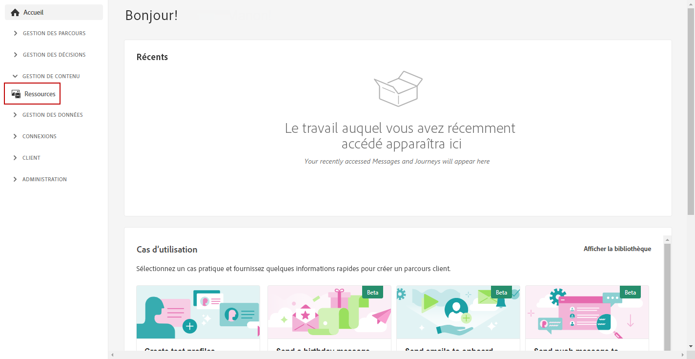
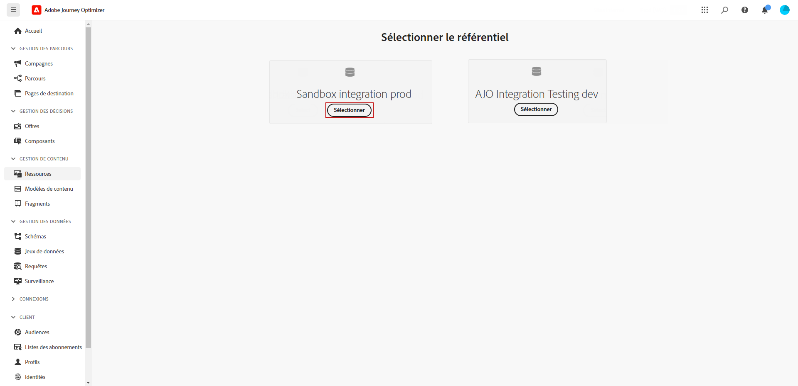
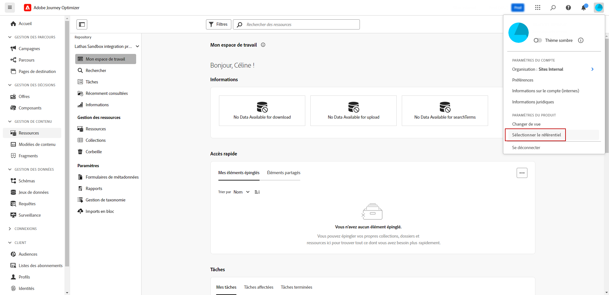
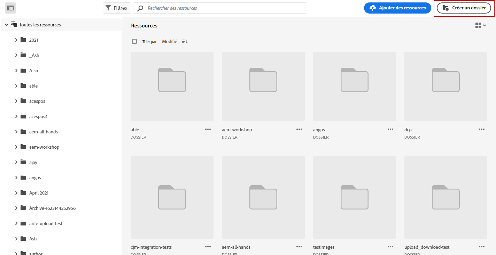
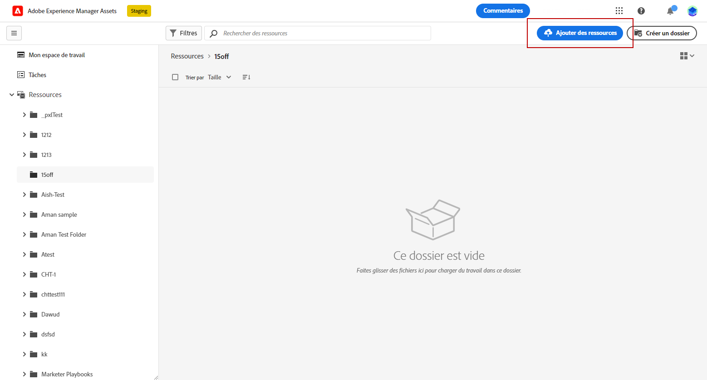
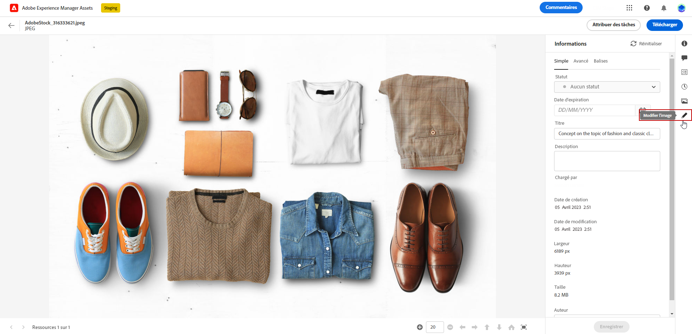
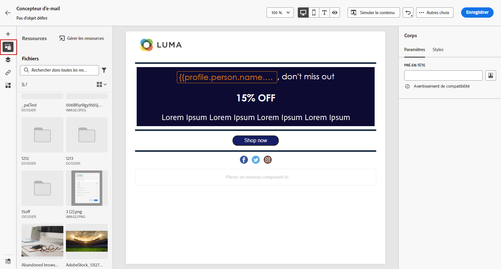
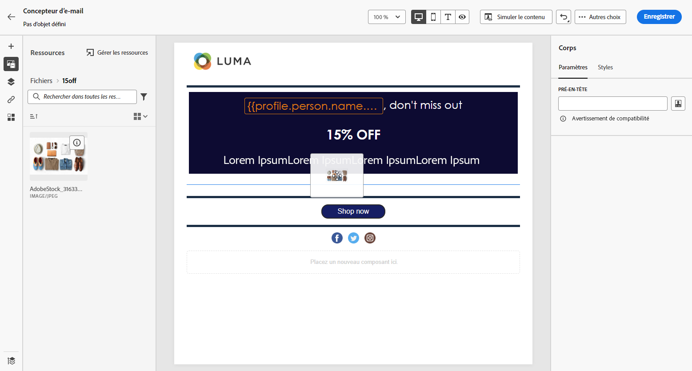
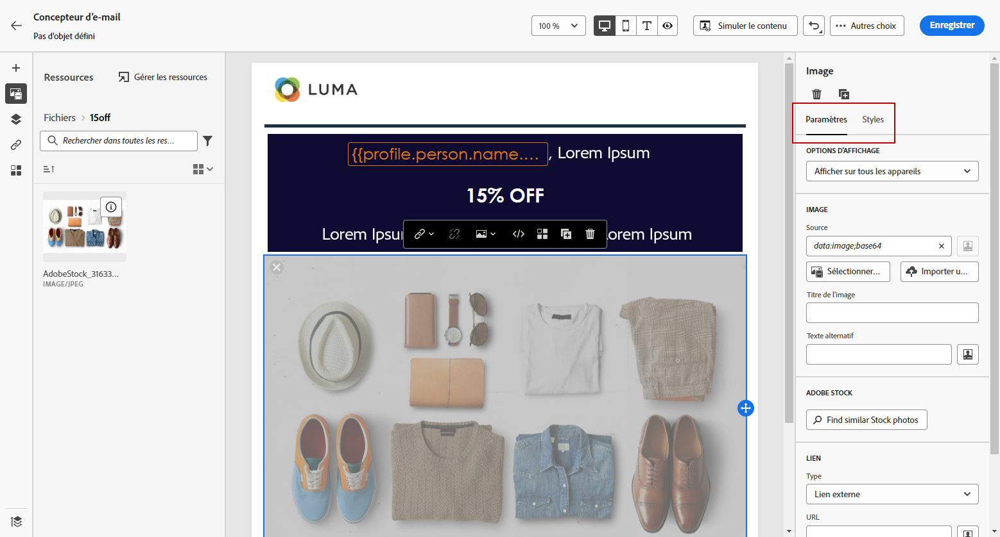

# Création et gestion des ressources avec [!DNL Experience Manager Assets]{#experience-manager-assets}

## Prise en main de [!DNL Experience Manager Assets] {#get-started-assets}

Rassemblez les workflows marketing et créatifs à l’aide de **[!DNL Adobe Experience Manager Assets]**. Intégrée de manière native à **[!DNL Adobe Journey Optimizer]**, accès **[!DNL Assets Essentials]** ou **[!DNL Assets as a Cloud Service]** pour stocker, gérer, découvrir et distribuer des ressources numériques. Ceci fournit un référentiel de ressources unique et centralisé que vous pouvez utiliser pour renseigner vos messages.

**[!DNL Adobe Experience Manager Assets]** propose deux espaces de travail de ressources collaboratifs et centralisés qui étendent votre système de création et unifient les ressources numériques pour la diffusion d’expérience :

* **[!DNL Assets as a Cloud Service]**: Adobe Experience Manager Assets as a Cloud Service offre une solution cloud conviviale pour une gestion efficace des actifs numériques et des opérations Dynamic Media. Elle intègre de manière transparente des fonctionnalités avancées, notamment l’intelligence artificielle et l’apprentissage automatique.

  Apprenez-en plus dans la [Documentation d’Adobe Experience Manager as a Cloud Service](https://experienceleague.adobe.com/docs/experience-manager-cloud-service/content/assets/overview.html).

* **[!DNL Assets Essentials]**: Experience Manager Assets Essentials est une solution légère as a Cloud Service d’Assets pour une gestion et une collaboration unifiées des ressources. Grâce à une interface moderne et simplifiée, il permet aux équipes créatives et marketing de stocker, découvrir et distribuer des ressources numériques sans effort.

  En savoir plus dans la [documentation Adobe Experience Manager Assets Essentials](https://experienceleague.adobe.com/docs/experience-manager-assets-essentials/help/introduction.html?lang=fr){target="_blank"}.

Selon votre contrat, **[!DNL Adobe Experience Manager Assets Essentials]** ou **[!DNL Adobe Experience Manager Assets as a Cloud Service]** est accessible directement depuis **[!DNL Adobe Journey Optimizer]** dans le menu de gauche **[!UICONTROL Ressources]** . Vous pouvez également accéder aux ressources et aux dossiers lors de la [conception d’un contenu d’e-mail](../email/get-started-email-design.md).

## Conditions préalables{#assets-prerequisites}

>[!BEGINTABS]

>[!TAB Adobe Experience Manager Assets Essentials]

Avant d’utiliser [!DNL Adobe Experience Manager Assets Essentials], vous devez ajouter des utilisateurs aux profils de produit **Utilisateurs clients dʼAssets Essentials** ou/et **Utilisateurs dʼAssets Essentials**. Pour en savoir plus, consultez la [documentation d’Assets Essentials](https://experienceleague.adobe.com/docs/experience-manager-assets-essentials/help/get-started-admins/deploy-administer.html?lang=fr#add-user-groups){target="_blank"}.

>[!NOTE]
>Pour les produits Journey Optimizer obtenus avant le 6 janvier 2022, vous devez déployer **[!DNL Adobe Experience Manager Assets Essentials]** pour votre organisation. Pour en savoir plus, reportez-vous à la section [Déploiement d’Assets Essentials](https://experienceleague.adobe.com/docs/experience-manager-assets-essentials/help/deploy-administer.html?lang=fr){target="_blank"}

>[!TAB Adobe Experience Manager Assets as a Cloud Service]

Avant d’utiliser **[!DNL Adobe Experience Manager Assets as a Cloud Service]**, vous devez ajouter des utilisateurs aux Cloud Service Assets. En savoir plus dans [Adobe Experience Manager Assets as a Cloud Service](https://experienceleague.adobe.com/docs/experience-manager-cloud-service/content/security/ims-support.html?lang=fr).

>[!ENDTABS]

## Téléchargement et ajout de ressources{#add-asset}

Pour importer des fichiers dans **[!DNL Assets Essentials]** ou **[!DNL Assets as a Cloud Service]**, vous devez d’abord parcourir ou créer le dossier dans lequel il sera stocké. Vous pourrez alors les insérer dans le contenu de votre e-mail.

1. De [!DNL Adobe Journey Optimizer] page d’accueil, sélectionnez **[!UICONTROL Ressources]** sous la balise **[!UICONTROL Gestion de contenu]** pour accéder à **[!DNL Assets Essentials]** ou **[!DNL Assets as a Cloud Service]**.

   

1. Sélectionnez le référentiel pour vos ressources dans Journey Optimizer. Vous pouvez opter pour une **[!DNL Assets Essentials]** ou **[!DNL Assets as a Cloud Service]** , à condition que vous possédiez cette solution.

   

+++ Découvrez comment changer de référentiel Assets.

   Pour modifier votre référentiel Assets, sélectionnez l’icône Compte en haut à droite, puis cliquez sur **[!UICONTROL Sélectionner un référentiel]**.

   

+++

1. Double-cliquez sur un dossier dans la section centrale ou dans l’arborescence pour l’ouvrir.

   Vous pouvez également cliquer sur **[!UICONTROL Créer un dossier]** pour créer un nouveau dossier.

   

1. Une fois dans le dossier sélectionné ou créé, cliquez sur **[!UICONTROL Ajouter des ressources]** pour télécharger une nouvelle ressource dans votre dossier.

   

1. Dans la section **[!UICONTROL Téléchargement de fichiers]**, cliquez sur **[!UICONTROL Parcourir]** et choisissez si vous souhaitez **[!UICONTROL Parcourir les fichiers]** ou **[!UICONTROL Parcourir les dossiers]**.

1. Sélectionnez le fichier que vous souhaitez télécharger. Lorsque vous avez terminé, cliquez sur **[!UICONTROL Télécharger]**. Pour en savoir plus sur la gestion de vos ressources, consultez à ce sujet cette [page](https://experienceleague.adobe.com/docs/experience-manager-assets-essentials/help/manage-organize.html?lang=fr).

1. Pour modifier davantage vos ressources avec Adobe Photoshop Express, double-cliquez dessus. Ensuite, dans le menu de droite, sélectionnez l’icône **[!UICONTROL Mode d’édition]**. [En savoir plus](https://experienceleague.adobe.com/docs/experience-manager-assets-essentials/help/edit-images.html?lang=fr){target="_blank"}.

   

1. Dans [!DNL Adobe Journey Optimizer], sélectionnez le menu **[!UICONTROL Sélecteur de ressource]** dans le volet gauche du concepteur d’e-mail.

   

1. Sélectionnez le dossier **[!UICONTROL Ressources]** précédemment créé. Vous pouvez également rechercher votre ressource ou votre dossier dans la barre de recherche.

1. Glissez-déposez votre ressource dans le contenu de votre e-mail.

   

1. Vous pouvez personnaliser davantage vos ressources, par exemple en ajoutant un lien externe ou du texte, à l’aide des onglets **[!UICONTROL Paramètres]** et **[!UICONTROL Styles]**. [En savoir plus sur les paramètres des composants](../email/content-components.md)

   

   <!--
    After adding your asset to your email, use the **[!UICONTROL Find similar Stock photos]** option to locate Stock photos that match the content, color, and composition of your image. [Learn more about Adobe Stock](stock.md).

    Note that this option is available for licensed/unlicensed Stock images and images from your Assets folder. 

    
    -->

## [!DNL Adobe Experience Manager Assets] FAQ {#faq-assets}

+++ Puis-je continuer à utiliser le référentiel regroupé Assets Essentials dans Journey Optimizer ?

Si vous êtes configuré sur **[!DNL Adobe Experience Manager Assets as a Cloud Service]**, vous avez accès aux **[!DNL Adobe Experience Manager Assets Essentials]** et **[!DNL Adobe Experience Manager Assets as a Cloud Service]** référentiels si l’utilisateur dispose des autorisations appropriées. Ces référentiels sont séparés et non synchronisés. Un utilisateur de Journey Optimizer pourra voir ces deux référentiels, y compris d’autres environnements auxquels il a droit, tels que Stage, Dev, etc., et pourra basculer en toute transparence entre eux avec le sélecteur de référentiel.

+++

+++ Comment les ressources sont-elles gérées ? Les modifications apportées à Assets as a Cloud Service sont-elles reflétées dans Journey Optimizer ?

**[!DNL Adobe Experience Manager Assets as a Cloud Service]** s’intègre à Journey Optimizer de la même manière que **[!DNL Adobe Experience Manager Assets Essentials]**. Lorsque des modifications sont apportées à des ressources, une copie binaire est générée. Notez que les mises à jour dans **[!DNL Assets as a Cloud Service]** ne se propagent pas automatiquement aux campagnes par e-mail actives. Les modifications doivent être sélectionnées à nouveau manuellement dans le concepteur d’emails afin de garantir la synchronisation entre les ressources et les campagnes email en cours.

+++

+++ Puis-je utiliser des URL Dynamic Media lors de la création d’emails dans Journey Optimizer ?

Oui, vous pouvez utiliser des URL Dynamic Media dans la création d’emails Journey Optimizer. Il vous suffit de coller les URL au lieu de les sélectionner dans le sélecteur de ressources.

+++

+++ L’utilisateur de Journey Optimizer peut-il apporter des modifications au référentiel Adobe Experience Manager Assets as a Cloud Service à partir de l’interface de Journey Optimizer ?

Tant que l’utilisateur Journey Optimizer est autorisé **[!DNL Adobe Experience Manager Assets as a Cloud Service]** utilisateur standard et disposant de l’autorisation Modifier sur le référentiel, l’utilisateur peut apporter des modifications au **[!DNL Adobe Experience Manager Assets as a Cloud Service]** référentiel.

+++
