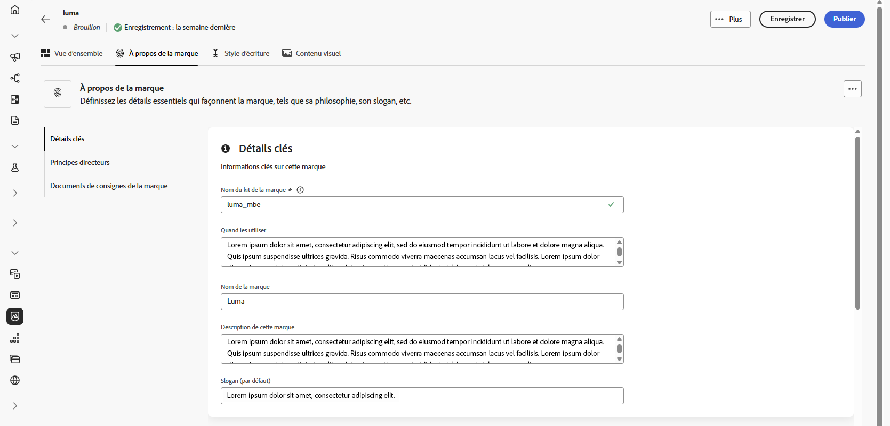
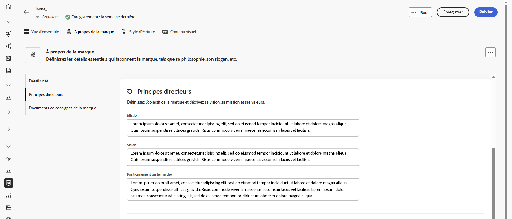
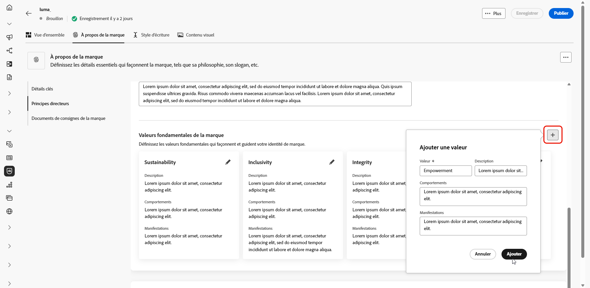
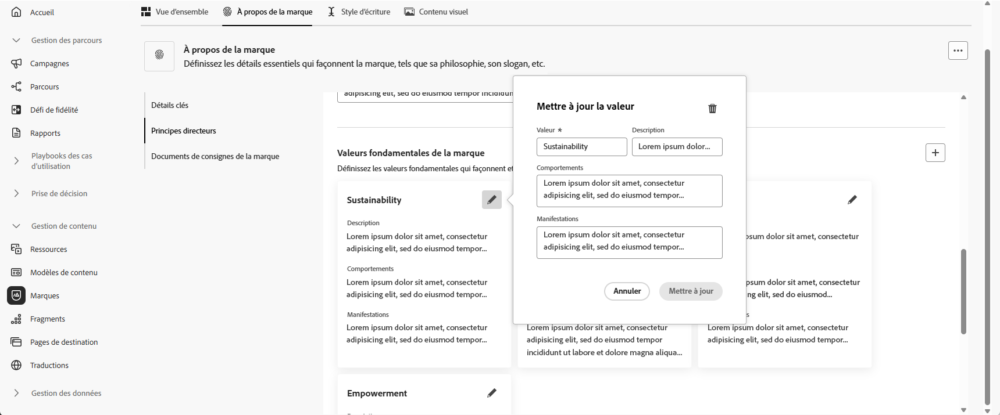
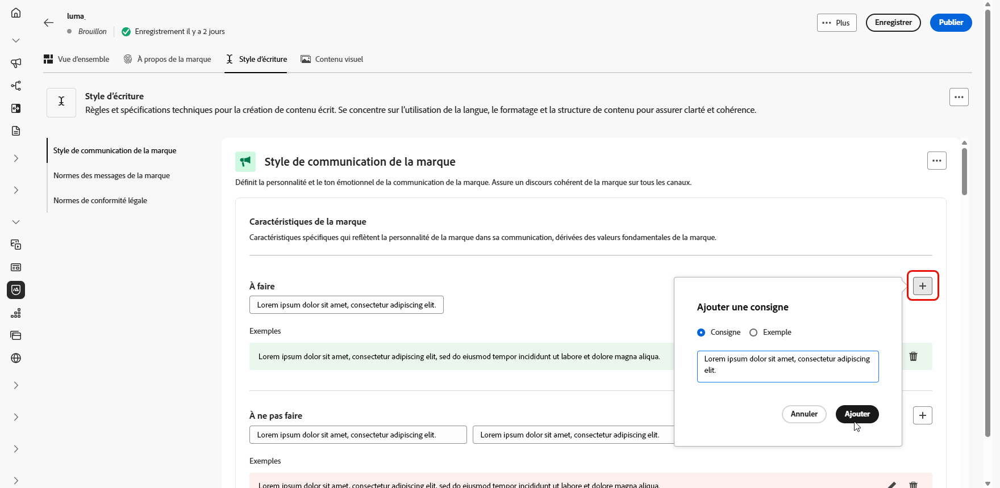
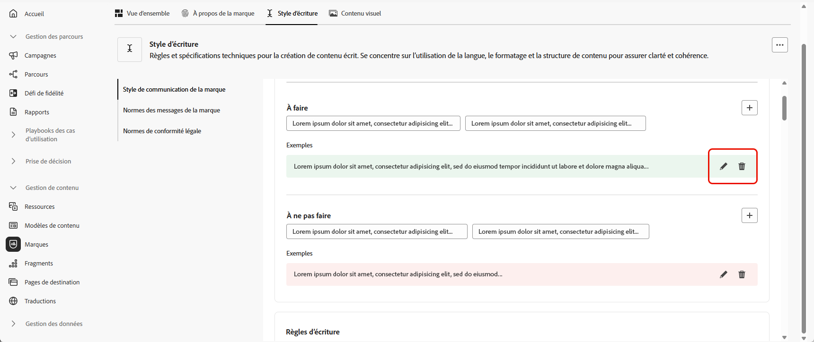
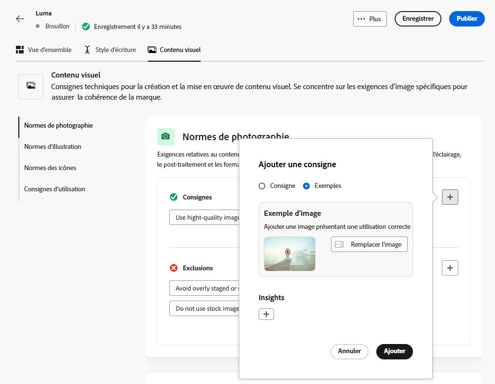
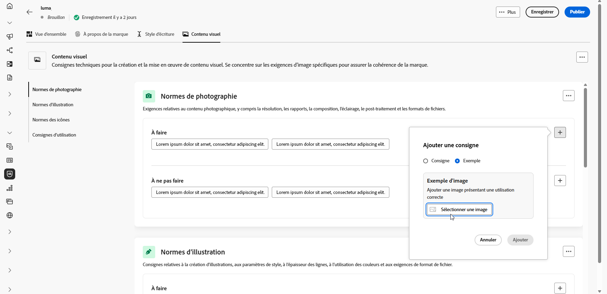
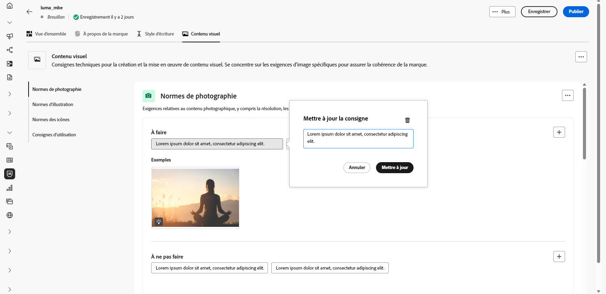

# Personnaliser votre marque {#brands-personalize}

## À propos de la marque {#about-brand}

Dans l’onglet **[!UICONTROL À propos de la marque]**, vous pouvez définir l’identité principale de votre marque en décrivant son objectif, sa personnalité, son slogan et d’autres attributs déterminants.

1. Commencez par renseigner les informations de base de votre marque dans la catégorie **[!UICONTROL Détails clés]** :

   * **[!UICONTROL Nom du kit de marque]** : saisissez le nom du kit de marque.

   * **[!UICONTROL Quand l’utiliser]** : spécifiez les scénarios ou les contextes dans lesquels ce kit de marque doit être appliqué.

   * **[!UICONTROL Nom de la marque]** : saisissez le nom officiel de la marque.

   * **[!UICONTROL Description de la marque]** : présentez ce que représente cette marque.

   * **[!UICONTROL Slogan par défaut]** : ajoutez le slogan principal de la marque.

     

1. Dans la catégorie **[!UICONTROL Principes directeurs]**, clarifiez l’orientation principale et la philosophie de votre marque :

   * **[!UICONTROL Mission]** : détaillez l’objectif de votre marque.

   * **[!UICONTROL Vision]** : décrivez votre objectif à long terme ou la situation future visée.

   * **[!UICONTROL Positionnement sur le marché]** : expliquez comment votre marque se positionne sur le marché.

     

1. Dans la catégorie **[!UICONTROL Valeurs fondamentales de la marque]**, cliquez sur  pour ajouter les valeurs de base de la marque et renseigner les détails :

   * **[!UICONTROL Valeur]** : attribuez un nom à une valeur fondamentale de la marque.

   * **[!UICONTROL Description]** : expliquez ce que cette valeur signifie pour votre marque.

   * **[!UICONTROL Comportements]** : décrivez les actions ou attitudes qui reflètent cette valeur dans la pratique.

   * **[!UICONTROL Manifestations]** : donnez des exemples de la manière dont cette valeur s’exprime dans le branding réel.

     

1. Si nécessaire, cliquez sur l’icône  pour mettre à jour ou supprimer l’une des valeurs fondamentale de la marque.

   

Vous pouvez maintenant [publier votre marque](brands.md#create-brand-kit) ou continuer à la personnaliser.

## Style d’écriture {#writing-style}

>[!CONTEXTUALHELP]
>id="ajo_brand_writing_style"
>title="Score d’alignement du style d’écriture"
>abstract="La section Style d’écriture définit les normes linguistiques, de mise en forme et de structure qui garantissent un contenu clair et cohérent. Le score d’alignement, noté du plus élevé au plus faible, reflète le degré de conformité de votre contenu à ces directives et met en évidence les domaines à améliorer."

La section **[!UICONTROL Style d’écriture]** décrit les normes d’écriture du contenu et expose en détail comment la langue, la mise en forme et la structure doivent être utilisés pour garantir la clarté, la cohérence et l’homogénéité de l’ensemble des ressources.

+++ Catégories et exemples disponibles

<table>
  <thead>
    <tr>
      <th>Catégorie</th>
      <th>Sous-catégorie</th>
      <th>Exemple de directives</th>
      <th>Exemple d’exclusions</th>
    </tr>
  </thead>
  <tbody>
    <tr>
      <td rowspan="4">Normes de création de contenu</td>
      <td>Normes des messages de la marque</td>
      <td>Mettez l’accent sur l’innovation et orientez les messages sur la clientèle.</td>
      <td>Ne faites pas de promesses irréalistes sur les capacités du produit.</td>
    </tr>
    <tr>
      <td>Utilisation du slogan</td>
      <td>Placez le slogan sous le logo sur toutes les ressources marketing numériques.</td>
      <td>Ne modifiez ni ne traduisez le slogan.</td>
    </tr>
    <tr>
      <td>Messages principaux</td>
      <td>Insistez sur l’énoncé des principaux avantages, comme l’amélioration de la productivité.</td>
      <td>N’utilisez pas des propositions de valeur sans rapport.</td>
    </tr>
    <tr>
      <td>Normes de nommage</td>
      <td>Utilisez des noms simples et descriptifs tels que « ProScheduler ».</td>
      <td>N’utilisez ni des termes complexes ni des caractères spéciaux.</td>
    </tr>
    <tr>
      <td rowspan="5">Style de communication de la marque</td>
      <td>Caractéristiques de la marque</td>
      <td>Amical et accessible.</td>
      <td>Ne soyez pas défaitiste.</td>
    </tr>
    <tr>
      <td>Règles d’écriture</td>
      <td>Gardez les phrases courtes et percutantes.</td>
      <td>N’utilisez pas trop de jargon.</td>
    </tr>
    <tr>
      <td>Ton situationnel</td>
      <td>Maintenez un ton professionnel dans les communications de crise.</td>
      <td>Ne soyez pas dédaigneux dans les communications d’assistance.</td>
    </tr>
    <tr>
      <td>Consignes relatives aux choix des mots</td>
      <td>Utilisez des mots comme « innovant » et « intelligent ».</td>
      <td>Évitez les mots tels que « bon marché » ou « hack ».</td>
    </tr>
    <tr>
      <td>Normes linguistiques</td>
      <td>Respectez les conventions françaises.</td>
      <td>Faites attention à l’orthographe.</td>
    </tr>
    <tr>
      <td rowspan="3">Normes de conformité légale</td>
      <td>Normes de marque commerciale</td>
      <td>Utilisez toujours le symbole ™ ou ®.</td>
      <td>N’omettez pas les symboles légaux si nécessaire.</td>
    </tr>
    <tr>
      <td>Normes de copyright</td>
      <td>Incluez les avis de copyright sur les supports marketing.</td>
      <td>N’utilisez pas de contenu tiers sans autorisation.</td>
    </tr>
    <tr>
      <td>Normes de mentions légales</td>
      <td>Affichez clairement les mentions légales sur les ressources numériques.</td>
      <td>Ne masquez pas les mentions légales dans des zones non visibles.</td>
    </tr>
</table>

+++

 

Pour personnaliser votre **[!UICONTROL style d’écriture]** :

1. Dans l’onglet **[!UICONTROL Style d’écriture]**, cliquez sur  pour ajouter une directive, une exception ou une exclusion.

1. Saisissez votre règle, votre exception ou votre exclusion. Vous pouvez également inclure des **[!UICONTROL exemples]** pour mieux illustrer la manière dont ces instructions doivent être appliquées.

   

1. Spécifiez le **contexte d’utilisation** pour votre règle, votre exception ou votre exclusion :

   * **[!UICONTROL Type de canal]** : choisissez où cette règle, cette exception ou cette exclusion doit s’appliquer. Par exemple, vous pouvez souhaiter qu’un style d’écriture spécifique apparaisse uniquement dans les canaux E-mail, Mobile, Impression ou d’autres canaux de communication.

   * **[!UICONTROL Type d’élément]** : spécifiez à quel élément de contenu la règle s’applique. Il peut s’agir d’éléments tels que des titres, des boutons, des liens ou d’autres composants de votre contenu.

     

1. Une fois votre règle, votre exception ou votre exclusion configurée, cliquez sur **[!UICONTROL Ajouter]**.

1. Le cas échéant, sélectionnez l’une de vos règles ou exclusions pour la mettre à jour ou la supprimer.

1. Cliquez sur  pour modifier votre exemple ou sur l’icône  pour le supprimer.

   

Vous pouvez désormais personnaliser davantage votre marque ou [la publier](#create-brand-kit).

## Contenu visuel {#visual-content}

>[!CONTEXTUALHELP]
>id="ajo_brand_imagery"
>title="Score d’alignement du contenu visuel"
>abstract="Le score d’alignement du contenu visuel indique dans quelle mesure votre contenu correspond à vos directives de marque configurées. Noté du plus élevé au plus faible, il vous permet d’évaluer l’alignement en un coup d’œil. Explorez les différentes catégories pour identifier les domaines à améliorer et identifier les éléments qui peuvent ne pas correspondre à la marque."

La section **[!UICONTROL Contenu visuel]** définit les normes en matière d’imagerie et de conception, en détaillant les spécifications nécessaires pour conserver une apparence de marque unifiée et cohérente.

+++ Catégories et exemples disponibles

<table>
  <thead>
    <tr>
      <th>Catégorie</th>
      <th>Exemple de directives</th>
      <th>Exemple d’exclusions</th>
    </tr>
  </thead>
  <tbody>
    <tr>
      <td>Normes de photographie</td>
      <td>Utilisez l’éclairage naturel pour les prises de vue extérieures.</td>
      <td>Évitez les images trop modifiées ou pixellisées.</td>
    </tr>
    <tr>
      <td>Normes d’illustration</td>
      <td>Utilisez des styles épurés et minimalistes.</td>
      <td>Optez pour la simplicité.</td>
    </tr>
    <tr>
      <td>Normes d’icône</td>
      <td>Utilisez un système de grille cohérent de 24 px.</td>
      <td>Ne mélangez pas les dimensions des icônes, n’utilisez pas d’épaisseurs de trait incohérentes et ne vous écartez pas des règles de grille.</td>
    </tr>
    <tr>
      <td>Consignes d’utilisation</td>
      <td>Choisissez des images de style de vie qui représentent des clientes et clients réels utilisant le produit dans des environnements professionnels.</td>
      <td>N’utilisez pas d’images qui contredisent le ton de la marque ou semblent hors contexte.</td>
    </tr>
</table>

+++

 

Pour personnaliser votre **[!UICONTROL contenu visuel]** :

1. Dans l’onglet **[!UICONTROL Contenu visuel]**, cliquez sur  pour ajouter une directive, une exclusion ou un exemple.

1. Saisissez votre règle, votre exclusion ou votre exemple.

   

1. Spécifiez le **contexte d’utilisation** pour votre règle ou votre exclusion :

   * **[!UICONTROL Type de canal]** : choisissez où cette règle, cette exception ou cette exclusion doit s’appliquer. Par exemple, vous pouvez souhaiter qu’un style d’écriture spécifique apparaisse uniquement dans les canaux E-mail, Mobile, Impression ou d’autres canaux de communication.

   * **[!UICONTROL Type d’élément]** : spécifiez à quel élément de contenu la règle s’applique. Il peut s’agir d’éléments tels que des titres, des boutons, des liens ou d’autres composants de votre contenu.

     

1. Une fois votre règle, votre exception ou votre exclusion configurée, cliquez sur **[!UICONTROL Ajouter]**.

1. Pour ajouter une image attestant d’une utilisation correcte, sélectionnez **[!UICONTROL Exemple]** et cliquez sur **[!UICONTROL Sélectionner une image]**. Vous pouvez également ajouter une image montrant une utilisation incorrecte comme exemple d’exclusion.

   

1. Le cas échéant, sélectionnez l’une de vos règles ou exclusions pour la mettre à jour ou la supprimer.

1. Sélectionnez l’un de vos exemples pour le mettre à jour, remplacez l’image ou cliquez sur l’icône  pour le supprimer.

   

Vous pouvez maintenant [publier votre marque](brands.md#create-brand-kit) ou continuer à la personnaliser.

<!--
## Colors {#colors}

The **[!UICONTROL Colors]** section the standards for your brand's color system, outlining how colors are selected, organized, and applied across experiences. It ensures consistent use of primary, secondary, accent, and neutral colors to maintain a cohesive, accessible, and recognizable brand identity.

+++ Available categories and examples

<table>
  <thead>
    <tr>
      <th>Category</th>
      <th>Guidelines Example</th>
      <th>Exclusions Example</th>
    </tr>
  </thead>
  <tbody>
    <tr>
      <td>Primary colors</td>
      <td>Use primary brand colors for logos, headers, and main call-to-action elements.</td>
      <td>Do not substitute or modify primary brand colors.</td>
    </tr>
    <tr>
      <td>Secondary colors</td>
      <td>Use secondary colors to support layouts, illustrations, and UI components.</td>
      <td>Do not let secondary colors overpower primary brand colors.</td>
    </tr>
    <tr>
      <td>Accent colors</td>
      <td>Use accent colors sparingly for buttons, links, and alerts.</td>
      <td>Do not use accent colors for large background areas.</td>
    </tr>
    <tr>
      <td>Neutral colors</td>
      <td>Use neutral colors for text, dividers, borders, and subtle UI elements.</td>
      <td>Avoid using neutrals with poor contrast or heavy color casts.</td>
    </tr>
    <tr>
      <td>Background colors</td>
      <td>Use light or neutral backgrounds to ensure readability and visual clarity.</td>
      <td>Do not place text or logos on low-contrast backgrounds.</td>
    </tr>
    <tr>
      <td>Additional colors</td>
      <td>Use additional colors only for data visualization or approved campaigns.</td>
      <td>Do not introduce unapproved or off-brand colors.</td>
    </tr>
    <tr>
      <td>Color scales</td>
      <td>Use approved tints and shades for UI states such as hover, active, and disabled.</td>
      <td>Do not create unofficial shades or gradients.</td>
    </tr>
    <tr>
      <td>Usage guidelines</td>
      <td>Maintain consistent color usage and accessible contrast across all assets.</td>
      <td>Do not mix conflicting palettes or apply colors inconsistently.</td>
    </tr>
</table>

+++

 

To personalize your **[!UICONTROL Colors]**:

1. From the **[!UICONTROL Colors]** tab, click  to add a color, guideline or exclusion. 

1. Enter your color information to define it accurately:

    * **Color name**: Provide a clear, descriptive name to identify the color within your brand system.

    * **Color value**: Choose your color using the hue picker or enter precise values using RGB, HEX, or Pantone name/code to ensure consistency across digital and print assets.

    

1. Review your selection to confirm accuracy and visual consistency and click **[!UICONTROL Add]** to save your color.

1. Then, enter your guideline or exclusion.

1. Specify the Usage context for your guideline or exclusion:

    * **[!UICONTROL Channel type]**: Choose where this guideline, exception, or exclusion should apply. For example, you may want a specific writing style to appear only in Email, Mobile, Prints, or other communication channels.

    * **[!UICONTROL Element type]**: Specify which content element the rule applies to. This could include elements such as Headings, Buttons, Links, or other components within your content.

      
  
1. Once your guideline, exception, or exclusion is set up, click **[!UICONTROL Add]**. 

1. If needed, select one of your guideline or exclusion to update or delete.

1. Select one your guideline or exclusion to update it. Click the icon to delete it. 

    

1. Click **[!UICONTROL Add group]** to define additional colors for your brand or to add a color scale group.

You can now further personalize your brand or [publish your brand](brands.md#create-brand-kit).

-->