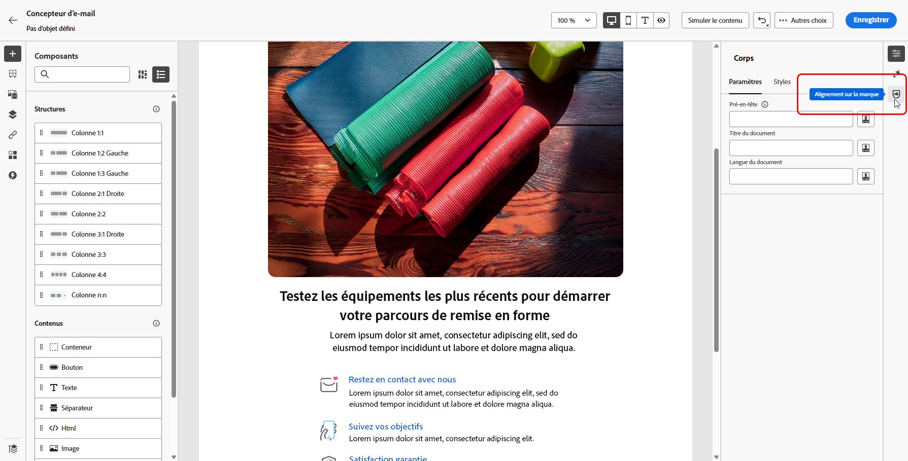
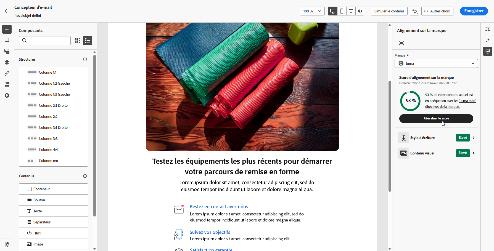
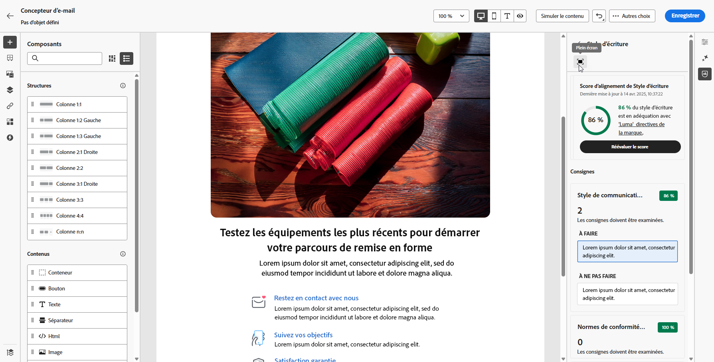
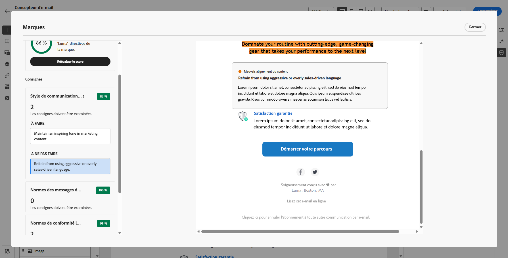

# Alignement sur la marque {#brands-score}

>[!CONTEXTUALHELP]
>id="ajo_brand_score"
>title="Score d’alignement sur la marque"
>abstract="Le score d’alignement sur la marque mesure le niveau de concordance du contenu avec les directives de votre marque, ce qui assure la cohérence des couleurs, des polices, du logo, des images et du style de rédaction."

>[!CONTEXTUALHELP]
>id="ajo_brand_colors"
>title="Score des couleurs"
>abstract="Score des couleurs"

>[!CONTEXTUALHELP]
>id="ajo_brand_fonts"
>title="Score des polices"
>abstract="Score des polices"

>[!CONTEXTUALHELP]
>id="ajo_brand_logos"
>title="Score des logos"
>abstract="Score des logos"

>[!AVAILABILITY]
>
>Vous devez accepter le [contrat d’utilisation](https://www.adobe.com/fr/legal/licenses-terms/adobe-dx-gen-ai-user-guidelines.html){target="_blank"} avant de pouvoir utiliser l’Assistant IA dans Adobe Journey Optimizer. Pour en savoir plus, contactez votre représentant Adobe.

La fonctionnalité d’alignement sur la marque vous permet de créer, de réviser et de gérer le contenu conforme aux directives de votre marque. Elle garantit la cohérence du ton, des messages et de l’identité visuelle dans vos campagnes par e-mail, tout en servant de contrôle qualité avant la mise en ligne de votre contenu.

## Valider le contenu avec l’alignement sur la marque {#validate-content}

Une fois [votre marque configurée et publiée](brands.md), évaluez son score d’alignement directement dans votre campagne par e-mail pour vous assurer que votre contenu correspond à vos directives de marque :

1. Créez votre [campagne par email](../campaigns/create-campaign.md).

1. Ouvrez le menu **[!UICONTROL Alignement sur la marque]** dans le concepteur d’e-mail.

   Votre contenu est automatiquement évalué par rapport à votre marque par défaut. [Découvrez comment attribuer une marque par défaut](brands.md).

   

1. Pour évaluer l’utilisation d’une autre marque, sélectionnez-la dans le menu déroulant **[!UICONTROL Marque]** et cliquez sur **[!UICONTROL Évaluer le score]**.

   

1. Parcourez le **[!UICONTROL Style d’écriture]** ou **[!UICONTROL Contenu visuel]** pour obtenir plus d’informations sur votre score.

   

1. Cliquez sur l’icône  pour afficher plus d’informations sur votre score.

   

1. Sélectionnez une directive avec indicateur pour afficher les commentaires et suggestions spécifiques. L’alignement des marques évalue les catégories suivantes :

   * **[!UICONTROL Style d&#39;écriture]** :
      * **[!UICONTROL Style de communication de la marque]** : définit la personnalité et le ton émotionnel pour garantir une voix de marque cohérente sur tous les canaux.
      * **[!UICONTROL Normes de message de marque]** : règles structurelles et de mise en forme pour un texte marketing et promotionnel efficace.
      * **[!UICONTROL Normes de conformité juridique]** : vérifie que toutes les communications sont conformes aux exigences légales, y compris les listes de contrôle de conformité et l’emplacement des textes.

   * **[!UICONTROL Contenu visuel]** :
      * **[!UICONTROL Normes relatives à la photographie]** : exigences relatives au contenu photographique, notamment la résolution, la composition, l’éclairage et les formats de fichiers.
      * **[!UICONTROL Normes relatives aux illustrations]** : paramètres de style, épaisseur des lignes, utilisation des couleurs et exigences en matière de format de fichier pour les illustrations.
      * **[!UICONTROL Normes relatives aux icônes]** : spécifications de conception des icônes, y compris les systèmes de grille, les épaisseurs de trait et le dimensionnement pour l’uniformité.
      * **[!UICONTROL Instructions d’utilisation]** : bonnes pratiques relatives à la sélection, à l’emplacement et au contexte des images pour conserver l’identité de la marque.

   

1. Modifiez votre contenu en fonction des recommandations pour améliorer l’alignement sur la marque.

1. Réévaluez manuellement le contenu après avoir apporté des modifications pour actualiser votre score d’alignement.

## Valider la qualité du contenu {#validate-quality}

>[!NOTE]
>
>L’évaluation de la qualité du contenu est indépendante de la marque. Même si une marque est sélectionnée dans le menu déroulant, ses directives ne sont pas appliquées au contrôle qualité. La sélection de la marque n’est pertinente que pour la notation de l’alignement de la marque.

Outre l’alignement de la marque, vous pouvez évaluer la qualité générale du contenu afin d’identifier les problèmes potentiels de lisibilité, de cohésion du contenu et d’efficacité, indépendamment des directives de votre marque.

Pour évaluer la qualité de votre contenu :

1. Créez votre [campagne par email](../campaigns/create-campaign.md).

1. Ouvrez le menu **[!UICONTROL Alignement sur la marque]** dans le concepteur d’e-mail.

   

1. Cliquez sur **[!UICONTROL Évaluer le score]** pour générer des scores d’alignement de la marque et de qualité du contenu.

   

1. Accédez à l’onglet **[!UICONTROL Qualité globale]** pour consulter vos informations et recommandations sur la qualité du contenu.

   

1. Cliquez sur l’icône  pour obtenir une vue détaillée de votre score de qualité.

   

1. Sélectionnez un élément avec indicateur pour afficher des commentaires spécifiques et des suggestions d’amélioration exploitables. Les scores sont basés sur les catégories suivantes :

   * **[!UICONTROL Efficacité de CTA]** : évalue dans quelle mesure votre call-to-action motive les lecteurs à effectuer l’action souhaitée.
   * **[!UICONTROL Objet]** : évalue la clarté, la pertinence et la qualité pour attirer l’attention afin d’encourager les ouvertures d’e-mails.
   * **[!UICONTROL Lisibilité]** : mesure à quel point votre contenu est facile à comprendre et attrayant pour les lecteurs et lectrices.
   * **[!UICONTROL Vérification anti-spam]** : identifie les déclencheurs de spam courants susceptibles d&#39;avoir un impact sur la délivrabilité.
   * **[!UICONTROL Cohésion du contenu]** : garantit le bon déroulement de votre contenu et le respect des rubriques.
   * **[!UICONTROL Relecture]** : vérifie les problèmes d’orthographe, de grammaire et de clarté.

   

1. Modifiez votre contenu en fonction des recommandations afin d’améliorer la lisibilité, la cohésion du contenu et la qualité globale.

1. Cliquez sur **[!UICONTROL Réévaluer le score]** après avoir apporté des modifications pour actualiser votre score de qualité.

## Vidéo pratique {#video}

Découvrez comment créer et personnaliser vos propres marques pour définir clairement votre identité visuelle et verbale dans les communications.

+++ Regarder la vidéo

>[!VIDEO](https://video.tv.adobe.com/v/3470548/?captions=fre_fr&learn=on)

+++
