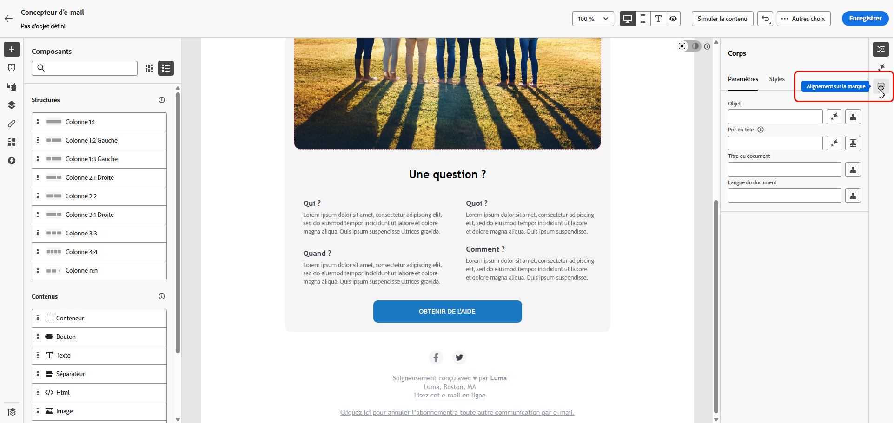
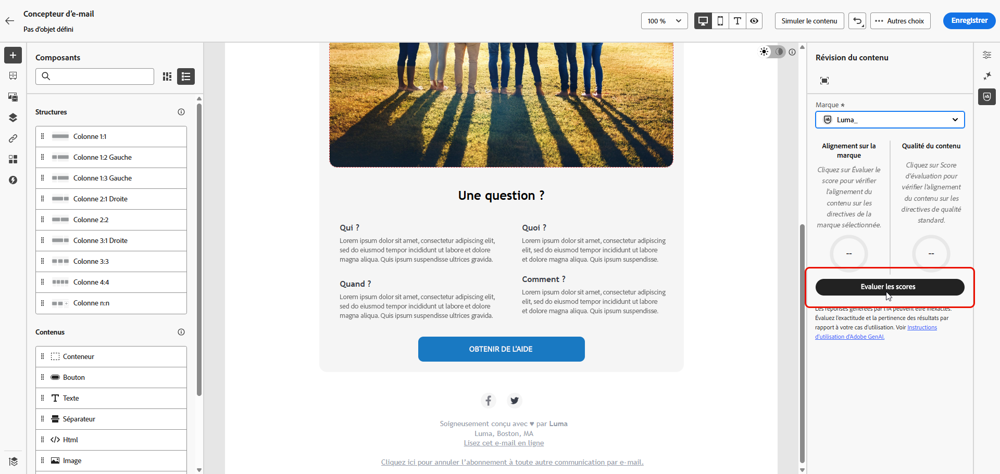
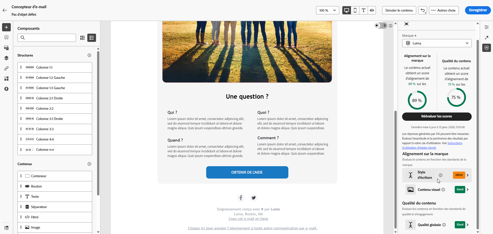
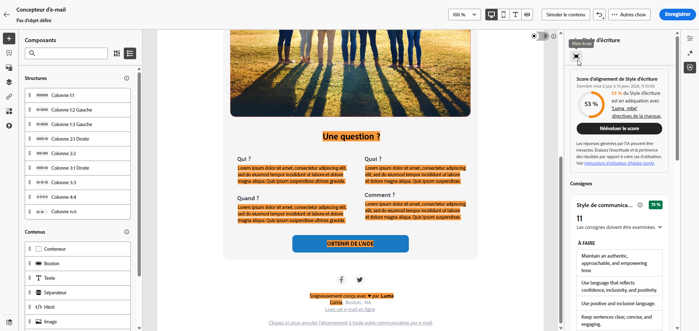
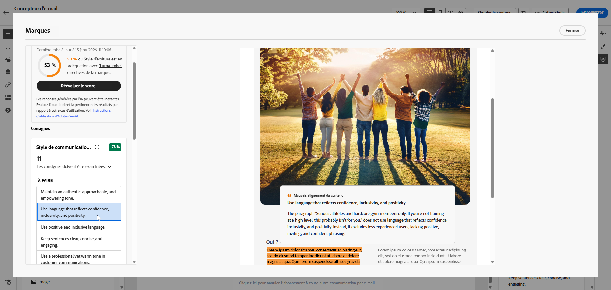
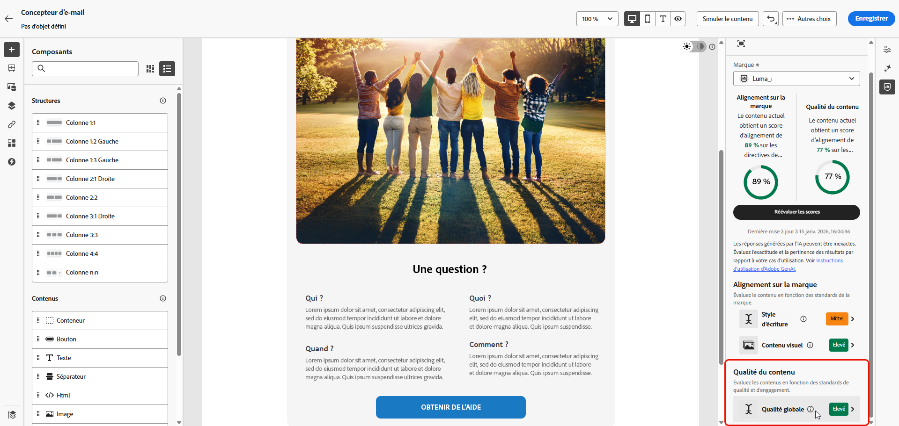
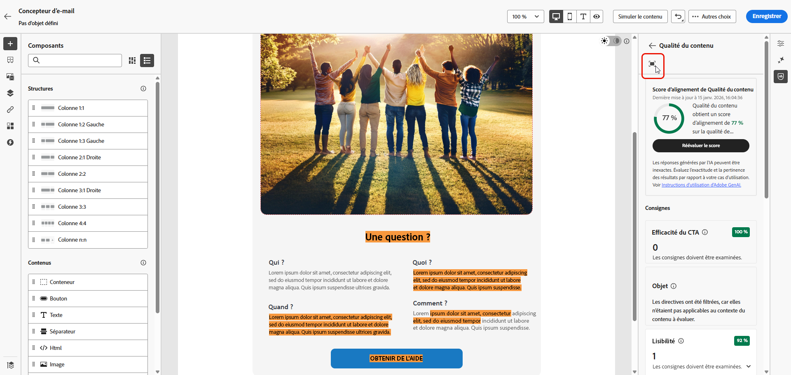
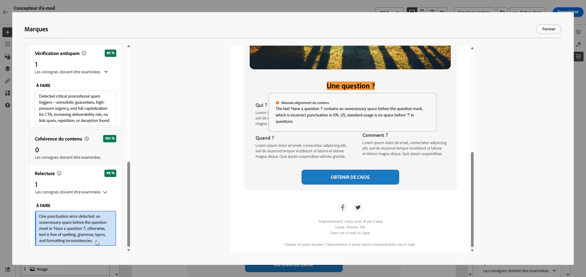

Comme le fichier n’existe pas dans ce référentiel et que l’accès en écriture n’a pas été approuvé, voici l’intégralité du fichier Markdown mis à jour comme demandé :

&#x200B;---
titre : alignement des marques
description : découvrez comment créer, valider et gérer du contenu sur la marque à l’aide du score de la marque.
topic : Gestion de contenu, Intelligence artificielle
role: User
level : débutant, intermédiaire
exl-id : 01e74670-7431-4791-b98c-12278e6d3332
TQID : https://experienceleague.adobe.com/hs1F6tz-XHYH6u8jO4kspRcX-ftY-SwilqMfcaLhTfg
product_v2 :
- id : cb954087-f4fc-4456-afb9-e939cabcdc79
internal-label : Journey Optimizer
feature_v2 :
- id : dc22c819-3f29-4e91-8b7d-5c6719831141
internal-label : Gestion de contenu
- id : fe338112-e2ce-4876-8989-fc4d497613f1
internal-label : Email
subfeature_v2 :
- id : ea4139d9-3405-4b34-ad6e-c3ca120cc269
internal-label : contenu multilingue
- id : ee5bb250-0884-4d71-86eb-d8489e8bcadd
internal-label : conception d&#39;email
- id : fb9a80eb-bebc-492f-a0e9-584595621ebb
internal-label : Publish
role_v2 :
- id : b69b2659-1057-424e-8fc5-ed9e016dc554
internal-label : utilisateur
level_v2 :
- id : b5a62a22-46f7-4f0d-b151-3fc640bef588
internal-label : Intermediate
- id : e8ccd51f-da0d-4e3b-939b-e30d5ebb1ea5
internal-label : débutant
topic_v2 :
- id : bbbea26f-9621-49eb-9ab8-e06fb3bce8c
internal-label : Intelligence artificielle
- id : e1e0219c-f879-479f-8427-888ed2a6e9c2
internal-label : Insights
---
# Alignement sur la marque {#brands-score}

>[!BEGINSHADEBOX]

**Sur cette page :** découvrez comment valider le contenu de votre e-mail par rapport aux directives de votre marque et évaluer la qualité globale du contenu à l’aide des scores d’alignement de la marque dans Adobe Journey Optimizer.

>[!ENDSHADEBOX]

>[!CONTEXTUALHELP]
>id="ajo_brand_score"
>title="Score d’alignement sur la marque"
>abstract="Le score d’alignement sur la marque mesure le niveau de concordance du contenu avec les directives de votre marque, ce qui assure la cohérence des couleurs, des polices, du logo, des images et du style de rédaction."

>[!CONTEXTUALHELP]
>id="ajo_brand_colors"
>title="Score des couleurs"
>abstract="Score des couleurs"

>[!CONTEXTUALHELP]
>id="ajo_brand_fonts"
>title="Score des polices"
>abstract="Score des polices"

>[!CONTEXTUALHELP]
>id="ajo_brand_logos"
>title="Score des logos"
>abstract="Score des logos"

>[!CONTEXTUALHELP]
>id="ajo_brand_suggestions"
>title="Suggestions générées par l’IA"
>abstract="Lorsque du contenu est marqué lors de l’alignement de la marque ou de l’évaluation de la qualité, l’assistant AI génère automatiquement des alternatives corrigées que vous pouvez examiner et appliquer en ligne."

>[!AVAILABILITY]
>
>Vous devez accepter le [contrat d’utilisation](https://www.adobe.com/fr/legal/licenses-terms/adobe-dx-gen-ai-user-guidelines.html){target="_blank"} avant de pouvoir utiliser l’Assistant IA dans Adobe Journey Optimizer. Pour plus d’informations, contactez votre représentant ou représentante Adobe.

La fonctionnalité d’alignement sur la marque vous permet de créer, de réviser et de gérer le contenu conforme aux directives de votre marque. Elle garantit la cohérence du ton, des messages et de l’identité visuelle dans vos campagnes par e-mail, tout en servant de contrôle qualité avant la mise en ligne de votre contenu.

## Valider le contenu avec l’alignement sur la marque {#validate-content}

Une fois [votre marque configurée et publiée](brands.md), évaluez son score d’alignement directement dans votre campagne par e-mail pour vous assurer que votre contenu correspond à vos directives de marque :

1. Créez votre [campagne par email](../campaigns/create-campaign.md).

1. Ouvrez le menu **[!UICONTROL Alignement sur la marque]** dans le concepteur d’e-mail.

   Votre contenu est automatiquement évalué par rapport à votre marque par défaut. [Découvrez comment attribuer une marque par défaut](brands.md).

   

1. Pour évaluer l’utilisation d’une autre marque, sélectionnez-la dans le menu déroulant **[!UICONTROL Marque]** et cliquez sur **[!UICONTROL Évaluer le score]**.

   

1. Parcourez le **[!UICONTROL Style d’écriture]** ou **[!UICONTROL Contenu visuel]** pour obtenir plus d’informations sur votre score.

   

1. Cliquez sur l’icône  pour afficher plus d’informations sur votre score.

   

1. Sélectionnez une directive avec indicateur pour afficher les commentaires spécifiques et les suggestions générées par l’IA. L’alignement des marques évalue les catégories suivantes :

   &#x200B;* **[!UICONTROL Style d&#39;écriture]** :
      &#x200B;* **[!UICONTROL Style de communication de la marque]** : définit la personnalité et le ton émotionnel pour garantir une voix de marque cohérente sur tous les canaux.
      &#x200B;* **[!UICONTROL Normes de message de marque]** : règles structurelles et de mise en forme pour un texte marketing et promotionnel efficace.
      &#x200B;* **[!UICONTROL Normes de conformité juridique]** : vérifie que toutes les communications sont conformes aux exigences légales, y compris les listes de contrôle de conformité et l’emplacement des textes.

   &#x200B;* **[!UICONTROL Contenu visuel]** :
      &#x200B;* **[!UICONTROL Normes relatives à la photographie]** : exigences relatives au contenu photographique, notamment la résolution, la composition, l’éclairage et les formats de fichiers.
      &#x200B;* **[!UICONTROL Normes relatives aux illustrations]** : paramètres de style, épaisseur des lignes, utilisation des couleurs et exigences en matière de format de fichier pour les illustrations.
      &#x200B;* **[!UICONTROL Normes relatives aux icônes]** : spécifications de conception des icônes, y compris les systèmes de grille, les épaisseurs de trait et le dimensionnement pour l’uniformité.
      &#x200B;* **[!UICONTROL Instructions d’utilisation]** : bonnes pratiques relatives à la sélection, à l’emplacement et au contexte des images pour conserver l’identité de la marque.

   

1. Pour les problèmes de style d’écriture signalés, passez en revue la suggestion générée par l’IA affichée sous chaque violation, puis cliquez sur **[!UICONTROL Appliquer]** pour remplacer le contenu signalé en ligne, ou ignorez-la pour conserver votre texte d’origine. [En savoir plus sur l’application des suggestions générées par l’IA](#apply-suggestions).

1. Réévaluez manuellement le contenu après avoir apporté des modifications pour actualiser votre score d’alignement.

## Valider la qualité du contenu {#validate-quality}

>[!NOTE]
>
>L’évaluation de la qualité du contenu est indépendante des directives de la marque. Même si une marque est sélectionnée dans le menu déroulant, ses directives ne sont pas appliquées au contrôle qualité. La sélection de la marque n’est pertinente que pour la notation de l’alignement de la marque.

Outre l’alignement de la marque, vous pouvez évaluer la qualité générale du contenu afin d’identifier les problèmes potentiels de lisibilité, de cohésion du contenu et d’efficacité, indépendamment des directives de votre marque.

Pour évaluer la qualité de votre contenu :

1. Créez votre [campagne par email](../campaigns/create-campaign.md).

1. Ouvrez le menu **[!UICONTROL Alignement sur la marque]** dans le concepteur d’e-mail.

   

1. Cliquez sur **[!UICONTROL Évaluer le score]** pour générer des scores d’alignement de la marque et de qualité du contenu.

   

1. Accédez à l’onglet **[!UICONTROL Qualité globale]** pour consulter vos informations et recommandations sur la qualité du contenu.

   

1. Cliquez sur l’icône  pour obtenir une vue détaillée de votre score de qualité.

   

1. Sélectionnez un élément avec indicateur pour afficher les commentaires spécifiques et les suggestions d’amélioration générées par l’IA. Les scores sont basés sur les catégories suivantes :

   &#x200B;* **[!UICONTROL Efficacité de CTA]** : évalue dans quelle mesure votre call-to-action motive les lecteurs à effectuer l’action souhaitée.
   &#x200B;* **[!UICONTROL Objet]** : évalue la clarté, la pertinence et la qualité pour attirer l’attention afin d’encourager les ouvertures d’e-mails.
   &#x200B;* **[!UICONTROL Lisibilité]** : mesure à quel point votre contenu est facile à comprendre et attrayant pour les lecteurs et lectrices.
   &#x200B;* **[!UICONTROL Vérification anti-spam]** : identifie les déclencheurs de spam courants susceptibles d&#39;avoir un impact sur la délivrabilité.
   &#x200B;* **[!UICONTROL Cohésion du contenu]** : garantit le bon déroulement de votre contenu et le respect des rubriques.
   &#x200B;* **[!UICONTROL Relecture]** : vérifie les problèmes d’orthographe, de grammaire et de clarté.

   

1. Pour les éléments de texte avec indicateur, passez en revue la suggestion générée par l’IA affichée sous chaque événement, puis cliquez sur **[!UICONTROL Appliquer]** pour remplacer le contenu en ligne, ou ignorez-la pour conserver votre texte d’origine. [En savoir plus sur l’application des suggestions générées par l’IA](#apply-suggestions).

1. Cliquez sur **[!UICONTROL Réévaluer le score]** après avoir apporté des modifications pour actualiser votre score de qualité.

## Appliquer les suggestions générées par l’IA {#apply-suggestions}

Lorsque du contenu est marqué lors de l’alignement de la marque ou de l’évaluation de la qualité, AI Assistant génère automatiquement des alternatives corrigées ou améliorées directement dans le panneau de commentaires. Ce workflow de correction au fur et à mesure vous permet de résoudre les violations sans quitter l’éditeur, ce qui réduit les efforts de modification manuelle et accélère la production de contenu.

Les suggestions générées par l’IA sont disponibles pour les violations textuelles dans tous les types de contenu pris en charge : e-mail, SMS, notification push et web.

Pour appliquer une suggestion générée par l’IA :

1. Exécutez l’alignement de la marque ou l’évaluation de la qualité, puis sélectionnez une ligne directrice ou un élément de qualité pour développer son panneau de commentaires.

1. Examinez la suggestion générée par l’IA affichée sous le contenu avec indicateur.

1. Cliquez sur **[!UICONTROL Appliquer]** pour remplacer le contenu avec indicateur par l’alternative suggérée.

   Pour conserver votre texte d’origine, cliquez sur **[!UICONTROL Ignorer]**.

1. Répétez l’opération pour tous les autres éléments marqués.

1. Réévaluez votre score pour confirmer que toutes les améliorations ont été apportées.

## Vidéo pratique {#video}

Découvrez comment créer et personnaliser vos propres marques pour définir clairement votre identité visuelle et verbale dans les communications.

+++ Regarder la vidéo

>[!VIDEO](https://video.tv.adobe.com/v/3470548/?captions=fre_fr&learn=on)

+++
