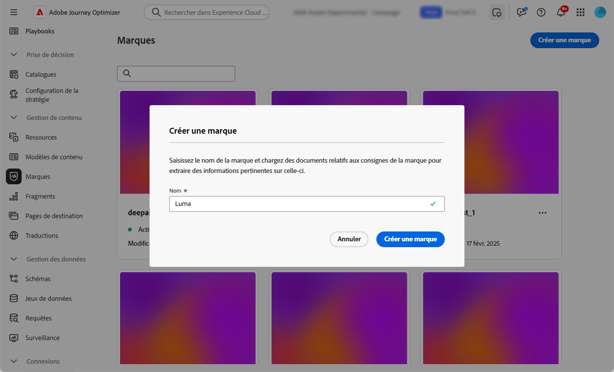

# Créer et gérer vos marques {#brands}

>[!AVAILABILITY]
>
>Cette fonctionnalité est disponible en version bêta privée. Elle sera progressivement disponible pour tous les clients dans les prochaines versions.

Les directives sur la marque sont un ensemble détaillé de règles et de normes qui établissent l&#39;identité visuelle et verbale d&#39;une marque. Ils servent de référence pour maintenir une représentation cohérente de la marque sur toutes les plateformes de marketing et de communication.

<!--Upload feature currently behind feature flag--

In [!DNL Journey Optimizer], you now have the option to manually input and organize your brand details or upload brand guideline documents for automatic information extraction.-->

## Accéder aux marques {#generative-access}

Pour accéder au menu **[!UICONTROL Marques]** dans [!DNL Adobe Journey Optimizer], les utilisateurs doivent disposer des autorisations **[!UICONTROL Kit de marque gérée]** ou **[!UICONTROL Activer l’assistant d’IA]**. [En savoir plus](../administration/permissions.md)

+++  Découvrez comment attribuer des autorisations liées à la marque

1. Dans le produit **Autorisations**, accédez à l’onglet **Rôles** et sélectionnez le **Rôle** de votre choix.

1. Cliquez sur **Modifier** pour modifier les autorisations.

1. Ajoutez la ressource **Assistant IA**, puis sélectionnez **Kit de marque géré** ou **[!UICONTROL Activer l’assistant IA]** dans le menu déroulant.

   Notez que l’autorisation **[!UICONTROL Activer l’assistant d’IA]** permet uniquement d’accéder en lecture seule au menu **[!UICONTROL Marques]**.

   {zoomable="yes"}

1. Cliquez sur **Enregistrer** pour appliquer vos modifications.

   Les autorisations des personnes déjà affectées à ce rôle seront automatiquement mises à jour.

1. Pour attribuer ce rôle à de nouvelles personnes, accédez à l’onglet **Utilisateurs et utilisatrices** du tableau de bord **Rôles** et cliquez sur **Ajouter un utilisateur ou une utilisatrice**.

1. Saisissez le nom de la personne, son adresse e-mail ou choisissez dans la liste, puis cliquez sur **Enregistrer**.

1. Si le profil de l’utilisateur ou de l’utilisatrice n’a pas été créé auparavant, consultez cette [documentation](https://experienceleague.adobe.com/fr/docs/experience-platform/access-control/abac/permissions-ui/users).

+++

## Création de votre marque {#create-brand-kit}

Pour créer et gérer vos directives de marque, procédez comme suit.

<!--Upload feature currently behind feature flag--

To create and manage your Brand guideline, you can either enter the details yourself, or upload your brand guidelines document to have the information extracted automatically:-->

1. Dans le menu **[!UICONTROL Marques]**, cliquez sur **[!UICONTROL Créer une marque]**.

   

1. Saisissez un **[!UICONTROL Nom]** pour votre marque<!--and a **[!UICONTROL Description]** to your brand guideline-->.

   

<!--Upload feature currently behind feature flag so hidden from doc - should be available again by EOM (Feb)--

1. Drag and drop or select your file to upload your brand guidelines and extract automatically relevant brand information. Click **[!UICONTROL Create brand]**.

    The information extraction process now begins. Note that it may take several minutes to complete.

    

1. Your Content and visual creation standards are now automatically populated. Browse through the different tabs to adapt the information as needed.

-->

1. Dans l’onglet **[!UICONTROL Style d’écriture]**, cliquez sur  pour ajouter une instruction ou une exclusion, ainsi que des exemples.

   

1. Dans l’onglet **[!UICONTROL Contenu visuel]**, cliquez sur  pour ajouter une autre directive ou exclusion.

1. Pour ajouter une image montrant une utilisation correcte, sélectionnez **[!UICONTROL Exemple]** et cliquez sur **[!UICONTROL Sélectionner une image]**. Vous pouvez également ajouter une image montrant une utilisation incorrecte comme exemple d’exclusion.

   

1. Une fois la configuration effectuée, cliquez sur **[!UICONTROL Enregistrer]** puis **[!UICONTROL Publier]** pour rendre vos directives de marque disponibles dans l’assistant d’IA.

1. Pour apporter des modifications à votre marque publiée, cliquez sur **[!UICONTROL Modifier la marque]**.

   >[!NOTE]
   >
   >Cela crée une copie temporaire en mode d’édition, qui remplace la version active une fois publiée.

   

1. Dans le tableau de bord **[!UICONTROL Marques]**, ouvrez le menu avancé en cliquant sur l’icône  pour :

   * Afficher la marque
   * Modifier
   * Dupliquer
   * Publier
   * Dépublier
   * Supprimer

   

Les directives de votre marque sont désormais accessibles à partir de la liste déroulante **[!UICONTROL Marque]** dans le menu de l’assistant d’IA, ce qui lui permet de générer du contenu et des ressources conformes à vos spécifications. [En savoir plus sur l’assistant IA](gs-generative.md)

