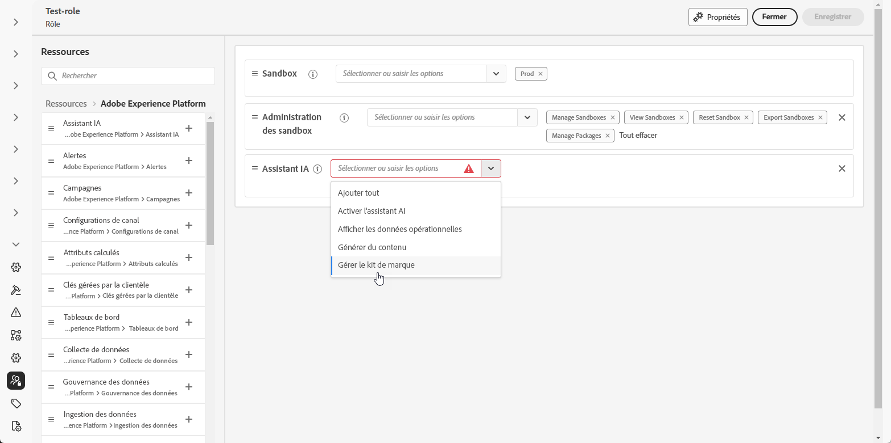
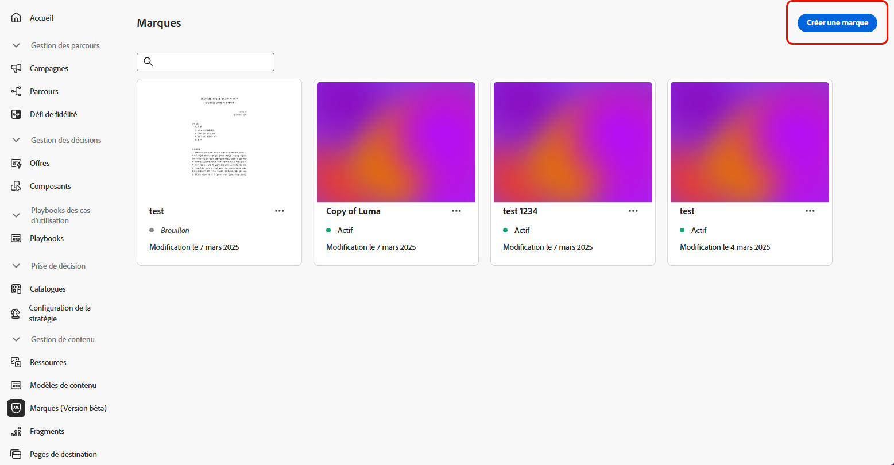
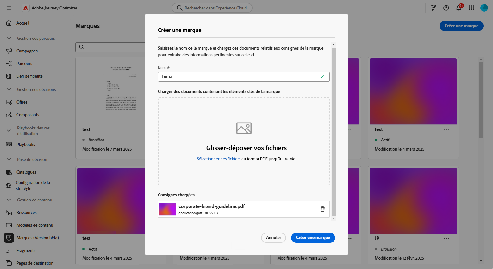
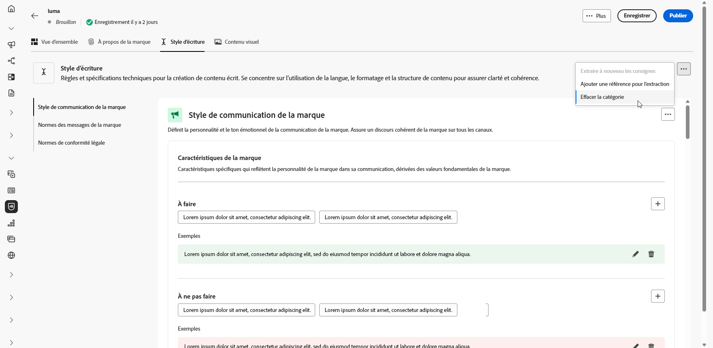
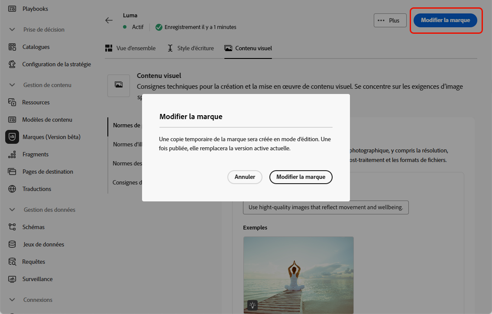
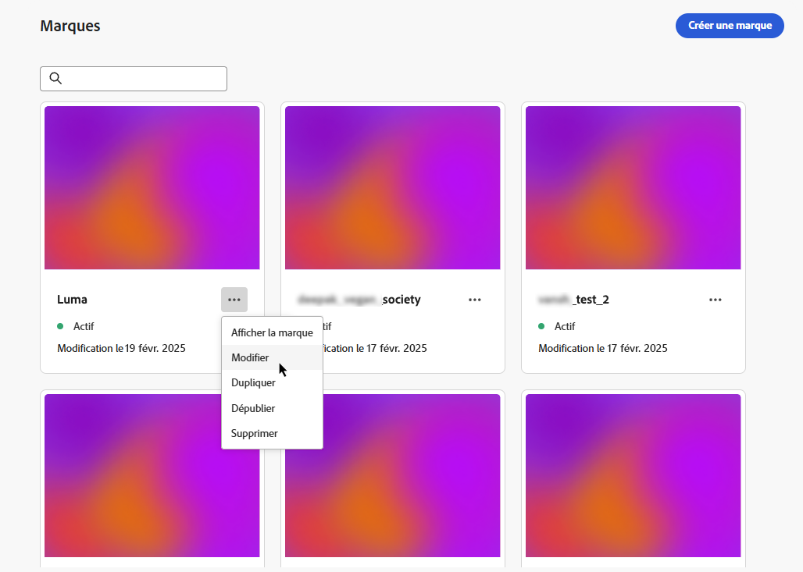
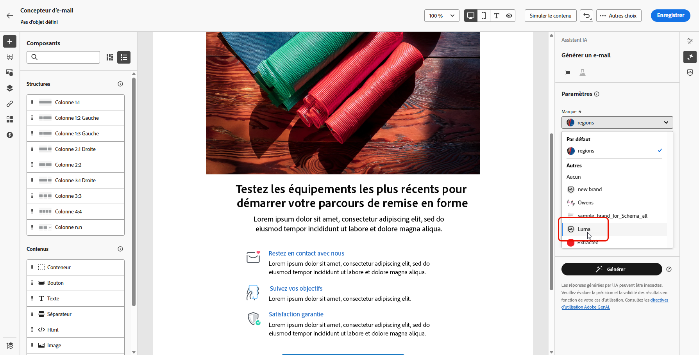
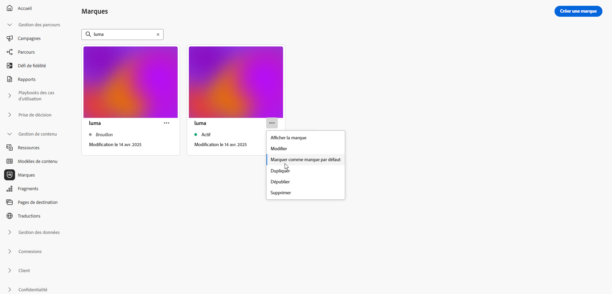

# Créer et gérer vos marques {#brands}

>[!CONTEXTUALHELP]
>id="ajo_brand_overview"
>title="Commencer avec les marques"
>abstract="Créez et personnalisez vos propres marques pour définir votre identité visuelle et verbale unique, tout en facilitant la génération de contenu correspondant au style et à la voix de votre marque."

>[!CONTEXTUALHELP]
>id="ajo_brand_ai_menu"
>title="Sélectionner votre marque"
>abstract="Choisissez votre marque pour vous assurer que tout le contenu généré par l’IA est adapté aux spécifications et aux directives de votre marque."

>[!CONTEXTUALHELP]
>id="ajo_brand_score_overview"
>title="Sélection de la marque"
>abstract="Sélectionnez votre marque pour vous assurer que votre contenu est conçu conformément à ses directives, standards et identités spécifiques, en préservant la cohérence et l’intégrité de la marque."

Les consignes de marque sont un ensemble détaillé de règles et de normes qui établissent l’identité visuelle et verbale d’une marque. Elles servent de référence pour maintenir une représentation cohérente de la marque sur toutes les plateformes de marketing et de communication.

Dans [!DNL Journey Optimizer], vous avez désormais la possibilité de saisir et d’organiser manuellement les détails de votre marque ou de charger des documents de directives pour une extraction automatique des informations.

>[!AVAILABILITY]
>
>Vous devez accepter le [contrat d’utilisation](https://www.adobe.com/fr/legal/licenses-terms/adobe-dx-gen-ai-user-guidelines.html){target="_blank"} avant de pouvoir utiliser l’Assistant IA dans Adobe Journey Optimizer. Pour en savoir plus, contactez votre représentant Adobe.

## Accéder aux marques {#generative-access}

Pour accéder au menu **[!UICONTROL Marques]** dans [!DNL Adobe Journey Optimizer], vous devez disposer des autorisations **[!UICONTROL Gérer le kit de marque]** ou **[!UICONTROL Activer l’Assistant IA]**. [En savoir plus](../administration/permissions.md)

+++  Découvrez comment attribuer des autorisations liées à la marque.

Pour attribuer des autorisations aux marques, procédez comme suit :

1. Dans le produit **Autorisations**, accédez à l’onglet **Rôles** et sélectionnez le **Rôle** de votre choix.

1. Cliquez sur **Modifier** pour modifier les autorisations.

1. Ajoutez la ressource **Assistant IA**, puis sélectionnez **Gérer le kit de marque** ou **[!UICONTROL Activer l’Assistant IA]** dans le menu déroulant.

   Notez que l’autorisation **[!UICONTROL Activer l’Assistant IA]** permet uniquement d’accéder en lecture seule au menu **[!UICONTROL Marques]**.

   {zoomable="yes"}

1. Cliquez sur **Enregistrer** pour appliquer vos modifications.

   Les autorisations des personnes déjà affectées à ce rôle seront automatiquement mises à jour.

1. Pour attribuer ce rôle à de nouvelles personnes, accédez à l’onglet **Utilisateurs et utilisatrices** du tableau de bord **Rôles** et cliquez sur **Ajouter un utilisateur ou une utilisatrice**.

1. Saisissez le nom de la personne, son adresse e-mail ou choisissez dans la liste, puis cliquez sur **Enregistrer**.

1. Si le profil de l’utilisateur ou de l’utilisatrice n’a pas été créé auparavant, consultez cette [documentation](https://experienceleague.adobe.com/fr/docs/experience-platform/access-control/abac/permissions-ui/users).

+++

## Créer et gérer votre marque {#create-brand-kit}

>[!CONTEXTUALHELP]
>id="ajo_brands_create"
>title="Créer votre marque"
>abstract="Saisissez votre nom de marque et chargez votre fichier de directives de marque. L’outil extrait automatiquement les détails clés, ce qui facilite la gestion de l’identité de votre marque."

Pour créer et gérer vos directives de marque, vous pouvez saisir vous-même les détails ou charger votre document de directives de marque pour que les informations soient extraites automatiquement :

1. Dans le menu **[!UICONTROL Marques]**, cliquez sur **[!UICONTROL Créer une marque]**.

   

1. Saisissez le **[!UICONTROL Nom]** de votre marque.

1. Effectuez un glisser-déposer ou sélectionnez votre fichier pour charger vos directives de marque et extraire automatiquement les informations pertinentes sur la marque. Cliquez sur **[!UICONTROL Créer une marque]**.

   Le processus d’extraction des informations commence maintenant. Notez que l’opération peut prendre plusieurs minutes.

   

1. Vos standards de création visuelle et de contenu sont désormais automatiquement renseignés. Parcourez les différents onglets pour adapter les informations selon vos besoins. [En savoir plus](#personalize)

1. À partir du menu avancé de chaque section ou catégorie, vous pouvez ajouter des références pour extraire automatiquement les informations de marque pertinentes ou exécuter à nouveau l’extraction pour mettre à jour les directives existantes.

   Pour supprimer du contenu existant, utilisez les options **[!UICONTROL Effacer la section]** ou **[!UICONTROL Effacer la catégorie]**.

   

1. Cliquez sur **[!UICONTROL Filtrer]** pour filtrer les instructions par canal ou type d’élément.

   

1. Une fois la configuration effectuée, cliquez sur **[!UICONTROL Enregistrer]**, puis sur **[!UICONTROL Publier]** pour rendre les consignes de votre marque disponibles dans l’Assistant IA.

1. Pour apporter des modifications à votre marque publiée, cliquez sur **[!UICONTROL Modifier la marque]**.

   >[!NOTE]
   >
   >Cette opération crée une copie temporaire en mode d’édition, qui remplace la version active une fois publiée.

   

1. Dans le tableau de bord **[!UICONTROL Marques]**, ouvrez le menu avancé en cliquant sur l’icône  pour :

   * Afficher la marque
   * Ouvrir dans un nouvel onglet
   * Modifier
   * Marquer comme marque par défaut
   * Dupliquer
   * Publier
   * Dépublier
   * Supprimer

   

Les consignes de votre marque sont désormais accessibles à partir de la liste déroulante **[!UICONTROL Marque]** du menu de l’Assistant IA, ce qui lui permet de générer du contenu et des ressources dans le ton de votre marque. [En savoir plus sur l’Assistant IA](gs-generative.md).

### Définir une marque par défaut {#default-brand}

Vous pouvez désigner une marque par défaut qui sera appliquée automatiquement lors de la génération du contenu et du calcul des scores d’alignement pendant la création des campagnes.

Pour définir une marque par défaut, accédez au tableau de bord **[!UICONTROL Marques]**. Ouvrez le menu avancé en cliquant sur l’icône  et sélectionnez **[!UICONTROL Marquer comme marque par défaut]**.

