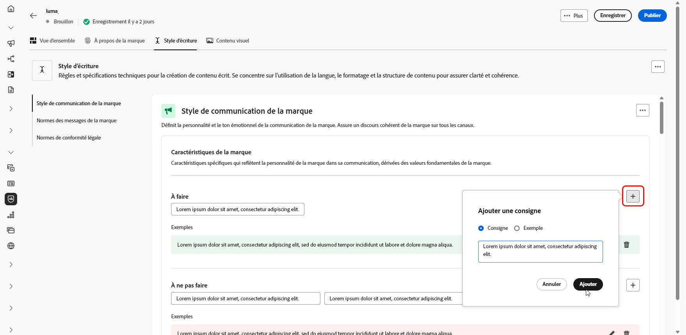

# Créer et gérer vos marques {#brands}

>[!CONTEXTUALHELP]
>id="ajo_brand_overview"
>title="Prise en main des marques"
>abstract="Créez et personnalisez vos propres marques pour définir votre identité visuelle et verbale unique tout en facilitant la génération de contenu correspondant au style et à la voix de votre marque."

>[!CONTEXTUALHELP]
>id="ajo_brand_ai_menu"
>title="Sélectionner votre marque"
>abstract="Choisissez votre marque pour vous assurer que tout le contenu généré par l’IA est adapté conformément aux spécifications et aux directives de votre marque."

>[!CONTEXTUALHELP]
>id="ajo_brand_score_overview"
>title="Sélection de la marque"
>abstract="Sélectionnez votre marque pour vous assurer que votre contenu est conçu conformément à ses directives, normes et identités spécifiques, en préservant la cohérence et l’intégrité de la marque."

>[!CONTEXTUALHELP]
>id="ajo_brand_score"
>title="Score d’alignement de la marque"
>abstract="Le score d’alignement de votre marque mesure dans quelle mesure votre contenu respecte les directives de votre marque, en assurant la cohérence des couleurs, des polices, du logo, des images et du style d’écriture."

>[!CONTEXTUALHELP]
>id="ajo_brand_colors"
>title="Score des couleurs"
>abstract="Score des couleurs"

>[!CONTEXTUALHELP]
>id="ajo_brand_fonts"
>title="Score des polices"
>abstract="Score des polices"

>[!CONTEXTUALHELP]
>id="ajo_brand_logos"
>title="Score des logos"
>abstract="Score des logos"

>[!CONTEXTUALHELP]
>id="ajo_brand_imagery"
>title="Score de l’imagerie"
>abstract="Score de l’imagerie"

>[!CONTEXTUALHELP]
>id="ajo_brand_writing_style"
>title="Écriture du score de style"
>abstract="Écriture du score de style"

>[!AVAILABILITY]
>
>Cette fonctionnalité est publiée en version Private Beta. Elle sera progressivement disponible pour l’ensemble de la clientèle dans les versions ultérieures.

Les consignes de marque sont un ensemble détaillé de règles et de normes qui établissent l’identité visuelle et verbale d’une marque. Elles servent de référence pour maintenir une représentation cohérente de la marque sur toutes les plateformes de marketing et de communication.

Dans [!DNL Journey Optimizer], vous avez désormais la possibilité de saisir et d’organiser manuellement les détails de votre marque ou de télécharger des documents de directives sur la marque pour l’extraction automatique des informations.

## Accéder aux marques {#generative-access}

Pour accéder au menu **[!UICONTROL Marques]** dans [!DNL Adobe Journey Optimizer], vous devez disposer des autorisations **[!UICONTROL Kit de marque géré]** ou **[!UICONTROL Activer l’Assistant IA]**. [En savoir plus](../administration/permissions.md)

+++  Découvrez comment attribuer des autorisations liées à la marque.

1. Dans le produit **Autorisations**, accédez à l’onglet **Rôles** et sélectionnez le **Rôle** de votre choix.

1. Cliquez sur **Modifier** pour modifier les autorisations.

1. Ajoutez la ressource **Assistant IA**, puis sélectionnez **Kit de marque géré** ou **[!UICONTROL Activer l’Assistant IA]** dans le menu déroulant.

   Notez que l’autorisation **[!UICONTROL Activer l’Assistant IA]** permet uniquement d’accéder en lecture seule au menu **[!UICONTROL Marques]**.

   {zoomable="yes"}

1. Cliquez sur **Enregistrer** pour appliquer vos modifications.

   Les autorisations des personnes déjà affectées à ce rôle seront automatiquement mises à jour.

1. Pour attribuer ce rôle à de nouvelles personnes, accédez à l’onglet **Utilisateurs et utilisatrices** du tableau de bord **Rôles** et cliquez sur **Ajouter un utilisateur ou une utilisatrice**.

1. Saisissez le nom de la personne, son adresse e-mail ou choisissez dans la liste, puis cliquez sur **Enregistrer**.

1. Si le profil de l’utilisateur ou de l’utilisatrice n’a pas été créé auparavant, consultez cette [documentation](https://experienceleague.adobe.com/fr/docs/experience-platform/access-control/abac/permissions-ui/users).

+++

## Créer votre marque {#create-brand-kit}

>[!CONTEXTUALHELP]
>id="ajo_brands_create"
>title="Créer votre marque"
>abstract="Saisissez votre nom de marque et téléchargez votre fichier de directives de marque. L&#39;outil extrait automatiquement les détails clés, ce qui facilite la gestion de l&#39;identité de votre marque."

Pour créer et gérer vos directives de marque, vous pouvez saisir vous-même les détails ou charger votre document de directives de marque pour que les informations soient extraites automatiquement :

1. Dans le menu **[!UICONTROL Marques]**, cliquez sur **[!UICONTROL Créer une marque]**.

   

1. Saisissez un **[!UICONTROL Nom]** pour votre marque.

1. Effectuez un glisser-déposer ou sélectionnez votre fichier pour charger les directives de votre marque et extraire automatiquement les informations pertinentes sur la marque. Cliquez sur **[!UICONTROL Créer une marque]**.

   Le processus d’extraction des informations commence maintenant. Notez que cette opération peut prendre plusieurs minutes.

   

1. Vos normes de création visuelle et de contenu sont désormais automatiquement renseignées. Parcourez les différents onglets pour adapter les informations selon vos besoins.

1. Dans l’onglet **[!UICONTROL Style d’écriture]**, cliquez sur  pour ajouter une consigne ou une exclusion, ainsi que des exemples.

   

1. Dans l’onglet **[!UICONTROL Contenu visuel]**, cliquez sur  pour ajouter une autre consigne ou exclusion.

1. Pour ajouter une image attestant d’une utilisation correcte, sélectionnez **[!UICONTROL Exemple]** et cliquez sur **[!UICONTROL Sélectionner une image]**. Vous pouvez également ajouter une image montrant une utilisation incorrecte comme exemple d’exclusion.

   

1. Une fois la configuration effectuée, cliquez sur **[!UICONTROL Enregistrer]**, puis sur **[!UICONTROL Publier]** pour rendre vos consignes de marque disponibles dans l’Assistant IA.

1. Pour apporter des modifications à votre marque publiée, cliquez sur **[!UICONTROL Modifier la marque]**.

   >[!NOTE]
   >
   >Cette opération crée une copie temporaire en mode d’édition, qui remplace la version active une fois publiée.

   

1. Dans le tableau de bord **[!UICONTROL Marques]**, ouvrez le menu avancé en cliquant sur l’icône  pour :

   * Afficher la marque
   * Modifier
   * Dupliquer
   * Publier
   * Dépublier
   * Supprimer

   

Les consignes relatives à votre marque sont désormais accessibles à partir de la liste déroulante **[!UICONTROL Marque]** du menu de l’Assistant IA, ce qui lui permet de générer du contenu et des ressources dans le ton de votre marque. [En savoir plus sur l’Assistant IA](gs-generative.md)

