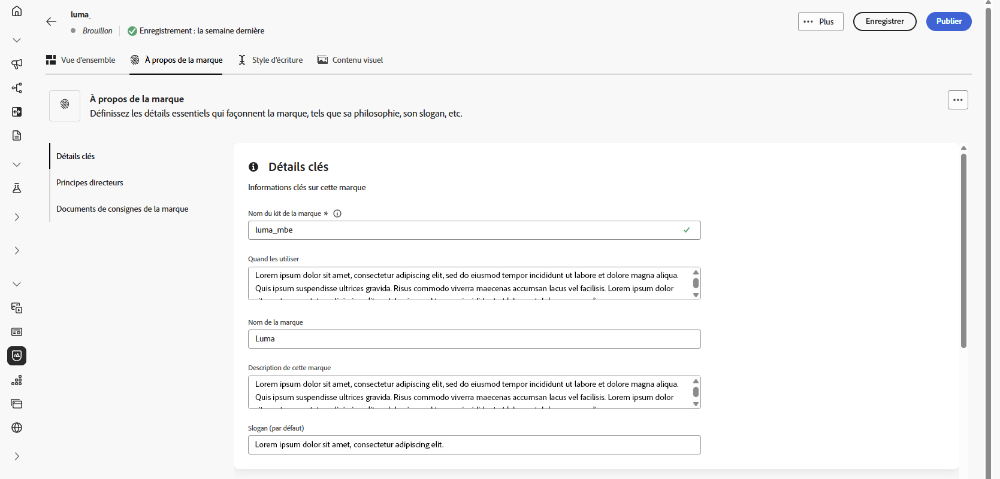
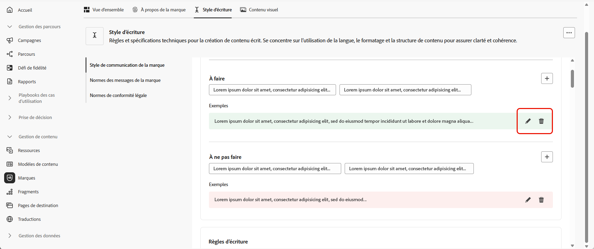
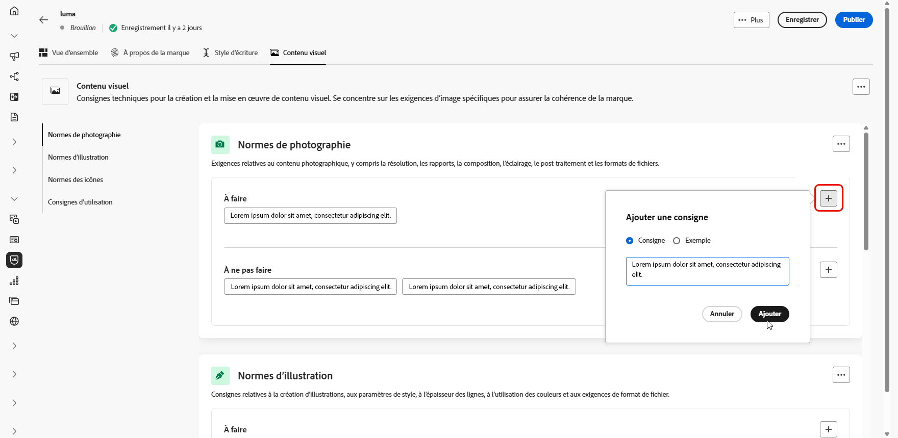
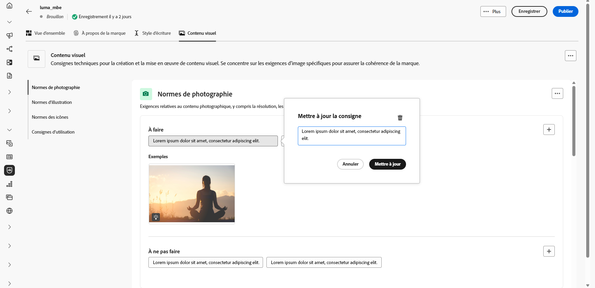

# Créer et gérer vos marques {#brands}

>[!CONTEXTUALHELP]
>id="ajo_brand_overview"
>title="Commencer avec les marques"
>abstract="Créez et personnalisez vos propres marques pour définir votre identité visuelle et verbale unique, tout en facilitant la génération de contenu correspondant au style et à la voix de votre marque."

>[!CONTEXTUALHELP]
>id="ajo_brand_ai_menu"
>title="Sélectionner votre marque"
>abstract="Choisissez votre marque pour vous assurer que tout le contenu généré par l’IA est adapté aux spécifications et aux directives de votre marque."

>[!CONTEXTUALHELP]
>id="ajo_brand_score_overview"
>title="Sélection de la marque"
>abstract="Sélectionnez votre marque pour vous assurer que votre contenu est conçu conformément à ses directives, standards et identités spécifiques, en préservant la cohérence et l’intégrité de la marque."

>[!AVAILABILITY]
>
>Cette fonctionnalité est publiée en version Private Beta. Elle sera progressivement disponible pour l’ensemble de la clientèle dans les versions ultérieures.
>Vous devez accepter le [contrat d’utilisation](https://www.adobe.com/fr/legal/licenses-terms/adobe-dx-gen-ai-user-guidelines.html){target="_blank"} avant de pouvoir utiliser l’assistant AI dans Adobe Journey Optimizer. Pour plus d’informations, contactez votre représentant ou représentante Adobe.

Les consignes de marque sont un ensemble détaillé de règles et de normes qui établissent l’identité visuelle et verbale d’une marque. Elles servent de référence pour maintenir une représentation cohérente de la marque sur toutes les plateformes de marketing et de communication.

Dans [!DNL Journey Optimizer], vous avez désormais la possibilité de saisir et d’organiser manuellement les détails de votre marque ou de charger des documents de directives pour une extraction automatique des informations.

## Accéder aux marques {#generative-access}

Pour accéder au menu **[!UICONTROL Marques]** dans [!DNL Adobe Journey Optimizer], les utilisateurs doivent disposer des autorisations **[!UICONTROL Gérer le kit de marque]** ou **[!UICONTROL Activer l’assistant d’IA]**. [En savoir plus](../administration/permissions.md)

+++  Découvrez comment attribuer des autorisations liées à la marque.

1. Dans le produit **Autorisations**, accédez à l’onglet **Rôles** et sélectionnez le **Rôle** de votre choix.

1. Cliquez sur **Modifier** pour modifier les autorisations.

1. Ajoutez la ressource **Assistant IA**, puis sélectionnez **Gérer le kit de marque** ou **[!UICONTROL Activer l’assistant IA]** dans le menu déroulant.

   Notez que l’autorisation **[!UICONTROL Activer l’Assistant IA]** permet uniquement d’accéder en lecture seule au menu **[!UICONTROL Marques]**.

   {zoomable="yes"}

1. Cliquez sur **Enregistrer** pour appliquer vos modifications.

   Les autorisations des personnes déjà affectées à ce rôle seront automatiquement mises à jour.

1. Pour attribuer ce rôle à de nouvelles personnes, accédez à l’onglet **Utilisateurs et utilisatrices** du tableau de bord **Rôles** et cliquez sur **Ajouter un utilisateur ou une utilisatrice**.

1. Saisissez le nom de la personne, son adresse e-mail ou choisissez dans la liste, puis cliquez sur **Enregistrer**.

1. Si le profil de l’utilisateur ou de l’utilisatrice n’a pas été créé auparavant, consultez cette [documentation](https://experienceleague.adobe.com/fr/docs/experience-platform/access-control/abac/permissions-ui/users).

+++

## Créer et gérer votre marque {#create-brand-kit}

>[!CONTEXTUALHELP]
>id="ajo_brands_create"
>title="Créer votre marque"
>abstract="Saisissez votre nom de marque et chargez votre fichier de directives de marque. L’outil extrait automatiquement les détails clés, ce qui facilite la gestion de l’identité de votre marque."

Pour créer et gérer vos directives de marque, vous pouvez saisir vous-même les détails ou charger votre document de directives de marque pour que les informations soient extraites automatiquement :

1. Dans le menu **[!UICONTROL Marques]**, cliquez sur **[!UICONTROL Créer une marque]**.

   

1. Saisissez le **[!UICONTROL Nom]** de votre marque.

1. Effectuez un glisser-déposer ou sélectionnez votre fichier pour charger vos directives de marque et extraire automatiquement les informations pertinentes sur la marque. Cliquez sur **[!UICONTROL Créer une marque]**.

   Le processus d’extraction des informations commence maintenant. Notez que l’opération peut prendre plusieurs minutes.

   

1. Vos standards de création visuelle et de contenu sont désormais automatiquement renseignés. Parcourez les différents onglets pour adapter les informations selon vos besoins. [En savoir plus](#personalize)

1. Dans le menu avancé de chaque section ou catégorie, vous pouvez ajouter des références pour extraire automatiquement les informations de marque pertinentes.

   Pour supprimer du contenu existant, utilisez les options **[!UICONTROL Effacer la section]** ou **[!UICONTROL Effacer la catégorie]**.

   

1. Une fois la configuration effectuée, cliquez sur **[!UICONTROL Enregistrer]** puis **[!UICONTROL Publier]** pour rendre votre ligne directrice de marque disponible dans l’assistant AI.

1. Pour apporter des modifications à votre marque publiée, cliquez sur **[!UICONTROL Modifier la marque]**.

   >[!NOTE]
   >
   >Cette opération crée une copie temporaire en mode d’édition, qui remplace la version active une fois publiée.

   

1. Dans le tableau de bord **[!UICONTROL Marques]**, ouvrez le menu avancé en cliquant sur l’icône  pour :

   * Afficher la marque
   * Modifier
   * Dupliquer
   * Publier
   * Dépublier
   * Supprimer

   

Les directives relatives à votre marque sont désormais accessibles à partir de la liste déroulante **[!UICONTROL Marque]** du menu de l’assistant AI, ce qui lui permet de générer du contenu et des ressources conformes à vos spécifications. [En savoir plus sur l’assistant AI](gs-generative.md)

### Définir une marque par défaut {#default-brand}

Vous pouvez désigner une marque par défaut à appliquer automatiquement lors de la génération du contenu et du calcul des scores d’alignement lors de la création de la campagne.

Pour définir une marque par défaut, accédez au tableau de bord **[!UICONTROL Marques]**. Ouvrez le menu avancé en cliquant sur l’icône  et sélectionnez **[!UICONTROL Marquer comme marque par défaut]**.

## Personnaliser votre marque {#personalize}

### À propos de la marque {#about-brand}

Utilisez l’onglet **[!UICONTROL À propos de la marque]** pour établir l’identité principale de votre marque en décrivant son objectif, sa personnalité, son slogan et d’autres attributs déterminants.

1. Commencez par renseigner les informations fondamentales de votre marque dans la catégorie **[!UICONTROL Détails clés]** :

   * **[!UICONTROL Nom du kit de marque]** : saisissez le nom du kit de marque.

   * **[!UICONTROL Quand l’utiliser]** : spécifiez les scénarios ou les contextes où ce kit de marque doit être appliqué.

   * **[!UICONTROL Nom de la marque]** : saisissez le nom officiel de la marque.

   * **[!UICONTROL Description de la marque]** : donnez un aperçu de ce que représente cette marque.

   * **[!UICONTROL Ligne de balise par défaut]** : ajoutez la ligne de balise principale associée à la marque.

     

1. Dans la catégorie **[!UICONTROL Principes directeurs]**, clarifiez l’orientation et la philosophie de base de votre marque :

   * **[!UICONTROL Mission]** : détaillez l’objectif de votre marque.

   * **[!UICONTROL Vision]** : Décrivez votre objectif à long terme ou l’état futur souhaité.

   * **[!UICONTROL Positionnement sur le marché]** : Expliquez comment votre marque est positionnée sur le marché.

     

1. Dans la catégorie **[!UICONTROL Valeurs de marque principales]**, cliquez sur  pour ajouter les valeurs de base de la marque et renseigner les détails :

   * **[!UICONTROL Valeur]** : attribuez un nom à une valeur de marque principale.

   * **[!UICONTROL Description]** : expliquez ce que cette valeur signifie pour votre marque.

   * **[!UICONTROL Comportements]** : Décrivez les actions ou attitudes qui reflètent cette valeur dans la pratique.

   * **[!UICONTROL Manifestations]** : donnez des exemples de la manière dont cette valeur est exprimée dans le branding réel.

     

1. Si nécessaire, cliquez sur l’icône pour mettre à jour ou supprimer l’une des valeurs de votre marque principale.

   

Vous pouvez désormais personnaliser davantage votre marque ou [publier votre marque](#create-brand-kit).

### Règle de style {#writing-style}

>[!CONTEXTUALHELP]
>id="ajo_brand_writing_style"
>title="Score d&#39;alignement du style d&#39;écriture"
>abstract="La section Style d’écriture définit des normes de langue, de mise en forme et de structure pour garantir un contenu clair et cohérent. Le score d’alignement, noté de haut en bas, montre dans quelle mesure votre contenu suit ces directives et met en évidence les domaines à améliorer."

La section **[!UICONTROL Style d’écriture]** décrit les normes d’écriture de contenu et explique en détail comment la langue, le formatage et la structure doivent être utilisés pour garantir la clarté, la cohérence et l’homogénéité de l’ensemble des ressources.

+++ Catégorie et exemples disponibles

<table>
  <thead>
    <tr>
      <th>Catégorie</th>
      <th>Sous-catégorie</th>
      <th>Exemple de directives</th>
      <th>Exemple d’exclusions</th>
    </tr>
  </thead>
  <tbody>
    <tr>
      <td rowspan="4">Normes de création de contenu</td>
      <td>Normes de message de marque</td>
      <td>Mettez l’accent sur l’innovation et le message client.</td>
      <td>Ne promettez pas outre mesure les fonctionnalités du produit.</td>
    </tr>
    <tr>
      <td>Utilisation des balises</td>
      <td>Placez le slogan sous le logo sur toutes les ressources de marketing numérique.</td>
      <td>Ne modifiez ou ne traduisez pas le slogan.</td>
    </tr>
    <tr>
      <td>Messagerie principale</td>
      <td>Insistez sur l'énoncé des principaux avantages, comme l'amélioration de la productivité.</td>
      <td>N’utilisez pas de propositions de valeur non liées.</td>
    </tr>
    <tr>
      <td>Normes de dénomination</td>
      <td>Utilisez des noms simples et descriptifs tels que « ProScheduler ».</td>
      <td>N’utilisez pas de termes complexes ou de caractères spéciaux.</td>
    </tr>
    <tr>
      <td rowspan="5">Style de communication de la marque</td>
      <td>Caractéristiques de la personnalité d’une marque</td>
      <td>Amical et accessible.</td>
      <td>Ne sois pas défaitiste.</td>
    </tr>
    <tr>
      <td>Mécanique de l'écriture</td>
      <td>Faites en sorte que les phrases soient courtes et percutantes.</td>
      <td>N'utilisez pas trop de jargon.</td>
    </tr>
    <tr>
      <td>Ton Situationnel</td>
      <td>Maintenir un ton professionnel dans les communications de crise.</td>
      <td>Ne méprisez pas les communications d’assistance.</td>
    </tr>
    <tr>
      <td>Instructions relatives au choix de mots</td>
      <td>Utilisez des mots comme « innovant » et « intelligent ».</td>
      <td>Évitez les mots tels que « bon marché » ou « hack ».</td>
    </tr>
    <tr>
      <td>Normes linguistiques</td>
      <td>Respectez les conventions américaines en anglais.</td>
      <td>Ne mélangez pas l'orthographe britannique et américaine.</td>
    </tr>
    <tr>
      <td rowspan="3">Normes De Conformité Légale</td>
      <td>Normes relatives aux marques</td>
      <td>Utilisez toujours le symbole ™ ou ®.</td>
      <td>N’omettez pas les symboles légaux si nécessaire.</td>
    </tr>
    <tr>
      <td>Normes de copyright</td>
      <td>Incluez les avis de copyright sur les supports marketing.</td>
      <td>N’utilisez pas de contenu tiers sans autorisation.</td>
    </tr>
    <tr>
      <td>Normes de non-responsabilité</td>
      <td>Afficher de manière lisible les clauses de non-responsabilité sur les ressources numériques.</td>
      <td>Ne masquez pas les clauses de non-responsabilité dans les zones non visibles.</td>
    </tr>
</table>

+++

 

Pour personnaliser votre **[!UICONTROL Style d’écriture]** :

1. Dans l’onglet **[!UICONTROL Style d’écriture]**, cliquez sur  pour ajouter une directive, une exception ou une exclusion.

1. Saisissez votre règle, votre exception ou votre exclusion, puis cliquez sur **[!UICONTROL Ajouter]**.

   

1. Sélectionnez l’une des instructions ou exclusions à mettre à jour ou à supprimer.

1. Cliquez sur le  pour modifier votre exemple ou sur l’icône  pour le supprimer.

   

Vous pouvez désormais personnaliser davantage votre marque ou [publier votre marque](#create-brand-kit).

### Contenu visuel {#visual-content}

>[!CONTEXTUALHELP]
>id="ajo_brand_imagery"
>title="Score d’alignement du contenu visuel"
>abstract="Le score d’alignement du contenu visuel indique dans quelle mesure votre contenu correspond aux directives de votre marque configurée. Noté de haut en bas, il vous permet d’évaluer l’alignement en un coup d’œil. Explorez les différentes catégories pour identifier les domaines à améliorer et identifier les éléments qui peuvent être hors marque."

La section **[!UICONTROL Contenu visuel]** définit les normes en matière d’imagerie et de conception, en détaillant les spécifications nécessaires pour conserver une apparence de marque unifiée et cohérente.

+++ Catégories et exemples disponibles

<table>
  <thead>
    <tr>
      <th>Catégorie</th>
      <th>Exemple de directives</th>
      <th>Exemple d’exclusions</th>
    </tr>
  </thead>
  <tbody>
    <tr>
      <td>Normes de photographie</td>
      <td>Utiliser l'éclairage naturel pour les prises de vue extérieures.</td>
      <td>Évitez les images trop modifiées ou pixellisées.</td>
    </tr>
    <tr>
      <td>Normes d'illustration</td>
      <td>Utilisez des styles épurés et minimalistes.</td>
      <td>Éviter les situations trop complexes.</td>
    </tr>
    <tr>
      <td>Normes des icônes</td>
      <td>Utilisez un système de grille cohérent de 24 px.</td>
      <td>Ne mélangez pas les dimensions des icônes, n’utilisez pas d’épaisseurs de contour incohérentes ou ne vous écartez pas des règles de grille.</td>
    </tr>
    <tr>
      <td>Consignes d’utilisation</td>
      <td>Choisissez des images de style de vie qui reflètent des clients réels utilisant le produit dans des environnements professionnels.</td>
      <td>N’utilisez pas d’images qui contredisent le ton de la marque ou semblent hors contexte.</td>
    </tr>
</table>

+++

 

Pour personnaliser votre **[!UICONTROL contenu visuel]** :

1. Dans l’onglet **[!UICONTROL Contenu visuel]**, cliquez sur  pour ajouter une directive, une exclusion ou un exemple.

1. Saisissez votre règle, exclusion ou exemple et cliquez sur **[!UICONTROL Ajouter]**.

   

1. Pour ajouter une image attestant d’une utilisation correcte, sélectionnez **[!UICONTROL Exemple]** et cliquez sur **[!UICONTROL Sélectionner une image]**. Vous pouvez également ajouter une image montrant une utilisation incorrecte comme exemple d’exclusion.

   

1. Sélectionnez l’une des instructions ou exclusions à mettre à jour ou à supprimer.

1. Sélectionnez l’une de vos directives ou exclusions pour la mettre à jour. Cliquez sur l’icône  pour le supprimer.

   

Vous pouvez désormais personnaliser davantage votre marque ou [publier votre marque](#create-brand-kit).
