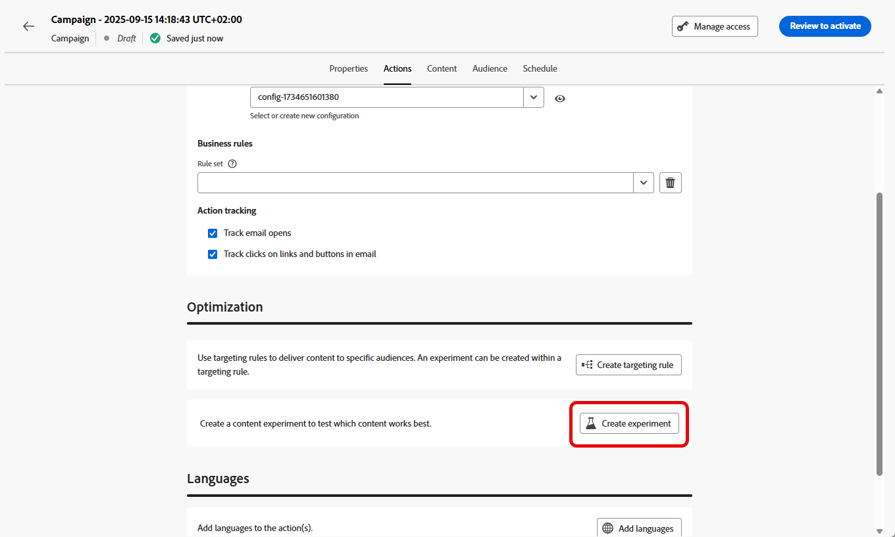
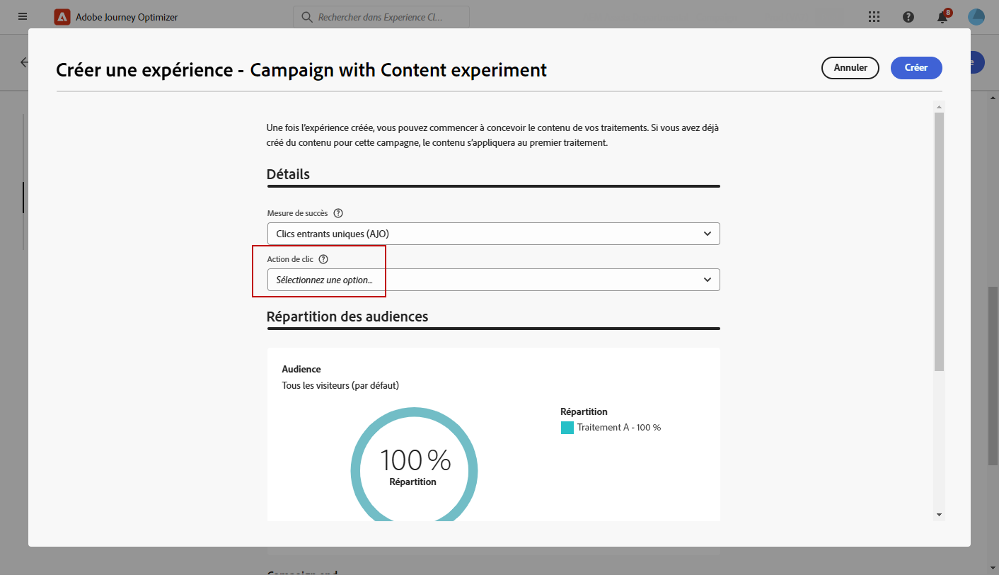

# Créer une expérience de contenu {#content-experiment}

>[!CONTEXTUALHELP]
>id="ajo_campaigns_content_experiment"
>title="Expérience de contenu"
>abstract="Vous pouvez choisir de changer le contenu ou l’objet du message afin de définir plusieurs traitements et déterminer la meilleure combinaison pour vos audiences."

>[!NOTE]
>
>Avant de commencer l’expérience de contenu, assurez-vous que votre configuration des rapports est définie pour vos jeux de données personnalisés. En savoir plus dans [cette section](../reports/reporting-configuration.md).

L’expérience de contenu Journey Optimizer vous permet de définir plusieurs traitements de diffusion afin de mesurer celui qui fonctionne le mieux pour votre audience cible. Vous pouvez choisir de changer le contenu ou l’objet de la diffusion. L’audience ciblée est attribuée de manière aléatoire à chaque traitement afin de déterminer lequel fonctionne le mieux en termes de mesure spécifiée.

Dans l&#39;exemple ci-dessous, la cible de la diffusion a été divisée en deux groupes, représentant chacun 45 % de la population ciblée, et un groupe d’exclusion de 10 %, qui ne recevra pas la diffusion.

Chaque personne de l’audience ciblée recevra une version de l’e-mail, avec un objet qui sera l’un des deux suivants :

* une promotion directe d&#39;une offre de 10 % sur la nouvelle collection et une image,
* l’autre ne fait de la publicité que pour une offre spéciale sans spécifier les 10 % de réduction, sans image.

L’objectif ici est de voir si les destinataires interagissent avec l’e-mail en fonction de l’expérience reçue. Nous choisirons donc **[!UICONTROL Ouvertures d’e-mails]** comme mesure d’objectif principal dans cette expérience de contenu.

➡️ Découvrez comment utiliser les expériences de contenu pour comparer les décisions avec le canal d’expérience basé sur du code dans [ce cas d’utilisation](../experience-decisioning/experience-decisioning-uc.md).

## Créer votre contenu {#campaign-experiment}

1. Commencez par créer et configurer votre [campagne](../campaigns/create-campaign.md) ou votre [parcours](../building-journeys/journeys-message.md) en fonction de vos besoins.

1. Dans la fenêtre **[!UICONTROL Modifier le contenu]**, commencez à personnaliser votre traitement A.

   Pour ce traitement, nous spécifions l’offre spéciale directement dans la ligne d’objet et ajoutons des personnalisations.

   

1. Créez ou importez votre contenu d’origine et personnalisez-le selon vos besoins.

## Configurer votre expérience de contenu {#configure-experiment}

>[!CONTEXTUALHELP]
>id="ajo_campaigns_content_experiment_dimension"
>title="Dimension"
>abstract="Choisissez la dimension spécifique à suivre pour votre expérience, par exemple des clics spécifiques ou des vues de pages spécifiques."

>[!CONTEXTUALHELP]
>id="ajo_campaigns_content_experiment_success_metric"
>title="Mesure de succès"
>abstract="La mesure de succès permet de suivre et d’évaluer le traitement le plus performant dans une expérience. Veillez à configurer votre jeu de données pour certaines mesures avant de l’utiliser."

1. Lorsque votre message est personnalisé, dans la page de résumé de la campagne, cliquez sur **[!UICONTROL Créer une expérience]** pour commencer à configurer votre expérience de contenu.

   

1. Sélectionnez les **[!UICONTROL mesures de succès]** que vous souhaitez définir pour votre expérience.

   Pour cet exemple, sélectionnez **[!UICONTROL Ouverture d’e-mails]** pour tester si les profils ouvrent leurs e-mails lorsque le code de promotion se trouve dans la ligne d’objet.

   

1. Lors de la configuration d’une expérience utilisant le canal in-app ou web et du choix de **[!UICONTROL Clics entrants]**, **[!UICONTROL Clics entrants uniques]**, **[!UICONTROL Pages vues]** ou **[!UICONTROL Mesures des pages vues uniques]**, le menu déroulant **[!UICONTROL Action de clic]** vous permet de suivre et de surveiller précisément les clics et les vues sur des pages spécifiques.

   

1. Cliquez sur **[!UICONTROL Ajouter un traitement]** pour créer autant de nouveaux traitements que nécessaire.

   

1. Modifiez le **[!UICONTROL Titre]** de votre traitement pour mieux les différencier.

1. Choisissez d’ajouter un groupe d’**[!UICONTROL exclusion]** à votre diffusion. Ce groupe ne recevra aucun contenu de cette campagne.

   Le fait d’activer la barre de bascule retirera automatiquement 10 % de votre population. Vous pouvez ajuster ce pourcentage si nécessaire.

   >[!IMPORTANT]
   >
   >Lorsqu’un groupe d’exclusion est utilisé dans une action pour l’expérimentation de contenu, l’affectation d’exclusion ne s’applique qu’à cette action spécifique. Une fois l’action terminée, les profils du groupe d’exclusion continueront sur le chemin du parcours et pourront recevoir des messages d’autres actions. Par conséquent, assurez-vous que les messages suivants ne dépendent pas de la réception d’un message par un profil qui peut se trouver dans un groupe d’exclusion. Si c’est le cas, vous devrez peut-être supprimer l’affectation d’exclusion.

   

1. Vous pouvez ensuite choisir d’attribuer un pourcentage précis à chaque **[!UICONTROL Traitement]** ou simplement activer la fonction **[!UICONTROL Répartir proportionnellement]** grâce à la barre d’activation.

   

1. Activez l’expérience de mise à l’échelle automatique pour déployer automatiquement la variation gagnante de votre expérience. [En savoir plus sur la mise à l’échelle du gagnant](#scale-winner)

1. Cliquez sur **[!UICONTROL Créer]** lorsque la configuration est terminée.

## Concevoir vos traitements {#treatment-experiment}

1. Dans la fenêtre **[!UICONTROL Modifier le contenu]**, sélectionnez votre traitement B pour modifier le contenu.

   Pour ce traitement, nous choisissons de ne pas spécifier l’offre dans la **[!UICONTROL ligne d’objet]**.

   

1. Cliquez sur **[!UICONTROL Modifier le corps de l’e-mail]** pour personnaliser davantage votre traitement B.

   

1. Après avoir conçu vos traitements, cliquez sur **[!UICONTROL Autres actions]** pour accéder aux options relatives à vos traitements : **[!UICONTROL Renommer]**, **[!UICONTROL Dupliquer]** et **[!UICONTROL Supprimer]**.

   

1. Si nécessaire, accédez au menu **[!UICONTROL Paramètres d’expérience]** pour modifier la configuration de vos traitements.

   

1. Une fois le contenu de votre message défini, cliquez sur le bouton **[!UICONTROL Simuler du contenu]** afin de contrôler le rendu de votre diffusion et vérifiez les paramètres de personnalisation avec les profils de test. [En savoir plus](../content-management/preview-test.md).

Après avoir paramétré votre expérimentation, vous pouvez suivre le succès de votre diffusion avec votre rapport. [En savoir plus](../reports/campaign-global-report-cja-experimentation.md)

## Mettre à l’échelle le gagnant {#scale-winner}

>[!AVAILABILITY]
>
>La fonction Mettre à l’échelle le gagnant est actuellement prise en charge pour les canaux suivants :
>
>* Canaux entrants (par exemple, web, message in-app, expérience basée sur le code) dans n’importe quel parcours ou campagne.
>* Canaux sortants (par exemple, e-mail, notification push, SMS) dans les campagnes transactionnelles déclenchées par API.

Mettre à l’échelle le gagnant vous permet de déployer automatiquement ou manuellement la variation gagnante d’une expérience sur l’ensemble de votre audience. Cette fonctionnalité garantit qu’une fois qu’un gagnant est déterminé, vous pouvez amplifier sa portée et son efficacité sans surveiller constamment l’expérience.

Vous avez le choix entre deux modes :

* **Mise à l’échelle automatique** : configurez les paramètres de mise à l’échelle automatique lors de la création de votre expérience en choisissant le timing et les conditions de mise à l’échelle du traitement gagnant ou une option de secours si aucun gagnant ne se dégage.

* **Mise à l’échelle manuelle** : passez en revue manuellement les résultats de l’expérience et lancez le déploiement du traitement gagnant, en gardant un contrôle total sur le timing et les décisions.

### Mise à l’échelle automatique {#autoscaling}

La mise à l’échelle automatique vous permet de définir des règles prédéfinies pour le moment du déploiement du traitement gagnant ou d’un traitement de secours, en fonction des résultats de l’expérience.

Notez qu’une fois la mise à l’échelle automatique effectuée, la mise à l’échelle manuelle n’est plus disponible.

Pour activer la mise à l’échelle automatique dans vos expériences :

1. Configurez votre campagne ou votre parcours et configurez votre expérience selon vos besoins. [En savoir plus](#configure-experiment)

1. Activez l’option de mise à l’échelle automatique lors de la configuration de votre expérience.

   

1. Sélectionnez le moment où le gagnant doit être mis à l’échelle :

   * Dès que le gagnant est trouvé.
   * Une fois l’expérience activée pendant l’heure sélectionnée.

     L’heure de mise à l’échelle automatique doit être planifiée avant la date de fin de l’expérience. Si elle est définie pour une heure postérieure à la date de fin, un avertissement de validation s’affiche et la campagne ou le parcours n’est pas publié.

   

1. Choisissez le comportement de secours si aucun gagnant n’est trouvé par heure d’échelle :

   * Poursuivez l’expérience jusqu’à sa fin comme prévu.
   * Mettez à l’échelle le traitement alternatif après une heure spécifiée.

Une fois tous les paramètres satisfaits, votre traitement gagnant ou alternatif est envoyé à votre audience.

### Mise à l’échelle manuelle {#manual-scaling}

La mise à l’échelle manuelle vous permet d’examiner les résultats de l’expérience et de décider quand déployer le traitement gagnant selon votre propre planning.

Notez que si vous mettez manuellement à l’échelle l’expérience gagnante avant l’heure de mise à l’échelle automatique planifiée, la mise à l’échelle automatique est annulée.

Pour mettre à l’échelle manuellement le gagnant de vos expériences :

1. Configurez votre campagne ou votre parcours et configurez votre expérience selon vos besoins. [En savoir plus](#configure-experiment)

1. Laissez l’expérience se poursuivre jusqu’à ce qu’un gagnant soit identifié ou que la signification statistique soit atteinte.

1. Ouvrez le tableau de bord de votre campagne ou sélectionnez l’activité de votre canal dans votre parcours.

   Examinez les résultats dans le menu **[!UICONTROL Expérience de contenu]** pour identifier le traitement le plus performant.

   

1. Cliquez sur **[!UICONTROL Mettre à l’échelle le traitement]** pour envoyer le traitement gagnant au reste de votre audience.

   

1. Sélectionnez le traitement à mettre à l’échelle dans le menu déroulant, puis cliquez sur **[!UICONTROL Mettre à l’échelle]**.

   

Notez que la mise à l’échelle du traitement peut prendre jusqu’à une heure. Vous recevrez une notification une fois le processus de mise à l’échelle manuelle terminé.

