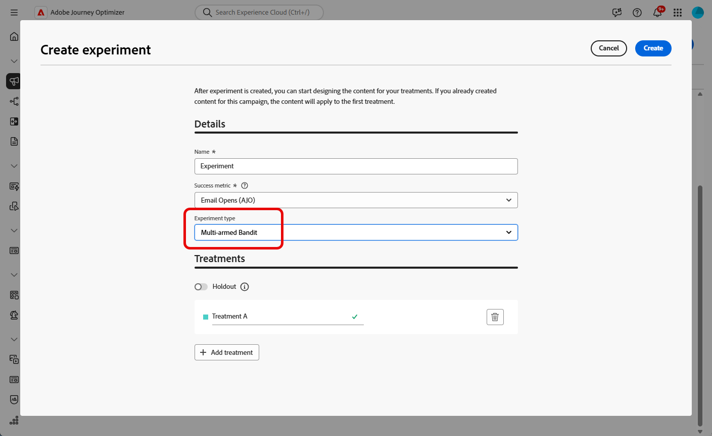

# Créer une expérience de contenu {#content-experiment}

>[!CONTEXTUALHELP]
>id="ajo_campaigns_content_experiment"
>title="Expérience de contenu"
>abstract="Vous pouvez choisir de changer le contenu ou l’objet du message afin de définir plusieurs traitements et déterminer la meilleure combinaison pour vos audiences."

>[!NOTE]
>
>Avant de commencer l’expérience de contenu, assurez-vous que votre configuration des rapports est définie pour vos jeux de données personnalisés. En savoir plus dans [cette section](../reports/reporting-configuration.md).

L’expérience de contenu Journey Optimizer vous permet de définir plusieurs traitements de diffusion afin de mesurer celui qui fonctionne le mieux pour votre audience cible. Vous pouvez choisir de changer le contenu ou l’objet de la diffusion. L’audience ciblée est attribuée de manière aléatoire à chaque traitement afin de déterminer lequel fonctionne le mieux en termes de mesure spécifiée.

Dans l&#39;exemple ci-dessous, la cible de la diffusion a été divisée en deux groupes, représentant chacun 45 % de la population ciblée, et un groupe d’exclusion de 10 %, qui ne recevra pas la diffusion.

Chaque personne de l’audience ciblée recevra une version de l’e-mail, avec un objet qui sera l’un des deux suivants :

* une promotion directe d&#39;une offre de 10 % sur la nouvelle collection et une image,
* l’autre ne fait de la publicité que pour une offre spéciale sans spécifier les 10 % de réduction, sans image.

L’objectif ici est de voir si les destinataires interagissent avec l’e-mail en fonction de l’expérience reçue. Nous choisirons donc **[!UICONTROL Ouvertures d’e-mails]** comme mesure d’objectif principal dans cette expérience de contenu.

➡️Découvrez comment utiliser les expériences de contenu pour comparer des décisions avec le canal d’expérience basée sur du code dans [ce cas d’utiisation](../experience-decisioning/experience-decisioning-uc.md).

## Créer votre contenu {#campaign-experiment}

1. Commencez par créer et configurer votre [campagne](../campaigns/create-campaign.md) ou votre [parcours](../building-journeys/journey-action.md) en fonction de vos besoins.

1. Dans la fenêtre **[!UICONTROL Modifier le contenu]**, commencez à personnaliser votre traitement A.

   Pour ce traitement, nous spécifions l’offre spéciale directement dans la ligne d’objet et ajoutons des personnalisations.

   

1. Créez ou importez votre contenu d’origine et personnalisez-le selon vos besoins.

## Configurer votre expérience de contenu {#configure-experiment}

>[!CONTEXTUALHELP]
>id="ajo_campaigns_content_experiment_dimension"
>title="Dimension"
>abstract="Choisissez la dimension spécifique à suivre pour votre expérience, par exemple des clics spécifiques ou des vues de pages spécifiques."

>[!CONTEXTUALHELP]
>id="ajo_campaigns_content_experiment_success_metric"
>title="Mesure de succès"
>abstract="La mesure de succès permet de suivre et d’évaluer le traitement le plus performant dans une expérience. Veillez à configurer votre jeu de données pour certaines mesures avant de l’utiliser."

>[!AVAILABILITY]
>
>Le courrier prend en charge la fonctionnalité d’exclusion, mais ne prend actuellement pas en charge les traitements.

Pour votre expérience de contenu, vous pouvez choisir entre trois types d’expérience :

* **[!UICONTROL Expérience A/B]** : définissez la répartition du trafic entre les traitements au début du test. Les performances sont évaluées en fonction de la mesure principale de votre choix. Dans ce cas, Experimentation Accelerator signale l’effet élévateur observé entre les traitements.

* **[!UICONTROL Bandit manchot]** : la répartition du trafic entre les traitements est gérée automatiquement. Tous les 7 jours, les performances de la mesure principale sont examinées et les pondérations sont ajustées en conséquence. Les rapports dans Experimentation Accelerator continuent d’afficher l’effet élévateur sous la forme de tests A/B.

* **[!UICONTROL Apporter votre propre bandit manchot]** : la répartition du trafic entre les traitements est gérée automatiquement. Vous pouvez déterminer quand et comment elle doit changer à l’aide des API d’expérience afin d’ajuster les affectations en temps réel.

➡️ [En savoir plus sur la différence entre les expériences A/B et le bandit manchot](mab-vs-ab.md)

>[!BEGINTABS]

>[!TAB Expérience A/B]

1. Lorsque votre message est personnalisé, dans l’onglet **[!UICONTROL Actions]**, cliquez sur **[!UICONTROL Créer une expérience]** pour commencer à configurer votre expérience de contenu.

   

1. Sélectionnez les **[!UICONTROL mesures de succès]** que vous souhaitez définir pour votre expérience.

   Pour cet exemple, sélectionnez **[!UICONTROL Ouverture d’e-mails]** pour tester si les profils ouvrent leurs e-mails lorsque le code de promotion se trouve dans la ligne d’objet.

   

1. Lors de la configuration d’une expérience utilisant le canal in-app ou web et du choix de **[!UICONTROL Clics entrants]**, **[!UICONTROL Clics entrants uniques]**, **[!UICONTROL Pages vues]** ou **[!UICONTROL Mesures des pages vues uniques]**, le champ **[!UICONTROL Dimensions]** vous permet de suivre et de surveiller précisément les clics et les vues sur des pages spécifiques.

   

1. Si vous avez créé une campagne déclenchée par API, sélectionnez **[!UICONTROL Expérience A/B]** dans le menu déroulant **[!UICONTROL Type d’expérience]**.

1. Cliquez sur **[!UICONTROL Ajouter un traitement]** pour créer autant de nouveaux traitements que nécessaire.

   

   >[!CAUTION]
   >
   >Lors de la création d’une expérience basée sur du code, notez les restrictions suivantes :
   >* **Nombre de traitements** : la création de plus de 3 à 5 traitements peut entraîner des problèmes de performances et d’interface. Si vous rencontrez des erreurs lors de l’ajout de traitements, essayez de réduire le nombre de traitements ou ajoutez-les de manière incrémentielle jusqu’à ce que le problème soit résolu.
   >* **Mots-clés réservés** : évitez d’utiliser des mots-clés réservés tels que « Exclusion » dans vos noms de traitement, car cela peut entraîner des erreurs de mappage des nœuds de décision et empêcher le bon fonctionnement de l’expérience.

1. Modifiez le **[!UICONTROL Titre]** de votre traitement pour mieux les différencier.

1. Choisissez d’ajouter un groupe d’**[!UICONTROL exclusion]** à votre diffusion. Ce groupe ne recevra aucun contenu de cette campagne.

   Le fait d’activer la barre de bascule retirera automatiquement 10 % de votre population. Vous pouvez ajuster ce pourcentage si nécessaire.

   >[!IMPORTANT]
   >
   >Lorsqu’un groupe d’exclusion est utilisé dans une action pour l’expérimentation de contenu, l’affectation d’exclusion ne s’applique qu’à cette action spécifique. Une fois l’action terminée, les profils du groupe d’exclusion continueront sur le chemin du parcours et pourront recevoir des messages d’autres actions. Par conséquent, assurez-vous que les messages suivants ne dépendent pas de la réception d’un message par un profil qui peut se trouver dans un groupe d’exclusion. Si c’est le cas, vous devrez peut-être supprimer l’affectation d’exclusion.

   

1. Vous pouvez ensuite choisir d’attribuer un pourcentage précis à chaque **[!UICONTROL Traitement]** ou simplement activer le bouton (bascule) **[!UICONTROL Répartir proportionnellement]**.

   

1. Activez l’expérience avec mise à l’échelle automatique pour déployer automatiquement la variation gagnante de votre expérience. [Découvrir comment mettre à l’échelle le gagnant](#scale-winner)

   

1. Cliquez sur **[!UICONTROL Créer]** lorsque la configuration est terminée.

>[!TAB Bandit manchot]

Notez que l’expérience de bandit manchot n’est disponible qu’avec les éléments suivants :

* Canaux entrants
* Parcours unitaires
* Campagnes déclenchées par API (transactionnelles et opérationnelles)
* Canaux sortants si le planning est récurrent

1. Lorsque votre message est personnalisé, dans l’onglet **[!UICONTROL Actions]**, cliquez sur **[!UICONTROL Créer une expérience]** pour commencer à configurer votre expérience de contenu.

   

1. Sélectionnez les **[!UICONTROL mesures de succès]** que vous souhaitez définir pour votre expérience.

   Pour cet exemple, sélectionnez **[!UICONTROL Ouverture d’e-mails]** pour tester si les profils ouvrent leurs e-mails lorsque le code de promotion se trouve dans la ligne d’objet.

   

1. Si vous avez créé une campagne déclenchée par API, sélectionnez **[!UICONTROL Bandit manchot]** dans le menu déroulant **[!UICONTROL Type d’expérience]**.

   

1. Cliquez sur **[!UICONTROL Ajouter un traitement]** pour créer autant de nouveaux traitements que nécessaire.

   

1. Modifiez le **[!UICONTROL Titre]** de votre traitement pour mieux les différencier.

1. Choisissez d’ajouter un groupe d’**[!UICONTROL exclusion]** à votre diffusion. Ce groupe ne recevra aucun contenu de cette campagne.

   Le fait d’activer la barre de bascule retirera automatiquement 10 % de votre population. Vous pouvez ajuster ce pourcentage si nécessaire.

   >[!IMPORTANT]
   >
   >Lorsqu’un groupe d’exclusion est utilisé dans une action pour l’expérimentation de contenu, l’affectation d’exclusion ne s’applique qu’à cette action spécifique. Une fois l’action terminée, les profils du groupe d’exclusion continueront sur le chemin du parcours et pourront recevoir des messages d’autres actions. Par conséquent, assurez-vous que les messages suivants ne dépendent pas de la réception d’un message par un profil qui peut se trouver dans un groupe d’exclusion. Si c’est le cas, vous devrez peut-être supprimer l’affectation d’exclusion.

   

>[!TAB Apporter votre propre bandit manchot]

Notez que l’expérience Apporter votre propre bandit manchot n’est disponible qu’avec les éléments suivants :

* Canaux entrants
* Parcours unitaires
* Campagnes déclenchées par API (transactionnelles et opérationnelles)
* Canaux sortants si le planning est récurrent

1. Lorsque votre message est personnalisé, dans l’onglet **[!UICONTROL Actions]**, cliquez sur **[!UICONTROL Créer une expérience]** pour commencer à configurer votre expérience de contenu.

   

1. Sélectionnez les **[!UICONTROL mesures de succès]** que vous souhaitez définir pour votre expérience.

   Pour cet exemple, sélectionnez **[!UICONTROL Ouverture d’e-mails]** pour tester si les profils ouvrent leurs e-mails lorsque le code de promotion se trouve dans la ligne d’objet.

   

1. Si vous avez créé une campagne déclenchée par API, sélectionnez **[!UICONTROL Apporter votre propre bandit manchot]** dans le menu déroulant **[!UICONTROL Type d’expérience]**.

   

1. Cliquez sur **[!UICONTROL Ajouter un traitement]** pour créer autant de nouveaux traitements que nécessaire.

   

1. Modifiez le **[!UICONTROL Titre]** de votre traitement pour mieux les différencier.

1. Choisissez d’ajouter un groupe d’**[!UICONTROL exclusion]** à votre diffusion. Ce groupe ne recevra aucun contenu de cette campagne.

   Le fait d’activer la barre de bascule retirera automatiquement 10 % de votre population. Vous pouvez ajuster ce pourcentage si nécessaire.

   >[!IMPORTANT]
   >
   >Lorsqu’un groupe d’exclusion est utilisé dans une action pour l’expérimentation de contenu, l’affectation d’exclusion ne s’applique qu’à cette action spécifique. Une fois l’action terminée, les profils du groupe d’exclusion continueront sur le chemin du parcours et pourront recevoir des messages d’autres actions. Par conséquent, assurez-vous que les messages suivants ne dépendent pas de la réception d’un message par un profil qui peut se trouver dans un groupe d’exclusion. Si c’est le cas, vous devrez peut-être supprimer l’affectation d’exclusion.

   

>[!ENDTABS]

## Concevoir vos traitements {#treatment-experiment}

1. Dans la fenêtre **[!UICONTROL Modifier le contenu]**, sélectionnez votre traitement B pour modifier le contenu.

   Pour ce traitement, nous choisissons de ne pas spécifier l’offre dans la **[!UICONTROL ligne d’objet]**.

   

1. Cliquez sur **[!UICONTROL Modifier le corps de l’e-mail]** pour personnaliser davantage votre traitement B.

   

1. Après avoir conçu vos traitements, cliquez sur **[!UICONTROL Autres actions]** pour accéder aux options relatives à vos traitements : **[!UICONTROL Renommer]**, **[!UICONTROL Dupliquer]** et **[!UICONTROL Supprimer]**.

   

1. Si nécessaire, accédez au menu **[!UICONTROL Paramètres d’expérience]** pour modifier la configuration de vos traitements.

   

1. Une fois le contenu de votre message défini, cliquez sur le bouton **[!UICONTROL Simuler du contenu]** afin de contrôler le rendu de votre diffusion et vérifiez les paramètres de personnalisation avec les profils de test. [En savoir plus](../content-management/preview-test.md)

Après avoir paramétré votre expérimentation, vous pouvez suivre le succès de votre diffusion avec votre rapport. [En savoir plus](../reports/campaign-global-report-cja-experimentation.md)

## Mettre à l’échelle le gagnant {#scale-winner}

>[!AVAILABILITY]
>
>La fonctionnalité de mise à l’échelle du gagnant est actuellement prise en charge pour les canaux suivants :
>
>* Canaux entrants (ex. : web, message in-app, expérience basée sur du code) dans un parcours ou une campagne.
>* Canaux sortants (ex. : e-mail, notification push, SMS) dans des campagnes transactionnelles déclenchées par API.

Mettre à l’échelle le gagnant vous permet de déployer automatiquement ou manuellement la variation gagnante d’une expérience sur l’ensemble de votre audience. Cette fonctionnalité vous permet, une fois un gagnant déterminé, d’en amplifier la portée et l’efficacité sans avoir à surveiller continuellement l’expérience.

Vous pouvez choisir entre deux modes :

* **Mise à l’échelle automatique** : configurez les paramètres de mise à l’échelle automatique lors de la création de votre expérience, en définissant le moment et les conditions de mise à l’échelle du traitement gagnant ou d’une solution de secours si aucun gagnant n’émerge.

* **Mise à l’échelle manuelle** : examinez manuellement les résultats de l’expérience et déclenchez le déploiement du traitement gagnant en gardant un contrôle total sur le moment et les décisions.

### Mise à l’échelle automatique {#autoscaling}

La mise à l’échelle automatique vous permet de définir des règles prédéfinies pour déterminer quand déployer le traitement gagnant ou une solution de secours en fonction des résultats de l’expérience.

Remarque : une fois la mise à l’échelle automatique effectuée, la mise à l’échelle manuelle n’est plus disponible.

Pour activer la mise à l’échelle automatique dans vos expériences :

1. Configurez votre campagne ou votre parcours et définissez votre expérience comme souhaité. [En savoir plus](#configure-experiment)

1. Activez l’option de mise à l’échelle automatique pendant la configuration de l’expérience.

   

1. Définissez le moment où le gagnant doit être déployé :

   * Dès qu’un gagnant est identifié.
   * Après que l’expérience est active depuis une durée donnée.

   Le moment de la mise à l’échelle doit obligatoirement être planifié avant la date de fin de l’expérience. Si une date postérieure est définie, un message d’avertissement s’affichera et la campagne ou le parcours ne pourra pas être publié.

   

1. Définissez le comportement de secours si aucun gagnant n’est identifié au moment de la mise à l’échelle :

   * Poursuivre l’expérience jusqu’à la fin prévue.
   * Mettre à l’échelle le traitement alternatif après un délai spécifié.

Une fois tous les paramètres remplis, le gagnant ou le traitement alternatif est envoyé à votre audience.

### Mise à l’échelle manuelle {#manual-scaling}

La mise à l’échelle manuelle vous permet d’examiner les résultats de l’expérience et de décider quand déployer le traitement gagnant selon votre propre planning.

Remarque : si vous effectuez manuellement la mise à l’échelle du gagnant avant le moment prévu pour la mise à l’échelle automatique, cette dernière est annulée.

Pour effectuer la mise à l’échelle manuelle du gagnant de vos expériences :

1. Configurez votre campagne ou votre parcours et définissez votre expérience comme souhaité. [En savoir plus](#configure-experiment)

1. Laissez l’expérience se dérouler jusqu’à ce qu’un gagnant soit identifié ou qu’une signification statistique soit atteinte.

1. Ouvrez le tableau de bord de votre campagne ou sélectionnez l’activité de canal correspondante dans votre parcours.

   Consultez les résultats dans le menu **[!UICONTROL Expérience de contenu]** pour identifier le traitement le plus performant.

   

1. Cliquez sur **[!UICONTROL Mettre à l’échelle le traitement]** pour envoyer le traitement gagnant au reste de votre audience.

   

1. Dans le menu déroulant, sélectionnez le traitement que vous souhaitez mettre à l’échelle, puis cliquez sur **[!UICONTROL Mettre à l’échelle]**.

   

Remarque : la mise à l’échelle du traitement peut prendre jusqu’à une heure. Vous recevrez une notification une fois la mise à l’échelle manuelle terminée.

