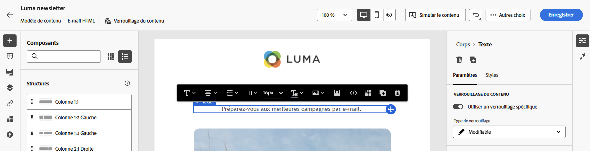
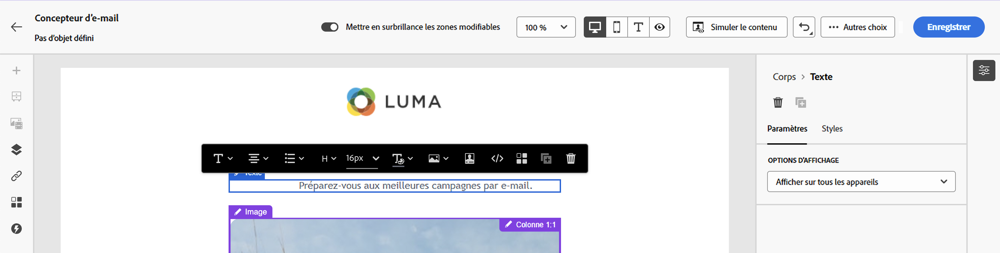

# Verrouillage de contenu dans les modèles de courrier électronique {#lock-content-email-templates}

Journey Optimizer vous permet de verrouiller le contenu dans les modèles d’email, soit en verrouillant l’intégralité du modèle, soit des structures et composants spécifiques. Cela vous permet d’éviter les modifications ou suppressions involontaires, de mieux contrôler la personnalisation des modèles et d’améliorer l’efficacité et la fiabilité de vos campagnes par e-mail.

>[!AVAILABILITY]
>
>Les utilisateurs autorisés à créer des modèles de contenu peuvent activer le verrouillage.

Le verrouillage du contenu peut être appliqué au niveau **structure** ou au niveau **composant**. Voici les principales qui s’appliquent au niveau de la structure et du composant lors du verrouillage du contenu dans votre modèle.

* Lorsqu’une structure est verrouillée :

   * Tout le contenu de cette structure est également verrouillé par défaut.
   * Aucun contenu ne peut être ajouté à la structure.
   * Par défaut, vous ne pouvez pas supprimer la structure. Vous pouvez contourner cette restriction en activant l’option &quot;Autoriser la suppression&quot;.
   * Les composants de contenu individuels dans la structure verrouillée peuvent être définis comme modifiables.

* Lorsqu’une structure est modifiable (structure non verrouillée) :

   * Les composants de contenu individuels peuvent être verrouillés dans cette structure.
   * Par défaut, vous ne pouvez pas supprimer un composant s’il est verrouillé ou si l’option &quot;Verrouillage de contenu modifiable uniquement&quot; est sélectionnée. Vous pouvez contourner cette restriction en activant l’option &quot;Autoriser la suppression&quot;.

## Verrouillage d’un modèle de courrier électronique {#define}

### Activation du verrouillage de contenu {#enable}

Vous pouvez activer le verrouillage de contenu pour un modèle d&#39;email directement dans le Designer des emails, que vous créiez un nouveau modèle ou que vous en modifiiez un existant. Procédez de la façon suivante :

1. Ouvrez ou créez un modèle d&#39;email et accédez à l&#39;écran d&#39;édition de contenu dans le Designer Email.

1. Dans le volet **[!UICONTROL Body]** à droite, activez l’option **[!UICONTROL Governance]**.

1. Dans la liste déroulante **[!UICONTROL Mode]** , sélectionnez le mode de verrouillage souhaité pour le modèle :

   * **[!UICONTROL Verrouillage de contenu]** : verrouillez des sections spécifiques du contenu dans le modèle. Par défaut, toutes les structures et tous les composants deviennent modifiables. Vous pouvez ensuite verrouiller de manière sélective des éléments individuels.
   * **[!UICONTROL Lecture seule]** : verrouillez le contenu complet du modèle, empêchant toute modification.

   

1. Si vous avez sélectionné le mode **[!UICONTROL verrouillage du contenu]**, vous pouvez définir plus précisément comment les utilisateurs peuvent interagir avec le modèle. Activez l’option **[!UICONTROL Activer l’édition de contenu]** et sélectionnez l’une des options suivantes :

   * **[!UICONTROL Autoriser la structure et l’ajout de contenu]** : les utilisateurs peuvent ajouter des structures entre des structures existantes et ajouter des composants de contenu ou des fragments dans des structures modifiables.

   * **[!UICONTROL Autoriser l’ajout de contenu uniquement]** : les utilisateurs peuvent ajouter des composants de contenu ou des fragments dans des structures modifiables, mais ils ne peuvent pas ajouter ni dupliquer des structures.

1. Après avoir sélectionné le mode de verrouillage, vous pouvez définir les structures et/ou les composants à verrouiller si vous avez sélectionné le mode **[!UICONTROL verrouillage de contenu]** :

   * [Découvrez comment verrouiller des structures](#lock-structures)
   * [Découvrez comment verrouiller des composants](#lock-components)

   Si vous choisissez le mode **[!UICONTROL Lecture seule]** , vous pouvez terminer et enregistrer votre modèle comme vous le faites habituellement.

Vous pouvez ajuster les paramètres **[!UICONTROL Gouvernance]** à tout moment lors de la conception de votre modèle en sélectionnant le corps du modèle. Pour ce faire, cliquez sur le lien **[!UICONTROL Body]** dans le rail de navigation situé en haut du volet de droite.

### Verrouillage des structures {#lock-structures}

Pour verrouiller une structure dans votre modèle :

1. Sélectionnez la structure à verrouiller.

1. Dans la liste déroulante **[!UICONTROL Type de verrouillage]**, sélectionnez **[!UICONTROL Verrouillé]**.

   

   >[!NOTE]
   >
   >Par défaut, les utilisateurs ne peuvent pas supprimer les structures verrouillées. Vous pouvez contourner cette restriction en activant l’option **[!UICONTROL Autoriser la suppression]**.

Après le verrouillage d&#39;une structure, aucun autre composant de contenu ou fragment ne peut être dupliqué ou ajouté à l&#39;intérieur. Tous les composants d’une structure verrouillée sont également verrouillés par défaut. Pour rendre un composant modifiable dans une structure verrouillée :

1. Sélectionnez le composant que vous souhaitez déverrouiller.

1. Activez l’option **[!UICONTROL Utiliser le verrouillage spécifique]** .

1. Dans la liste déroulante **[!UICONTROL Type de verrouillage]**, sélectionnez **[!UICONTROL Modifiable]**. Pour autoriser l’édition du contenu tout en verrouillant les styles, sélectionnez **[!UICONTROL Contenu modifiable uniquement]**. [Découvrez comment verrouiller des composants](#lock-components)

   

### Verrouillage de composants {#lock-components}

Pour verrouiller un composant spécifique dans une structure :

1. Sélectionnez le composant et activez l’option **[!UICONTROL Utiliser un verrouillage spécifique]** dans le volet de droite.

1. Dans la liste déroulante **[!UICONTROL Type de verrouillage]** , sélectionnez l’option de verrouillage de votre choix :

   

   * **[!UICONTROL Verrouillage de contenu modifiable uniquement]** : verrouillez les styles du composant, mais permet de modifier le contenu.
   * **[!UICONTROL Verrouillé]** : verrouillez entièrement le contenu et les styles du composant.

   >[!NOTE]
   >
   >Le type de verrouillage **[!UICONTROL Modifiable]** permet aux utilisateurs de modifier un composant, même dans une structure verrouillée. [Découvrez comment verrouiller des structures](#lock-structures)

1. Par défaut, les utilisateurs ne peuvent pas supprimer les composants verrouillés. Vous pouvez activer la suppression en activant l’option **[!UICONTROL Autoriser la suppression]**.

### Identification du contenu verrouillé {#identify}

Pour identifier facilement les structures et les composants verrouillés dans votre modèle, utilisez l’ **[!UICONTROL Arborescence de navigation]** située dans le menu de gauche. Ce menu présente un aperçu visuel de tous les éléments de modèle, en surlignant les éléments verrouillés avec une icône de verrouillage et les éléments modifiables avec une icône en forme de crayon.

Dans l’exemple ci-dessous, la gouvernance est activée pour le corps du modèle. *La structure 2* est verrouillée avec le *composant 1* modifiable, tandis que la *structure 3* est entièrement verrouillée.

## Utiliser des modèles avec du contenu verrouillé {#use}

Lors de l’utilisation d’un modèle avec du contenu verrouillé, le message **[!UICONTROL Gouvernance activée]** s’affiche dans le volet de droite.

Selon le type de verrouillage appliqué au modèle, vous pouvez effectuer différentes actions sur les structures et composants du modèle. Pour identifier rapidement toutes les zones modifiables dans le modèle, activez les options **[!UICONTROL Mettre en surbrillance les zones modifiables]** .

Par exemple, dans le modèle ci-dessous, toutes les zones sont modifiables, à l’exception de l’image du haut qui a été verrouillée, ce qui signifie que vous ne pouvez pas la modifier ni la supprimer.

Pour plus d&#39;informations sur les différents types de verrouillage qui peuvent être appliqués, reportez-vous aux sections suivantes :

* [Verrouillage des structures](#lock-structures)
* [Verrouillage de composants](#lock-components)

Voici quelques exemples d’édition d’emails et de configuration de verrouillage de contenu associée qui ont été configurés :

| Type de verrouillage de contenu | Configuration des modèles | Edition d&#39;emails |
| ------- | ------- | ------- |
| Modèle de contenu en lecture seule | {zoomable="yes"} | {zoomable="yes"} |
| Le contenu complet est modifiable, mais les utilisateurs ne peuvent pas ajouter de structure ou de composant. | {zoomable="yes"} | {zoomable="yes"} |
| Structure verrouillée qui ne peut pas être supprimée | {zoomable="yes"} | {zoomable="yes"} |
| Composant avec des styles verrouillés et qui ne peut pas être supprimé. Les utilisateurs peuvent uniquement modifier le contenu. | {zoomable="yes"} | {zoomable="yes"} |
| Composant modifiable dans une structure verrouillée. | {zoomable="yes"} | {zoomable="yes"} |
