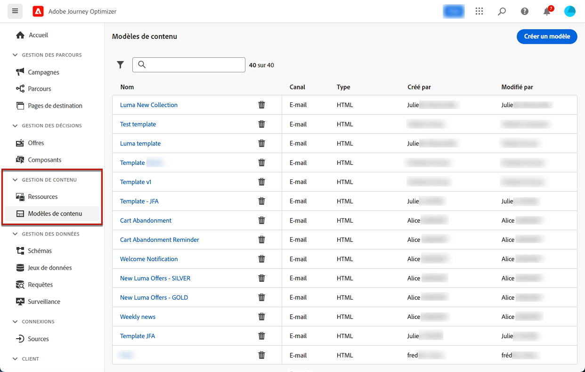
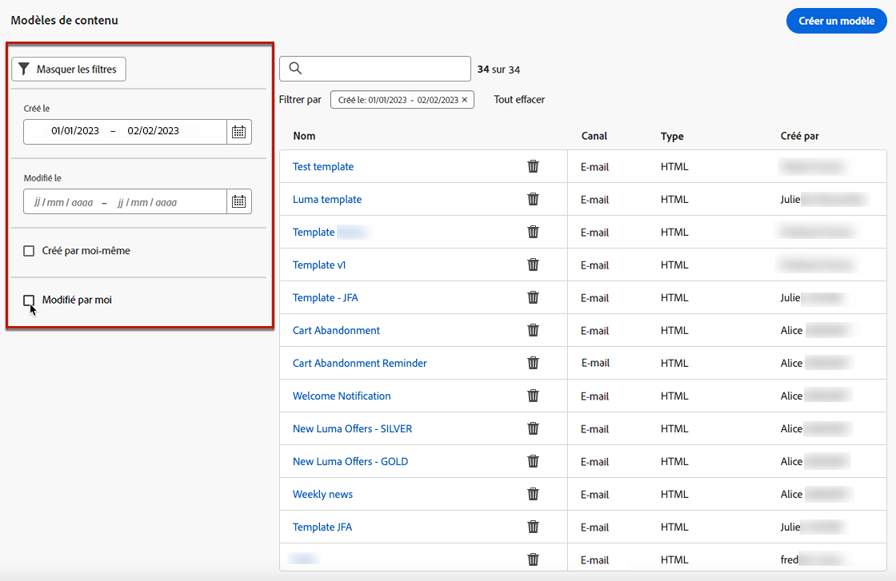
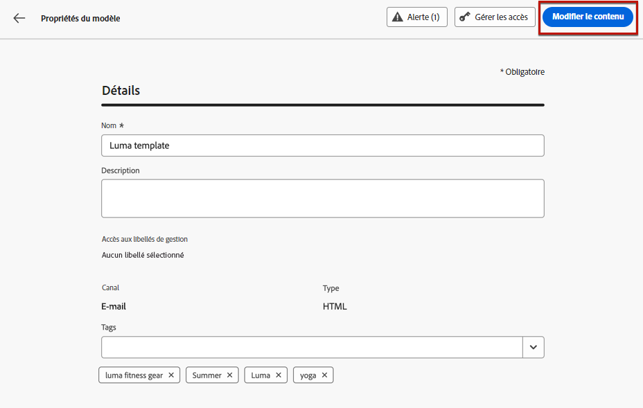
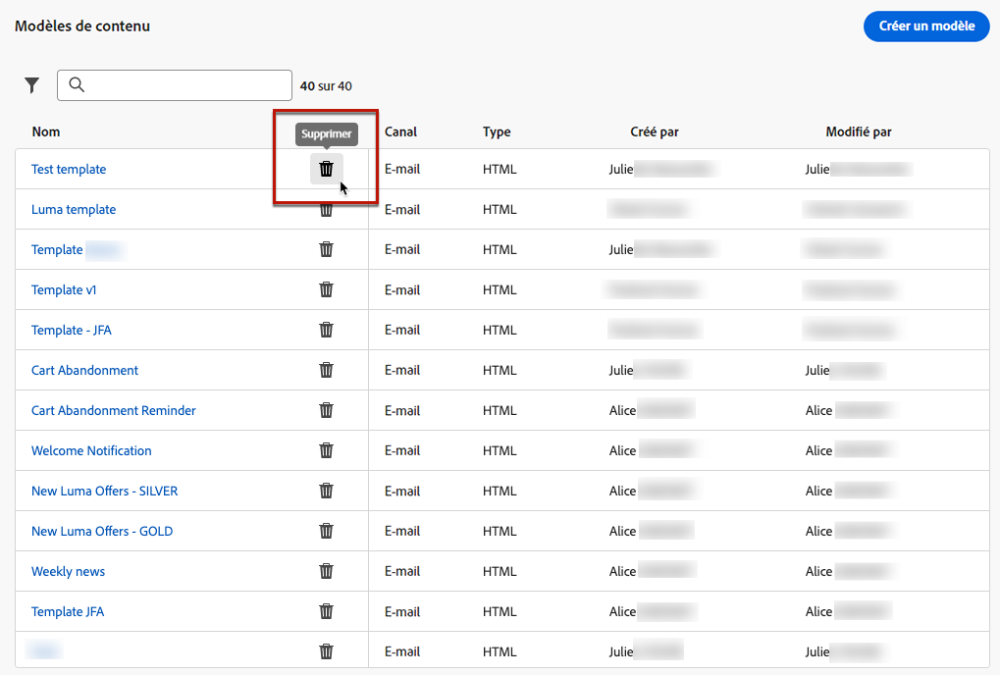
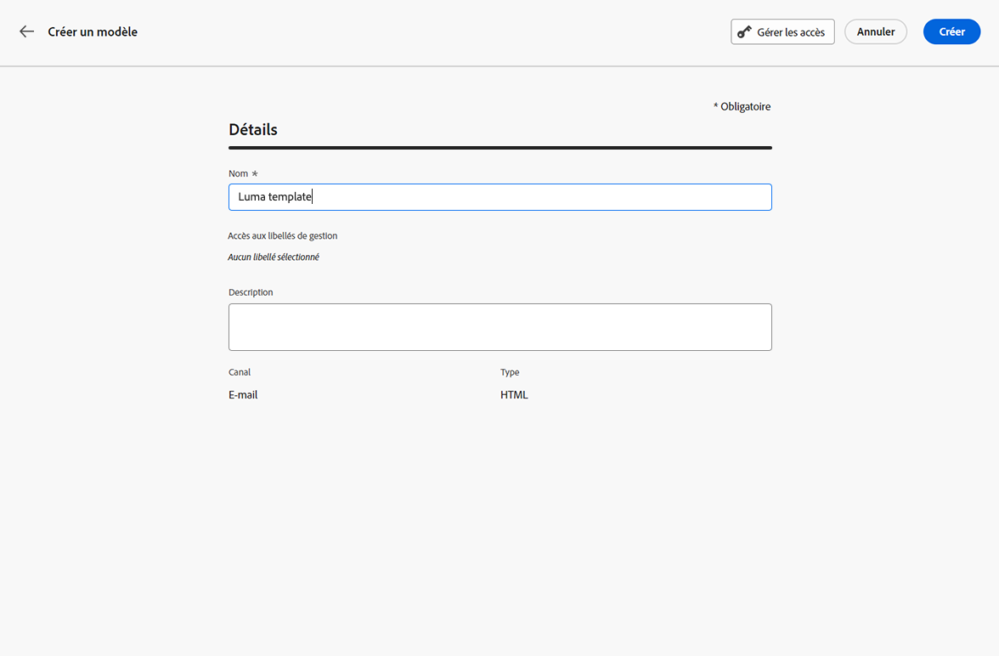
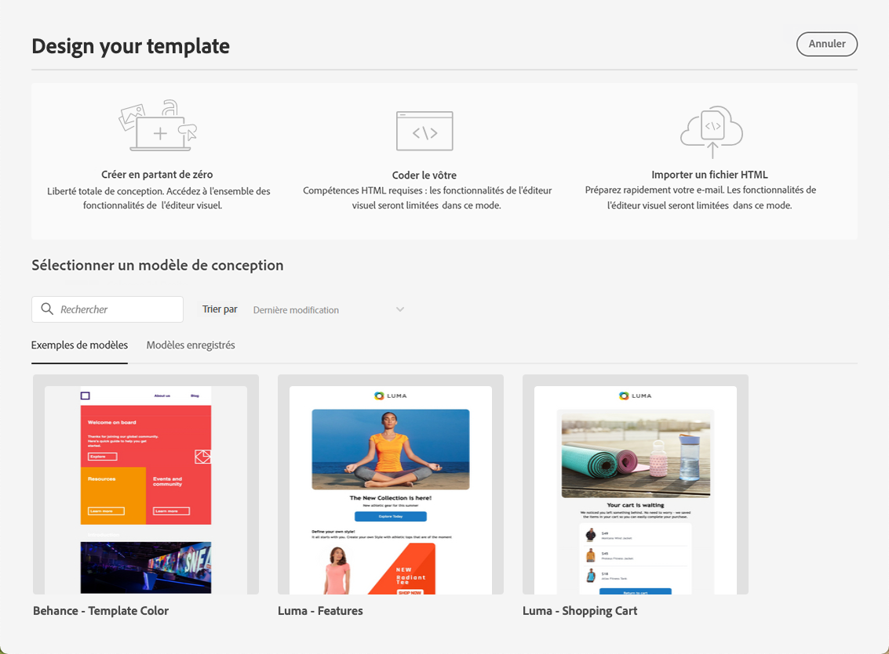
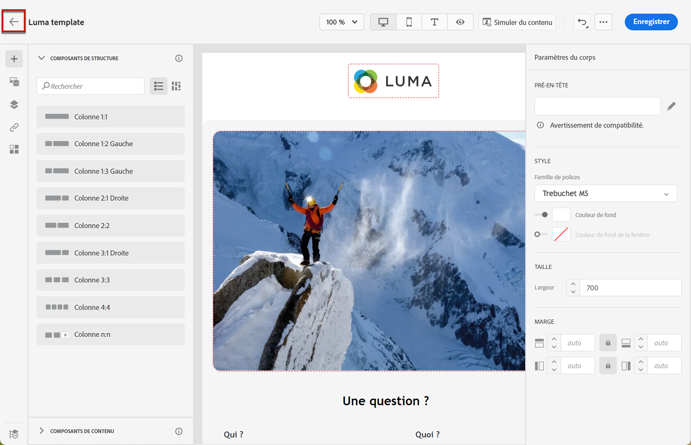
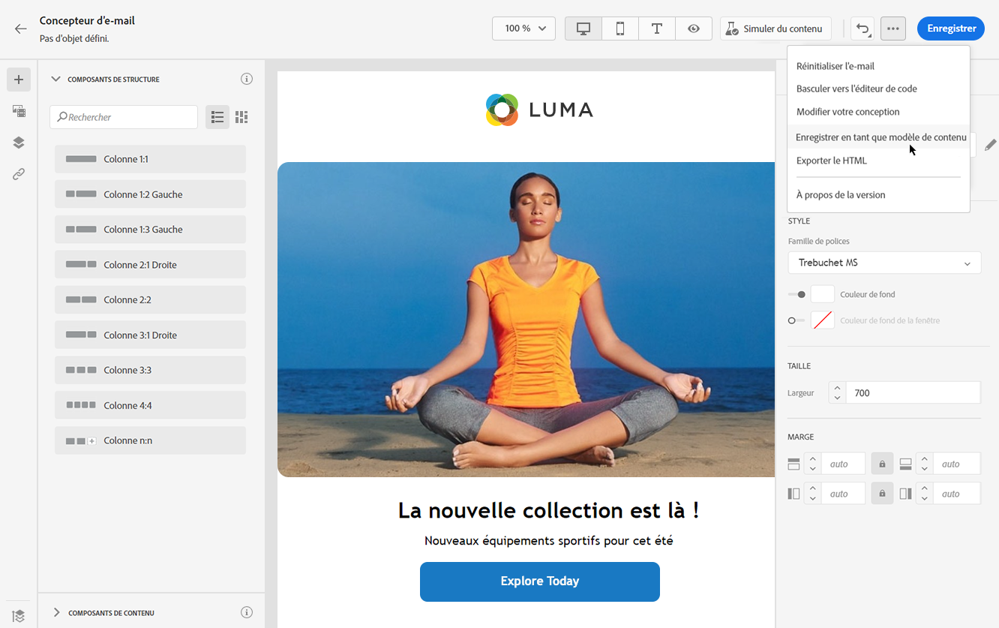
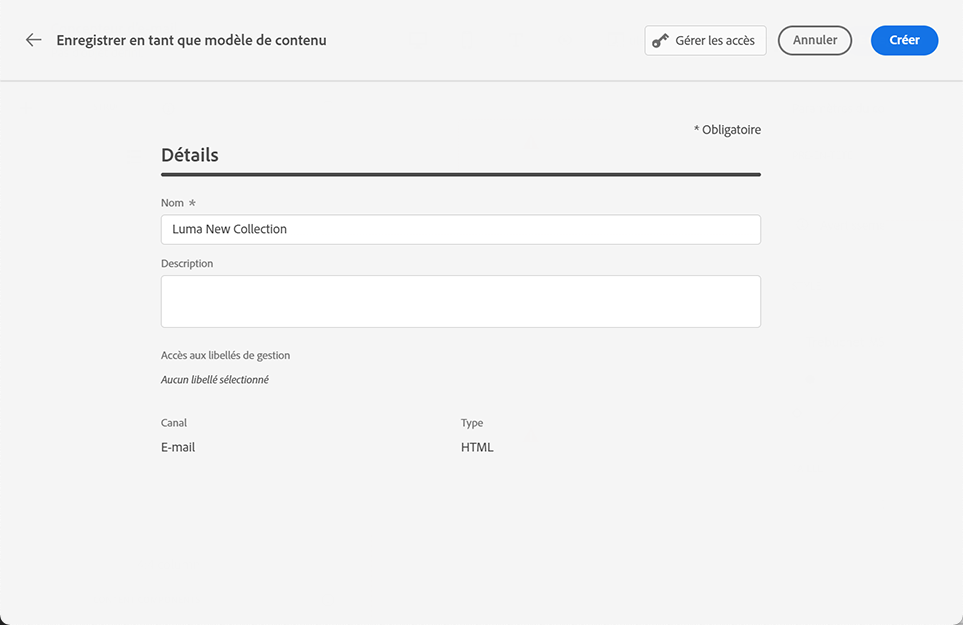
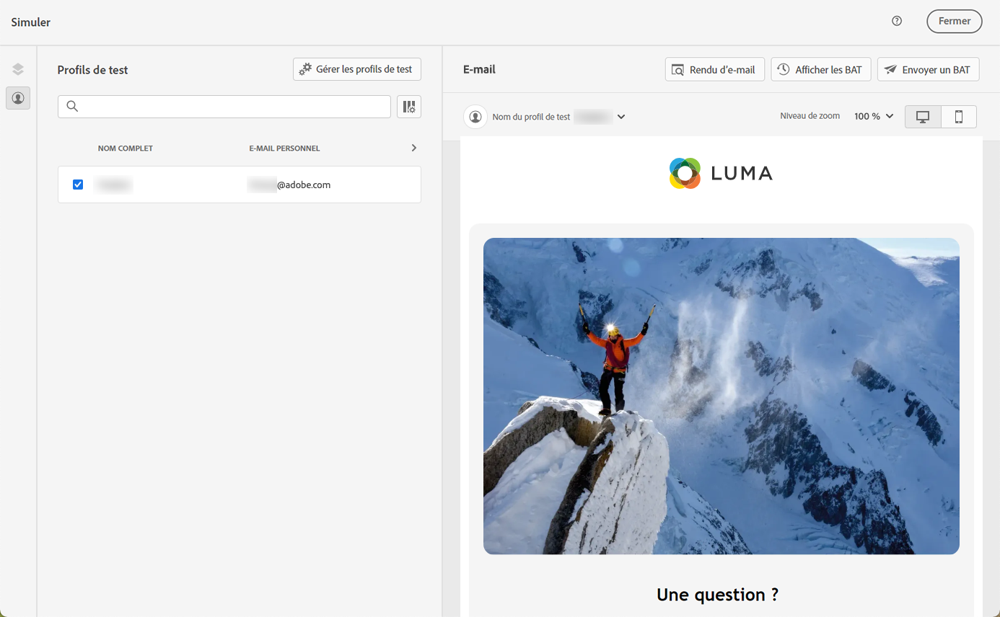

# Utiliser des modèles de contenu d’e-mail {#content-templates}

Pour accélérer et améliorer le processus de conception, vous pouvez créer des modèles autonomes pour réutiliser facilement du contenu personnalisé dans les campagnes et parcours [!DNL Journey Optimizer].

Cette fonctionnalité permet aux utilisateurs et utilisatrices orientés sur le contenu de travailler sur des modèles en dehors des campagnes ou des parcours. Les utilisateurs et utilisatrices marketing peuvent ensuite réutiliser et adapter ces modèles de contenu autonomes dans leurs propres parcours ou campagnes.

>[!NOTE]
>
>Actuellement, seuls les modèles de contenu d’**e-mail** sont pris en charge.

Par exemple, un utilisateur ou une utilisatrice de votre société est responsable du contenu uniquement et n’a donc pas accès aux campagnes ou aux parcours. Cependant, cet utilisateur ou cette utilisatrice peut créer un modèle d‘email que les responsables marketing de votre organisation pourront sélectionner pour une utilisation dans tous les e-mails comme point de départ.

Vous pouvez également créer et gérer des modèles de contenu à l’aide d’API. Pour plus d’informations à ce sujet, consultez la [documentation relative aux API Journey Optimizer](https://developer.adobe.com/journey-optimizer-apis/references/content/){target="_blank"}.

➡️ [Découvrez comment créer et utiliser des modèles dans cette vidéo.](#video-templates)

>[!CAUTION]
>
>Pour créer, modifier et supprimer des modèles de contenu, vous devez disposer de l’autorisation **[!DNL Manage library items]** incluse dans le profil de produit **[!DNL Content Library Manager]**. [En savoir plus](../administration/ootb-product-profiles.md#content-library-manager).

## Accéder aux modèles et les gérer {#access-manage-templates}

Pour accéder à la liste des modèles de contenu, sélectionnez **[!UICONTROL Gestion de contenu]** > **[!UICONTROL Modèles de contenu]** dans le menu de gauche.

Tous les modèles qui ont été créés sur le sandbox actuel à partir d’un parcours ou d’une campagne à l’aide de l’option [Enregistrer en tant que modèle](#save-as-template) du menu **[!UICONTROL Modèles de contenu]** s’affichent.

Vous pouvez trier les modèles de contenu par date de création ou de modification. Vous pouvez également choisir d’afficher uniquement les éléments que vous avez créés ou modifiés.

Pour modifier le contenu d’un modèle, cliquez sur l’élément de votre choix dans la liste, puis sélectionnez **[!UICONTROL Modifier le contenu]**.

Pour supprimer un modèle, sélectionnez l’icône de corbeille en regard du modèle souhaité.

>[!NOTE]
>
>Lorsqu’un modèle est modifié ou supprimé, les campagnes ou les parcours, y compris les e-mails créés à l’aide de ce modèle, ne sont pas affectés.

## Créer des modèles de contenu {#create-content-templates}

>[!CONTEXTUALHELP]
>id="ajo_create_template"
>title="Définissez votre propre modèle de contenu"
>abstract="Créez entièrement un modèle personnalisé autonome pour rendre votre contenu réutilisable sur plusieurs parcours et campagnes."

Vous pouvez créer des modèles de contenu de deux manières :

* Créez un nouveau modèle de contenu à l’aide du menu **[!UICONTROL Modèles de contenu]** du rail de gauche. [Voici comment procéder.](#create-template-from-scratch)

* Lors de la conception d’un e-mail dans une campagne ou un parcours, enregistrez le contenu de votre e-mail en tant que modèle. [Voici comment procéder.](#save-as-template)

Une fois enregistré, votre modèle de contenu peut être utilisé dans une campagne ou un parcours. Qu’il soit créé entièrement ou à partir d’un email précédent, vous pouvez maintenant utiliser ce modèle lors de la création d’un [e-mail](../email/get-started-email-design.md) dans [!DNL Journey Optimizer]. [Voici comment procéder.](../email/use-email-templates.md)

>[!NOTE]
>
>* Les modifications apportées aux modèles de contenu ne sont pas propagées aux campagnes ou aux parcours, qu’ils soient en ligne ou en version préliminaire.
>
>* De même, lorsque des modèles sont utilisés dans une campagne ou un parcours, les modifications que vous apportez au contenu de votre campagne et de votre parcours n’ont aucune incidence sur le modèle de contenu précédemment utilisé.

### Créer un nouveau modèle {#create-template-from-scratch}

Pour créer entièrement un nouveau modèle de contenu, procédez comme suit.

1. Accédez à la liste des modèles de contenu via le menu de gauche **[!UICONTROL Gestion de contenu]** > **[!UICONTROL Modèles de contenu]**.

1. Sélectionnez **[!UICONTROL Créer un modèle]**.

1. Renseignez les détails du modèle.

   

   >[!NOTE]
   >
   >Actuellement, seuls le canal **E-mail** et le type **HTML** sont pris en charge.

1. Pour attribuer des libellés d’utilisation des données personnalisés ou de base au modèle, sélectionnez **[!UICONTROL Gérer l’accès]**. [En savoir plus sur le contrôle d’accès au niveau de l’objet (OLAC)](../administration/object-based-access.md).

1. Sélectionnez ou créez des balises Adobe Experience Platform à partir du champ **[!UICONTROL Balises]** pour classer votre modèle en vue d’une recherche améliorée. [En savoir plus](../start/search-filter-categorize.md#tags).

1. Cliquez sur **[!UICONTROL Créer]** et choisissez comment concevoir votre modèle à partir des différentes options :

   * [Concevez entièrement votre e-mail](../email/content-from-scratch.md) via l’interface du concepteur d’e-mail.

   * [Codez ou copiez et collez du code HTML brut](../email/code-content.md) directement dans le concepteur d’e-mail.

   * [Importez du contenu HTML existant](../email/existing-content.md) à partir d’un fichier ou d’un dossier .zip.

   * Utilisez du contenu existant à partir d’une liste de modèles intégrés ou personnalisés. Les étapes pour utiliser un modèle de contenu dans un e-mail sont décrites dans [cette section](../email/use-email-templates.md).

   

1. Le [concepteur d’e-mail](../email/get-started-email-design.md) s’affiche. Modifiez votre contenu selon vos besoins, de la même manière que pour tout e-mail contenu dans un parcours ou une campagne, selon l’option que vous avez sélectionnée.

   Vous pouvez tester votre contenu si nécessaire. [Voici comment procéder.](#test-template)

1. Une fois votre modèle prêt, cliquez sur **[!UICONTROL Enregistrer]**.

1. Si nécessaire, cliquez sur la flèche en regard du nom du modèle pour revenir à l’écran **[!UICONTROL Détails]** et modifier votre modèle.

   

Ce modèle est maintenant prêt à être utilisé lors de la création d’un e-mail dans [!DNL Journey Optimizer]. [Voici comment procéder.](../email/use-email-templates.md)

### Enregistrer en tant que modèle {#save-as-template}

>[!CONTEXTUALHELP]
>id="ajo_messages_depecrated_inventory"
>title="Découvrez comment migrer vos messages"
>abstract="Le 25 juillet 2022, le menu Messages a disparu et les messages sont désormais créés directement à partir d’un parcours. Si vous souhaitez réutiliser vos messages hérités dans les parcours, vous devez les enregistrer en tant que modèles."

Lors de la conception d’un [e-mail](../email/get-started-email-design.md) dans une campagne ou un parcours, vous pouvez enregistrer le contenu de votre email pour une réutilisation ultérieure. Pour ce faire, suivez les étapes ci-après.

1. Dans le concepteur d’e-mail, cliquez sur les points de suspension en haut à droite de l’écran.

1. Sélectionnez **[!UICONTROL Enregistrer en tant que modèle de contenu]** dans le menu déroulant.

   

1. Ajoutez un nom et une description pour ce modèle.

   

1. Pour attribuer des libellés d’utilisation des données personnalisés ou de base au modèle, sélectionnez **[!UICONTROL Gérer l’accès]**. [En savoir plus](../administration/object-based-access.md).

1. Sélectionnez ou créez une balise Adobe Experience Platform à partir du champ **Balises** pour classer votre modèle. [En savoir plus](../start/search-filter-categorize.md#tags).

1. Cliquez sur **[!UICONTROL Enregistrer]**.

1. Le modèle est enregistré dans la liste **[!UICONTROL Modèles de contenu]**, accessible à partir du menu dédié [!DNL Journey Optimizer]. Il devient alors un modèle de contenu autonome accessible pouvant être édité et supprimé comme tout autre élément de cette liste. [En savoir plus](#access-manage-templates).

Vous pouvez désormais utiliser ce modèle lors de la création d’un [e-mail](../email/get-started-email-design.md) dans [!DNL Journey Optimizer]. [Voici comment procéder.](../email/use-email-templates.md)

>[!NOTE]
>
>Toute modification apportée à ce nouveau modèle n’est pas propagée dans l’e-mail d’où il provient. De même, lorsque le contenu d’origine est modifié dans cet e-mail, le nouveau modèle n’est pas modifié.

## Testez votre modèle de contenu {#test-template}

Vous pouvez tester le rendu de tout modèle de contenu d’e-mail, qu’il ait été créé entièrement ou à partir d’un e-mail. Pour ce faire, procédez comme suit.

1. Pour accéder à la liste des modèles de contenu, consultez le menu **[!UICONTROL Gestion de contenu]** > **[!UICONTROL Modèles de contenu]** et sélectionnez n’importe quel modèle.

1. Cliquez sur **[!UICONTROL Modifier le contenu]** dans les **[!UICONTROL Propriétés du modèle]**.

1. Cliquez sur **[!UICONTROL Simuler du contenu]** et sélectionnez un profil de test pour vérifier le rendu des e-mails. Vous pouvez choisir la vue bureau ou la vue mobile. [En savoir plus](../content-management/preview-test.md).

   

1. Vous pouvez envoyer un BAT pour tester votre contenu et le faire approuver par certains utilisateurs et utilisatrices internes avant de l’utiliser pour un parcours ou une campagne.

   * Pour ce faire, cliquez sur le bouton **[!UICONTROL Envoyer un BAT]** et suivez les étapes décrites dans [cette section](../content-management/proofs.md).

   * Avant d’envoyer le BAT, vous devez sélectionner la [surface d’e-mail](../configuration/channel-surfaces.md) qui sera utilisée pour tester votre contenu.

     

>[!CAUTION]
>
>Pour l’instant, le suivi n’est pas pris en charge lors du test des modèles de contenu d’e-mail. Dès lors, le suivi des événements, des paramètres UTM et des liens de page de destination n’est pas assuré dans les BAT envoyés à partir d’un modèle. Pour tester le suivi, [utilisez le modèle de contenu](../email/use-email-templates.md) d’un e-mail et [envoyez un BAT](../content-management/preview-test.md#send-proofs).

## Vidéo pratique {#video-templates}

Découvrez comment créer, modifier et utiliser des modèles de contenu dans [!DNL Journey Optimizer].

>[!VIDEO](https://video.tv.adobe.com/v/3413743/?quality=12)
