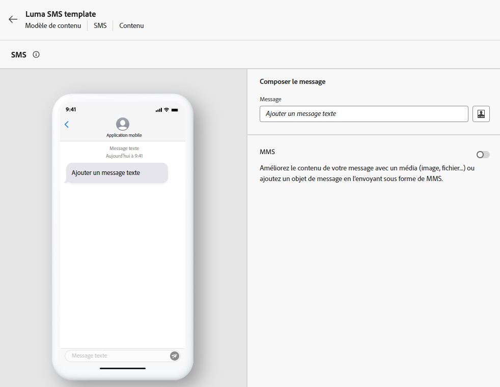
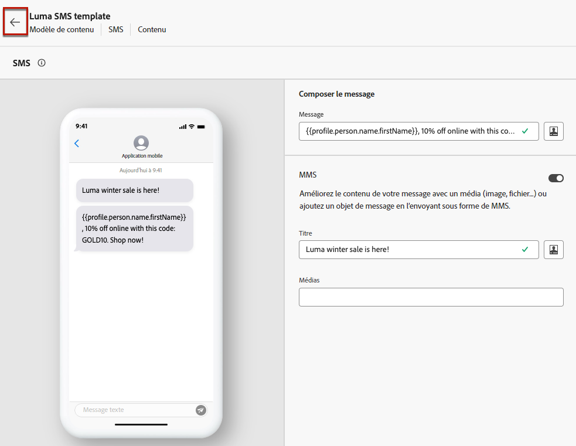
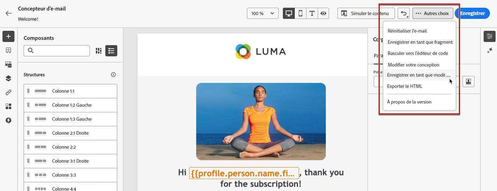
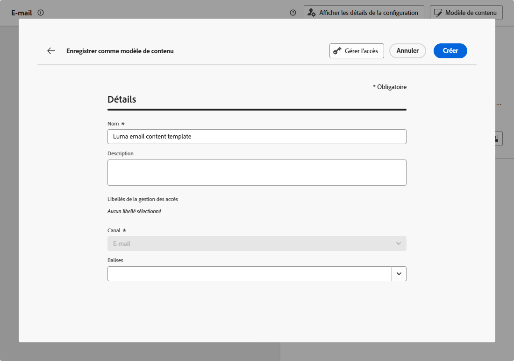

# Utiliser des modèles de contenu d’e-mail {#content-templates}

Pour accélérer et améliorer le processus de conception, vous pouvez créer des modèles autonomes pour réutiliser facilement du contenu personnalisé dans les campagnes et parcours [!DNL Journey Optimizer].

Cette fonctionnalité permet aux utilisateurs et utilisatrices orientés sur le contenu de travailler sur des modèles en dehors des campagnes ou des parcours. Les utilisateurs et utilisatrices marketing peuvent ensuite réutiliser et adapter ces modèles de contenu autonomes dans leurs propres parcours ou campagnes.

<!---->

>[!NOTE]
>
>Actuellement, les modèles de contenu ne sont pas disponibles pour le canal web.

Par exemple, un utilisateur ou une utilisatrice de votre société est responsable du contenu uniquement et n’a donc pas accès aux campagnes ou aux parcours. Cependant, cet utilisateur ou cette utilisatrice peut créer un modèle d‘email que les responsables marketing de votre organisation pourront sélectionner pour une utilisation dans tous les e-mails comme point de départ.

Vous pouvez également créer et gérer des modèles de contenu à l’aide d’API. Pour plus d’informations à ce sujet, consultez la [documentation relative aux API Journey Optimizer](https://developer.adobe.com/journey-optimizer-apis/references/content/){target="_blank"}.

➡️ [Découvrez comment créer et utiliser des modèles dans cette vidéo.](#video-templates)

>[!CAUTION]
>
>Pour créer, modifier et supprimer des modèles de contenu, vous devez disposer de l’autorisation **[!DNL Manage library items]** incluse dans le profil de produit **[!DNL Content Library Manager]**. [En savoir plus](../administration/ootb-product-profiles.md#content-library-manager).

## Accéder aux modèles et les gérer {#access-manage-templates}

Pour accéder à la liste des modèles de contenu, sélectionnez **[!UICONTROL Gestion de contenu]** > **[!UICONTROL Modèles de contenu]** dans le menu de gauche.

Tous les modèles qui ont été créés sur l’environnement de test actuel, à partir d’un parcours ou d’une campagne à l’aide de la variable **[!UICONTROL Enregistrer en tant que modèle]** de l’option **[!UICONTROL Modèles de contenu]** menu - s’affichent. [Découvrez comment créer des modèles](#create-content-templates)

Vous pouvez trier les modèles de contenu en procédant comme suit :
* Type
* Canal
* Date de création ou de modification
* Balises - [En savoir plus sur les balises](../start/search-filter-categorize.md#tags)

Vous pouvez également choisir d’afficher uniquement les éléments que vous avez vous-même créés ou modifiés.

<!--Select the **[!UICONTROL Grid view]** mode to display each template as a thumbnail. 

>[!NOTE]
>
>Currently proper thumbnails can only be generated for HTML-type email content templates.

When you update a content, you may have to wait a few seconds before the changes are reflected in the thumbnail.

-->

* Pour modifier le contenu d’un modèle, cliquez sur l’élément de votre choix dans la liste, puis sélectionnez **[!UICONTROL Modifier le contenu]**.

  

* Pour supprimer un modèle, sélectionnez l’option **[!UICONTROL Autres actions]** en regard du modèle souhaité et sélectionnez **[!UICONTROL Supprimer]**.

  

>[!NOTE]
>
>Lorsqu’un modèle est modifié ou supprimé, les campagnes ou les parcours, y compris le contenu créé à l’aide de ce modèle, ne sont pas affectés.

## Créer des modèles de contenu {#create-content-templates}

>[!CONTEXTUALHELP]
>id="ajo_create_template"
>title="Définissez votre propre modèle de contenu"
>abstract="Créez entièrement un modèle personnalisé autonome pour rendre votre contenu réutilisable sur plusieurs parcours et campagnes."

Vous pouvez créer des modèles de contenu de deux manières :

* Créez un nouveau modèle de contenu à l’aide du menu **[!UICONTROL Modèles de contenu]** du rail de gauche. [Voici comment procéder.](#create-template-from-scratch)

* Lors de la conception de votre contenu dans une campagne ou un parcours, enregistrez-le en tant que modèle. [Voici comment procéder.](#save-as-template)

Une fois enregistré, votre modèle de contenu peut être utilisé dans une campagne ou un parcours. Qu’il soit créé à partir de zéro ou d’un contenu précédent, vous pouvez maintenant utiliser ce modèle lors de la création de tout contenu dans [!DNL Journey Optimizer]. [Voici comment procéder.](#use-content-templates)

>[!NOTE]
>
>* Les modifications apportées aux modèles de contenu ne sont pas propagées aux campagnes ou aux parcours, qu’ils soient en ligne ou en version préliminaire.
>
>* De même, lorsque des modèles sont utilisés dans une campagne ou un parcours, les modifications que vous apportez au contenu de votre campagne et de votre parcours n’ont aucune incidence sur le modèle de contenu précédemment utilisé.

### Créer un nouveau modèle {#create-template-from-scratch}

Pour créer entièrement un nouveau modèle de contenu, procédez comme suit.

1. Accédez à la liste des modèles de contenu via le menu de gauche **[!UICONTROL Gestion de contenu]** > **[!UICONTROL Modèles de contenu]**.

1. Sélectionnez **[!UICONTROL Créer un modèle]**.

1. Renseignez les détails du modèle et sélectionnez le canal souhaité.

   

   >[!NOTE]
   >
   >Actuellement, tous les canaux sont disponibles, à l&#39;exception du Web.

1. Choisissez une **[!UICONTROL Type]** pour le canal sélectionné.

   

   * Pour **[!UICONTROL Email]**, si vous sélectionnez **[!UICONTROL Contenu]**, vous pouvez définir la variable [Objet](../email/create-email.md#define-email-content) dans votre modèle. Si vous sélectionnez **[!UICONTROL HTML]**, vous pouvez uniquement définir le contenu du corps de l&#39;email.

   * Pour **[!UICONTROL SMS]**, **[!UICONTROL Push]**, **[!UICONTROL In-App]** et **[!UICONTROL Courrier]**, seul le type par défaut est disponible pour le canal actuel. Vous devez toujours la sélectionner.

1. Sélectionnez ou créez des balises Adobe Experience Platform à partir du champ **[!UICONTROL Balises]** pour classer votre modèle en vue d’une recherche améliorée. [En savoir plus](../start/search-filter-categorize.md#tags)

1. Pour attribuer des libellés d’utilisation de données personnalisés ou de base au modèle, vous pouvez sélectionner **[!UICONTROL Gérer l’accès]**. [En savoir plus sur le contrôle d’accès au niveau de l’objet (OLAC)](../administration/object-based-access.md).

1. Cliquez sur **[!UICONTROL Créer]** et concevez votre contenu selon les besoins, de la même manière que pour tout contenu à l’intérieur d’un parcours ou d’une campagne, selon le canal que vous avez sélectionné.

   

   Découvrez comment créer du contenu pour les différents canaux dans les sections suivantes :
   * [Définition du contenu d’un email](../email/get-started-email-design.md)
   * [Définition du contenu push](../push/design-push.md)
   * [Définir le contenu SMS](../sms/create-sms.md#sms-content)
   * [Définir le contenu du courrier](../direct-mail/create-direct-mail.md)
   * [Définition du contenu in-app](../in-app/design-in-app.md)

1. Si vous créez une **[!UICONTROL Email]** avec le modèle **[!UICONTROL HTML]** vous pouvez tester votre contenu. [Voici comment procéder.](#test-template)

1. Une fois votre modèle prêt, cliquez sur **[!UICONTROL Enregistrer]**.

1. Cliquez sur la flèche en regard du nom du modèle pour revenir au **[!UICONTROL Détails]** écran.

   

Ce modèle est maintenant prêt à être utilisé lors de la création de contenu dans [!DNL Journey Optimizer]. [Voici comment procéder.](#use-content-templates)

### Enregistrer en tant que modèle {#save-as-template}

>[!CONTEXTUALHELP]
>id="ajo_messages_depecrated_inventory"
>title="Découvrez comment migrer vos messages"
>abstract="Le 25 juillet 2022, le menu Messages a disparu et les messages sont désormais créés directement à partir d’un parcours. Si vous souhaitez réutiliser vos messages hérités dans les parcours, vous devez les enregistrer en tant que modèles."

Lors de la conception d&#39;un contenu dans une campagne ou un parcours, vous pouvez l&#39;enregistrer pour une réutilisation ultérieure. Pour ce faire, suivez les étapes ci-après.

1. À partir du message **[!UICONTROL Modifier le contenu]** , cliquez sur l’écran **[!UICONTROL Modèle de contenu]** bouton .

1. Sélectionnez **[!UICONTROL Enregistrer en tant que modèle de contenu]** dans le menu déroulant.

   

   Si vous vous trouvez dans la variable [Concepteur d&#39;email](../email/get-started-email-design.md), vous pouvez également sélectionner cette option dans le **[!UICONTROL Plus]** Liste déroulante en haut à droite de l’écran.

   

1. Ajoutez un nom et une description pour ce modèle.

   

   >[!NOTE]
   >
   >Le canal et le type actuels sont automatiquement renseignés et ne peuvent pas être modifiés. Pour les modèles de courrier électronique créés à partir du [Concepteur d&#39;email](../email/get-started-email-design.md), la variable **[!UICONTROL HTML]** type est automatiquement sélectionné.

1. Sélectionnez ou créez une balise Adobe Experience Platform à partir du champ **Balises** pour classer votre modèle. [En savoir plus](../start/search-filter-categorize.md#tags).

1. Pour attribuer des libellés d’utilisation de données personnalisés ou de base au modèle, vous pouvez sélectionner **[!UICONTROL Gérer l’accès]**. [En savoir plus](../administration/object-based-access.md).

1. Cliquez sur **[!UICONTROL Enregistrer]**.

1. Le modèle est enregistré dans la liste **[!UICONTROL Modèles de contenu]**, accessible à partir du menu dédié [!DNL Journey Optimizer]. Il devient alors un modèle de contenu autonome accessible pouvant être édité et supprimé comme tout autre élément de cette liste. [En savoir plus](#access-manage-templates).

Vous pouvez désormais utiliser ce modèle lorsque vous créez du contenu dans [!DNL Journey Optimizer]. [Voici comment procéder](#use-content-templates)

>[!NOTE]
>
>Toute modification apportée à ce nouveau modèle n’est pas propagée au contenu d’où elle provient. De même, lorsque le contenu d’origine est modifié dans ce contenu, le nouveau modèle n’est pas modifié.

## Tester les modèles de contenu d&#39;email {#test-template}

Vous pouvez tester le rendu de certains de vos modèles d&#39;email, qu&#39;ils soient créés entièrement ou à partir d&#39;un contenu existant. Pour ce faire, procédez comme suit.

>[!CAUTION]
>
>Actuellement, le test des modèles de contenu n’est disponible que pour **[!UICONTROL Email]** avec le modèle **[!UICONTROL HTML]** type.

1. Accédez à la liste des modèles de contenu via le **[!UICONTROL Gestion de contenu]** > **[!UICONTROL Modèles de contenu]** et sélectionnez un modèle d&#39;email.

1. Cliquez sur **[!UICONTROL Modifier le contenu]** dans les **[!UICONTROL Propriétés du modèle]**.

1. Cliquez sur **[!UICONTROL Simulation du contenu]** et sélectionnez un profil de test pour vérifier votre rendu. [En savoir plus](../content-management/preview-test.md).

   

1. Vous pouvez envoyer un BAT pour tester votre contenu et le faire approuver par certains utilisateurs et utilisatrices internes avant de l’utiliser pour un parcours ou une campagne.

   * Pour ce faire, cliquez sur le bouton **[!UICONTROL Envoyer un BAT]** et suivez les étapes décrites dans [cette section](../content-management/proofs.md).

   * Avant d’envoyer le BAT, vous devez sélectionner la [surface d’e-mail](../configuration/channel-surfaces.md) qui sera utilisée pour tester votre contenu.

     

>[!CAUTION]
>
>Pour l’instant, le suivi n’est pas pris en charge lors du test des modèles de contenu d’e-mail. Dès lors, le suivi des événements, des paramètres UTM et des liens de page de destination n’est pas assuré dans les BAT envoyés à partir d’un modèle. Pour tester le suivi, [utilisez le modèle de contenu](../email/use-email-templates.md) d’un e-mail et [envoyez un BAT](../content-management/preview-test.md#send-proofs).

## Utiliser des modèles de contenu {#use-content-templates}

Lors de la création de contenu pour n’importe quel canal (sauf Web) dans [!DNL Journey Optimizer], vous pouvez utiliser un modèle personnalisé qui :

* vous avez créé à l’aide du menu **[!UICONTROL Modèles de contenu]** ; [En savoir plus](#create-template-from-scratch).

* Enregistré dans un contenu existant d’un parcours ou d’une campagne à l’aide du **[!UICONTROL Enregistrer en tant que modèle de contenu]** . [En savoir plus](#save-as-template)

Pour commencer à créer votre contenu avec l’un de ces modèles, procédez comme suit.

1. Dans une campagne ou un parcours, après avoir sélectionné **[!UICONTROL Modifier le contenu]**, cliquez sur le **[!UICONTROL Modèle de contenu]** bouton .

1. Sélectionner **[!UICONTROL Appliquer le modèle de contenu]**.

   

1. Sélectionnez le modèle de votre choix dans la liste. Seuls les modèles compatibles avec le canal et/ou le type sélectionnés sont affichés.

   

   >[!NOTE]
   >
   >Depuis cet écran, vous pouvez également créer un modèle à partir du bouton dédié qui ouvre un nouvel onglet.

1. Cliquez sur **[!UICONTROL Valider]**. Le modèle est appliqué à votre contenu.

1. Continuez à modifier votre contenu selon vos besoins.

>[!NOTE]
>
>Pour commencer à concevoir un email à partir d’un modèle de contenu à l’aide de la fonction [Concepteur d&#39;email](../email/get-started-email-design.md), suivez les étapes décrites dans la section [cette section](../email/use-email-templates.md).

## Vidéo pratique {#video-templates}

Découvrez comment créer, modifier et utiliser des modèles de contenu dans [!DNL Journey Optimizer].

>[!VIDEO](https://video.tv.adobe.com/v/3413743/?quality=12)
