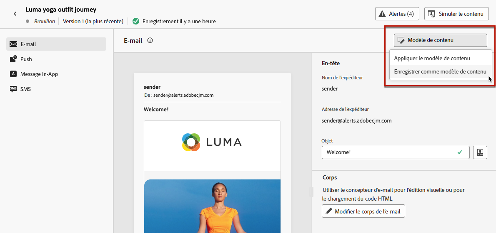

# Créer des modèles de contenu {#create-content-templates}

>[!CONTEXTUALHELP]
>id="ajo_create_template"
>title="Définissez votre propre modèle de contenu"
>abstract="Créez entièrement un modèle personnalisé autonome pour rendre votre contenu réutilisable sur plusieurs parcours et campagnes."

Vous pouvez créer des modèles de contenu de deux manières :

* Créez un modèle de contenu à partir de zéro à l’aide du menu **[!UICONTROL Modèles de contenu]** du rail de gauche. [Voici comment procéder](#create-template-from-scratch)

* Lors de la conception de votre contenu dans une campagne ou un parcours, enregistrez-le en tant que modèle. [Voici comment procéder.](#save-as-template)

Une fois enregistré, votre modèle de contenu peut être utilisé dans une campagne ou un parcours. Qu’il soit créé entièrement ou à partir d’un contenu précédent, vous pouvez maintenant utiliser ce modèle lors de la création d’un contenu dans [!DNL Journey Optimizer]. [Voici comment procéder.](#use-content-templates)

>[!NOTE]
>
>* Les modifications apportées aux modèles de contenu ne sont pas propagées aux campagnes ou aux parcours, qu’ils soient en ligne ou en version préliminaire.
>
>* De même, lorsque des modèles sont utilisés dans une campagne ou un parcours, les modifications que vous apportez au contenu de votre campagne et de votre parcours n’ont aucune incidence sur le modèle de contenu précédemment utilisé.

## Créer un nouveau modèle {#create-template-from-scratch}

>[!NOTE]
>
>À compter de mars 2025, les modèles de contenu de type HTML seront désormais obsolètes. Vous pouvez toujours utiliser les modèles de contenu HTML existants précédemment créés dans [!DNL Journey Optimizer].

Pour créer entièrement un nouveau modèle de contenu, procédez comme suit.

1. Accédez à la liste des modèles de contenu via le menu de gauche **[!UICONTROL Gestion de contenu]** > **[!UICONTROL Modèles de contenu]**.

1. Sélectionnez **[!UICONTROL Créer un modèle]**.

1. Renseignez les détails du modèle et sélectionnez le canal souhaité.

   

   >[!NOTE]
   >
   >Actuellement, tous les canaux sont disponibles, à l’exception du canal web.

1. Sélectionnez ou créez des balises Adobe Experience Platform à partir du champ **[!UICONTROL Balises]** pour classer votre modèle en vue d’une recherche améliorée. [En savoir plus](../start/search-filter-categorize.md#tags)

1. Pour attribuer des libellés d’utilisation des données personnalisés ou de base au modèle, vous pouvez sélectionner **[!UICONTROL Gérer l’accès]**. [En savoir plus sur le contrôle d’accès au niveau de l’objet (OLAC)](../administration/object-based-access.md)

1. Cliquez sur **[!UICONTROL Créer]** et concevez votre contenu selon vos besoins, de la même manière que pour tout contenu dans un parcours ou une campagne, selon le canal que vous avez sélectionné.

   

   Découvrez comment créer du contenu pour les différents canaux dans les sections suivantes :
   * [Définir le contenu d’un e-mail](../email/get-started-email-design.md)
   * [Définir le contenu d’une notification push](../push/design-push.md)
   * [Définir le contenu d’un SMS](../sms/create-sms.md#sms-content)
   * [Définir le contenu d’un courrier](../direct-mail/create-direct-mail.md)
   * [Définir le contenu in-app](../in-app/design-in-app.md)

1. Vous pouvez tester votre contenu. [Voici comment procéder.](#test-template)

1. Une fois votre modèle prêt, cliquez sur **[!UICONTROL Enregistrer]**.

1. Cliquez sur la flèche en regard du nom du modèle pour revenir à l’écran **[!UICONTROL Détails]**.

   

Ce modèle est maintenant prêt à être utilisé lors de la création d’un contenu dans [!DNL Journey Optimizer]. [Voici comment procéder](#use-content-templates)

>[!NOTE]
>
>Lors de la création d’un modèle de contenu d’e-mail, vous pouvez appliquer rapidement un style spécifique adapté à votre marque et à votre conception à votre contenu. [En savoir plus](../email/apply-email-themes.md)

## Enregistrer le contenu comme modèle de contenu {#save-as-template}

>[!CONTEXTUALHELP]
>id="ajo_messages_depecrated_inventory"
>title="Découvrez comment migrer vos messages"
>abstract="Le 25 juillet 2022, le menu Messages a disparu et les messages sont désormais créés directement à partir d’un parcours. Si vous souhaitez réutiliser vos messages hérités dans les parcours, vous devez les enregistrer en tant que modèles."

Lors de la conception d’un contenu dans une campagne ou un parcours, vous pouvez l’enregistrer pour une réutilisation ultérieure. Pour ce faire, suivez les étapes ci-après.

1. Dans l’écran **[!UICONTROL Modifier le contenu]** du message, cliquez sur le bouton **[!UICONTROL Modèle de contenu]**.

1. Sélectionnez **[!UICONTROL Enregistrer en tant que modèle de contenu]** dans le menu déroulant.

   

   Si vous vous trouvez dans le [Concepteur d’e-mail](../email/get-started-email-design.md), vous pouvez également sélectionner cette option dans la liste déroulante **[!UICONTROL Plus]** située en haut à droite de l’écran.

   

1. Ajoutez un nom et une description pour ce modèle.

   

   >[!NOTE]
   >
   >Le canal actuel est automatiquement renseigné et ne peut pas être modifié.

1. Sélectionnez ou créez une balise Adobe Experience Platform à partir du champ **Balises** pour classer votre modèle. [En savoir plus](../start/search-filter-categorize.md#tags).

1. Pour attribuer des libellés d’utilisation des données personnalisés ou de base au modèle, vous pouvez sélectionner **[!UICONTROL Gérer l’accès]**. [En savoir plus](../administration/object-based-access.md).

1. Cliquez sur **[!UICONTROL Enregistrer]**.

1. Le modèle est enregistré dans la liste **[!UICONTROL Modèles de contenu]**, accessible à partir du menu dédié [!DNL Journey Optimizer]. Il devient alors un modèle de contenu autonome accessible pouvant être édité et supprimé comme tout autre élément de cette liste. [En savoir plus](#access-manage-templates).

Vous pouvez désormais utiliser ce modèle lors de la création de contenu dans [!DNL Journey Optimizer]. [Voici comment procéder](#use-content-templates)

>[!NOTE]
>
>Toute modification apportée à ce nouveau modèle n’est pas propagée dans le contenu d’où il provient. De même, lorsque le contenu d’origine est modifié dans ce contenu, le nouveau modèle n’est pas modifié.
