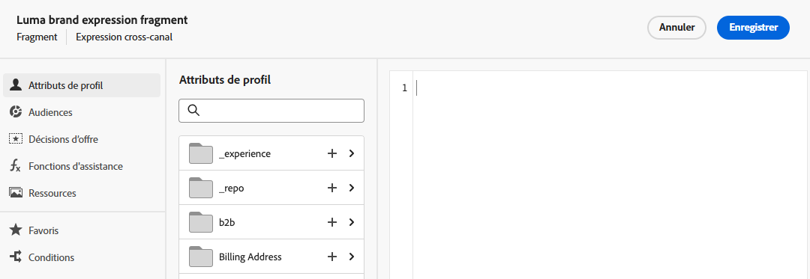

# Créer un fragment {#create-fragments}

>[!CONTEXTUALHELP]
>id="ajo_create_visual_fragment"
>title="Sélectionner le type Visuel"
>abstract="Créez un fragment visuel autonome pour rendre votre contenu réutilisable dans un e-mail au sein d’un parcours ou d’une campagne, ou dans un modèle de contenu."
>additional-url="https://experienceleague.adobe.com/fr/docs/journey-optimizer/using/channels/email/design-email/add-content/use-visual-fragments" text="Ajouter des fragments visuels à vos e-mails"

>[!CONTEXTUALHELP]
>id="ajo_create_expression_fragment"
>title="Sélectionner le type Expression"
>abstract="Créez un fragment d’expression autonome à partir de zéro pour rendre votre contenu réutilisable sur plusieurs parcours et campagnes. Lorsque vous utilisez l’éditeur de personnalisation, vous pouvez utiliser tous les fragments d’expression qui ont été créés dans le sandbox actuel."
>additional-url="https://experienceleague.adobe.com/fr/docs/journey-optimizer/using/content-management/personalization/expression-editor/use-expression-fragments" text="Utiliser des fragments d’expression"

Les fragments peuvent être créés entièrement à partir du menu de gauche **[!UICONTROL Fragments]**. De plus, vous pouvez également enregistrer une partie du contenu existant en tant que fragment lorsque vous concevez du contenu. [Voici comment procéder.](#save-as-fragment)

Une fois enregistré, votre fragment peut être utilisé dans un parcours, une campagne ou un modèle. Vous pouvez utiliser ce fragment pour créer du contenu dans le cadre des parcours et des campagnes. Voir [Ajout de fragments visuels](../email/use-visual-fragments.md) et [Utilisation de fragments d’expression](../personalization/use-expression-fragments.md).

Pour créer un fragment, suivez les étapes présentées ci-dessous.

## Définir les propriétés du fragment {#properties}

1. Accédez à la liste des fragments via le menu de gauche **[!UICONTROL Gestion de contenu]** > **[!UICONTROL Fragments]**.

1. Sélectionnez **[!UICONTROL Créer un fragment]** et renseignez le nom et la description du fragment (si nécessaire).

   

1. Sélectionnez ou créez des balises Adobe Experience Platform à partir du champ **[!UICONTROL Balises]** pour classer votre fragment en vue d’une recherche améliorée. [Découvrir comment utiliser les balises unifiées](../start/search-filter-categorize.md#tags)

1. Sélectionnez le type de fragment : **Fragment visuel** ou **Fragment d’expression**. [En savoir plus](../content-management/fragments.md#visual-expression)

   >[!NOTE]
   >
   >Actuellement, les fragments visuels sont disponibles uniquement pour le canal **E-mail**.

1. Si vous créez un fragment d’expression, sélectionnez le type de code que vous souhaitez utiliser : **[!UICONTROL HTML]**, **[!UICONTROL JSON]** ou **[!UICONTROL Texte]**.

   

1. Pour attribuer des libellés d’utilisation des données personnalisés ou de base au fragment, cliquez sur le bouton **[!UICONTROL Gérer l’accès]** en haut de l’écran. [En savoir plus sur le contrôle d’accès au niveau de l’objet (OLAC)](../administration/object-based-access.md).

1. Cliquez sur le bouton **[!UICONTROL Créer]** pour concevoir le contenu de votre fragment.

## Concevoir le contenu du fragment {#content}

Après avoir configuré les propriétés du fragment, le concepteur d’e-mail ou l’éditeur de personnalisation s’ouvre, selon le type de fragment que vous créez.

* Pour les fragments visuels, modifiez votre contenu selon vos besoins, de la même manière que pour tout e-mail se trouvant dans un parcours ou une campagne. [En savoir plus](../email/get-started-email-design.md)

  

* Pour les fragments d’expression, utilisez l’éditeur de personnalisation de [!DNL Journey Optimizer] et toutes ses fonctionnalités de personnalisation et de création pour créer le contenu de votre fragment. [En savoir plus](../personalization/personalization-build-expressions.md)

  

Lorsque votre contenu est prêt, cliquez sur le bouton **[!UICONTROL Enregistrer]**. Le fragment est créé et ajouté à la liste de fragments avec le statut **[!UICONTROL Brouillon]**. Vous pouvez le prévisualiser et le publier pour le rendre disponible dans les parcours et les campagnes.

## Prévisualiser et publier le fragment {#publish}

>[!NOTE]
>
>Pour publier un fragment, vous devez disposer de l’autorisation utilisateur [Publier le fragment](../administration/ootb-product-profiles.md#content-library-manager).

Si votre fragment est prêt à être lancé, vous pouvez le prévisualiser et le publier pour le rendre disponible dans vos parcours et campagnes. Pour ce faire, procédez comme suit.

1. Revenez à l’écran de création de fragment après avoir conçu son contenu ou ouvrez-le depuis la liste des fragments.

1. Une prévisualisation du fragment est disponible sous le champ **[!UICONTROL Balises]**, permettant de vérifier son rendu. Si vous devez apporter des modifications, cliquez sur le bouton **[!UICONTROL Modifier]** dans la section supérieure de l’écran pour ouvrir le Designer d’e-mail ou l’éditeur de personnalisation, selon le type de fragment. [En savoir plus](manage-fragments.md#edit-fragments)

   

1. Cliquez sur le bouton **[!UICONTROL Publier]** dans le coin supérieur droit pour publier le fragment.

1. Si le fragment est utilisé dans un parcours dynamique ou une campagne, un message s’ouvre pour vous en informer. Cliquez sur le lien **[!UICONTROL En savoir plus]** pour accéder à la liste des parcours et/ou campagnes dans lesquels il est référencé. [Découvrir comment explorer les références d’un fragment](../content-management/manage-fragments.md#explore-references)

   {width="70%" align="center"}

   Cliquez sur **[!UICONTROL Confirmer]** pour publier le fragment et le mettre à jour dans les parcours actifs/campagnes actives qui l’utilisent.

Le fragment est désormais **[!UICONTROL en ligne]** et devient disponible lors de la création de tout contenu dans le Designer d’e-mail [!DNL Journey Optimizer] ou l’éditeur de personnalisation.

* [Découvrir comment utiliser des fragments visuels](../email/use-visual-fragments.md)
* [Découvrir comment utiliser des fragments d’expression](../personalization/use-expression-fragments.md)
