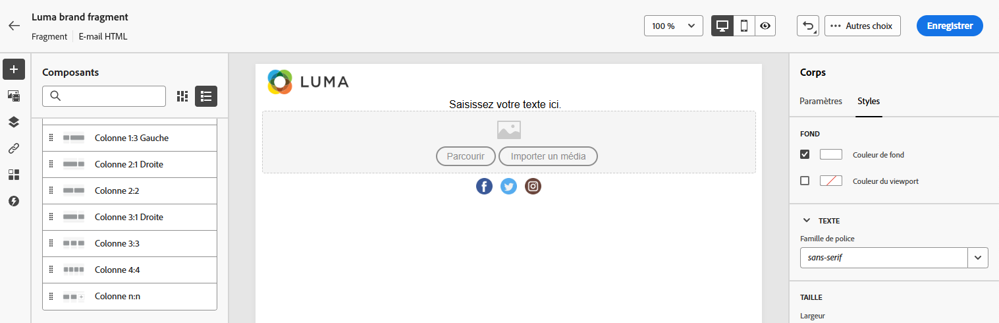

# Créer un fragment à partir de zéro {#create-fragments}

>[!CONTEXTUALHELP]
>id="ajo_create_visual_fragment"
>title="Sélectionner le type Visuel"
>abstract="Créez un fragment visuel autonome pour rendre votre contenu réutilisable dans un e-mail au sein d’un parcours ou d’une campagne, ou dans un modèle de contenu."
>additional-url="https://experienceleague.adobe.com/docs/journey-optimizer/using/email/design-email/add-content/use-visual-fragments.html?lang=fr" text="Ajouter des fragments visuels à vos e-mails"

>[!CONTEXTUALHELP]
>id="ajo_create_expression_fragment"
>title="Sélectionner le type Expression"
>abstract="Créez un fragment d’expression autonome à partir de zéro pour rendre votre contenu réutilisable sur plusieurs parcours et campagnes. Lorsque vous utilisez l’éditeur de personnalisation, vous pouvez utiliser tous les fragments d’expression qui ont été créés dans le sandbox actuel."
>additional-url="https://experienceleague.adobe.com/docs/journey-optimizer/using/content-management/personalization/expression-editor/use-expression-fragments.html?lang=fr" text="Utiliser des fragments d’expression"

Les fragments sont créés à partir du menu de gauche **[!UICONTROL Fragments]**. De plus, vous pouvez également enregistrer une partie du contenu existant en tant que fragment lorsque vous concevez du contenu. [Voici comment procéder.](#save-as-fragment)

Une fois enregistré, votre fragment peut être utilisé dans un parcours, une campagne ou un modèle. Vous pouvez désormais utiliser ce fragment lors de la création de tout contenu dans [!DNL Journey Optimizer]. Voir [Ajouter des fragments visuels](../email/use-visual-fragments.md) et [Utiliser des fragments d’expression](../personalization/use-expression-fragments.md)

Pour créer un fragment à partir de zéro, procédez comme suit.

1. Accédez à la liste des fragments via le menu de gauche **[!UICONTROL Gestion de contenu]** > **[!UICONTROL Fragments]**.

1. Sélectionnez **[!UICONTROL Créer un fragment]**.

1. Renseignez les détails du fragment, c’est-à-dire le nom et la description (si nécessaire).

   

1. Sélectionnez ou créez des balises Adobe Experience Platform à partir du champ **[!UICONTROL Balises]** pour classer votre fragment en vue d’une recherche améliorée. [En savoir plus](../start/search-filter-categorize.md#tags)

1. Sélectionnez le type de fragment : [Fragment visuel](#create-visual-fragment) ou [Fragment d’expression](#create-expression-fragment).

   >[!NOTE]
   >
   >Actuellement, seul le canal **E-mail** est pris en charge pour les fragments visuels.

1. Si vous créez un fragment d’expression, sélectionnez le type de code que vous souhaitez utiliser : **[!UICONTROL HTML]**, **[!UICONTROL JSON]** ou **[!UICONTROL Texte]**.

   

1. Pour attribuer des libellés d’utilisation des données personnalisés ou de base au fragment, sélectionnez **[!UICONTROL Gérer l’accès]**. [En savoir plus sur le contrôle d’accès au niveau de l’objet (OLAC)](../administration/object-based-access.md).

1. Cliquez sur **[!UICONTROL Créer]**.

1. Le [Concepteur d’e-mail](../email/get-started-email-design.md) ou l’éditeur de personnalisation s’ouvre, selon le type de fragment que vous créez.

   * Pour les fragments visuels, modifiez votre contenu selon vos besoins, de la même manière que pour tout e-mail se trouvant dans un parcours ou une campagne.

     >[!NOTE]
     >
     >Vous pouvez ajouter des champs de personnalisation et du contenu dynamique, mais les attributs contextuels ne sont pas pris en charge dans les fragments.

     

   * Pour les fragments d’expression, utilisez l’éditeur de personnalisation de [!DNL Journey Optimizer] et toutes ses fonctionnalités de personnalisation et de création pour créer le contenu de votre fragment. [En savoir plus](../personalization/personalization-build-expressions.md)

     

1. Une fois votre fragment prêt, cliquez sur **[!UICONTROL Enregistrer]**.

Le fragment est ajouté à la [liste de fragments](#access-manage-fragments). Il est maintenant prêt à être utilisé lors de la création de tout contenu dans le Concepteur d’e-mail ou l’éditeur de personnalisation de [!DNL Journey Optimizer].

* [Découvrir comment utiliser des fragments visuels](../email/use-visual-fragments.md)
* [Découvrir comment utiliser des fragments d’expression](../personalization/use-expression-fragments.md)
