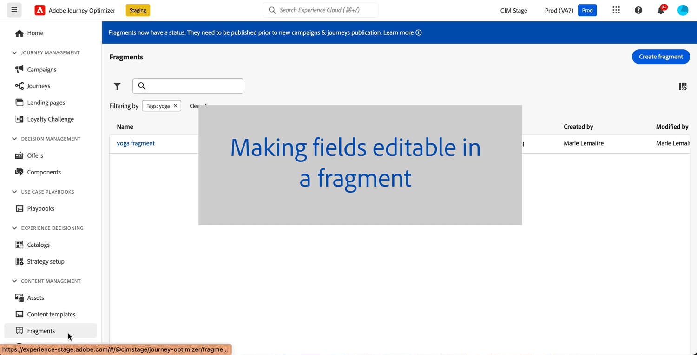

# Fragments personnalisables {#customizable-fragments}

Lorsque des fragments sont utilisés dans une action de campagne ou de parcours, ils sont verrouillés par défaut en raison de l’héritage. Cela signifie que toutes les modifications apportées à un fragment sont automatiquement propagées à tous les parcours et campagnes où le fragment est utilisé. Avec les fragments personnalisables, des champs spécifiques d’un fragment peuvent être définis comme modifiables lorsque le fragment est ajouté à une action de campagne ou de parcours. Supposons, par exemple, que vous ayez un fragment avec une bannière, du texte et un bouton. Vous pouvez désigner comme modifiables certains champs, tels que l’image ou l’URL cible du bouton. Cela permet aux utilisateurs et utilisatrices de modifier ces éléments lorsqu’ils incorporent le fragment dans leur campagne ou leur parcours, ce qui offre une expérience personnalisée sans affecter le fragment d’origine.

Les fragments personnalisables éliminent la nécessité de rompre l’héritage des fragments, ce qui empêchait auparavant la propagation des modifications centralisées au niveau des fragments vers les campagnes et les parcours. Cette approche permet d’ajuster les portions de contenu au moment de l’utilisation, ce qui offre la possibilité de remplacer les valeurs par défaut par des détails spécifiques au contexte.

En exploitant des fragments personnalisables, vous pouvez gérer et personnaliser efficacement votre contenu sans créer de blocs de contenu entièrement nouveaux ni interrompre l’héritage du fragment d’origine. Cela garantit que les modifications apportées au niveau du fragment sont toujours propagées, tout en permettant une personnalisation nécessaire au niveau de la campagne ou du parcours.

Les fragments visuels et d’expression peuvent être marqués comme personnalisables. Pour obtenir des instructions détaillées sur la manière de procéder pour chaque type de fragment, reportez-vous aux sections ci-dessous.

## Ajouter des champs modifiables dans des fragments visuels {#visual}

Pour rendre des parties d’un fragment visuel modifiables, procédez comme suit :

>[!NOTE]
>
>Des champs modifiables peuvent être ajoutés aux composants **image**, **texte** et **bouton**. Pour les composants **HTML**, les champs modifiables sont ajoutés à l’aide de l’éditeur de personnalisation, comme pour les fragments d’expression. [Découvrir comment ajouter un champ modifiable dans les composants HTML et les fragments d’expression](#expression)

1. Ouvrez l’écran d’édition du contenu du fragment.

1. Sélectionnez le composant de votre fragment dans lequel vous souhaitez configurer des champs modifiables.

1. Le volet des propriétés du composant s’ouvre sur le côté droit. Sélectionnez l’onglet **Champs modifiables**, puis activez l’option **Activer l’édition**.

1. Tous les champs pouvant être modifiés pour le composant sélectionné sont répertoriés dans le volet. Les champs disponibles pour la modification dépendent du type de composant sélectionné.

   Dans l’exemple ci-dessous, nous autorisons la modification de l’URL du bouton « Cliquez ici ».

   

1. Cliquez sur la **Vue d’ensemble** pour vérifier tous les champs modifiables et leurs valeurs par défaut.

   Dans cet exemple, le champ URL du bouton s’affiche avec la valeur par défaut définie dans le composant. Cette valeur sera personnalisable par les utilisateurs et utilisatrices après l’ajout du fragment à leur contenu.

   

1. Une fois que tout est prêt, enregistrez vos modifications pour mettre à jour le fragment.

1. Après avoir ajouté le fragment dans un e-mail, les utilisateurs et utilisatrices peuvent personnaliser tous les champs modifiables configurés dans le fragment. [Découvrir comment personnaliser des champs modifiables dans un fragment visuel](../email/use-visual-fragments.md#customize-fields)

## Ajouter des champs modifiables dans les composants HTML et les fragments d’expression {#expression}

Pour rendre modifiables des parties d’un composant HTML ou d’un fragment d’expression, vous devez utiliser une syntaxe spécifique dans l’éditeur d’expression. Cela implique de déclarer une **variable** avec une valeur par défaut que les utilisateurs et utilisatrices peuvent remplacer après l’ajout du fragment à leur contenu.

Supposons, par exemple, que vous souhaitiez créer un fragment à ajouter à vos e-mails et permettre aux utilisateurs et utilisatrices de personnaliser une couleur spécifique utilisée à différents emplacements, tels que les cadres ou les couleurs d’arrière-plan des boutons. Lors de la création de votre fragment, vous devez déclarer une variable avec un **ID unique**, par exemple « couleur », puis l’appeler aux emplacements souhaités dans le contenu du fragment où vous souhaitez appliquer cette couleur. Lors de l’ajout du fragment à leur contenu, les utilisateurs et utilisatrices peuvent personnaliser la couleur utilisée partout où la variable est référencée.

Pour les composants HTML, seuls des éléments spécifiques peuvent devenir des champs modifiables. Pour plus d’informations, développez la section ci-dessous.

+++Éléments modifiables dans les composants HTML :

Les éléments ci-dessous peuvent devenir des champs modifiables dans un composant HTML :

* Partie de texte
* URL complète pour un lien ou une image (ne fonctionne pas avec une partie de l’URL)
* Propriété CSS entière (ne fonctionne pas avec une propriété partielle)

Par exemple, dans le code ci-dessous, chaque élément surligné en rouge peut devenir une propriété :

{width="70%"}

+++

Pour déclarer une variable et l’utiliser dans votre fragment, procédez comme suit :

1. Ouvrez votre fragment d’expression, puis modifiez son contenu dans l’éditeur de personnalisation. Pour les composants HTML, sélectionnez le composant dans le fragment et cliquez sur le bouton **Afficher le code source**.

   

1. Déclarez la variable que vous souhaitez que les utilisateurs et utilisatrices modifient. Accédez au menu **Fonctions d’assistance** dans le volet de navigation de gauche, puis ajoutez la fonction **en ligne**. La syntaxe pour déclarer et pour appeler la variable est automatiquement ajoutée à votre contenu.

   

1. Remplacez `"name"` par un ID unique pour identifier le champ modifiable.

   >[!NOTE]
   >
   >L’ID de champ doit être unique et ne doit pas comporter d’espaces. Cet ID doit être utilisé partout dans le contenu où vous souhaitez afficher la valeur de la variable.

1. Adaptez la syntaxe à vos besoins en ajoutant les paramètres présentés dans le tableau ci-dessous :

   | Action | Paramètre | Exemple |
   | ------- | ------- | ------- |
   | Déclarez un champ modifiable avec une **valeur par défaut**. Lors de l’ajout du fragment à votre contenu, cette valeur par défaut sera utilisée si vous ne la personnalisez pas. | Ajoutez la valeur par défaut entre les balises intégrées. | `{{#inline "editableFieldID"}}default_value{{/inline}}` |
   | Définissez un **libellé** pour le champ modifiable. Ce libellé s’affiche dans le concepteur d’e-mail lors de l’édition des champs du fragment. | `name="title"` | `{{#inline "editableFieldID" name="title"}}default_value{{/inline}}` |
   | Déclarez un champ modifiable contenant une **source d’image** qui doit être publiée. | `assetType="image"` | `{{#inline "editableFieldID" assetType="image"}}default_value{{/inline}}` |
   | Déclarez un champ modifiable contenant une **URL** qui doit faire l’objet d’un suivi. Notez que les blocs prédéfinis « URL de page miroir » et « Lien de désabonnement » prêts à l’emploi ne peuvent pas devenir des champs modifiables. | `assetType="url"` | `{{#inline "editableFieldID" assetType="url"}}default_value{{/inline}}` |

1. Utilisez la syntaxe `{{{name}}}` dans votre code à tous les endroits où vous souhaitez afficher la valeur du champ modifiable. Remplacez `name` par l’ID unique du champ défini précédemment.

   

1. Enregistrez votre fragment.

Lors de l’ajout du fragment à leur contenu d’e-mail, les utilisateurs et utilisatrices peuvent désormais remplacer les valeurs par défaut des variables par les valeurs de leur choix :

* Pour les fragments d’expression, une syntaxe spécifique est utilisée pour remplacer les valeurs des variables. [Découvrir comment personnaliser des champs modifiables dans un fragment d’expression](../personalization/use-expression-fragments.md#customize-fields)

* Pour les composants HTML, la variable s’affiche dans la liste des champs modifiables du concepteur d’e-mail. [Découvrir comment personnaliser des champs modifiables dans un fragment visuel](../email/use-visual-fragments.md#customize-fields)

## Exemple de fragment d’expression modifiable{#example}

Dans l’exemple ci-dessous, nous allons créer un fragment d’expression présentant de nouvelles collections sportives. Par défaut, le fragment affiche le contenu suivant : *Vous en voulez plus ? Ne manquez pas notre dernière collection sports !*

Nous voulons permettre aux utilisateurs et utilisatrices de remplacer « sports » dans ce contenu par le sport de leur choix. Par exemple : *Vous en voulez plus ? Ne manquez pas notre dernière collection yoga !*

Pour ce faire, procédez comme suit :

1. Déclarez une variable « sports » avec l’ID « sports ».

   Par défaut, si les utilisateurs ne modifient pas la valeur de la variable après l’ajout du fragment dans leur contenu, la valeur définie entre les balises `{{#inline}}` et `{{/inline}}`, c’est-à-dire « sports », s’affiche.

1. Ajoutez la syntaxe ``{{{sport}}}`` dans le contenu du fragment où vous souhaitez afficher la valeur de la variable, c’est-à-dire « sports » par défaut, ou la valeur choisie par les utilisateurs et utilisatrices.

   

1. Lors de l’ajout du fragment d’expression à leur contenu, les utilisateurs et utilisatrices peuvent remplacer la valeur de la variable par la valeur de leur choix directement dans l’éditeur d’expression. [Découvrir comment personnaliser des champs modifiables dans un fragment d’expression](../personalization/use-expression-fragments.md#customize-fields)

   
