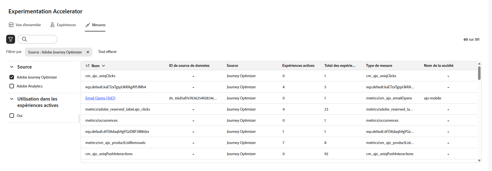

# Mesures {#experiment-accelerator-metrics}

>[!BEGINSHADEBOX]

* [Prise en main d’Experimentation Accelerator](experiment-accelerator.md)
* [Utilisation des données dans l’IA avec Experimentation Accelerator](experiment-accelerator-security.md)
* [Bonnes pratiques relatives à Experimentation Accelerator](experiment-accelerator-best-practices.md)
* [Surveiller les expériences](experiment-accelerator-monitor.md)
* **[Mesures d’expérimentation](experiment-accelerator-metrics.md)**

>[!ENDSHADEBOX]

La page **[!UICONTROL Mesures]** affiche les mesures de succès des expériences Journey Optimizer et Target au même endroit, ce qui permet de surveiller les performances, de les comparer et d’obtenir des informations plus précises.

## Tableau de bord {#dashboard}

Lors de l’accès à l’onglet **[!UICONTROL Mesures]**, toutes les mesures de succès disponibles de Journey Optimizer et d’Adobe Target sont répertoriées dans une vue consolidée afin de vous aider à effectuer le suivi des performances entre les initiatives, à comparer les résultats et à identifier rapidement les domaines qui nécessitent votre attention.

La liste **[!UICONTROL Mesures]** comprend les éléments suivants :

Accédez aux filtres en cliquant sur , qui propose des options spécifiques au contexte, telles que le filtrage par **[!UICONTROL Source]** ou **[!UICONTROL Utilisé dans des expériences actives]**.

Vous pouvez également rechercher rapidement une mesure en saisissant son nom dans la barre de recherche.

## Détails de la mesure {#metric-details}

### Incrémentiel dans le temps

Le graphique **[!UICONTROL Incrémentiel au fil du temps]** fournit une répartition visuelle de la tendance de la mesure sélectionnée sur une période sélectionnée. Utilisez le menu déroulant pour basculer entre les vues quotidiennes ou hebdomadaires afin d’ajuster le niveau de granularité.

Les valeurs de synthèse suivantes sont disponibles pour référence rapide :

* **[!UICONTROL Total]** :

* **[!UICONTROL Moyenne]** :

* **[!UICONTROL Taux de conversion]** : pourcentage de profils qui ont effectué l’action souhaitée (par exemple, achat, inscription) après avoir vu le traitement.

Chaque valeur comprend un pourcentage de modification par rapport à la période précédente, ce qui permet de voir facilement si les performances s’améliorent, diminuent ou restent stables.

### Effet d’expérience

Cette section affiche toutes les expériences actives au cours de la période sélectionnée (90 derniers jours, 30 derniers jours ou 7 derniers jours) et met en évidence leur contribution à la mesure.
